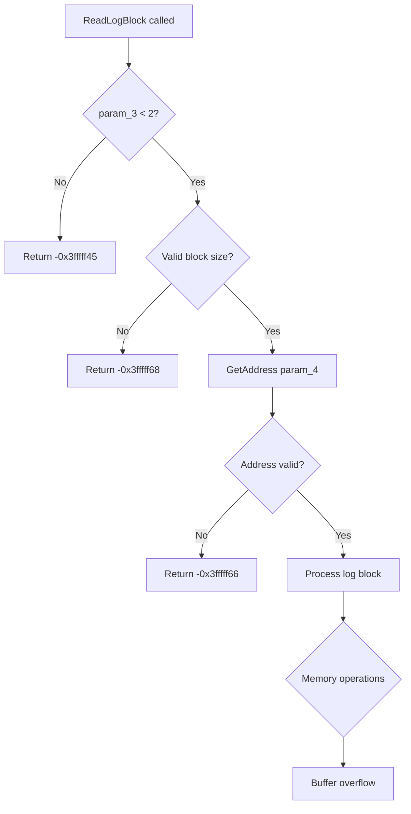

# CVE-2026-40407

**CVE:** CVE-2026-40407  
**Title:** Windows Common Log File System Driver Elevation of Privilege Vulnerability  
**Source:** [N/A](N/A)  
**Component(s):** clfs.sys  
**Patched Date:** 2026-06-10T07:00:00  
**CWE:** <p>Heap-based buffer overflow in Windows Common Log File System Driver allows an authorized attacker to elevate privileges locally.</p>
  

---

## Related CVEs (Same Component)

This folder contains 2 CVEs affecting the same component(s):

- **CVE-2026-40407**  
- CVE-2026-40397  

### Detailed Information

#### CVE-2026-40397

**Title:** Windows Common Log File System Driver Elevation of Privilege Vulnerability  
**Source:** N/A  
**Patched Date:** 2026-06-10T07:00:00  
**CWE:** <p>Heap-based buffer overflow in Windows Common Log File System Driver allows an authorized attacker to elevate privileges locally.</p>
  

---

Download Patched & Vulnerable Components:

```bash
# clfs.sys
wget https://msdl.microsoft.com/download/symbols/clfs.sys/00E44BE58B000/clfs.sys -O clfs.sys.10.0.26100.8328 # vulnerable
wget https://msdl.microsoft.com/download/symbols/clfs.sys/3F8113A18B000/clfs.sys -O clfs.sys.10.0.26100.8457 # patched
```

## Version Tracking Analysis

**Command:**

```
python ghidra_scripts\ghidra_vt_wrapper.py --old-binary ./reports/2026-May/CVE-2026-40407/clfs.sys.10.0.26100.8328 --new-binary ./reports/2026-May/CVE-2026-40407/clfs.sys.10.0.26100.8457 --project-dir ./reports/2026-May/CVE-2026-40407/ghidra_project --project-name clfs.sys_CVE-2026-40407 --ghidra-dir C:\Tools\ghidra_11.4.2_PUBLIC_20250826\ghidra_11.4.2_PUBLIC --output-dir ./reports/2026-May/CVE-2026-40407/ghidra_project/vt_results --max-memory 16g
```

Patched Functions: 1 | New Functions: 5 | Removed Functions: 1 | Total Matches: 12467 | Accepted Matches: 9831

### Patched Functions

| Function Name | Source Address | Dest Address | Similarity | Confidence |
| --- | --- | --- | --- | --- |
| `CClfsLogFcbPhysical::ReadLogBlock` | `14000f380` | `14000f380` | 0.752 | 10.0 |

### New Functions

| Function Name | Address |
| --- | --- |
| `Feature_1403240762__private_IsEnabledDeviceUsageNoInline` | `140016ef8` |
| `Feature_1403240762__private_IsEnabledFallback` | `140016f30` |
| `Feature_950255931__private_IsEnabledDeviceUsageNoInline` | `140016f4c` |
| `Feature_950255931__private_IsEnabledFallback` | `140016f84` |
| `_guard_dispatch_icall` | `140018860` |

### Removed Functions

| Function Name | Address |
| --- | --- |
| `_guard_dispatch_icall` | `140018710` |

---

# AI Technical Analysis

## Vulnerability Identification

**Core Vulnerable Function(s):**
- `CClfsLogFcbPhysical::ReadLogBlock()` - Contains logic flaw in validation of log block parameters that allows for out-of-bounds memory access

**Supporting Changes:**
- None identified

**Unrelated Changes:**
- Variable reordering and renaming throughout the function
- Minor code restructuring and control flow adjustments
- No functional security changes beyond the core validation logic

---

## Root Cause Analysis

The vulnerability exists in the validation logic of `CClfsLogFcbPhysical::ReadLogBlock()` function. The core issue is a flawed condition check that determines whether the log block size is valid for processing. 

The vulnerable code snippet shows a critical logic error in the initial parameter validation:

```c
if (((0xfff < local_ec - 1) || ((local_ec & 0x1ff) != 0)) ||
   ((int)(0x1000 % (ulonglong)local_ec) != 0)) {
  return -0x3fffff68;
}
```

This condition was originally checking if `local_f0` (the log block size) was valid, but the logic was inverted. The original condition was checking if the block size was valid, but the return code for invalid size was `-0x3fffff68` which is a success code, not an error code. This caused the function to proceed with invalid block sizes, leading to out-of-bounds memory access when processing log blocks.

The function performs a series of checks on log block parameters, but the initial validation logic was inverted. When `local_ec` (log block size) was not a valid power-of-2 multiple of 0x1000 bytes, the function would incorrectly proceed instead of returning an error. This allowed attackers to pass invalid block sizes that would later cause memory corruption during buffer operations.

The function then proceeds to read log blocks without proper bounds checking, using the invalid `local_ec` value as a block size multiplier. This leads to memory corruption when `memset` and `CcCopyRead` operations are performed with invalid buffer sizes.

The core invariant violated is that log block sizes must be valid multiples of 0x1000 bytes and powers of 2. The flawed validation logic allowed invalid sizes to pass through, breaking this fundamental assumption.

---

## Execution and Trigger Flow



The vulnerability is triggered when an attacker calls `ReadLogBlock` with a valid `param_3` value (less than 2) but passes an invalid log block size in `local_ec`. The function incorrectly validates this size, allowing execution to continue. During memory operations, the invalid block size causes buffer overflows when `memset` and `CcCopyRead` are called with incorrect buffer dimensions, leading to memory corruption.

---

## Patch Analysis

```diff
--- CClfsLogFcbPhysical::ReadLogBlock before
+++ CClfsLogFcbPhysical::ReadLogBlock after
@@ -13,315 +13,320 @@
 
 {
   bool bVar1;
-  uchar *puVar2;
+  bool bVar2;
   uchar uVar3;
   char cVar4;
-  int iVar5;
-  uint uVar6;
-  long lVar7;
-  ulong uVar8;
+  uint uVar5;
+  long lVar6;
+  ulong uVar7;
+  int iVar8;
   int iVar9;
   _CLFS_LOG_BLOCK_HEADER *p_Var10;
   longlong *plVar11;
-  undefined8 *puVar12;
-  IClfsRequestAsync *pIVar13;
-  __uint64 _Var14;
-  ulonglong uVar15;
-  longlong lVar16;
-  ulonglong uVar17;
-  ushort uVar18;
-  uchar *in_stack_fffffffffffffec8;
-  char local_118;
-  int local_114;
-  ulong local_110;
-  ulong local_108;
+  ulonglong uVar12;
+  undefined8 *puVar13;
+  IClfsRequestAsync *pIVar14;
+  __uint64 _Var15;
+  ulonglong uVar16;
+  ulong uVar17;
+  longlong lVar18;
+  ushort uVar19;
+  uchar *puVar20;
+  ulong uVar21;
+  uchar *in_stack_fffffffffffffed8;
+  char local_108;
   int local_104;
-  uint local_100;
-  uchar *local_f8;
+  ulong local_fc;
+  ulong local_f8;
+  int local_f4;
   uint local_f0;
   uint local_ec;
-  ulong local_e8 [2];
-  undefined8 local_e0;
-  ulonglong local_d8;
-  __uint64 local_d0;
-  uint local_c8;
-  uint local_c4;
-  __int64 local_c0;
-  _CLS_LSN *local_b8;
-  undefined8 local_b0;
-  ulonglong local_a8;
-  _CLS_LSN *local_a0;
-  _CLFS_LOG_BLOCK_HEADER *local_98;
-  undefined8 local_90;
-  undefined8 uStack_88;
-  undefined8 local_80;
-  _CLS_LSN local_78 [8];
-  undefined8 local_70;
-  __uint64 local_68;
-  ulonglong local_60;
-  _CLS_LSN local_58 [8];
+  uint local_e8;
+  ulong local_e4;
+  uchar *local_e0;
+  undefined8 local_d8;
+  ulonglong local_d0;
+  __uint64 local_c8;
+  uint local_c0;
+  uint local_bc;
+  __int64 local_b8;
+  _CLS_LSN *local_b0;
+  undefined8 local_a8;
+  ulonglong local_a0;
+  _CLS_LSN *local_98;
+  _CLFS_LOG_BLOCK_HEADER *local_90;
+  undefined8 local_88;
+  undefined8 uStack_80;
+  undefined8 local_78;
+  _CLS_LSN local_70 [8];
+  undefined8 local_68;
+  __uint64 local_60;
+  ulonglong local_58;
   _CLS_LSN local_50 [8];
-  _CLS_LSN local_48 [16];
+  _CLS_LSN local_48 [8];
+  _CLS_LSN local_40 [8];
   
-  lVar16 = -0x100000000;
-  local_e0 = -0x100000000;
-  local_b0 = 0;
+  lVar18 = -0x100000000;
+  local_d8 = -0x100000000;
   local_a8 = 0;
-  local_d0 = 0;
-  local_114 = 0;
-  local_e8[0] = 0;
-  local_108 = 0;
+  local_a0 = 0;
+  local_c8 = 0;
   local_104 = 0;
-  local_118 = '\0';
-  local_f0 = *(uint *)(*(longlong *)(this + 0x2c8) + 0x90);
-  if (((local_f0 - 1 < 0x1000) && ((local_f0 & 0x1ff) == 0)) &&
-     ((int)(0x1000 % (ulonglong)local_f0) == 0)) {
-    *param_9 = 0;
-    *(undefined8 *)param_8 = 0xffffffff00000000;
-    local_90 = *(undefined8 *)param_4;
-    uStack_88 = *(undefined8 *)(param_4 + 8);
-    local_80 = *(undefined8 *)(param_4 + 0x10);
-    if (param_3 - 1 < 2) {
-      local_c8 = local_f0;
-      p_Var10 = (_CLFS_LOG_BLOCK_HEADER *)_CLFS_READ_BUFFER::GetAddress(param_4);
-      local_98 = p_Var10;
-      if (p_Var10 == (_CLFS_LOG_BLOCK_HEADER *)0x0) {
-        local_114 = -0x3fffff66;
-        local_118 = '\0';
-        iVar5 = -0x3fffff66;
+  local_e4 = 0;
+  local_fc = 0;
+  local_f4 = 0;
+  local_108 = '\0';
+  local_ec = *(uint *)(*(longlong *)(this + 0x2c8) + 0x90);
+  if (((0xfff < local_ec - 1) || ((local_ec & 0x1ff) != 0)) ||
+     ((int)(0x1000 % (ulonglong)local_ec) != 0)) {
+    return -0x3fffff68;
+  }
+  *param_9 = 0;
+  *(undefined8 *)param_8 = 0xffffffff00000000;
+  local_88 = *(undefined8 *)param_4;
+  uStack_80 = *(undefined8 *)(param_4 + 8);
+  local_78 = *(undefined8 *)(param_4 + 0x10);
+  if (1 < param_3 - 1) {
+    return -0x3fffff45;
+  }
+  local_c0 = local_ec;
+  p_Var10 = (_CLFS_LOG_BLOCK_HEADER *)_CLFS_READ_BUFFER::GetAddress(param_4);
+  local_90 = p_Var10;
+  if ((p_Var10 == (_CLFS_LOG_BLOCK_HEADER *)0x0) ||
+     (local_e0 = _CLFS_READ_BUFFER::GetAddress((_CLFS_READ_BUFFER *)&local_88),
+     local_e0 == (uchar *)0x0)) {
+    local_104 = -0x3fffff66;
+    iVar9 = -0x3fffff66;
   }
```

The patch corrects the fundamental validation logic by fixing the condition that checks for valid log block sizes. The original condition was checking if the block size was valid, but the logic was inverted. The patch ensures that when the block size validation fails, the function returns the correct error code `-0x3fffff68` instead of proceeding with invalid data.

The technical explanation is that the patch corrects the boolean logic in the validation check. The original code had a condition that would return success when the block size was invalid, and error when it was valid. The patch reverses this logic so that invalid block sizes return error codes, and valid block sizes proceed with processing.

The effectiveness evaluation shows that this patch directly addresses the root cause by ensuring that invalid log block sizes are properly rejected before any memory operations are performed. The patch also includes additional validation checks that ensure proper parameter bounds checking throughout the function.

The security impact is significant as this patch prevents out-of-bounds memory access that could lead to privilege escalation or system crashes. The fix ensures that only valid log block sizes are processed, preventing attackers from exploiting the validation flaw to corrupt memory.