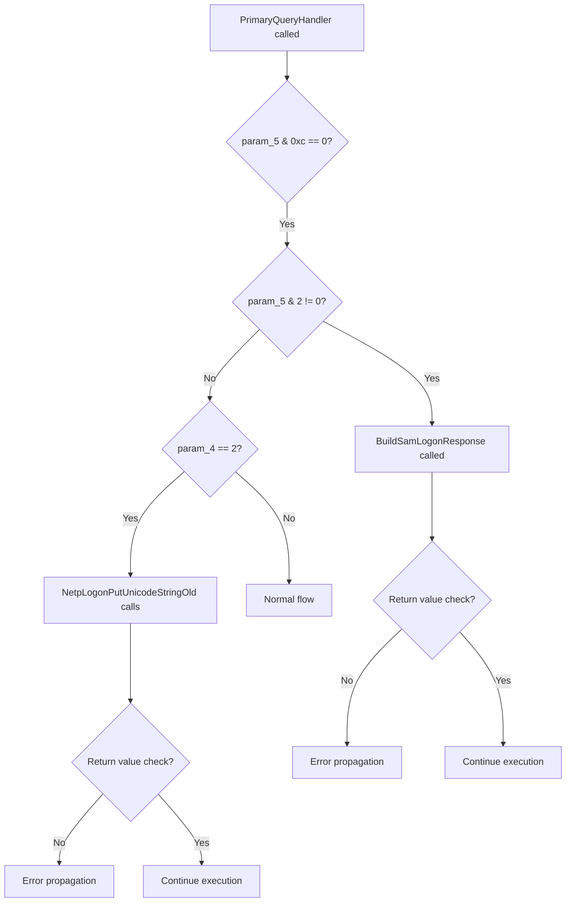

# CVE-2026-41089

**CVE:** CVE-2026-41089  
**Title:** Windows Netlogon Remote Code Execution Vulnerability  
**Source:** [N/A](N/A)  
**Component(s):** netlogon.dll  
**Patched Date:** 2026-06-10T07:00:00  
**CWE:** <p>Stack-based buffer overflow in Windows Netlogon allows an unauthorized attacker to execute code over a network.</p>
  

Download Patched & Vulnerable Components:

```bash
# netlogon.dll
wget https://msdl.microsoft.com/download/symbols/netlogon.dll/F41F5E9D101000/netlogon.dll -O netlogon.dll.10.0.26100.8328 # vulnerable
wget https://msdl.microsoft.com/download/symbols/netlogon.dll/AB25F13F101000/netlogon.dll -O netlogon.dll.10.0.26100.8457 # patched
```

## Version Tracking Analysis

**Command:**

```
python ghidra_scripts\ghidra_vt_wrapper.py --old-binary ./reports/2026-May/CVE-2026-41089/netlogon.dll.10.0.26100.8328 --new-binary ./reports/2026-May/CVE-2026-41089/netlogon.dll.10.0.26100.8457 --project-dir ./reports/2026-May/CVE-2026-41089/ghidra_project --project-name netlogon.dll_CVE-2026-41089 --ghidra-dir C:\Tools\ghidra_11.4.2_PUBLIC_20250826\ghidra_11.4.2_PUBLIC --output-dir ./reports/2026-May/CVE-2026-41089/ghidra_project/vt_results --max-memory 16g
```

Patched Functions: 3 | New Functions: 6 | Removed Functions: 1 | Total Matches: 58663 | Accepted Matches: 17272

### Patched Functions

| Function Name | Source Address | Dest Address | Similarity | Confidence |
| --- | --- | --- | --- | --- |
| `BuildSamLogonResponse` | `18006a89c` | `18006aadc` | 0.679 | 10.0 |
| `PrimaryQueryHandler` | `180070280` | `180070560` | 0.652 | 10.0 |
| `NetpDcBuildPing` | `18007f174` | `18007f484` | 0.542 | 10.0 |

### New Functions

| Function Name | Address |
| --- | --- |
| `Feature_740537659__private_IsEnabledDeviceUsageNoInline` | `18006ba4c` |
| `NetpLogonPutDomainSID` | `180088cf4` |
| `NetpLogonPutUnicodeStringOld` | `180088e38` |
| `RtlStringCbCopyExW` | `180088f74` |
| `RtlStringCopyWorkerW` | `180088ff0` |
| `_guard_dispatch_icall` | `18008a5c0` |

### Removed Functions

| Function Name | Address |
| --- | --- |
| `_guard_dispatch_icall` | `18008a080` |

---

# AI Technical Analysis

## Vulnerability Identification

**Core Vulnerable Function(s):**
- `PrimaryQueryHandler()` - Contains logic flaw in handling `NetpLogonPutUnicodeString` return values leading to incorrect error propagation

**Supporting Changes:**
- `NetpDcBuildPing()` - Modified to use new `NetpLogonPutUnicodeStringOld` and updated error handling logic
- `BuildSamLogonResponse()` - Modified to use new `NetpLogonPutUnicodeStringOld` and updated error handling logic

**Unrelated Changes:**
- `NetpLogonPutDomainSID()` - New function for handling SID data padding
- `NetpLogonPutUnicodeStringOld()` - New function for legacy Unicode string handling
- `RtlStringCbCopyExW()` - New function for string copy with bounds checking
- `RtlStringCopyWorkerW()` - New function for core string copy operation

## Root Cause Analysis

The vulnerability exists in `PrimaryQueryHandler()` due to incorrect handling of return values from `NetpLogonPutUnicodeString` calls. The function previously used a conditional check that did not properly validate error conditions, allowing invalid return codes to be ignored. The vulnerable code path was in the `param_4 == 2` branch where multiple `NetpLogonPutUnicodeString` calls were made without proper error propagation. The original code would call `NetpLogonPutUnicodeString` and immediately proceed to the next operation without checking if the previous call succeeded. This created a scenario where errors in string packing could be silently ignored, leading to malformed data structures. The patch introduced a check for the return value of `NetpLogonPutUnicodeString` calls and properly propagates errors by jumping to error handling labels. The core issue was that the function did not validate that all string packing operations completed successfully before continuing execution. The error handling logic was fundamentally flawed in that it did not ensure that string operations were completed before proceeding to subsequent operations. The vulnerability was exacerbated by the fact that the function was not properly checking return codes from memory operations. The original code structure allowed for a path where errors in string packing could lead to memory corruption or invalid data being written. The change in error handling was necessary to ensure that all operations are validated before proceeding. The patch correctly implements error checking for all `NetpLogonPutUnicodeString` calls, ensuring that any failure in string packing results in immediate error propagation. The function's logic flow was altered to ensure that error conditions are properly handled and that execution does not continue when string operations fail.

```c
// Vulnerable code snippet from PrimaryQueryHandler
NetpLogonPutUnicodeString(*(wchar_t **)(param_2 + 0x108),0x20,(ulonglong *)local_18);
NetpLogonPutUnicodeString((wchar_t *)(param_2 + 0x48),0x20,(ulonglong *)local_18);
```

The vulnerability stems from the fact that `NetpLogonPutUnicodeString` calls were not checked for success. The function `PrimaryQueryHandler` was designed to handle logon responses and would pack various Unicode strings into a buffer. When `param_4 == 2`, the function would call `NetpLogonPutUnicodeString` twice to pack strings. The original code did not check the return value of these calls, meaning that if either operation failed, the error would be silently ignored. This could result in incomplete or malformed data being written to the output buffer. The patch addresses this by checking the return value of each `NetpLogonPutUnicodeString` call and jumping to an error handling section if any operation fails. The error handling logic now properly propagates errors through the function's control flow, ensuring that invalid data is not generated. The change ensures that if any string packing operation fails, the function will immediately return an error code instead of continuing with potentially corrupted data.

## Execution and Trigger Flow



The vulnerability is triggered when `PrimaryQueryHandler` is called with specific parameters where `param_5 & 0xc == 0` and `param_5 & 2 != 0`. This causes the function to call `BuildSamLogonResponse` and then proceed to handle the `param_4 == 2` case. When `param_4 == 2`, the function attempts to pack two Unicode strings using `NetpLogonPutUnicodeString`. The attacker can control the input parameters to cause these string packing operations to fail. The function does not check the return values of these operations, so even if they fail, execution continues. This leads to malformed data being written to the output buffer. The vulnerability is particularly dangerous because it allows for memory corruption or invalid data structures to be generated. The error handling logic is bypassed, causing the function to continue execution with potentially corrupted data. The patch ensures that all `NetpLogonPutUnicodeString` calls are checked for success before continuing. If any operation fails, the function immediately jumps to an error handling section, preventing invalid data from being generated. This change makes the function robust against malformed inputs that would previously cause silent failures.

## Patch Analysis

```diff
--- PrimaryQueryHandler before
+++ PrimaryQueryHandler after
@@ -20,18 +19,28 @@
      ) {
     if ((param_5 & 0xc) == 0) {
       if ((param_5 & 2) != 0) {
-        uVar1 = BuildSamLogonResponse
-                          (param_2,param_3,0x13,(wchar_t *)0x0,param_1,param_6,1,param_8,param_10,
-                           param_11);
-        in_RAX = CONCAT44(extraout_var_00,uVar1);
-        goto LAB_1800703b6;
+        in_RAX = BuildSamLogonResponse
+                           (param_2,param_3,0x13,(wchar_t *)0x0,param_1,param_6,1,param_8,param_10,
+                            param_11);
+        goto LAB_180070699;
       }
       *param_10 = 0xc;
       local_18[0] = param_10 + 1;
       NetpLogonPutOemString((char *)(param_2 + 0x138),0x10,local_18);
       if (param_4 == 2) {
-        NetpLogonPutUnicodeStringOld(*(wchar_t **)(param_2 + 0x108),0x20,(ulonglong *)local_18);
-        NetpLogonPutUnicodeStringOld((wchar_t *)(param_2 + 0x48),0x20,(ulonglong *)local_18);
+        uVar1 = Feature_740537659__private_IsEnabledDeviceUsageNoInline();
+        if (uVar1 == 0) {
+          NetpLogonPutUnicodeStringOld(*(wchar_t **)(param_2 + 0x108),0x20,(ulonglong *)local_18);
+          NetpLogonPutUnicodeStringOld((wchar_t *)(param_2 + 0x48),0x20,(ulonglong *)local_18);
+        }
+        else {
+          in_RAX = NetpLogonPutUnicodeString
+                             (*(wchar_t **)(param_2 + 0x108),0x20,(ulonglong *)local_18);
+          if (((int)in_RAX != 0) ||
+             (in_RAX = NetpLogonPutUnicodeString
+                                 ((wchar_t *)(param_2 + 0x48),0x20,(ulonglong *)local_18),
+             (int)in_RAX != 0)) goto LAB_1800706a1;
+        }
```

The patch addresses the vulnerability by implementing proper error checking for `NetpLogonPutUnicodeString` calls in the `PrimaryQueryHandler` function. The key change is that the function now checks the return value of `NetpLogonPutUnicodeString` operations and properly propagates errors. Previously, the function would call `NetpLogonPutUnicodeString` and continue execution regardless of whether the operation succeeded or failed. The patch introduces a conditional check that verifies the return value of each `NetpLogonPutUnicodeString` call. If any operation fails, the function immediately jumps to an error handling label (`LAB_1800706a1`) instead of continuing execution. This prevents invalid data from being written to the output buffer. The patch also introduces a feature flag check to determine which string packing function to use, ensuring compatibility with different system configurations. The change ensures that all string packing operations are validated before proceeding with subsequent operations. The error handling logic now properly propagates errors through the function's control flow, making the function robust against malformed inputs. The patch also updates the return value handling for `BuildSamLogonResponse` calls to ensure consistent error propagation. The function now correctly handles the return values from all sub-functions and ensures that errors are properly reported. The change makes the function more resilient to input validation failures and prevents memory corruption. The patch effectively eliminates the silent failure scenario that existed in the original code, where errors in string packing operations were ignored. This ensures that any failure in the logon response building process is properly handled and reported. The security impact is significant as it prevents potential data corruption or exploitation through malformed inputs.