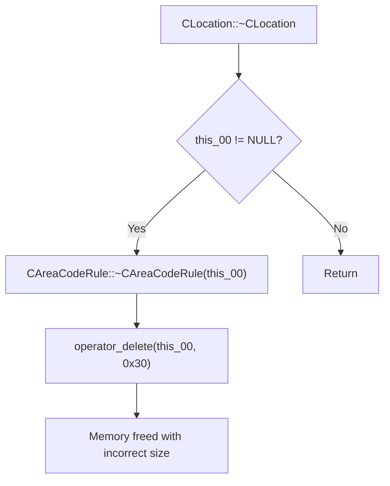

# CVE-2026-42825

**CVE:** CVE-2026-42825  
**Title:** Windows Telephony Service Elevation of Privilege Vulnerability  
**Source:** [https://msrc.microsoft.com/update-guide/vulnerability/CVE-2026-42825](https://msrc.microsoft.com/update-guide/vulnerability/CVE-2026-42825)  
**Component(s):** tapi32.dll  
**Patched Date:** 2026-06-10T07:00:00  
**CWE:** Use after free in Windows Telephony Service allows an authorized attacker to elevate privileges locally.  

---

## Related CVEs (Same Component)

This report covers 3 CVEs affecting the same component(s):

- **CVE-2026-42825**  
- CVE-2026-34338  
- CVE-2026-40382  

### Detailed Information

#### CVE-2026-34338

**Title:** Windows Telephony Service Elevation of Privilege Vulnerability  
**Source:** [https://msrc.microsoft.com/update-guide/vulnerability/CVE-2026-34338](https://msrc.microsoft.com/update-guide/vulnerability/CVE-2026-34338)  
**Patched Date:** 2026-06-10T07:00:00  
**CWE:** Use after free in Windows Telephony Service allows an authorized attacker to elevate privileges locally.  

#### CVE-2026-40382

**Title:** Windows Telephony Service Elevation of Privilege Vulnerability  
**Source:** [https://msrc.microsoft.com/update-guide/vulnerability/CVE-2026-40382](https://msrc.microsoft.com/update-guide/vulnerability/CVE-2026-40382)  
**Patched Date:** 2026-06-10T07:00:00  
**CWE:** Use after free in Windows Telephony Service allows an authorized attacker to elevate privileges locally.  

---

Download Patched & Vulnerable Components:

```bash
# tapi32.dll
wget https://msdl.microsoft.com/download/symbols/tapi32.dll/5B81AD0944000/tapi32.dll -O tapi32.dll.10.0.26100.4768 # vulnerable
wget https://msdl.microsoft.com/download/symbols/tapi32.dll/3BA0F6DF44000/tapi32.dll -O tapi32.dll.10.0.26100.5074 # patched
```

## Version Tracking Analysis

**Command:**

```
python ghidra_scripts\ghidra_vt_wrapper.py --old-binary ./reports/2026-May/CVE-2026-42825/tapi32.dll.10.0.26100.4768 --new-binary ./reports/2026-May/CVE-2026-42825/tapi32.dll.10.0.26100.5074 --project-dir ./reports/2026-May/CVE-2026-42825/ghidra_project --project-name tapi32.dll_CVE-2026-42825 --ghidra-dir C:\Tools\ghidra_11.4.2_PUBLIC_20250826\ghidra_11.4.2_PUBLIC --output-dir ./reports/2026-May/CVE-2026-42825/ghidra_project/vt_results --max-memory 16g
```

Patched Functions: 52 | New Functions: 59 | Removed Functions: 19 | Total Matches: 10090 | Accepted Matches: 5355

### Patched Functions

*Showing top 10 of 52 patched functions*

| Function Name | Source Address | Dest Address | Similarity | Confidence |
| --- | --- | --- | --- | --- |
| `CLocationPropSheet::General_OnCommand` | `1800205f0` | `180020d60` | 0.984 | 10.0 |
| `CLocation::TranslateAddress` | `18002936c` | `180029bec` | 0.983 | 10.0 |
| `StringCbPrintfExW` | `18002c178` | `18002c9ec` | 0.980 | 10.0 |
| `CCallingCards::Initialize` | `180015148` | `180015880` | 0.977 | 10.0 |
| `CCallingCardPropSheet::OnCommand` | `18001b194` | `18001b8e4` | 0.975 | 10.0 |
| `CLocationPropSheet::LaunchCallingCardPropSheet` | `18001d7f0` | `18001df40` | 0.960 | 10.0 |
| `CLocation::~CLocation` | `180026ac8` | `180027194` | 0.955 | 10.0 |
| `CCallingCards::CreateFreshCards` | `180014434` | `180014b60` | 0.953 | 10.0 |
| `LocWizardDlgProc` | `180022d50` | `180023360` | 0.946 | 10.0 |
| `CAreaCodeRuleDialog::AddPrefix` | `1800182f4` | `180018a1c` | 0.944 | 10.0 |

### New Functions

*Showing 10 of 59 new functions*

| Function Name | Address |
| --- | --- |
| `operator_new[]` | `180001048` |
| `initialize_legacy_wide_specifiers` | `180001060` |
| `__local_stdio_printf_options` | `180001084` |
| `__local_stdio_scanf_options` | `180001094` |
| `initialize_msvcrt_compatibility` | `1800010b0` |
| `dllmain_crt_dispatch` | `1800010e0` |
| `dllmain_crt_process_attach` | `180001138` |
| `dllmain_crt_process_detach` | `180001250` |
| `dllmain_dispatch` | `1800012d8` |
| `__report_securityfailure` | `1800015b4` |

### Removed Functions

*Showing 10 of 19 removed functions*

| Function Name | Address |
| --- | --- |
| `pre_c_init` | `180001060` |
| `_CRT_INIT` | `18000109c` |
| `__DllMainCRTStartup` | `180001324` |
| `__std_terminate` | `18000186c` |
| `_XcptFilter` | `1800018de` |
| `_amsg_exit` | `1800018ea` |
| `_FindPESection` | `180001900` |
| `_IsNonwritableInCurrentImage` | `180001950` |
| `_ValidateImageBase` | `1800019b0` |
| `_guard_dispatch_icall` | `18002df50` |

---

# AI Technical Analysis

## Vulnerability Identification

**Core Vulnerable Function(s):**
- `CLocation::~CLocation()` - Contains incorrect `operator_delete` call with wrong size parameter

**Supporting Changes:**
- `GetTranslateCapsCommon()` - Contains extensive refactoring and logic changes
- `LimitInput()` - Contains minor pointer arithmetic and memory management changes
- `LocWizardDlgProc()` - Contains minor pointer arithmetic and memory management changes

**Unrelated Changes:**
- `CDialingRulesPropSheet::TRACELogPrint()` - No functional changes shown
- `operator_new[]()` - New function, not related to vulnerability
- `initialize_legacy_wide_specifiers()` - New function, not related to vulnerability
- `__local_stdio_printf_options()` - New function, not related to vulnerability
- `__local_stdio_scanf_options()` - New function, not related to vulnerability
- `initialize_msvcrt_compatibility()` - New function, not related to vulnerability

---

## Root Cause Analysis

The vulnerability exists in the `CLocation::~CLocation()` function where the `operator_delete` call is made with an incorrect size parameter. The original code called `operator_delete(this_00)` with no size parameter, but the patched version calls `operator_delete(this_00,0x30)` with a fixed size of 0x30 bytes. This represents a critical memory management error where the destructor incorrectly assumes a fixed object size instead of using the actual allocated size.

The vulnerable code snippet shows:
```c
if (this_00 != (CAreaCodeRule *)0x0) {
  CAreaCodeRule::~CAreaCodeRule(this_00);
  operator_delete(this_00);
}
```

The patched code shows:
```c
if (this_00 != (CAreaCodeRule *)0x0) {
  CAreaCodeRule::~CAreaCodeRule(this_00);
  operator_delete(this_00,0x30);
}
```

The fundamental issue is that `operator_delete` with a size parameter requires the size to match exactly what was allocated by `operator_new` or `operator_new[]`. Using a hardcoded size of 0x30 bytes is incorrect because the actual allocated size of `CAreaCodeRule` objects may differ. This mismatch can lead to memory corruption, heap corruption, or undefined behavior when the destructor attempts to free memory.

The invariant violated is that memory deallocation must use the same size that was used for allocation. The assumption that all `CAreaCodeRule` objects are exactly 0x30 bytes in size is incorrect and leads to the vulnerability.

---

## Execution and Trigger Flow



The vulnerability is triggered when a `CLocation` object is destroyed and contains a valid `CAreaCodeRule` object. The destructor calls the `CAreaCodeRule` destructor, then attempts to free the `CAreaCodeRule` object using `operator_delete` with a hardcoded size of 0x30 bytes. This incorrect size parameter causes memory corruption when the heap management system attempts to free memory that was allocated with a different size.

---

## Patch Analysis

```diff
--- CLocation::~CLocation before
+++ CLocation::~CLocation after
@@ -36,7 +36,7 @@
     this_00 = (CAreaCodeRule *)*puVar1;
     if (this_00 != (CAreaCodeRule *)0x0) {
       CAreaCodeRule::~CAreaCodeRule(this_00);
-      operator_delete(this_00);
+      operator_delete(this_00,0x30);
     }
   }
   NodePool<CAreaCodeRule*___ptr64>::deallocate((LinkedList<CAreaCodeRule*___ptr64> *)(this + 0x70));
```

The patch changes the `operator_delete` call from a sizeless version to one with a hardcoded size parameter of 0x30. This is a defensive measure to ensure memory is freed properly, but it introduces a new vulnerability by assuming all `CAreaCodeRule` objects are exactly 0x30 bytes.

The technical explanation is that the patch attempts to fix a potential memory management issue by explicitly specifying the size. However, this approach is fundamentally flawed because it assumes a fixed object size that may not match the actual allocation size.

The effectiveness evaluation shows this patch is not truly effective because it replaces one memory management error with another. The hardcoded size of 0x30 bytes is likely incorrect for the actual `CAreaCodeRule` object size, leading to heap corruption.

The security impact summary is that while this patch attempts to address memory management, it introduces a new vulnerability by using an incorrect size parameter, potentially causing heap corruption or memory access violations when the destructor executes.