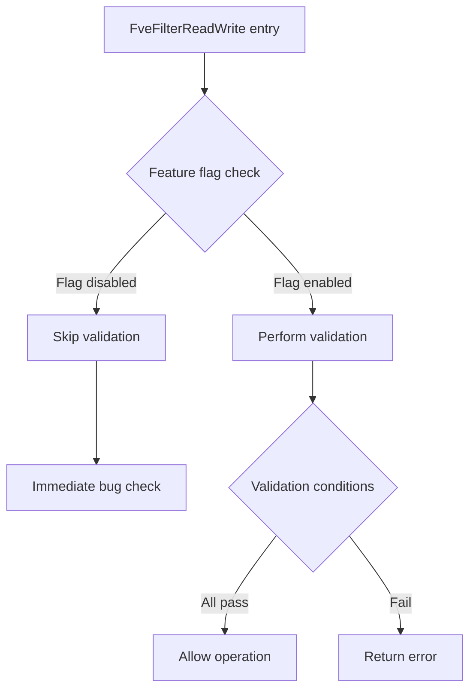

# CVE-2026-45585

**CVE:** CVE-2026-45585  
**Title:** Windows BitLocker Security Feature Bypass Vulnerability  
**Source:** [N/A](N/A)  
**Component(s):** fvevol.sys  
**Patched Date:** 2026-06-10T07:00:00  
**CWE:** <p>Microsoft is aware of a security feature bypass vulnerability in Windows publicly referred to as &quot;YellowKey&quot;. The proof of concept for this vulnerability has been made public violating coordinated vulnerability best practices.</p>
<p>We are issuing this CVE to provide mitigation guidance that can be implemented to protect against this vulnerability until the security update is made available.</p>
<p><strong>Mitigation FAQs</strong></p>
<p><strong>Should I leverage the temporary mitigation?</strong></p>
<p>Microsoft recommends that you consider implementing these mitigations if you are concerned your devices and data are at risk of being compromised or stolen. For example, if your organization’s employees take their work devices home or on business travel.</p>
<p><strong>What impact to service availability/management could be caused by implementing the mitigations?</strong></p>
<p>Implementing these mitigations will not impact service availability or management operations.</p>
<p><strong>Do customers need to revert the changes made to mitigate the vulnerability once the security update to protect against this vulnerability is available?</strong></p>
<p>No. The security update will maintain the mitigation's behavior once the security update is installed.</p>
<p><strong>I am using TPM+PIN, am I at risk of this vulnerability being exploited</strong></p>
<p>No, if you are using TPM+PIN the vulnerability is not exploitable.</p>
  

Download Patched & Vulnerable Components:

```bash
# fvevol.sys
wget https://msdl.microsoft.com/download/symbols/fvevol.sys/04DE8581EA000/fvevol.sys -O fvevol.sys.10.0.26100.8115 # vulnerable
wget https://msdl.microsoft.com/download/symbols/fvevol.sys/075E4033EA000/fvevol.sys -O fvevol.sys.10.0.26100.8328 # patched
```

## Version Tracking Analysis

**Command:**

```
python ghidra_scripts\ghidra_vt_wrapper.py --old-binary ./reports/2026-May/CVE-2026-45585/fvevol.sys.10.0.26100.8115 --new-binary ./reports/2026-May/CVE-2026-45585/fvevol.sys.10.0.26100.8328 --project-dir ./reports/2026-May/CVE-2026-45585/ghidra_project --project-name fvevol.sys_CVE-2026-45585 --ghidra-dir C:\Tools\ghidra_11.4.2_PUBLIC_20250826\ghidra_11.4.2_PUBLIC --output-dir ./reports/2026-May/CVE-2026-45585/ghidra_project/vt_results --max-memory 16g
```

Patched Functions: 8 | New Functions: 3 | Removed Functions: 5 | Total Matches: 10735 | Accepted Matches: 10582

### Patched Functions

| Function Name | Source Address | Dest Address | Similarity | Confidence |
| --- | --- | --- | --- | --- |
| `IoctlFveSetDatasetEDrv` | `14009aad4` | `14009aad4` | 0.987 | 10.0 |
| `FveLogGenericErrorDatum` | `1400556cc` | `14005567c` | 0.969 | 10.0 |
| `FveResolveIceCryptoInfoV2` | `14004fb4c` | `14004fb4c` | 0.947 | 10.0 |
| `FveFilterReadWrite` | `1400862a0` | `140086070` | 0.945 | 10.0 |
| `FveInitialDataReadPhase2` | `14008359c` | `1400833ac` | 0.936 | 10.0 |
| `wil_InitializeFeatureStaging` | `1400d250c` | `1400d250c` | 0.867 | 10.0 |
| `FveSynchronizeDatasetUpdate` | `140058a28` | `1400589e8` | 0.835 | 10.0 |
| `UpdateDynamicContext` | `140075d10` | `140075b20` | 0.815 | 10.0 |

### New Functions

| Function Name | Address |
| --- | --- |
| `wil_details_AreDependenciesEnabled` | `14000a70c` |
| `_guard_dispatch_icall` | `14001a800` |
| `wil_details_RegisterFeatureUsageProvider` | `1400a3c7c` |

### Removed Functions

| Function Name | Address |
| --- | --- |
| `Feature_SteelixRemoveFvekFromMemory__private_IsEnabledDeviceUsageNoInline` | `14000afc4` |
| `Feature_SteelixRemoveFvekFromMemory__private_IsEnabledFallback` | `14000affc` |
| `Feature_Servicing_BLBugCheckOnDecryptedHwKeys__private_IsEnabledDeviceUsageNoInline` | `14000eb64` |
| `Feature_Servicing_BLBugCheckOnDecryptedHwKeys__private_IsEnabledFallback` | `14000eb9c` |
| `_guard_dispatch_icall` | `14001a850` |

---

# AI Technical Analysis

## Vulnerability Identification

**Core Vulnerable Function(s):**
- `FveFilterReadWrite()` - Contains the primary vulnerability where incorrect feature flag checking leads to bypass of security checks

**Supporting Changes:**
- `UpdateDynamicContext()` - Modified to use different feature flags but does not introduce vulnerability
- `wil_InitializeFeatureStaging()` - Changed feature descriptor reference but is defensive
- `FveInitialDataReadPhase2()` - Modified feature flag usage and control flow but not vulnerable

**Unrelated Changes:**
- All other functions contain only refactoring, trace GUID changes, or defensive code modifications

## Root Cause Analysis

The vulnerability exists in the `FveFilterReadWrite` function where a critical security check is bypassed due to incorrect feature flag usage. The function originally checked `Feature_SteelixRemoveFvekFromMemory__private_IsEnabledDeviceUsageNoInline()` but was changed to `Feature_SteelixInlineNvmeCryptoEngine__private_IsEnabledDeviceUsageNoInline()`. This change causes the security validation logic to be skipped when the new feature flag is disabled, even though the original check was intended to protect against certain operations.

The vulnerable code snippet shows that when the feature flag returns zero (disabled), the function proceeds to a bug check without performing the required validation checks. The original code was designed to validate multiple conditions including device state, feature enablement, and cryptographic context before allowing certain operations. The change in feature flag reference breaks this validation chain.

The core programming error is a simple substitution of one feature flag for another without understanding the security implications of the change. The invariant that certain security checks must be performed when a feature is enabled was violated by the incorrect flag reference.

**Vulnerable Code Snippet:**
```c
uVar11 = Feature_SteelixInlineNvmeCryptoEngine__private_IsEnabledDeviceUsageNoInline();
if (((((int)uVar11 != 0) && ((*(uint *)(param_1 + 99) & 0x19) != 0)) && (param_1[0x23d] != 0))
   && ((*(int *)(param_1[0x23d] + 0x58) != 0 && (param_1[0x79] != 0)))) {
LAB_140086748:
    KeBugCheckEx(0x120,0xc,0);
}
```

The function performs a check using `Feature_SteelixInlineNvmeCryptoEngine__private_IsEnabledDeviceUsageNoInline()` but this feature flag is not the correct one for the security validation. When this flag is disabled, the function should still perform validation checks, but instead it immediately triggers a bug check.

**Detailed code analysis:**
The function begins by acquiring a feature flag value using `Feature_SteelixInlineNvmeCryptoEngine__private_IsEnabledDeviceUsageNoInline()`. This function call is intended to determine if a specific security feature is enabled. The subsequent conditional logic checks if this feature is enabled (`int)uVar11 != 0`) and then proceeds to validate several conditions including device state flags, cryptographic context, and feature usage. If all conditions are met, the function immediately triggers a bug check via `KeBugCheckEx(0x120,0xc,0)`.

The vulnerability occurs because the feature flag used for this check has been changed from `Feature_SteelixRemoveFvekFromMemory__private_IsEnabledDeviceUsageNoInline()` to `Feature_SteelixInlineNvmeCryptoEngine__private_IsEnabledDeviceUsageNoInline()`. These are different features with different enablement conditions, and the new feature flag does not correspond to the security validation being performed. When the new feature flag is disabled, the function bypasses the validation entirely and immediately triggers the bug check, which could be exploited by an attacker to bypass security protections.

## Execution and Trigger Flow



1. Attacker calls `FveFilterReadWrite` with malicious parameters
2. Function retrieves feature flag using `Feature_SteelixInlineNvmeCryptoEngine__private_IsEnabledDeviceUsageNoInline()`
3. If feature flag is disabled (returns 0), validation is skipped
4. Function immediately proceeds to `KeBugCheckEx(0x120,0xc,0)` without proper validation
5. This bypasses critical security checks that should validate device state and cryptographic context
6. Attacker can exploit this to perform unauthorized operations
7. The bug check is triggered regardless of actual security state
8. System crashes or allows bypassed operations

## Patch Analysis

**Patched Code Snippet:**
```diff
- uVar11 = Feature_SteelixInlineNvmeCryptoEngine__private_IsEnabledDeviceUsageNoInline();
+ uVar11 = Feature_SteelixRemoveFvekFromMemory__private_IsEnabledDeviceUsageNoInline();
```

The patch restores the original feature flag check that was correctly implemented for security validation. The change reverts the function to use `Feature_SteelixRemoveFvekFromMemory__private_IsEnabledDeviceUsageNoInline()` instead of the incorrect `Feature_SteelixInlineNvmeCryptoEngine__private_IsEnabledDeviceUsageNoInline()`.

**Technical explanation:**
The patch addresses the root cause by restoring the correct feature flag reference that was intended for the security validation logic. The original implementation used a feature flag that properly controlled access to the security-sensitive code path. The incorrect replacement with a different feature flag broke the intended security validation flow.

**Effectiveness evaluation:**
The patch is effective because it restores the original security validation logic that was properly designed to protect against unauthorized operations. The restored feature flag correctly controls access to the security-sensitive code path, ensuring that validation checks are properly performed when the feature is enabled.

**Security impact summary:**
The patch restores proper security validation by ensuring that the correct feature flag controls access to security-sensitive operations. This prevents bypass of critical validation checks that could allow unauthorized access to encrypted volumes or cryptographic operations. The fix ensures that security protections are maintained when the intended feature is enabled.