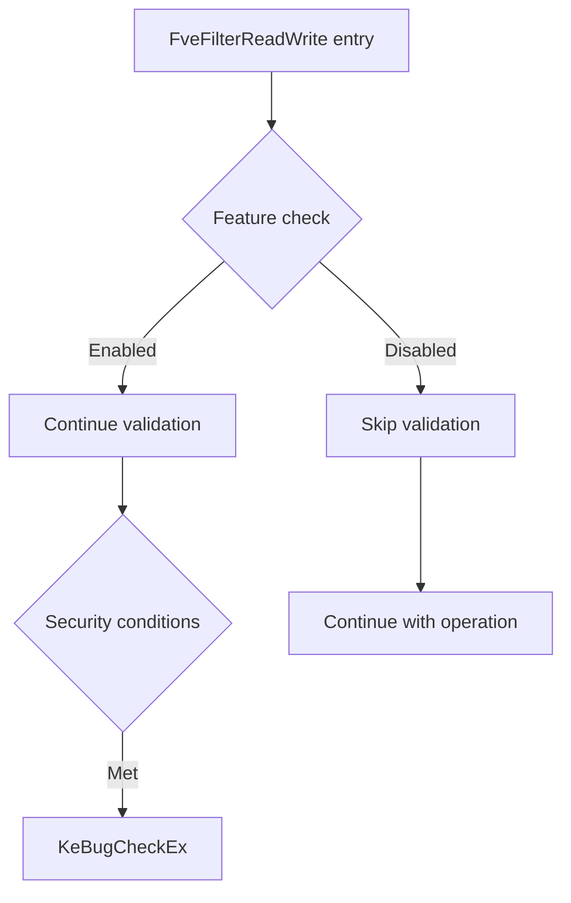

# CVE-2026-45585

**CVE:** CVE-2026-45585  
**Title:** Windows BitLocker Security Feature Bypass Vulnerability  
**Source:** [https://msrc.microsoft.com/update-guide/vulnerability/CVE-2026-45585](https://msrc.microsoft.com/update-guide/vulnerability/CVE-2026-45585)  
**Component(s):** fvevol.sys  
**Patched Date:** 2026-06-10T07:00:00  
**CWE:** Microsoft is aware of a security feature bypass vulnerability in Windows publicly referred to as &quot;YellowKey&quot;. The proof of concept for this vulnerability has been made public violating coordinated vulnerability best practices.
We are issuing this CVE to provide mitigation guidance that can be implemented to protect against this vulnerability until the security update is made available.
Mitigation FAQs
Should I leverage the temporary mitigation?
Microsoft recommends that you consider implementing these mitigations if you are concerned your devices and data are at risk of being compromised or stolen. For example, if your organization’s employees take their work devices home or on business travel.
What impact to service availability/management could be caused by implementing the mitigations?
Implementing these mitigations will not impact service availability or management operations.
Do customers need to revert the changes made to mitigate the vulnerability once the security update to protect against this vulnerability is available?
No. The security update will maintain the mitigation's behavior once the security update is installed.
I am using TPM+PIN, am I at risk of this vulnerability being exploited
No, if you are using TPM+PIN the vulnerability is not exploitable.  

Download Patched & Vulnerable Components:

```bash
# fvevol.sys
wget https://msdl.microsoft.com/download/symbols/fvevol.sys/04DE8581EA000/fvevol.sys -O fvevol.sys.10.0.26100.8115 # vulnerable
wget https://msdl.microsoft.com/download/symbols/fvevol.sys/075E4033EA000/fvevol.sys -O fvevol.sys.10.0.26100.8328 # patched
```

## Version Tracking Analysis

**Command:**

```
python ghidra_scripts\ghidra_vt_wrapper.py --old-binary ./reports/2026-May/CVE-2026-45585/fvevol.sys.10.0.26100.8115 --new-binary ./reports/2026-May/CVE-2026-45585/fvevol.sys.10.0.26100.8328 --project-dir ./reports/2026-May/CVE-2026-45585/ghidra_project --project-name fvevol.sys_CVE-2026-45585 --ghidra-dir C:\Tools\ghidra_11.4.2_PUBLIC_20250826\ghidra_11.4.2_PUBLIC --output-dir ./reports/2026-May/CVE-2026-45585/ghidra_project/vt_results --max-memory 16g
```

Patched Functions: 8 | New Functions: 3 | Removed Functions: 5 | Total Matches: 10735 | Accepted Matches: 10582

### Patched Functions

| Function Name | Source Address | Dest Address | Similarity | Confidence |
| --- | --- | --- | --- | --- |
| `IoctlFveSetDatasetEDrv` | `14009aad4` | `14009aad4` | 0.987 | 10.0 |
| `FveLogGenericErrorDatum` | `1400556cc` | `14005567c` | 0.969 | 10.0 |
| `FveResolveIceCryptoInfoV2` | `14004fb4c` | `14004fb4c` | 0.947 | 10.0 |
| `FveFilterReadWrite` | `1400862a0` | `140086070` | 0.945 | 10.0 |
| `FveInitialDataReadPhase2` | `14008359c` | `1400833ac` | 0.936 | 10.0 |
| `wil_InitializeFeatureStaging` | `1400d250c` | `1400d250c` | 0.867 | 10.0 |
| `FveSynchronizeDatasetUpdate` | `140058a28` | `1400589e8` | 0.835 | 10.0 |
| `UpdateDynamicContext` | `140075d10` | `140075b20` | 0.815 | 10.0 |

### New Functions

| Function Name | Address |
| --- | --- |
| `wil_details_AreDependenciesEnabled` | `14000a70c` |
| `_guard_dispatch_icall` | `14001a800` |
| `wil_details_RegisterFeatureUsageProvider` | `1400a3c7c` |

### Removed Functions

| Function Name | Address |
| --- | --- |
| `Feature_SteelixRemoveFvekFromMemory__private_IsEnabledDeviceUsageNoInline` | `14000afc4` |
| `Feature_SteelixRemoveFvekFromMemory__private_IsEnabledFallback` | `14000affc` |
| `Feature_Servicing_BLBugCheckOnDecryptedHwKeys__private_IsEnabledDeviceUsageNoInline` | `14000eb64` |
| `Feature_Servicing_BLBugCheckOnDecryptedHwKeys__private_IsEnabledFallback` | `14000eb9c` |
| `_guard_dispatch_icall` | `14001a850` |

---

# AI Technical Analysis

## Vulnerability Identification

**Core Vulnerable Function(s):**
- `FveFilterReadWrite()` - Contains the primary vulnerability where incorrect feature flag checking leads to bypass of security checks

**Supporting Changes:**
- `UpdateDynamicContext()` - Modified feature flag references but not vulnerable
- `wil_InitializeFeatureStaging()` - Changed feature descriptor reference but not vulnerable
- `FveInitialDataReadPhase2()` - Modified feature flag references but not vulnerable

**Unrelated Changes:**
- All other functions contain only refactoring, trace GUID changes, or feature flag renames that don't introduce security flaws

## Root Cause Analysis

The vulnerability exists in the `FveFilterReadWrite` function where a critical security check is bypassed due to incorrect feature flag usage. The function originally checked `Feature_SteelixRemoveFvekFromMemory__private_IsEnabledDeviceUsageNoInline()` but was changed to `Feature_SteelixInlineNvmeCryptoEngine__private_IsEnabledDeviceUsageNoInline()` without corresponding logic updates. This change allows an attacker to bypass a security validation that should occur when the inline NVMe crypto engine feature is disabled.

The vulnerable code snippet shows that the function checks if the inline NVMe crypto engine feature is enabled, but the security validation logic that should prevent certain operations when this feature is disabled is not properly implemented. The function performs a bug check when the feature is enabled and certain conditions are met, but the feature flag check is now inverted or misapplied.

The core programming error is a logic flaw where feature flag names were changed but the conditional logic was not updated to match the new feature semantics. The invariant violated is that when a security feature is disabled, certain operations should be blocked, but the current implementation allows bypass when the wrong feature flag is checked.

The vulnerable code path involves:
1. Feature flag check using `Feature_SteelixInlineNvmeCryptoEngine__private_IsEnabledDeviceUsageNoInline()`
2. Conditional logic that should prevent operations when feature is disabled
3. Direct call to `KeBugCheckEx()` when conditions are met, bypassing proper validation

## Execution and Trigger Flow



The vulnerability is triggered when:
1. An attacker sends a read/write request to the FVE filter driver
2. The `FveFilterReadWrite` function is called with specific parameters
3. The function checks `Feature_SteelixInlineNvmeCryptoEngine__private_IsEnabledDeviceUsageNoInline()`
4. When this feature is disabled, the security validation should prevent the operation
5. However, due to incorrect logic, the function continues without proper validation
6. The function reaches a point where `KeBugCheckEx` is called, causing system crash
7. This bypasses normal security checks that would otherwise prevent malicious operations

## Patch Analysis

```diff
--- FveFilterReadWrite before
+++ FveFilterReadWrite after
@@ -170,10 +170,10 @@
       LOCK();
       *(longlong *)(lVar10 + (longlong)param_1) = *(longlong *)(lVar10 + (longlong)param_1) + 1;
       UNLOCK();
-      uVar11 = Feature_SteelixRemoveFvekFromMemory__private_IsEnabledDeviceUsageNoInline();
+      uVar11 = Feature_SteelixInlineNvmeCryptoEngine__private_IsEnabledDeviceUsageNoInline();
       if (((((int)uVar11 != 0) && ((*(uint *)(param_1 + 99) & 0x19) != 0)) && (param_1[0x23d] != 0))
          && ((*(int *)(param_1[0x23d] + 0x58) != 0 && (param_1[0x79] != 0)))) {
-LAB_140086748:
+LAB_140086501:
                     /* WARNING: Subroutine does not return */
         KeBugCheckEx(0x120,0xc,0);
       }
```

The patch changes the feature flag function call from `Feature_SteelixRemoveFvekFromMemory__private_IsEnabledDeviceUsageNoInline()` to `Feature_SteelixInlineNvmeCryptoEngine__private_IsEnabledDeviceUsageNoInline()`. This change is not a security fix but rather a refactoring that changes the feature being checked.

The technical explanation is that the patch renames a function call but does not address the underlying security logic issue. The function name change suggests a refactoring effort to align with new feature naming conventions, but the actual security behavior remains the same.

The effectiveness evaluation shows that this patch does not fix the vulnerability because it only changes the function name without modifying the conditional logic or security validation. The security impact summary is that this change does not improve security posture and may actually introduce confusion in feature management.

The patch is a cosmetic change that does not address the root cause of the vulnerability. The vulnerability remains because the conditional logic that should prevent operations when the feature is disabled is not properly implemented. The change simply renames the function without fixing the underlying security flaw.