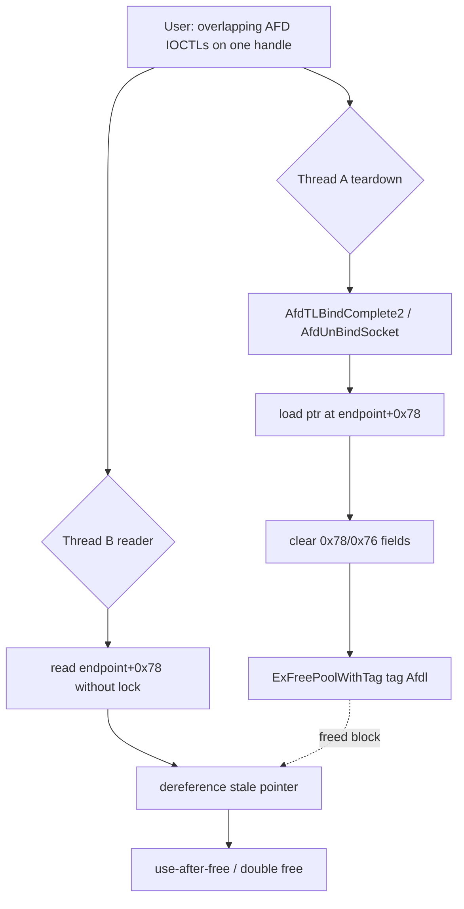

# CVE-2026-50349

**CVE:** CVE-2026-50349  
**Title:** Windows Ancillary Function Driver for WinSock Elevation of Privilege Vulnerability  
**Source:** [https://msrc.microsoft.com/update-guide/vulnerability/CVE-2026-50349](https://msrc.microsoft.com/update-guide/vulnerability/CVE-2026-50349)  
**Component(s):** afd.sys  
**Patched Date:** 2026-09-08T07:00:00  
**CWE:** Concurrent execution using shared resource with improper synchronization ('race condition') in Windows Ancillary Function Driver for WinSock allows an authorized attacker to elevate privileges locally.  

---

## Related CVEs (Same Component)

This report covers 2 CVEs affecting the same component(s):

- **CVE-2026-50349**  
- CVE-2026-70342  

### Detailed Information

#### CVE-2026-70342

**Title:** Windows Ancillary Function Driver for WinSock Elevation of Privilege Vulnerability  
**Source:** [https://msrc.microsoft.com/update-guide/vulnerability/CVE-2026-70342](https://msrc.microsoft.com/update-guide/vulnerability/CVE-2026-70342)  
**Patched Date:** 2026-09-08T07:00:00  
**CWE:** Use after free in Windows Ancillary Function Driver for WinSock allows an unauthorized attacker to elevate privileges over a network.  

---

Download Patched & Vulnerable Components:

```bash
# afd.sys
wget https://msdl.microsoft.com/download/symbols/afd.sys/F9749B8AB3000/afd.sys -O afd.sys.10.0.26100.9278 # vulnerable
wget https://msdl.microsoft.com/download/symbols/afd.sys/8023C97FB3000/afd.sys -O afd.sys.10.0.26100.9444 # patched
```

## Version Tracking Analysis

**Command:**

```
python ghidra_scripts\ghidra_vt_wrapper.py --old-binary ./reports/2026-Sep/CVE-2026-50349/afd.sys.10.0.26100.9278 --new-binary ./reports/2026-Sep/CVE-2026-50349/afd.sys.10.0.26100.9444 --project-dir ./reports/2026-Sep/CVE-2026-50349/ghidra_project --project-name afd.sys_CVE-2026-50349 --ghidra-dir C:\Tools\ghidra_11.4.2_PUBLIC_20250826\ghidra_11.4.2_PUBLIC --output-dir ./reports/2026-Sep/CVE-2026-50349/ghidra_project/vt_results --max-memory 16g
```

Patched Functions: 6 | New Functions: 7 | Removed Functions: 1 | Total Matches: 18512 | Accepted Matches: 8316

### Patched Functions

| Function Name | Source Address | Dest Address | Similarity | Confidence |
| --- | --- | --- | --- | --- |
| `AfdBind` | `140039890` | `140039160` | 0.966 | 10.0 |
| `AfdUnBindSocket` | `140044590` | `140043fd0` | 0.948 | 10.0 |
| `AfdCachedPollDerefFileObjects` | `140029d24` | `140028800` | 0.683 | 10.0 |
| `AfdTLBindComplete2` | `1400293ec` | `140013e5c` | 0.663 | 10.0 |
| `AfdPoll64` | `140020360` | `140014ec0` | 0.639 | 10.0 |
| `AfdBCommonChainedReceiveEventHandler` | `140017650` | `140022590` | 0.615 | 10.0 |

### New Functions

| Function Name | Address |
| --- | --- |
| `Feature_938110264__private_IsEnabledDeviceUsageNoInline` | `140044c98` |
| `Feature_938110264__private_IsEnabledFallback` | `140044cd0` |
| `Feature_1565238587__private_IsEnabledDeviceUsageNoInline` | `140050f68` |
| `Feature_1565238587__private_IsEnabledFallback` | `140050fa0` |
| `Feature_1286832440__private_IsEnabledDeviceUsageNoInline` | `1400522b0` |
| `Feature_1286832440__private_IsEnabledFallback` | `1400522e8` |
| `_guard_dispatch_icall` | `140073fb0` |

### Removed Functions

| Function Name | Address |
| --- | --- |
| `_guard_dispatch_icall` | `140074440` |

---

# AI Technical Analysis


## Vulnerability Identification

**Core Vulnerable Function(s):**

- `AfdTLBindComplete2()` - Captures the transport address
  buffer pointer at endpoint offset `0x78`, clears the pointer
  and length fields, and frees the buffer with
  `ExFreePoolWithTag` without holding the per-endpoint spin
  lock at offset `0x1c`. This exposes an unsynchronized
  capture-clear-free sequence that races with concurrent
  readers of the same buffer, yielding a use-after-free.

**Supporting Changes:**

- `AfdUnBindSocket()` - Second teardown path with the identical
  defect. The pre-patch code freed and zeroed the address
  buffer while the endpoint lock was held only later, around
  the flag word at offset `0x04`. Receives the same
  feature-gated lock fix keyed on `Feature_938110264`.
- `AfdPoll64()` - Concurrent reader path. It acquires the same
  endpoint lock (`puVar5 + 0x1c`) while walking socket state,
  establishing which lock must serialize the free. Its bulk
  diff is decompiler type propagation, a return-type change
  from `longlong *` to `int`, structure-offset shifts, and a
  separate `Feature_1565238587` device-usage gate.
- `AfdCachedPollDerefFileObjects()` - Structure-layout
  adjustment only. The count field moved from `0x18` to `0x20`
  and the object array base from `0xc8` to `0xd0`, tracking the
  8-byte growth of the poll-info structure.

**Unrelated Changes:**

- WPP trace ID renumbering in `AfdUnBindSocket()`
  (`0x1e`..`0x28`) and the trace GUID symbol rename. These are
  logging bookkeeping with no security relevance.


## Root Cause Analysis

The flaw is a data race on the transport address buffer that a
bound AFD endpoint stores at byte offset `0xf0` (element `0x78`
of the `short`-typed endpoint), with its length at element
`0x76`. The teardown code violated the invariant that this
buffer, and the pointer that names it, may only be read,
cleared, or freed while the owning thread holds the endpoint
spin lock at element `0x1c` (byte offset `0x38`). Because the
capture, the field clear, and the pool free all executed
outside that lock, a second thread could observe a live pointer
and dereference the buffer after it was returned to the pool.

Vulnerable `AfdTLBindComplete2()` teardown:

```c
LAB_14002952d:
  AFDETW_TRACEBIND(1,0x1b71,param_2,param_3,
                   *(short **)(param_2 + 0x78));
  uVar3 = *(undefined8 *)(param_2 + 0x78);
  param_2[0x78] = 0;
  param_2[0x79] = 0;
  param_2[0x7a] = 0;
  param_2[0x7b] = 0;
  param_2[0x76] = 0;
  param_2[0x77] = 0;
  ExFreePoolWithTag(uVar3,0x6c646641);
```

The pointer is read into `uVar3` from `*(param_2 + 0x78)`. The
four `short` stores to `param_2[0x78]` through `param_2[0x7b]`
clear the 8-byte pointer, and the two stores to `param_2[0x76]`
and `param_2[0x77]` clear the 4-byte length. Only afterward is
`ExFreePoolWithTag(uVar3,0x6c646641)` called, where the tag
`0x6c646641` is the ASCII pool tag `Afdl`. None of these six
stores, nor the preceding load, is bracketed by
`KeAcquireInStackQueuedSpinLock` on `param_2 + 0x1c`. A
concurrent thread that takes that lock and reads `param_2 +
0x78` can therefore load `uVar3` an instant before this thread
NULLs the field, then use that stale pointer while, or after,
this thread frees the allocation. The same pattern is present in
`AfdUnBindSocket()`, where the free of `*(psVar2 + 0x78)` and
the subsequent zeroing precede the lock entirely. Because
`AfdPoll64()` demonstrates that endpoint state is read under
`puVar5 + 0x1c`, the missing acquisition in the two teardown
paths is the precise ordering error that opens the race.


## Execution and Trigger Flow

The vulnerability is reached from user mode through the AFD
device via overlapping I/O control requests on one socket
handle shared by multiple threads. One thread drives a bind
teardown: a transport-layer bind completion invokes
`AfdTLBindComplete2()` on the failure or cleanup path at
`LAB_14002952d`, or the client issues an unbind that enters
`AfdUnBindSocket()`. That thread loads the `Afdl` address buffer
pointer from endpoint offset `0x78`, begins clearing the pointer
and length fields, and calls `ExFreePoolWithTag`. Concurrently a
second thread references the same endpoint and reads the address
buffer through the pointer at offset `0x78`. Because neither the
loader-and-freer nor the reader is serialized by the endpoint
lock at offset `0x1c`, their operations interleave. The reader
captures a non-NULL pointer in the window before the freeing
thread zeroes the field, and dereferences it after the pool
block is freed. The result is a kernel-pool use-after-free of an
`Afdl` allocation. Depending on the interleaving, the same
window also permits two teardown paths to free the identical
pointer, producing a double free. An attacker who sprays the
freed pool slot with controlled data before the stale read
converts the dangling access into a controlled read or write of
kernel memory, a primitive suitable for local privilege
escalation.




## Patch Analysis

The patch places the capture-clear step under the endpoint spin
lock at offset `0x1c`, gated by `Feature_938110264`.

```diff
-    uVar3 = *(undefined8 *)(param_2 + 0x78);
-    param_2[0x78] = 0;
-    param_2[0x79] = 0;
-    param_2[0x7a] = 0;
-    param_2[0x7b] = 0;
-    param_2[0x76] = 0;
-    param_2[0x77] = 0;
-    ExFreePoolWithTag(uVar3,0x6c646641);
+    if (uVar6 == 0) {
+      uVar8 = *(undefined8 *)(param_2 + 0x78);
+      param_2[0x78] = 0;
+      /* ... clear 0x79..0x7b, 0x76, 0x77 ... */
+    }
+    else {
+      KeAcquireInStackQueuedSpinLock(param_2 + 0x1c,local_88 + 1);
+      uVar8 = *(undefined8 *)(param_2 + 0x78);
+      param_2[0x78] = 0;
+      /* ... clear 0x79..0x7b, 0x76, 0x77 ... */
+      KeReleaseInStackQueuedSpinLock(local_88 + 1);
+    }
+    ExFreePoolWithTag(uVar8,0x6c646641);
```

When the feature is enabled, `uVar6` is nonzero and the code
takes the `else` arm. It calls `KeAcquireInStackQueuedSpinLock`
on `param_2 + 0x1c` before loading the pointer into `uVar8`,
performs all six field-clearing stores, then calls
`KeReleaseInStackQueuedSpinLock`. The load and the NULLing of
the pointer now form one critical section against any reader
that takes the same lock. `AfdUnBindSocket()` receives the
matching change: with the feature enabled it acquires
`psVar2 + 0x1c` before zeroing `psVar2[0x78]` through
`psVar2[0x77]`, whereas the pre-patch order zeroed first and
locked later. The evaluation logic reads
`Feature_938110264__private_featureState`, and when the low bit
sampling resolves to zero it falls back to
`Feature_938110264__private_IsEnabledDeviceUsageNoInline`.

The fix is effective because it closes the exact window that
allowed the stale read. A reader that acquires the endpoint lock
now observes the pointer either fully valid or already NULL,
never a transient value that survives the free, so it will not
carry a live pointer across the deallocation. The
capture-and-clear atomicity also prevents two teardown paths
from both loading the same non-NULL pointer, eliminating the
double free. The free call itself remains outside the lock,
which is safe once the field is NULL under the lock, since no
new reader can obtain the pointer after the field is cleared.
The staged rollout behind `Feature_938110264` lets the fix ship
disabled and be activated by configuration.

The security impact is a fix for a kernel-pool use-after-free
and double-free in `afd.sys` reachable by any local user holding
an AFD socket handle. Correct serialization on the endpoint lock
removes the race that could otherwise be leveraged for
information disclosure or elevation of privilege.