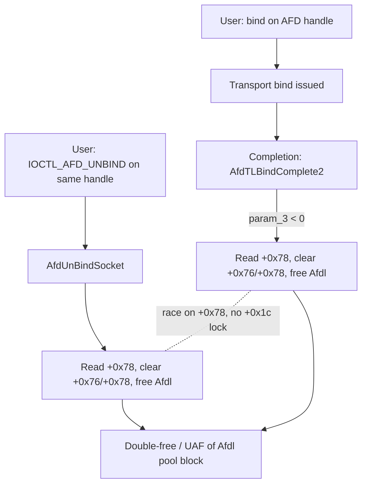

# CVE-2026-50349

**CVE:** CVE-2026-50349  
**Title:** Windows Ancillary Function Driver for WinSock Elevation of Privilege Vulnerability  
**Source:** [https://msrc.microsoft.com/update-guide/vulnerability/CVE-2026-50349](https://msrc.microsoft.com/update-guide/vulnerability/CVE-2026-50349)  
**Component(s):** afd.sys  
**Patched Date:** 2026-09-08T07:00:00  
**CWE:** Concurrent execution using shared resource with improper synchronization ('race condition') in Windows Ancillary Function Driver for WinSock allows an authorized attacker to elevate privileges locally.  

---

## Related CVEs (Same Component)

This report covers 2 CVEs affecting the same component(s):

- **CVE-2026-50349**  
- CVE-2026-70342  

### Detailed Information

#### CVE-2026-70342

**Title:** Windows Ancillary Function Driver for WinSock Elevation of Privilege Vulnerability  
**Source:** [https://msrc.microsoft.com/update-guide/vulnerability/CVE-2026-70342](https://msrc.microsoft.com/update-guide/vulnerability/CVE-2026-70342)  
**Patched Date:** 2026-09-08T07:00:00  
**CWE:** Use after free in Windows Ancillary Function Driver for WinSock allows an unauthorized attacker to elevate privileges over a network.  

---

Download Patched & Vulnerable Components:

```bash
# afd.sys
wget https://msdl.microsoft.com/download/symbols/afd.sys/F9749B8AB3000/afd.sys -O afd.sys.10.0.26100.9278 # vulnerable
wget https://msdl.microsoft.com/download/symbols/afd.sys/8023C97FB3000/afd.sys -O afd.sys.10.0.26100.9444 # patched
```

## Version Tracking Analysis

**Command:**

```
python ghidra_scripts\ghidra_vt_wrapper.py --old-binary ./reports/2026-Sep/CVE-2026-50349/afd.sys.10.0.26100.9278 --new-binary ./reports/2026-Sep/CVE-2026-50349/afd.sys.10.0.26100.9444 --project-dir ./reports/2026-Sep/CVE-2026-50349/ghidra_project --project-name afd.sys_CVE-2026-50349 --ghidra-dir C:\Tools\ghidra_11.4.2_PUBLIC_20250826\ghidra_11.4.2_PUBLIC --output-dir ./reports/2026-Sep/CVE-2026-50349/ghidra_project/vt_results --max-memory 16g
```

Patched Functions: 6 | New Functions: 7 | Removed Functions: 1 | Total Matches: 18512 | Accepted Matches: 8316

### Patched Functions

| Function Name | Source Address | Dest Address | Similarity | Confidence |
| --- | --- | --- | --- | --- |
| `AfdBind` | `140039890` | `140039160` | 0.966 | 10.0 |
| `AfdUnBindSocket` | `140044590` | `140043fd0` | 0.948 | 10.0 |
| `AfdCachedPollDerefFileObjects` | `140029d24` | `140028800` | 0.683 | 10.0 |
| `AfdTLBindComplete2` | `1400293ec` | `140013e5c` | 0.663 | 10.0 |
| `AfdPoll64` | `140020360` | `140014ec0` | 0.639 | 10.0 |
| `AfdBCommonChainedReceiveEventHandler` | `140017650` | `140022590` | 0.615 | 10.0 |

### New Functions

| Function Name | Address |
| --- | --- |
| `Feature_938110264__private_IsEnabledDeviceUsageNoInline` | `140044c98` |
| `Feature_938110264__private_IsEnabledFallback` | `140044cd0` |
| `Feature_1565238587__private_IsEnabledDeviceUsageNoInline` | `140050f68` |
| `Feature_1565238587__private_IsEnabledFallback` | `140050fa0` |
| `Feature_1286832440__private_IsEnabledDeviceUsageNoInline` | `1400522b0` |
| `Feature_1286832440__private_IsEnabledFallback` | `1400522e8` |
| `_guard_dispatch_icall` | `140073fb0` |

### Removed Functions

| Function Name | Address |
| --- | --- |
| `_guard_dispatch_icall` | `140074440` |

---

# AI Technical Analysis

## Vulnerability Identification

**Core Vulnerable Function(s):**

- `AfdTLBindComplete2()` - Reads, clears, and frees the transport
  address buffer at endpoint offset `+0x78` and its length at
  `+0x76` with no lock held, racing a concurrent unbind on the
  same endpoint and producing a use-after-free or double-free.
- `AfdUnBindSocket()` - Performs the same free-and-clear of the
  address buffer, but in the unpatched code clears the pointer
  and length fields outside the endpoint spinlock, so it races
  the bind-completion path over the identical fields.

**Supporting Changes:**

- `AfdCachedPollDerefFileObjects()` - Pure offset adjustment
  (`+0x18` to `+0x20` count, base `+0xC8` to `+0xD0`) tracking a
  growth of the poll-info structure. Not the address-buffer race.

**Unrelated Changes:**

- `AfdPoll64()` - Almost entirely structure-layout renumbering
  (every field shifted by 8 bytes) plus a separate feature,
  `Feature_1565238587`, gating IRP reference accounting. It does
  not touch the address buffer at `+0x78` and is not the flaw.

---

## Root Cause Analysis

The vulnerability is a missing-synchronization defect. The AFD
endpoint stores a transport (local) address buffer pointer at
short offset `+0x78` and its length at `+0x76`, and this buffer
is protected by the per-endpoint in-stack queued spinlock at
`+0x1c`. The bind-completion and unbind paths violate that
locking invariant: they read the pointer, null the pointer and
length fields, and free the pool block without ever acquiring
`+0x1c`, so two threads can observe the same non-null pointer.

Vulnerable `AfdTLBindComplete2()` before the patch:

```c
uVar3 = *(undefined8 *)(param_2 + 0x78);
param_2[0x78] = 0;
param_2[0x79] = 0;
param_2[0x7a] = 0;
param_2[0x7b] = 0;
param_2[0x76] = 0;
param_2[0x77] = 0;
ExFreePoolWithTag(uVar3,0x6c646641);
```

The pointer is captured into `uVar3` from `param_2 + 0x78`, the
four shorts `0x78`-`0x7b` (the 8-byte pointer) and the two shorts
`0x76`-`0x77` (the 4-byte length) are zeroed, and only then is
the block released with `ExFreePoolWithTag` under pool tag
`0x6c646641` ("Afdl"). None of this is fenced by the `+0x1c`
lock. A concurrent `AfdUnBindSocket()` reaches its own copy of
the same sequence, where the free at `*(undefined8 *)(psVar2 +
0x78)` runs and the clears at `psVar2[0x78]`-`psVar2[0x77]` sit
outside the lock the routine already takes for the flag writes
at `+4`. Because the load of the pointer and the store of null
are not atomic with respect to each other, two threads can both
latch the same address before either writes zero, driving two
`ExFreePoolWithTag` calls on one allocation (double-free), or one
thread frees while the other later dereferences the now-dangling
`+0x78` value (use-after-free). The window is the entire
read-clear-free span, and it is directly reachable from
attacker-issued bind and unbind requests on the same handle.

---

## Execution and Trigger Flow

An attacker holds one AFD socket handle and drives two operations
on it from separate threads. Thread A issues a bind whose
transport-layer completion invokes `AfdTLBindComplete2()`; when
`param_3 < 0` (a failed or cancelled bind), control jumps to the
teardown label and enters the read-clear-free sequence over
`param_2 + 0x78`. Thread B concurrently issues the unbind IOCTL,
which dispatches to `AfdUnBindSocket()` and reaches its matching
free of `*(psVar2 + 0x78)` plus the field clears. Both threads
resolve `+0x78` to the same non-null pool pointer because neither
holds the `+0x1c` spinlock. Thread A latches the pointer into
`uVar3`; Thread B latches it as its free argument. Both call
`ExFreePoolWithTag(ptr, 0x6c646641)`, freeing one block twice, or
one thread frees while the other reads the stale pointer for its
subsequent access. The freed "Afdl" block can be reclaimed and
reshaped by attacker-controlled pool sprays between the two
frees, converting the double-free into a controlled
kernel-pool corruption primitive suitable for privilege
escalation.



---

## Patch Analysis

The patch introduces the endpoint spinlock at `+0x1c` around the
entire read-clear window and gates the change behind
`Feature_938110264`.

Patched `AfdTLBindComplete2()` (feature-enabled branch):

```diff
+    if (uVar6 == 0) {
+      uVar8 = *(undefined8 *)(param_2 + 0x78);
+      param_2[0x78] = 0;
+      ...
+      param_2[0x77] = 0;
+    }
+    else {
+      KeAcquireInStackQueuedSpinLock(param_2 + 0x1c,local_88 + 1);
+      uVar8 = *(undefined8 *)(param_2 + 0x78);
+      param_2[0x78] = 0;
+      ...
+      param_2[0x77] = 0;
+      KeReleaseInStackQueuedSpinLock(local_88 + 1);
+    }
+    ExFreePoolWithTag(uVar8,0x6c646641);
```

The enabled branch calls `KeAcquireInStackQueuedSpinLock` on
`param_2 + 0x1c` before loading the pointer into `uVar8`, keeps
the lock held across all six field-clearing stores, then releases
it with `KeReleaseInStackQueuedSpinLock`. `ExFreePoolWithTag`
runs after release, but by then the pointer has been captured and
`+0x78` zeroed atomically with respect to any other holder of the
same lock. `AfdUnBindSocket()` receives the symmetric fix: its
feature-enabled branch acquires `+0x1c` first and then clears the
fields, whereas the disabled branch preserves the old
clear-then-lock order for behavioral parity. `uVar6` and `uVar9`
are the resolved feature states from
`Feature_938110264__private_IsEnabledDeviceUsageNoInline`.

The fix is effective because both racing paths now serialize on
the single per-endpoint lock that already guards this buffer, so
the load-then-store on `+0x78` becomes indivisible relative to
the peer. One thread nulls the pointer under the lock; the other
subsequently reads zero and skips the free, eliminating both the
double-free and the dangling-pointer read. Gating on
`Feature_938110264` lets the change ship staged, and the lock
address matches the existing endpoint locking discipline, so no
new lock-ordering hazard is introduced.

The security impact is a race-driven kernel-pool double-free and
use-after-free on the "Afdl" transport address allocation,
reachable from an unprivileged handle. Exploited, it yields pool
corruption and a plausible local elevation-of-privilege
primitive. The serialization fully closes the race window for the
affected fields.