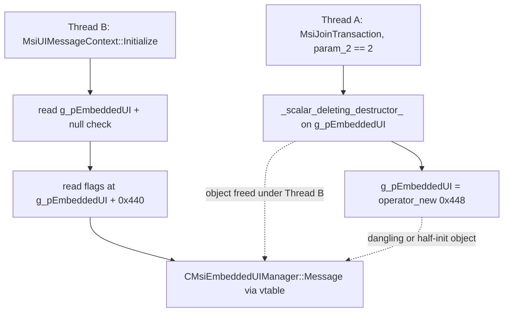

# CVE-2026-62694

**CVE:** CVE-2026-62694  
**Title:** Windows Installer Elevation of Privilege Vulnerability  
**Source:** [https://msrc.microsoft.com/update-guide/vulnerability/CVE-2026-62694](https://msrc.microsoft.com/update-guide/vulnerability/CVE-2026-62694)  
**Component(s):** msi.dll  
**Patched Date:** 2026-09-08T07:00:00  
**CWE:** Use after free in Windows Installer allows an authorized attacker to elevate privileges locally.  

---

## Related CVEs (Same Component)

This report covers 5 CVEs affecting the same component(s):

- **CVE-2026-62694**  
- CVE-2026-69441  
- CVE-2026-71339  
- CVE-2026-72929  
- CVE-2026-77894  

### Detailed Information

#### CVE-2026-69441

**Title:** Windows Installer Elevation of Privilege Vulnerability  
**Source:** [https://msrc.microsoft.com/update-guide/vulnerability/CVE-2026-69441](https://msrc.microsoft.com/update-guide/vulnerability/CVE-2026-69441)  
**Patched Date:** 2026-09-08T07:00:00  
**CWE:** Concurrent execution using shared resource with improper synchronization ('race condition') in Windows Installer allows an authorized attacker to elevate privileges locally.  

#### CVE-2026-71339

**Title:** Windows Installer Elevation of Privilege Vulnerability  
**Source:** [https://msrc.microsoft.com/update-guide/vulnerability/CVE-2026-71339](https://msrc.microsoft.com/update-guide/vulnerability/CVE-2026-71339)  
**Patched Date:** 2026-09-08T07:00:00  
**CWE:** Heap-based buffer overflow in Windows Installer allows an authorized attacker to elevate privileges locally.  

#### CVE-2026-72929

**Title:** Windows Installer Elevation of Privilege Vulnerability  
**Source:** [https://msrc.microsoft.com/update-guide/vulnerability/CVE-2026-72929](https://msrc.microsoft.com/update-guide/vulnerability/CVE-2026-72929)  
**Patched Date:** 2026-09-08T07:00:00  
**CWE:** Improper validation of integrity check value in Windows Installer allows an authorized attacker to elevate privileges locally.  

#### CVE-2026-77894

**Title:** Windows Installer Elevation of Privilege Vulnerability  
**Source:** [https://msrc.microsoft.com/update-guide/vulnerability/CVE-2026-77894](https://msrc.microsoft.com/update-guide/vulnerability/CVE-2026-77894)  
**Patched Date:** 2026-09-08T07:00:00  
**CWE:** Concurrent execution using shared resource with improper synchronization ('race condition') in Windows Installer allows an authorized attacker to elevate privileges locally.  

---

Download Patched & Vulnerable Components:

```bash
# msi.dll
wget https://msdl.microsoft.com/download/symbols/msi.dll/B872276934B000/msi.dll -O msi.dll.10.0.26100.9278 # vulnerable
wget https://msdl.microsoft.com/download/symbols/msi.dll/4A67AB8834C000/msi.dll -O msi.dll.10.0.26100.9444 # patched
```

## Version Tracking Analysis

**Command:**

```
python ghidra_scripts\ghidra_vt_wrapper.py --old-binary ./reports/2026-Sep/CVE-2026-62694/msi.dll.10.0.26100.9278 --new-binary ./reports/2026-Sep/CVE-2026-62694/msi.dll.10.0.26100.9444 --project-dir ./reports/2026-Sep/CVE-2026-62694/ghidra_project --project-name msi.dll_CVE-2026-62694 --ghidra-dir C:\Tools\ghidra_11.4.2_PUBLIC_20250826\ghidra_11.4.2_PUBLIC --output-dir ./reports/2026-Sep/CVE-2026-62694/ghidra_project/vt_results --max-memory 16g
```

Patched Functions: 20 | New Functions: 13 | Removed Functions: 1 | Total Matches: 43164 | Accepted Matches: 35808

### Patched Functions

*Showing top 10 of 20 patched functions*

| Function Name | Source Address | Dest Address | Similarity | Confidence |
| --- | --- | --- | --- | --- |
| `CMsiLockBytes::WriteAt` | `18024c050` | `18024d1e0` | 0.992 | 1.0 |
| `CMsiFileCopy::ChangeMedia` | `1800ecb30` | `1800ea770` | 0.986 | 1.0 |
| `CMsiConfigurationManager::DoInstall` | `18018b070` | `18018bdb0` | 0.952 | 10.0 |
| `MsiUIMessageContext::Terminate` | `1801ab430` | `1801ac1f8` | 0.946 | 10.0 |
| `CMsiEmbeddedUIManager::Message` | `180124698` | `180125b2c` | 0.932 | 10.0 |
| `CMsiEngine::DoInitialize` | `1800f8e64` | `1800f8ba8` | 0.930 | 10.0 |
| `CMsiEngine::Terminate` | `180145460` | `180145f80` | 0.891 | 10.0 |
| `CMsiEmbeddedUIManager::SendEEUICADetailsToServer` | `1801f3c00` | `1801f4d48` | 0.884 | 10.0 |
| `CMsiEngine::ClearEngineData` | `1800a1224` | `1800f7f34` | 0.878 | 10.0 |
| `MsiUIMessageContext::Initialize` | `180040318` | `1801041c4` | 0.872 | 10.0 |

### New Functions

*Showing 10 of 13 new functions*

| Function Name | Address |
| --- | --- |
| `AcquireLock` | `18008fe70` |
| `~AcquireLock` | `1800ad82c` |
| `AddRef` | `18012e2ac` |
| `GetCachedFeatureEnabledState` | `180137260` |
| `GetCurrentFeatureEnabledState` | `18013769c` |
| `ReportUsage` | `180140c00` |
| `__private_IsEnabled` | `180149574` |
| `GetDirectoryAndFilter` | `1801af4f8` |
| `Release` | `1801f4cd0` |
| `AddRef` | `1801f5358` |

### Removed Functions

| Function Name | Address |
| --- | --- |
| `_guard_dispatch_icall` | `180261900` |

---

# AI Technical Analysis

## Vulnerability Identification

**Core Vulnerable Function(s):**

- `MsiUIMessageContext::Initialize()` - Reads the process-global
  `g_pEmbeddedUI` pointer, null-checks it, then dereferences
  `g_pEmbeddedUI + 0x440` and calls `CMsiEmbeddedUIManager::Message()`
  on it with no lock and no reference held. This is the dangling
  dereference (use) site of the race.
- `MsiJoinTransaction()` - In the `param_2 == 2` branch it destroys
  the current `g_pEmbeddedUI` via `_scalar_deleting_destructor_` and
  reassigns a freshly allocated object, unsynchronized. This is the
  free/replace site of the race.

**Supporting Changes:**

- `CMsiEmbeddedUIManager::JoinExistingEEUI()` - Reworked to write
  through the passed `this` object rather than the global, and to set
  new lifetime flags at offsets `0x44c` and `0x44d`; the custom action
  manager allocation grows from `0x118` to `0x120`. Part of the new
  ownership model, not itself the flaw.
- `CMsiEmbeddedUIManager::CleanupTempDirectory()` - Refactored from
  operating on `g_pEmbeddedUI` to operating on `this`, consistent with
  instance-scoped lifetime.
- `AddRef()`, `AcquireLock()`, `~AcquireLock()` - New reference count
  and RAII critical-section primitives introduced by the fix.
- `GetCachedFeatureEnabledState()`,
  `GetCurrentFeatureEnabledState()` - WIL feature-flag plumbing that
  gates the corrected code path.

**Unrelated Changes:**

- `CMsiFileCopy::ChangeMedia()` - Both revisions are empty stubs
  returning `0x0`; the diff only reflects a symbol re-identification to
  `CScriptDatabase::ExportTable()`. No security relevance.

---

## Root Cause Analysis

The vulnerability is a use-after-free rooted in unsynchronized access
to the process-global embedded UI manager pointer `g_pEmbeddedUI`. The
code assumed a single logical owner of this singleton, yet multiple
`msi.dll` entry points read and replace it concurrently with no lock
and no reference count. That broken ownership invariant lets one
thread free and reallocate the object while another thread is still
dereferencing it.

```c
/* MsiUIMessageContext::Initialize (before) - use site */
if ((DAT_1803118b8 & 0x1000) == 0) {
LAB_180040800:
    if ((DAT_1803116f8 & 0x1000) != 0) {
      CMsiAPIMessage::Message(&g_message,0xc000000,(ushort *)0x0);
    }
    if ((g_pEmbeddedUI != (CMsiEmbeddedUIManager *)0x0) &&
       ((*(uint *)(g_pEmbeddedUI + 0x440) & 0x1000) != 0)) {
      CMsiEmbeddedUIManager::Message
                ((CMsiEmbeddedUIManager *)this_01,0xc000000,
                 (IMsiRecord *)&DAT_18030dd50);
    }
}
```

```c
/* MsiJoinTransaction (before) - free/replace site */
if (param_2 == 2) {
    if (g_pEmbeddedUI != (CMsiEmbeddedUIManager *)0x0) {
      CMsiEmbeddedUIManager::_scalar_deleting_destructor_
                (g_pEmbeddedUI,uVar12);
    }
    g_pEmbeddedUI = operator_new(0x448);
    ...
}
```

In `Initialize`, the guard tests `g_pEmbeddedUI` for non-null and then
reads the flags word at `g_pEmbeddedUI + 0x440`. Between that read and
the subsequent virtual `CMsiEmbeddedUIManager::Message` call, the
pointer value is used with no lock and no reference taken. Meanwhile
`MsiJoinTransaction` with `param_2 == 2` calls
`_scalar_deleting_destructor_` on the same global and immediately
overwrites it with `operator_new(0x448)`. The allocation size `0x448`
contains no reference-count field, confirming the object was never
designed for shared ownership. Because the free and the use touch one
unprotected global, a thread can observe a non-null pointer, have the
object freed underneath it, and then dereference freed memory or call
through a stale vtable. The window spans the flag read, the null
check, and the virtual dispatch, so the dangling object may be either
freed heap or a partially initialized replacement. The result is a
controllable use-after-free on a privileged installer component.

---

## Execution and Trigger Flow

The trigger requires two `msi.dll` operations to run against the same
process, one tearing down the embedded UI manager and one consuming
it. An actor initiates a transaction-join operation that reaches
`MsiJoinTransaction` with `param_2 == 2`, which enters the branch that
destroys `g_pEmbeddedUI` and allocates a replacement. Concurrently, a
UI message-context initialization reaches
`MsiUIMessageContext::Initialize`, which walks to its message-dispatch
tail and reads `g_pEmbeddedUI`. `Initialize` confirms the pointer is
non-null, reads the flag word at offset `0x440`, and finds the
`0x1000` bit set. Before it performs the virtual
`CMsiEmbeddedUIManager::Message` call, the transaction thread runs
`_scalar_deleting_destructor_`, freeing the object the first thread is
about to use. The first thread then dereferences the now-freed pointer
and dispatches through its vtable, producing the use-after-free. If
the transaction thread has already executed `operator_new`, the first
thread instead operates on a fresh, not-yet-populated object, an
equally unsafe state. Because both paths mutate a single global with
no serialization, the ordering is attacker-influenceable through
timing. Successful exploitation corrupts or hijacks control flow in a
component that commonly runs with elevated privilege.



---

## Patch Analysis

The patch replaces bare pointer sharing with reference-counted,
lock-guarded ownership, gated behind a WIL feature flag.

```diff
- if (g_pEmbeddedUI != (CMsiEmbeddedUIManager *)0x0) {
-   CMsiEmbeddedUIManager::_scalar_deleting_destructor_(g_pEmbeddedUI,uVar12);
- }
- g_pEmbeddedUI = operator_new(0x448);
+ pCVar6 = operator_new(0x450);
+ ... CMsiEmbeddedUIManager::CMsiEmbeddedUIManager(pCVar6,0) ...
+ CMsiEmbeddedUIManager::JoinExistingEEUI(pCVar6,puVar7,local_47c,local_480);
+ EnterCriticalSection(&g_csEmbeddedUILock);
+ this = g_pEmbeddedUI;
+ g_pEmbeddedUI = pCVar6;
+ LeaveCriticalSection(&g_csEmbeddedUILock);
+ if (this != (CMsiEmbeddedUIManager *)0x0) {
+   CMsiEmbeddedUIManager::Release(this);
+ }
```

```diff
+ EnterCriticalSection(&g_csEmbeddedUILock);
+ this_00 = g_pEmbeddedUI;
+ if (g_pEmbeddedUI != (CMsiEmbeddedUIManager *)0x0) {
+   LOCK();
+   *(int *)(g_pEmbeddedUI + 0x448) = *(int *)(g_pEmbeddedUI + 0x448) + 1;
+   UNLOCK();
+ }
+ LeaveCriticalSection(&g_csEmbeddedUILock);
+ if (this_00 != (CMsiEmbeddedUIManager *)0x0) {
+   if ((*(uint *)(this_00 + 0x440) & 0x1000) != 0) {
+     CMsiEmbeddedUIManager::Message(this_00,0xc000000,(IMsiRecord *)&DAT_18030ed60);
+   }
+   CMsiEmbeddedUIManager::Release(this_00);
+ }
```

The allocation size grows from `0x448` to `0x450`, adding a
reference-count field at offset `0x448` that `AddRef()` increments and
`Release()` decrements atomically. `MsiJoinTransaction` now builds the
replacement fully, then enters `g_csEmbeddedUILock`, swaps
`g_pEmbeddedUI`, leaves the lock, and only afterward calls `Release`
on the old object. `MsiUIMessageContext::Initialize` now enters the
same critical section, snapshots `g_pEmbeddedUI` into `this_00`, calls
`AddRef` while the lock is held, leaves the lock, and uses and
releases its own reference. Because every reader holds a counted
reference taken under the lock, the swap can never free an object a
reader still holds. The old object is destroyed only when its
reference count reaches zero, eliminating the dangling dereference.

This is effective within the feature-enabled path: the critical
section serializes pointer reads and swaps, and the atomic refcount
keeps the target alive across the flag read and the virtual dispatch.
The `AcquireLock`/`~AcquireLock` RAII pair enforces balanced
lock acquisition and release. One caveat is that the fix is gated by
`Feature_4208167227`; when the flag is disabled the code retains the
legacy unsynchronized branch, so protection depends on rollout
configuration. Overall the change converts a race-prone singleton into
a properly reference-counted, mutually exclusive resource.

The security impact is a remediated use-after-free in a
privilege-sensitive installer component. Correct synchronization and
lifetime management remove the exploitable window that previously
allowed freed-memory dereference and potential control-flow hijack.