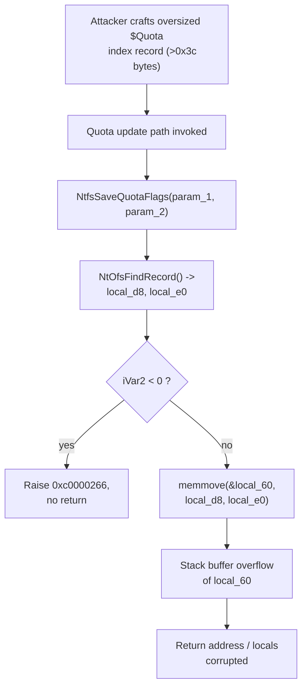

# CVE-2026-68832

**CVE:** CVE-2026-68832  
**Title:** Windows NTFS Elevation of Privilege Vulnerability  
**Source:** [https://msrc.microsoft.com/update-guide/vulnerability/CVE-2026-68832](https://msrc.microsoft.com/update-guide/vulnerability/CVE-2026-68832)  
**Component(s):** ntfs.sys  
**Patched Date:** 2026-09-08T07:00:00  
**CWE:** Integer overflow or wraparound in Windows NTFS allows an authorized attacker to elevate privileges locally.  

---

## Related CVEs (Same Component)

This report covers 29 CVEs affecting the same component(s):

- **CVE-2026-68832**  
- CVE-2026-68833  
- CVE-2026-68834  
- CVE-2026-68838  
- CVE-2026-68841  
- CVE-2026-68851  
- CVE-2026-68875  
- CVE-2026-69265  
- CVE-2026-69312  
- CVE-2026-69332  
- CVE-2026-69340  
- CVE-2026-69379  
- CVE-2026-69425  
- CVE-2026-69461  
- CVE-2026-69463  
- CVE-2026-69479  
- CVE-2026-69504  
- CVE-2026-69505  
- CVE-2026-69532  
- CVE-2026-69566  
- CVE-2026-69567  
- CVE-2026-69591  
- CVE-2026-69638  
- CVE-2026-69709  
- CVE-2026-69875  
- CVE-2026-71329  
- CVE-2026-72935  
- CVE-2026-77503  
- CVE-2026-83995  

### Detailed Information

#### CVE-2026-68833

**Title:** Windows NTFS Remote Code Execution Vulnerability  
**Source:** [https://msrc.microsoft.com/update-guide/vulnerability/CVE-2026-68833](https://msrc.microsoft.com/update-guide/vulnerability/CVE-2026-68833)  
**Patched Date:** 2026-09-08T07:00:00  
**CWE:** Heap-based buffer overflow in Windows NTFS allows an unauthorized attacker to execute code with a physical attack.  

#### CVE-2026-68834

**Title:** Windows NTFS Elevation of Privilege Vulnerability  
**Source:** [https://msrc.microsoft.com/update-guide/vulnerability/CVE-2026-68834](https://msrc.microsoft.com/update-guide/vulnerability/CVE-2026-68834)  
**Patched Date:** 2026-09-08T07:00:00  
**CWE:** Stack-based buffer overflow in Windows NTFS allows an authorized attacker to elevate privileges over a network.  

#### CVE-2026-68838

**Title:** Windows NTFS Elevation of Privilege Vulnerability  
**Source:** [https://msrc.microsoft.com/update-guide/vulnerability/CVE-2026-68838](https://msrc.microsoft.com/update-guide/vulnerability/CVE-2026-68838)  
**Patched Date:** 2026-09-08T07:00:00  
**CWE:** Stack-based buffer overflow in Windows NTFS allows an authorized attacker to elevate privileges over a network.  

#### CVE-2026-68841

**Title:** Windows NTFS Elevation of Privilege Vulnerability  
**Source:** [https://msrc.microsoft.com/update-guide/vulnerability/CVE-2026-68841](https://msrc.microsoft.com/update-guide/vulnerability/CVE-2026-68841)  
**Patched Date:** 2026-09-08T07:00:00  
**CWE:** Heap-based buffer overflow in Windows NTFS allows an authorized attacker to elevate privileges locally.  

#### CVE-2026-68851

**Title:** Windows NTFS Information Disclosure Vulnerability  
**Source:** [https://msrc.microsoft.com/update-guide/vulnerability/CVE-2026-68851](https://msrc.microsoft.com/update-guide/vulnerability/CVE-2026-68851)  
**Patched Date:** 2026-09-08T07:00:00  
**CWE:** Buffer over-read in Windows NTFS allows an authorized attacker to disclose information locally.  

#### CVE-2026-68875

**Title:** Windows NTFS Remote Code Execution Vulnerability  
**Source:** [https://msrc.microsoft.com/update-guide/vulnerability/CVE-2026-68875](https://msrc.microsoft.com/update-guide/vulnerability/CVE-2026-68875)  
**Patched Date:** 2026-09-08T07:00:00  
**CWE:** Buffer over-read in Windows NTFS allows an authorized attacker to execute code locally.  

#### CVE-2026-69265

**Title:** Windows NTFS Elevation of Privilege Vulnerability  
**Source:** [https://msrc.microsoft.com/update-guide/vulnerability/CVE-2026-69265](https://msrc.microsoft.com/update-guide/vulnerability/CVE-2026-69265)  
**Patched Date:** 2026-09-08T07:00:00  
**CWE:** Out-of-bounds read in Windows NTFS allows an authorized attacker to elevate privileges locally.  

#### CVE-2026-69312

**Title:** Windows NTFS Elevation of Privilege Vulnerability  
**Source:** [https://msrc.microsoft.com/update-guide/vulnerability/CVE-2026-69312](https://msrc.microsoft.com/update-guide/vulnerability/CVE-2026-69312)  
**Patched Date:** 2026-09-08T07:00:00  
**CWE:** Out-of-bounds read in Windows NTFS allows an authorized attacker to elevate privileges locally.  

#### CVE-2026-69332

**Title:** Windows NTFS Elevation of Privilege Vulnerability  
**Source:** [https://msrc.microsoft.com/update-guide/vulnerability/CVE-2026-69332](https://msrc.microsoft.com/update-guide/vulnerability/CVE-2026-69332)  
**Patched Date:** 2026-09-08T07:00:00  
**CWE:** Out-of-bounds read in Windows NTFS allows an authorized attacker to elevate privileges over a network.  

#### CVE-2026-69340

**Title:** Windows NTFS Elevation of Privilege Vulnerability  
**Source:** [https://msrc.microsoft.com/update-guide/vulnerability/CVE-2026-69340](https://msrc.microsoft.com/update-guide/vulnerability/CVE-2026-69340)  
**Patched Date:** 2026-09-08T07:00:00  
**CWE:** Heap-based buffer overflow in Windows NTFS allows an authorized attacker to elevate privileges over a network.  

#### CVE-2026-69379

**Title:** Windows NTFS Elevation of Privilege Vulnerability  
**Source:** [https://msrc.microsoft.com/update-guide/vulnerability/CVE-2026-69379](https://msrc.microsoft.com/update-guide/vulnerability/CVE-2026-69379)  
**Patched Date:** 2026-09-08T07:00:00  
**CWE:** Improper link resolution before file access ('link following') in Windows NTFS allows an authorized attacker to elevate privileges locally.  

#### CVE-2026-69425

**Title:** Windows NTFS Tampering Vulnerability  
**Source:** [https://msrc.microsoft.com/update-guide/vulnerability/CVE-2026-69425](https://msrc.microsoft.com/update-guide/vulnerability/CVE-2026-69425)  
**Patched Date:** 2026-09-08T07:00:00  
**CWE:** Improper link resolution before file access ('link following') in Windows NTFS allows an authorized attacker to perform tampering locally.  

#### CVE-2026-69461

**Title:** Windows NTFS Remote Code Execution Vulnerability  
**Source:** [https://msrc.microsoft.com/update-guide/vulnerability/CVE-2026-69461](https://msrc.microsoft.com/update-guide/vulnerability/CVE-2026-69461)  
**Patched Date:** 2026-09-08T07:00:00  
**CWE:** Stack-based buffer overflow in Windows NTFS allows an unauthorized attacker to execute code over a network.  

#### CVE-2026-69463

**Title:** Windows NTFS Remote Code Execution Vulnerability  
**Source:** [https://msrc.microsoft.com/update-guide/vulnerability/CVE-2026-69463](https://msrc.microsoft.com/update-guide/vulnerability/CVE-2026-69463)  
**Patched Date:** 2026-09-08T07:00:00  
**CWE:** Heap-based buffer overflow in Windows NTFS allows an unauthorized attacker to execute code over a network.  

#### CVE-2026-69479

**Title:** Windows NTFS Remote Code Execution Vulnerability  
**Source:** [https://msrc.microsoft.com/update-guide/vulnerability/CVE-2026-69479](https://msrc.microsoft.com/update-guide/vulnerability/CVE-2026-69479)  
**Patched Date:** 2026-09-08T07:00:00  
**CWE:** Heap-based buffer overflow in Windows NTFS allows an unauthorized attacker to execute code locally.  

#### CVE-2026-69504

**Title:** Windows NTFS Information Disclosure Vulnerability  
**Source:** [https://msrc.microsoft.com/update-guide/vulnerability/CVE-2026-69504](https://msrc.microsoft.com/update-guide/vulnerability/CVE-2026-69504)  
**Patched Date:** 2026-09-08T07:00:00  
**CWE:** Out-of-bounds read in Windows NTFS allows an authorized attacker to disclose information locally.  

#### CVE-2026-69505

**Title:** Windows NTFS Elevation of Privilege Vulnerability  
**Source:** [https://msrc.microsoft.com/update-guide/vulnerability/CVE-2026-69505](https://msrc.microsoft.com/update-guide/vulnerability/CVE-2026-69505)  
**Patched Date:** 2026-09-08T07:00:00  
**CWE:** Out-of-bounds read in Windows NTFS allows an authorized attacker to elevate privileges over a network.  

#### CVE-2026-69532

**Title:** Windows NTFS Elevation of Privilege Vulnerability  
**Source:** [https://msrc.microsoft.com/update-guide/vulnerability/CVE-2026-69532](https://msrc.microsoft.com/update-guide/vulnerability/CVE-2026-69532)  
**Patched Date:** 2026-09-08T07:00:00  
**CWE:** Out-of-bounds read in Windows NTFS allows an authorized attacker to elevate privileges locally.  

#### CVE-2026-69566

**Title:** Windows NTFS Remote Code Execution Vulnerability  
**Source:** [https://msrc.microsoft.com/update-guide/vulnerability/CVE-2026-69566](https://msrc.microsoft.com/update-guide/vulnerability/CVE-2026-69566)  
**Patched Date:** 2026-09-08T07:00:00  
**CWE:** Heap-based buffer overflow in Windows NTFS allows an unauthorized attacker to execute code with a physical attack.  

#### CVE-2026-69567

**Title:** Windows NTFS Elevation of Privilege Vulnerability  
**Source:** [https://msrc.microsoft.com/update-guide/vulnerability/CVE-2026-69567](https://msrc.microsoft.com/update-guide/vulnerability/CVE-2026-69567)  
**Patched Date:** 2026-09-08T07:00:00  
**CWE:** Use after free in Windows NTFS allows an authorized attacker to elevate privileges locally.  

#### CVE-2026-69591

**Title:** Windows NTFS Information Disclosure Vulnerability  
**Source:** [https://msrc.microsoft.com/update-guide/vulnerability/CVE-2026-69591](https://msrc.microsoft.com/update-guide/vulnerability/CVE-2026-69591)  
**Patched Date:** 2026-09-08T07:00:00  
**CWE:** Out-of-bounds read in Windows NTFS allows an authorized attacker to disclose information over a network.  

#### CVE-2026-69638

**Title:** Windows NTFS Remote Code Execution Vulnerability  
**Source:** [https://msrc.microsoft.com/update-guide/vulnerability/CVE-2026-69638](https://msrc.microsoft.com/update-guide/vulnerability/CVE-2026-69638)  
**Patched Date:** 2026-09-08T07:00:00  
**CWE:** Heap-based buffer overflow in Windows NTFS allows an unauthorized attacker to execute code locally.  

#### CVE-2026-69709

**Title:** Windows NTFS Remote Code Execution Vulnerability  
**Source:** [https://msrc.microsoft.com/update-guide/vulnerability/CVE-2026-69709](https://msrc.microsoft.com/update-guide/vulnerability/CVE-2026-69709)  
**Patched Date:** 2026-09-08T07:00:00  
**CWE:** Heap-based buffer overflow in Windows NTFS allows an authorized attacker to execute code locally.  

#### CVE-2026-69875

**Title:** Windows NTFS Elevation of Privilege Vulnerability  
**Source:** [https://msrc.microsoft.com/update-guide/vulnerability/CVE-2026-69875](https://msrc.microsoft.com/update-guide/vulnerability/CVE-2026-69875)  
**Patched Date:** 2026-09-08T07:00:00  
**CWE:** Heap-based buffer overflow in Windows NTFS allows an authorized attacker to elevate privileges over a network.  

#### CVE-2026-71329

**Title:** Windows NTFS Remote Code Execution Vulnerability  
**Source:** [https://msrc.microsoft.com/update-guide/vulnerability/CVE-2026-71329](https://msrc.microsoft.com/update-guide/vulnerability/CVE-2026-71329)  
**Patched Date:** 2026-09-08T07:00:00  
**CWE:** Heap-based buffer overflow in Windows NTFS allows an unauthorized attacker to execute code with a physical attack.  

#### CVE-2026-72935

**Title:** Windows NTFS Elevation of Privilege Vulnerability  
**Source:** [https://msrc.microsoft.com/update-guide/vulnerability/CVE-2026-72935](https://msrc.microsoft.com/update-guide/vulnerability/CVE-2026-72935)  
**Patched Date:** 2026-09-08T07:00:00  
**CWE:** Out-of-bounds read in Windows NTFS allows an authorized attacker to elevate privileges locally.  

#### CVE-2026-77503

**Title:** Windows NTFS Elevation of Privilege Vulnerability  
**Source:** [https://msrc.microsoft.com/update-guide/vulnerability/CVE-2026-77503](https://msrc.microsoft.com/update-guide/vulnerability/CVE-2026-77503)  
**Patched Date:** 2026-09-08T07:00:00  
**CWE:** Out-of-bounds read in Windows NTFS allows an unauthorized attacker to elevate privileges locally.  

#### CVE-2026-83995

**Title:** Windows NTFS Elevation of Privilege Vulnerability  
**Source:** [https://msrc.microsoft.com/update-guide/vulnerability/CVE-2026-83995](https://msrc.microsoft.com/update-guide/vulnerability/CVE-2026-83995)  
**Patched Date:** 2026-09-08T07:00:00  
**CWE:** Heap-based buffer overflow in Windows NTFS allows an authorized attacker to elevate privileges locally.  

---

Download Patched & Vulnerable Components:

```bash
# ntfs.sys
wget https://msdl.microsoft.com/download/symbols/ntfs.sys/44E7212637B000/ntfs.sys -O ntfs.sys.10.0.26100.9278 # vulnerable
wget https://msdl.microsoft.com/download/symbols/ntfs.sys/489F48C437D000/ntfs.sys -O ntfs.sys.10.0.26100.9444 # patched
```

## Version Tracking Analysis

**Command:**

```
python ghidra_scripts\ghidra_vt_wrapper.py --old-binary ./reports/2026-Sep/CVE-2026-68832/ntfs.sys.10.0.26100.9278 --new-binary ./reports/2026-Sep/CVE-2026-68832/ntfs.sys.10.0.26100.9444 --project-dir ./reports/2026-Sep/CVE-2026-68832/ghidra_project --project-name ntfs.sys_CVE-2026-68832 --ghidra-dir C:\Tools\ghidra_11.4.2_PUBLIC_20250826\ghidra_11.4.2_PUBLIC --output-dir ./reports/2026-Sep/CVE-2026-68832/ghidra_project/vt_results --max-memory 16g
```

Patched Functions: 60 | New Functions: 96 | Removed Functions: 46 | Total Matches: 39640 | Accepted Matches: 26090

### Patched Functions

*Showing top 10 of 60 patched functions*

| Function Name | Source Address | Dest Address | Similarity | Confidence |
| --- | --- | --- | --- | --- |
| `NtfsReadRawEncrypted` | `140284968` | `14027eed8` | 0.995 | 10.0 |
| `NtfsFspDispatch` | `14000cfa0` | `14000ca10` | 0.992 | 10.0 |
| `NtfsLockVolumeInternal` | `1400d71f8` | `1400d7c28` | 0.989 | 10.0 |
| `TxfTransMgrAbort` | `14022e3c8` | `1402700ec` | 0.986 | 10.0 |
| `NtfsRestartIndexEnumeration` | `1401496d0` | `140158690` | 0.984 | 10.0 |
| `NtfsRemoveSupersededTarget` | `140158050` | `1401a512c` | 0.984 | 10.0 |
| `NtfsDismountVolume` | `1400d3520` | `1400d3f50` | 0.980 | 10.0 |
| `NtfsDeallocateRecord` | `1401aff94` | `1401c7bb4` | 0.979 | 10.0 |
| `TxfTransMgrPrepareCommit` | `14022af30` | `1402649e8` | 0.977 | 10.0 |
| `NtfsSetEncryption` | `1402668e8` | `14025adfc` | 0.970 | 10.0 |

### New Functions

*Showing 10 of 96 new functions*

| Function Name | Address |
| --- | --- |
| `FUN_1400161ae` | `1400161ae` |
| `Feature_2320477497__private_IsEnabledDeviceUsageNoInline` | `14003f054` |
| `Feature_2320477497__private_IsEnabledFallback` | `14003f08c` |
| `Feature_322668859__private_IsEnabledDeviceUsageNoInline` | `14003f0fc` |
| `Feature_322668859__private_IsEnabledFallback` | `14003f134` |
| `Feature_3646397753__private_IsEnabledDeviceUsageNoInline` | `14003f150` |
| `Feature_3646397753__private_IsEnabledFallback` | `14003f188` |
| `Feature_1280294203__private_IsEnabledDeviceUsageNoInline` | `1400433ec` |
| `Feature_1280294203__private_IsEnabledFallback` | `140043424` |
| `Feature_1770228025__private_IsEnabledDeviceUsageNoInline` | `140043440` |

### Removed Functions

*Showing 10 of 46 removed functions*

| Function Name | Address |
| --- | --- |
| `FUN_14001673e` | `14001673e` |
| `TxfReadOnlyFileObjectCheckTransInactive` | `140033598` |
| `_guard_dispatch_icall` | `140055da0` |
| `FUN_14005ae66` | `14005ae66` |
| `FUN_14005cdc9` | `14005cdc9` |
| `FUN_14005cdeb` | `14005cdeb` |
| `FUN_14005cf75` | `14005cf75` |
| `FUN_14005cf9d` | `14005cf9d` |
| `FUN_14005cfe8` | `14005cfe8` |
| `FUN_14005d031` | `14005d031` |

---

# AI Technical Analysis

## Vulnerability Identification

**Core Vulnerable Function(s):**

- `NtfsSaveQuotaFlags()` - Copies a variable-length quota index
  record into a fixed 60-byte stack buffer (`local_60`) using
  `local_e0` as the length with no upper-bound check, producing a
  stack-based buffer overflow.

**Supporting Changes:**

- `NtfsAddStreamLayoutEntryToBuffer()` - Adds feature-gated
  length validation (`local_124 < *(uint *)(local_108 + 2)`)
  before mapping and copying attribute data. Defensive hardening
  that accompanies the same servicing build, not the primary
  overflow.
- `NtfsAcquireSharedVcbEx()` - New helper that unpins cached data
  and acquires the VCB resource. Refactoring support, no
  overflow.
- `NtfsGetVolumeBitmap$filt$1()` - New SEH exception filter
  thunk. No attacker-influenced copy.

**Unrelated Changes:**

- `TxfSetupTransactionContextFromCcb()` - Return-type change to
  `int`, extraction of `TxfReferenceTxfVscbForDefaultReader()`,
  and status-constant reformatting. Pure refactor.
- `NtfsBuildEaList()` - Inline EA deletion replaced by a call to
  `NtfsDeleteEa()`; local variable reshuffling. Refactor.
- `NtfsMarkVolumeDirty()` - Only the ETW provider symbol
  (`Microsoft_Windows_NtfsLog_*EnableBits`) and trace-message
  offsets changed. Recompilation artifacts.

---

## Root Cause Analysis

The flaw is a classic missing length validation before a memory
copy into a fixed-size stack buffer. `NtfsSaveQuotaFlags()`
retrieves a quota record from the `$Quota` index via
`NtOfsFindRecord()`, which returns a data pointer (`local_d8`)
and a length (`local_e0`) that both derive from on-disk
structures. The routine then copies `local_e0` bytes into the
local buffer `local_60` without ever checking that `local_e0`
fits, violating the invariant that the destination buffer is at
most 60 (`0x3c`) bytes.

Vulnerable code (before):

```c
iVar2 = NtOfsFindRecord(param_1,lVar1,&local_98,&local_f0);
if (iVar2 < 0) {
  if (NtfsStatusDebugFlags != '\0') {
    NtfsStatusTraceAndDebugInternal(param_1,0xc0000266,0x2a140d);
  }
  local_118 = (undefined8 *)0x2a140d;
  NtfsRaiseStatusInternal(param_1,0xc0000266,0,
                          *(undefined8 *)(lVar1 + 0xb8));
}
memmove(&local_60,local_d8,local_e0 & 0xffffffff);
local_60 = CONCAT44(*(undefined4 *)(param_2 + 0x1198),
                    (undefined4)local_60);
```

After `NtOfsFindRecord()` returns, `iVar2 < 0` is the only error
path checked, and it covers record-not-found, not record-size.
When the lookup succeeds, control falls straight to the copy.
The length operand `local_e0 & 0xffffffff` is taken verbatim
from the record descriptor, so a caller who controls the quota
record controls the byte count. The destination `&local_60` is
an ordinary stack local; the surrounding frame holds `local_60`,
`local_f0`, `local_118`, and the saved return address at higher
addresses. The immediately following statement rewrites the
first four bytes of `local_60` with a field from
`param_2 + 0x1198`, confirming the buffer is treated as a small
fixed structure rather than a heap allocation sized to the
record. Because `local_e0` is a 32-bit length with no ceiling,
any record larger than 60 bytes writes past `local_60` and
corrupts adjacent locals and the return address. The absence of
a compare between `local_e0` and the buffer capacity is the root
cause; the copy primitive itself (`memmove`, later `memcpy`) is
irrelevant to the bug.

---

## Execution and Trigger Flow

The trigger requires reaching the quota-flag save path with a
malformed quota record. An attacker mounts or supplies an NTFS
volume, or issues quota control requests, so that the `$Quota`
metadata file holds an index entry whose value length exceeds
60 bytes. When NTFS updates the volume quota state, it calls
`NtfsSaveQuotaFlags()` with the VCB (`param_1`) and the quota
control block (`param_2`). The function locates the relevant
default quota record through `NtOfsFindRecord()`, passing the
index context in `lVar1`. The lookup succeeds, so the negative
status branch that raises `0xc0000266` is skipped. Execution
reaches the unconditional copy, where `local_e0` carries the
oversized on-disk length. `memmove()` then writes `local_e0`
bytes from `local_d8` into the 60-byte `local_60`, overrunning
the stack frame. The subsequent `CONCAT44` write and the normal
return complete the corruption, and the smashed return address
or adjacent locals are consumed when the function returns. In
kernel mode (`ntfs.sys`) this yields memory corruption suitable
for denial of service and potential elevation of privilege.



---

## Patch Analysis

The patch inserts a feature-gated bounds check immediately
before the copy and keeps the existing error-raising
convention.

```diff
-  memmove(&local_60,local_d8,local_e0 & 0xffffffff);
+  iVar2 = Feature_4282891576__private_IsEnabledDeviceUsageNoInline();
+  if ((iVar2 != 0) && (0x3c < (uint)local_e0)) {
+    if (NtfsStatusDebugFlags != '\0') {
+      NtfsStatusTraceAndDebugInternal(param_1,0xc0000266,0x2a1498);
+    }
+    local_118 = (undefined8 *)0x2a1498;
+    NtfsRaiseStatusInternal(param_1,0xc0000266,0,
+                            *(undefined8 *)(lVar1 + 0xb8));
+  }
+  memcpy(&local_60,local_d8,local_e0 & 0xffffffff);
```

The new code first queries a runtime feature flag through
`Feature_4282891576__private_IsEnabledDeviceUsageNoInline()`,
Microsoft's velocity-staging gate used to roll out fixes. When
the feature is enabled (`iVar2 != 0`), the guard compares the
record length against the buffer capacity with the predicate
`0x3c < (uint)local_e0`. The constant `0x3c` is 60, which is the
exact size of the `local_60` destination region, so any record
strictly larger than the buffer fails the check. On failure the
routine emits an optional debug trace and then calls
`NtfsRaiseStatusInternal()` with `0xc0000266`
(`STATUS_QUOTA_LIST_INCONSISTENT`), a non-returning function
that aborts the operation before any copy occurs. Only when the
length is within bounds does control reach the copy, now
expressed as `memcpy()`. The trace-offset change from `0x2a140d`
to `0x2a1498` simply distinguishes the new inconsistency site.

The fix is effective because the guard is evaluated on every
successful `NtOfsFindRecord()` result and gates the single
dangerous copy, so no oversized `local_e0` can reach `memcpy()`.
The comparison uses the same width (`uint`) as the length
operand, eliminating truncation or sign mismatches. Because
`NtfsRaiseStatusInternal()` does not return, there is no
fall-through that could still execute the copy after the check.
The one caveat is the feature-flag gate: if the flag is
disabled, the check is bypassed and the buffer remains
exposed, so full protection depends on the staged rollout being
active.

The security impact is a kernel stack-based buffer overflow in
`ntfs.sys` reachable through crafted quota metadata. The patch
converts the corruption into a clean, non-returning error,
neutralizing the denial-of-service and privilege-escalation
potential of `CVE-2026-68832`.