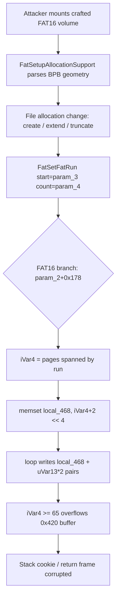

# CVE-2026-68878

**CVE:** CVE-2026-68878  
**Title:** Windows Fast FAT Driver Elevation of Privilege Vulnerability  
**Source:** [https://msrc.microsoft.com/update-guide/vulnerability/CVE-2026-68878](https://msrc.microsoft.com/update-guide/vulnerability/CVE-2026-68878)  
**Component(s):** fastfat.sys  
**Patched Date:** 2026-09-08T07:00:00  
**CWE:** Stack-based buffer overflow in Windows Fast FAT Driver allows an authorized attacker to elevate privileges over a network.  

---

## Related CVEs (Same Component)

This report covers 2 CVEs affecting the same component(s):

- **CVE-2026-68878**  
- CVE-2026-69347  

### Detailed Information

#### CVE-2026-69347

**Title:** Windows Fast FAT Driver Remote Code Execution Vulnerability  
**Source:** [https://msrc.microsoft.com/update-guide/vulnerability/CVE-2026-69347](https://msrc.microsoft.com/update-guide/vulnerability/CVE-2026-69347)  
**Patched Date:** 2026-09-08T07:00:00  
**CWE:** Heap-based buffer overflow in Windows Fast FAT Driver allows an unauthorized attacker to execute code locally.  

---

Download Patched & Vulnerable Components:

```bash
# fastfat.sys
wget https://msdl.microsoft.com/download/symbols/fastfat.sys/80FF16646A000/fastfat.sys -O fastfat.sys.10.0.26100.9278 # vulnerable
wget https://msdl.microsoft.com/download/symbols/fastfat.sys/F89D469D6B000/fastfat.sys -O fastfat.sys.10.0.26100.9444 # patched
```

## Version Tracking Analysis

**Command:**

```
python ghidra_scripts\ghidra_vt_wrapper.py --old-binary ./reports/2026-Sep/CVE-2026-68878/fastfat.sys.10.0.26100.9278 --new-binary ./reports/2026-Sep/CVE-2026-68878/fastfat.sys.10.0.26100.9444 --project-dir ./reports/2026-Sep/CVE-2026-68878/ghidra_project --project-name fastfat.sys_CVE-2026-68878 --ghidra-dir C:\Tools\ghidra_11.4.2_PUBLIC_20250826\ghidra_11.4.2_PUBLIC --output-dir ./reports/2026-Sep/CVE-2026-68878/ghidra_project/vt_results --max-memory 16g
```

Patched Functions: 7 | New Functions: 9 | Removed Functions: 1 | Total Matches: 6642 | Accepted Matches: 6014

### Patched Functions

| Function Name | Source Address | Dest Address | Similarity | Confidence |
| --- | --- | --- | --- | --- |
| `FatSetFatRun` | `140023aac` | `140024aac` | 0.922 | 10.0 |
| `EfspValidateAndParseFsctl` | `140052618` | `1400537c8` | 0.787 | 10.0 |
| `FatSetupAllocationSupport` | `140024204` | `140025234` | 0.735 | 10.0 |
| `wil_details_FeatureStateCache_TryEnableDeviceUsageFastPath` | `140008a5c` | `140001d70` | 0.729 | 10.0 |
| `wil_details_FeatureReporting_ReportUsageToServiceDirect` | `140008860` | `140001b70` | 0.639 | 10.0 |
| `EfspValidateStreamTransitionMetadata` | `140057a6c` | `140058bfc` | 0.632 | 10.0 |
| `wil_details_FeatureReporting_ReportUsageToService` | `1400087e4` | `140001aec` | 0.525 | 10.0 |

### New Functions

| Function Name | Address |
| --- | --- |
| `Feature_3174802747__private_IsEnabledDeviceUsageNoInline` | `140001668` |
| `Feature_3174802747__private_IsEnabledFallback` | `1400016a0` |
| `Feature_4205292859__private_IsEnabledDeviceUsageNoInline` | `1400016bc` |
| `Feature_4205292859__private_IsEnabledFallback` | `1400016f4` |
| `Feature_709593401__private_IsEnabledDeviceUsageNoInline` | `140008d78` |
| `Feature_709593401__private_IsEnabledFallback` | `140008db0` |
| `Feature_591104313__private_IsEnabledDeviceUsageNoInline` | `14000b42c` |
| `Feature_591104313__private_IsEnabledFallback` | `14000b464` |
| `_guard_dispatch_icall` | `14000da10` |

### Removed Functions

| Function Name | Address |
| --- | --- |
| `_guard_dispatch_icall` | `14000d8a0` |

---

# AI Technical Analysis

## Vulnerability Identification

**Core Vulnerable Function(s):**

- `FatSetFatRun()` - Contains a stack-based buffer overflow.
  A fixed 0x420-byte stack array (`local_468`) is both zeroed
  and written in a loop whose iteration count is derived from
  attacker-influenced volume geometry, with no upper bound
  before the patch.

**Supporting Changes:**

- `FatSetupAllocationSupport()` - Computes and stores the FAT
  geometry (cluster counts, sector sizes) that later feed the
  size arithmetic in `FatSetFatRun()`. The patch adds
  feature-gated integer-overflow guards to that arithmetic. It
  hardens an input path but is not where the memory write
  occurs.

**Unrelated Changes:**

- `EfspValidateStreamTransitionMetadata()` - EFS stream
  transition metadata validator. The patch adds structural and
  alignment checks on `EFSSTRAN`/`EFSSTRFT` records. Separate
  subsystem, no memory-corruption primitive.
- `EfspValidateAndParseFsctl()` - EFS FSCTL buffer parser. The
  patch tightens offset bounds (`*puVar3 < 0x409`) and swaps
  `memmove` for `memcpy`. Defensive hardening of a distinct
  code path, not the analyzed overflow.

---

## Root Cause Analysis

The flaw is a classic missing-bounds-check on a loop that
writes into a fixed-size stack buffer. `FatSetFatRun()`
assumes the number of 4 KB FAT pages touched by a cluster run
always fits inside the 66-entry descriptor array `local_468`,
but that count is a function of volume parameters an attacker
controls through a crafted FAT16 volume. The invariant "pages
spanned <= buffer capacity" is never enforced before the write.

Vulnerable BEFORE code (FAT16 branch):

```c
uVar6 = (uint)*(ushort *)(param_2 + 0x124) *
        (uint)*(ushort *)(param_2 + 0x120) + param_3 * 2;
uVar3 = param_4 * 2 + -2 + uVar6;
iVar4 = (uVar3 >> 0xc) - (uVar6 >> 0xc);
memset(local_468,0,(ulonglong)(iVar4 + 2) << 4);
uVar5 = uVar6 & 0xfffff000;
for (uVar13 = 0; uVar13 < iVar4 + 1U; uVar13 = uVar13 + 1) {
  FatPrepareWriteVolumeFile
            (local_498,param_2,uVar5,0x1000,
             local_468 + (ulonglong)uVar13 * 2,
             local_468 + (ulonglong)uVar13 * 2 + 1,'\x01');
  uVar5 = uVar5 + 0x1000;
}
```

`uVar6` is the byte offset of the run's first FAT entry;
`param_4` is the entry count, so `uVar3` is the last entry's
byte offset. `iVar4` is the difference of their 4 KB page
numbers (`>> 0xc`), that is, the count of pages the run spans.
The loop then runs `iVar4 + 1` times. Each iteration consumes
two pointer slots at `local_468 + uVar13 * 2` and
`local_468 + uVar13 * 2 + 1`, i.e. 16 bytes per iteration. The
buffer is 0x420 (1056) bytes, giving exactly 66 iterations of
capacity. When `param_4` is large enough that `iVar4 >= 65`,
the `memset` of `(iVar4 + 2) << 4` bytes already writes past
1056 bytes, and the loop then writes pointer pairs beyond
`local_468`. Because `local_468` sits directly below the stack
cookie (`local_48 = __security_cookie ^ ...`), the overflow
corrupts the cookie, saved registers, and the return frame.
Nothing in the pre-patch path validates `iVar4` or `uVar5`
against the buffer size, so the geometry alone determines the
overflow length.

---

## Execution and Trigger Flow

An attacker supplies a malicious FAT16 volume, for example a
crafted disk image or a removable device. During mount,
`FatSetupAllocationSupport()` reads the BIOS parameter block
and derives sector size (`param_2 + 0x120`), reserved sectors
(`param_2 + 0x124`), and cluster counts, storing them in the
volume control block. These values set the FAT geometry used
later. The attacker then triggers a file-allocation change
(create, extend, or truncate a file) that requires updating a
run of FAT entries. That path reaches `FatSetFatRun()` with a
starting cluster (`param_3`) and a large entry count
(`param_4`). Execution enters the FAT16 branch selected by
`*(char *)(param_2 + 0x178)`. There the code computes the byte
span of the run and derives `iVar4`, the number of 4 KB pages
crossed. With attacker-chosen geometry and a long run, `iVar4`
exceeds 64. The `memset` immediately overflows `local_468`, and
the subsequent `FatPrepareWriteVolumeFile` loop writes pointer
pairs past the buffer end into adjacent stack memory. The stack
cookie and return address are overwritten, yielding kernel
memory corruption and, given control of the written pointer
values, a path toward privileged code execution.



---

## Patch Analysis

The patch inserts an explicit upper bound on the page count
before any buffer write occurs.

```diff
-  uVar3 = param_4 * 2 + -2 + uVar6;
+  uVar3 = uVar6 + (param_4 - 1) * 2;
   iVar4 = (uVar3 >> 0xc) - (uVar6 >> 0xc);
+  uVar5 = iVar4 + 1;
+  uVar11 = Feature_3174802747__private_IsEnabledDeviceUsageNoInline();
+  if (((int)uVar11 != 0) && (0x41 < uVar5)) {
+    *(undefined4 *)(param_1 + 0x48) = 0xc0000102;
+    ExRaiseStatus();
+  }
   memset(local_468,0,(ulonglong)(iVar4 + 2) << 4);
```

The fixed code hoists the loop trip count into `uVar5`
(`iVar4 + 1`) and evaluates it before the `memset`. When the
feature flag `Feature_3174802747` is enabled, it compares
`uVar5` against 0x41 (65). If `uVar5` exceeds 65, the function
stores `STATUS_FILE_CORRUPT_ERROR` (`0xc0000102`) into the IRP
context at `param_1 + 0x48` and calls `ExRaiseStatus()`, which
does not return. The threshold matches the buffer capacity
exactly: 0x420 bytes divided by 16 bytes per iteration is 66
slots, so the largest safe `iVar4` is 64 and the largest safe
`uVar5` is 65 (0x41). Any run that would touch a 66th page is
rejected. The refactor of `uVar3` from `param_4 * 2 + -2` to
`uVar6 + (param_4 - 1) * 2` is an equivalent rearrangement of
the same span computation and does not change behavior.

The guard is effective because it is placed ahead of both the
`memset` and the write loop, so no out-of-bounds byte is ever
written once the bound is violated. Raising a non-returning
status cleanly aborts the corrupt operation instead of
truncating or clamping, avoiding a partial-write variant. The
capacity constant is derived directly from the array size, so
the check is tight rather than heuristic. The one caveat is
that the check is gated behind
`Feature_3174802747__private_IsEnabledDeviceUsageNoInline()`;
protection is only present when that feature is enabled, though
shipped builds enable it.

The fix converts a remotely or physically triggerable kernel
stack overflow into a controlled volume-corruption error. It
closes an elevation-of-privilege and denial-of-service vector
reachable through any mountable malicious FAT16 volume.