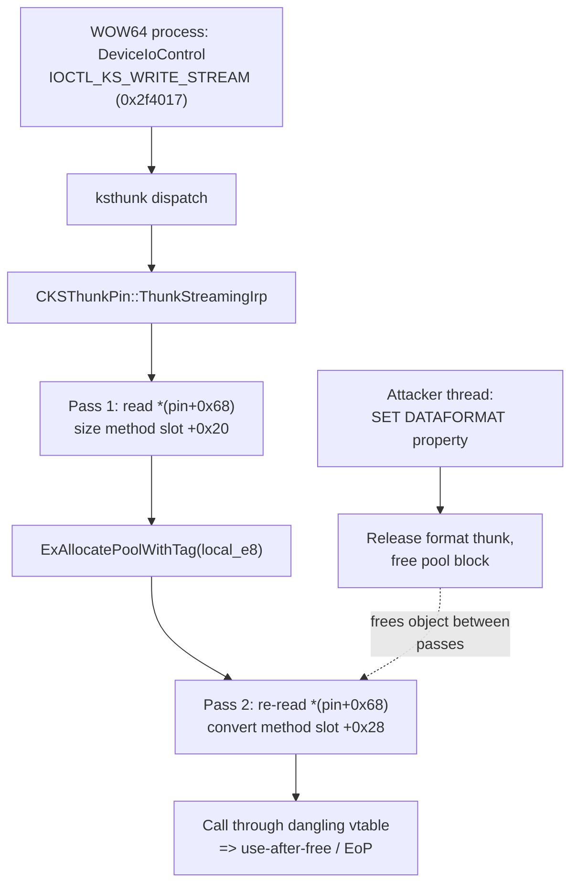

# CVE-2026-69275

**CVE:** CVE-2026-69275  
**Title:** Kernel Streaming WOW Thunk Service Driver Elevation of Privilege Vulnerability  
**Source:** [https://msrc.microsoft.com/update-guide/vulnerability/CVE-2026-69275](https://msrc.microsoft.com/update-guide/vulnerability/CVE-2026-69275)  
**Component(s):** ksthunk.sys  
**Patched Date:** 2026-09-08T07:00:00  
**CWE:** Use after free in Kernel Streaming WOW Thunk Service Driver allows an authorized attacker to elevate privileges locally.  

---

## Related CVEs (Same Component)

This report covers 2 CVEs affecting the same component(s):

- **CVE-2026-69275**  
- CVE-2026-69900  

### Detailed Information

#### CVE-2026-69900

**Title:** Kernel Streaming WOW Thunk Service Driver Elevation of Privilege Vulnerability  
**Source:** [https://msrc.microsoft.com/update-guide/vulnerability/CVE-2026-69900](https://msrc.microsoft.com/update-guide/vulnerability/CVE-2026-69900)  
**Patched Date:** 2026-09-08T07:00:00  
**CWE:** Untrusted pointer dereference in Kernel Streaming WOW Thunk Service Driver allows an authorized attacker to elevate privileges locally.  

---

Download Patched & Vulnerable Components:

```bash
# ksthunk.sys
wget https://msdl.microsoft.com/download/symbols/ksthunk.sys/390E55EC12000/ksthunk.sys -O ksthunk.sys.10.0.26100.9278 # vulnerable
wget https://msdl.microsoft.com/download/symbols/ksthunk.sys/33D0200D12000/ksthunk.sys -O ksthunk.sys.10.0.26100.9444 # patched
```

## Version Tracking Analysis

**Command:**

```
python ghidra_scripts\ghidra_vt_wrapper.py --old-binary ./reports/2026-Sep/CVE-2026-69275/ksthunk.sys.10.0.26100.9278 --new-binary ./reports/2026-Sep/CVE-2026-69275/ksthunk.sys.10.0.26100.9444 --project-dir ./reports/2026-Sep/CVE-2026-69275/ghidra_project --project-name ksthunk.sys_CVE-2026-69275 --ghidra-dir C:\Tools\ghidra_11.4.2_PUBLIC_20250826\ghidra_11.4.2_PUBLIC --output-dir ./reports/2026-Sep/CVE-2026-69275/ghidra_project/vt_results --max-memory 16g
```

Patched Functions: 3 | New Functions: 12 | Removed Functions: 6 | Total Matches: 1117 | Accepted Matches: 1079

### Patched Functions

| Function Name | Source Address | Dest Address | Similarity | Confidence |
| --- | --- | --- | --- | --- |
| `CKSThunkPin::ThunkStreamingIrp` | `14000c13c` | `14000c35c` | 0.699 | 10.0 |
| `CKSThunkDevice::CreateFilterFile` | `140001de0` | `140001de0` | 0.683 | 10.0 |
| `CKSThunkPin::ThunkStreamingIrpCompletion` | `140002550` | `140002760` | 0.651 | 10.0 |

### New Functions

*Showing 10 of 12 new functions*

| Function Name | Address |
| --- | --- |
| `IndirectedQueryInterface` | `140001060` |
| `IndirectedRelease` | `140001080` |
| `IndirectedAddRef` | `1400010a0` |
| `NonDelegatedRelease` | `1400010c0` |
| `NonDelegatedAddRef` | `1400010e0` |
| `GetExtendedHeaderSizeForHandler` | `1400025e8` |
| `ReverseThunkExtendedHeader` | `140002664` |
| `ThunkExtendedHeaderForHandler` | `140002708` |
| `Feature_3484919097__private_IsEnabledDeviceUsageNoInline` | `140002944` |
| `Feature_3484919097__private_IsEnabledFallback` | `14000297c` |

### Removed Functions

| Function Name | Address |
| --- | --- |
| `IndirectedQueryInterface` | `140001060` |
| `IndirectedRelease` | `140001080` |
| `IndirectedAddRef` | `1400010a0` |
| `NonDelegatedRelease` | `1400010c0` |
| `NonDelegatedAddRef` | `1400010e0` |
| `_guard_dispatch_icall` | `140004410` |

---

# AI Technical Analysis

## Vulnerability Identification

**Core Vulnerable Function(s):**

- `CKSThunkPin::ThunkStreamingIrp()` - Reads the per-pin
  `IKsWOW64FormatThunk` pointer directly out of the pin
  object on every use, across a size-measurement pass and a
  copy pass, without holding a lock or a counted reference.
  A concurrent format change can free that object while the
  streaming IRP is still using it, producing a
  use-after-free with an attacker-influenced vtable call.

**Supporting Changes:**

- `CKSThunkPin::ThunkStreamingIrpCompletion()` - Completion
  routine. Updated to release the referenced format-thunk
  object and to use the relocated field offsets. It carries
  the release half of the new reference-counting protocol.
- `CKSThunkDevice::CreateFilterFile()` - Grows the
  `CKSThunkPin` allocation from `0x78` to `0x80` so the new
  push-lock field fits in the object. Layout support only.

**Unrelated Changes:**

- `CBaseUnknown::IndirectedQueryInterface()`,
  `IndirectedRelease()`, `IndirectedAddRef()`,
  `NonDelegatedRelease()`, `NonDelegatedAddRef()` - Compiler
  generated COM reference-count thunks (recovered as
  indirect jump wrappers). They are the plumbing the fix
  calls into, not the site of the flaw.

---

## Root Cause Analysis

The defect is a use-after-free driven by a time-of-check to
time-of-use race on the per-pin format-thunk object. The
code assumes the `IKsWOW64FormatThunk` pointer stored in the
pin remains valid and stable for the full duration of a
streaming IRP conversion. That invariant is never enforced:
the pointer is re-fetched from shared object memory and
called through, while a separate thread can tear it down.

Vulnerable code, size-measurement pass:

```c
plVar14 = *(longlong **)(local_e0 + 0x68);
if ((plVar14 != (longlong *)0x0) &&
   (uVar6 = (**(code **)(*plVar14 + 0x20))
                      (plVar14, *(uint *)(p_Var12 + 0x2c), 0),
    (ulonglong)uVar6 != (ulonglong)uVar4 - 0x30)) {
  ExRaiseStatus(0xc000000d);
}
uVar3 = GetExtendedHeaderSize(local_e0,
                              *(ulong *)(p_Var12 + 0x2c),
                              uVar4 - 0x30);
```

Vulnerable code, copy pass:

```c
plVar2 = *(longlong **)(local_e0 + 0x68);
if (plVar2 == (longlong *)0x0) {
  if (uVar6 == local_bc)
    memmove(pKVar16 + 0x38, _Dst + 0x30, (ulonglong)uVar6);
  else
    uVar4 = 0xc000000d;
}
else {
  (**(code **)(*plVar2 + 0x28))
             (plVar2, _Dst + 0x30, pKVar16 + 0x38);
}
```

The thunk pointer lives at `local_e0 + 0x68`, inside the
`CKSThunkPin` object reachable from other IRP paths. Each
loop reloads it into `plVar14` and `plVar2` independently, so
the two passes need not observe the same object. The first
pass calls the size method at vtable slot `+0x20` and
compares the result against `uVar4 - 0x30` to bound the
allocation. The second pass calls the conversion method at
slot `+0x28` to write into `pKVar16 + 0x38`, a region sized
from the first pass. Neither read is guarded by a lock, and
no reference is taken, so a concurrent `SET_DATAFORMAT`
property request on the same pin can release the object and
free its pool between or during these calls. The conversion
call then dispatches through a dangling vtable at `*plVar2`;
if the pool is reclaimed with attacker data, `*(code **)
(*plVar2 + 0x28)` becomes an attacker-chosen pointer. The
value `0x2f4017` gating the header loop is the WOW64
streaming control code, confirming the path is reachable
from a 32-bit caller.

---

## Execution and Trigger Flow

A 32-bit (WOW64) process opens a kernel-streaming pin
exposed through `ksthunk.sys` and issues a streaming I/O
control request, arriving as `IOCTL_KS_WRITE_STREAM` or the
read variant (control code `0x2f4017`). The dispatch path
routes the IRP to `CKSThunkPin::ThunkStreamingIrp`, which
allocates a shadow IRP and copies the 32-bit
`KSSTREAM_HEADER` array into a kernel buffer. It enters the
first loop, where it reads the pin's format-thunk pointer
from `local_e0 + 0x68` and calls the size method to compute
the total output size accumulated in `local_e8`. That size
drives the `ExAllocatePoolWithTag` call for the 64-bit
header buffer. The function then enters the second loop and
re-reads the same pin field, calling the conversion method
at slot `+0x28` to translate each extended header into the
freshly sized buffer.

Concurrently, a second attacker thread issues a
`KSPROPERTY_CONNECTION_DATAFORMAT` set request on the same
pin. Servicing that request releases the current
`IKsWOW64FormatThunk` and installs a new one, freeing the
pool block that the streaming thread still references
through `plVar2`. When the streaming thread performs the
conversion call, it dereferences freed memory. With precise
timing and pool grooming, the freed block is reallocated
with controlled contents, so the indirect call through
`*plVar2` transfers control to an attacker-chosen address in
kernel context, yielding elevation of privilege.



---

## Patch Analysis

The patch replaces every raw read of the pin field with a
single lock-protected, reference-counted acquisition, then
threads that one reference through both loops and the
completion routine.

```diff
+  uVar8 = Feature_3484919097__private_IsEnabledDeviceUsageNoInline();
+  if (((int)uVar8 != 0) && (-1 < *param_3)) {
+    KeEnterCriticalRegion();
+    ExAcquirePushLockSharedEx(this + 0x68, 0);
+    local_f8 = *(longlong **)(this + 0x70);
+    if (local_f8 != (longlong *)0x0) {
+      (**(code **)(*local_f8 + 8))(local_f8);   /* AddRef */
+    }
+    ExReleasePushLockSharedEx(this + 0x68, 0);
+    KeLeaveCriticalRegion();
+  }
```

```diff
+  if ((-1 < *param_3) && (local_e0 != (undefined4 *)0x0)) {
+    *(longlong **)(local_e0 + 4) = local_f8;  /* hand to IRP */
+    local_f8 = (longlong *)0x0;
+  }
+  if (local_f8 != (longlong *)0x0) {
+    (**(code **)(*local_f8 + 0x10))(local_f8); /* Release */
+  }
```

The fix introduces a push lock at pin offset `0x68` and
moves the thunk pointer to offset `0x70`, which is why
`CreateFilterFile` now allocates `0x80` bytes and zeroes the
full range. Under `KeEnterCriticalRegion` and
`ExAcquirePushLockSharedEx`, the code snapshots the pointer
into `local_f8` and immediately calls `AddRef` (slot `+0x8`),
so the object cannot be freed while the IRP holds it. Every
later use in `ThunkStreamingIrp` now reads `local_f8` and
calls the handler-specific helpers
`GetExtendedHeaderSizeForHandler` and
`ThunkExtendedHeaderForHandler`, instead of re-fetching the
shared field. When the IRP is queued asynchronously, the
reference is transferred into the output structure at
`local_e0 + 4` and `local_f8` is cleared so it is not
released twice. `ThunkStreamingIrpCompletion` later releases
it through slot `+0x10` and clears the stored pointer.

The mitigation is effective for the identified race: the
shared teardown path must acquire the same push lock, and
the counted reference keeps the object alive across both
passes and across the asynchronous completion. Because the
reference is taken once and reused, the two passes now
provably observe the same object, closing the TOCTOU gap as
well as the lifetime gap. The transfer-and-clear logic
prevents a double free on the success path. The change is
gated behind `Feature_3484919097`, so protection depends on
that feature being enabled in the running build.

The vulnerability was a kernel use-after-free reachable by
an unprivileged WOW64 process through standard streaming I/O
control codes. Successful exploitation grants an indirect
call through freed pool memory, enabling local elevation of
privilege to kernel context.