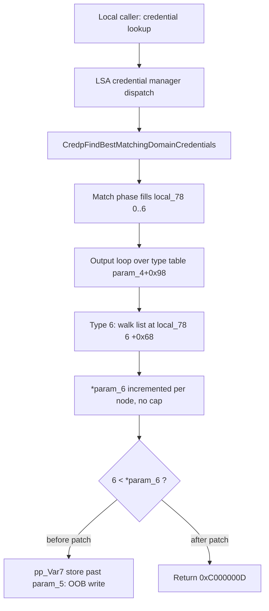

# CVE-2026-69277

**CVE:** CVE-2026-69277  
**Title:** Microsoft Local Security Authority (LSA) Server Elevation of Privilege Vulnerability  
**Source:** [https://msrc.microsoft.com/update-guide/vulnerability/CVE-2026-69277](https://msrc.microsoft.com/update-guide/vulnerability/CVE-2026-69277)  
**Component(s):** lsasrv.dll  
**Patched Date:** 2026-09-08T07:00:00  
**CWE:** Stack-based buffer overflow in Microsoft Local Security Authority Server (lsasrv) allows an authorized attacker to elevate privileges locally.  

---

## Related CVEs (Same Component)

This report covers 3 CVEs affecting the same component(s):

- **CVE-2026-69277**  
- CVE-2026-69365  
- CVE-2026-69594  

### Detailed Information

#### CVE-2026-69365

**Title:** Microsoft Local Security Authority (LSA) Server Elevation of Privilege Vulnerability  
**Source:** [https://msrc.microsoft.com/update-guide/vulnerability/CVE-2026-69365](https://msrc.microsoft.com/update-guide/vulnerability/CVE-2026-69365)  
**Patched Date:** 2026-09-08T07:00:00  
**CWE:** Out-of-bounds read in Microsoft Local Security Authority Server (lsasrv) allows an authorized attacker to elevate privileges over a network.  

#### CVE-2026-69594

**Title:** Microsoft Local Security Authority (LSA) Server Elevation of Privilege Vulnerability  
**Source:** [https://msrc.microsoft.com/update-guide/vulnerability/CVE-2026-69594](https://msrc.microsoft.com/update-guide/vulnerability/CVE-2026-69594)  
**Patched Date:** 2026-09-08T07:00:00  
**CWE:** Heap-based buffer overflow in Microsoft Local Security Authority Server (lsasrv) allows an authorized attacker to elevate privileges locally.  

---

Download Patched & Vulnerable Components:

```bash
# lsasrv.dll
wget https://msdl.microsoft.com/download/symbols/lsasrv.dll/10C3BECA1D0000/lsasrv.dll -O lsasrv.dll.10.0.26100.9278 # vulnerable
wget https://msdl.microsoft.com/download/symbols/lsasrv.dll/449577651D1000/lsasrv.dll -O lsasrv.dll.10.0.26100.9444 # patched
```

## Version Tracking Analysis

**Command:**

```
python ghidra_scripts\ghidra_vt_wrapper.py --old-binary ./reports/2026-Sep/CVE-2026-69277/lsasrv.dll.10.0.26100.9278 --new-binary ./reports/2026-Sep/CVE-2026-69277/lsasrv.dll.10.0.26100.9444 --project-dir ./reports/2026-Sep/CVE-2026-69277/ghidra_project --project-name lsasrv.dll_CVE-2026-69277 --ghidra-dir C:\Tools\ghidra_11.4.2_PUBLIC_20250826\ghidra_11.4.2_PUBLIC --output-dir ./reports/2026-Sep/CVE-2026-69277/ghidra_project/vt_results --max-memory 16g
```

Patched Functions: 5 | New Functions: 15 | Removed Functions: 3 | Total Matches: 301710 | Accepted Matches: 29419

### Patched Functions

| Function Name | Source Address | Dest Address | Similarity | Confidence |
| --- | --- | --- | --- | --- |
| `LsaCreateSharedMemory` | `1800e1400` | `1800e1a30` | 0.988 | 1.0 |
| `FUN_1800f4210` | `1800f4210` | `1800f4840` | 0.988 | 1.0 |
| `LsaOpenSamUser` | `1800cffc0` | `1800d02f0` | 0.986 | 1.0 |
| `NegpCaptureSuppliedCreds` | `1800dd3d8` | `1800dd8f8` | 0.897 | 10.0 |
| `CredpFindBestMatchingDomainCredentials` | `1800626e0` | `1800626e0` | 0.743 | 10.0 |

### New Functions

*Showing 10 of 15 new functions*

| Function Name | Address |
| --- | --- |
| `GetCachedFeatureEnabledState` | `1800cb568` |
| `GetCurrentFeatureEnabledState` | `1800cb6a0` |
| `ReportUsage` | `1800cbed4` |
| `__private_IsEnabled` | `1800cbfd8` |
| `GetCachedFeatureEnabledState` | `1800db470` |
| `GetCurrentFeatureEnabledState` | `1800dbe34` |
| `ReportUsage` | `1800de8d8` |
| `__private_IsEnabled` | `1800decdc` |
| `MulDiv` | `1800f4870` |
| `GetCachedFeatureEnabledState` | `180126408` |

### Removed Functions

| Function Name | Address |
| --- | --- |
| `FUN_1800f4240` | `1800f4240` |
| `_guard_dispatch_icall` | `180154b70` |
| `PackageLock''` | `180156ad0` |

---

# AI Technical Analysis

## Vulnerability Identification

**Core Vulnerable Function(s):**

- `CredpFindBestMatchingDomainCredentials()` - The final
  credential-collection loop stores matched credential pointers
  into the caller-supplied output array `param_5` (`local_c0`)
  using the running index `*param_6`, which is never checked
  against the array capacity before each write. A type-6
  credential carrying a chained list inflates `*param_6` beyond
  the fixed slot count, producing an out-of-bounds pointer write.

**Supporting Changes:**

- `NegpCaptureSuppliedCreds()` - Secondary hardening in the same
  update. Adds a `local_128 < 0x7ffe` size cap and a corrected
  multiplication-overflow guard on the credential-string
  allocation, gated by `Feature_2938602810`. Not the primary
  memory-corruption primitive.
- `GetCachedFeatureEnabledState()`,
  `GetCurrentFeatureEnabledState()`, `ReportUsage()`
  (`Feature_601072954`) - Windows Implementation Library (WIL)
  feature-flag plumbing that toggles the bounds check in
  `CredpFindBestMatchingDomainCredentials()`.
- `GetCachedFeatureEnabledState()`,
  `GetCurrentFeatureEnabledState()` (`Feature_2938602810`) - WIL
  plumbing for the `NegpCaptureSuppliedCreds()` hardening.

**Unrelated Changes:**

- `LsaCreateSharedMemory()` - The symbol is reassigned to
  `WARBIRD_DELAY_LOAD::GdiGradientFill`, a stub returning `0`.
  This is a Warbird symbol-shuffle artifact with no security
  relevance.
- `LsaOpenSamUser()` - Reassigned to `LsaGetUserAuthData`, a stub
  returning the constant `-0x3fffff45`. A relocation artifact,
  not the flaw.

---

## Root Cause Analysis

The defect is a classic out-of-bounds write (CWE-787) driven by
an output counter that is incremented independently of the
destination buffer's fixed capacity. The function guarantees at
most seven credential slots, one per credential type held in the
local array `local_78[0..6]`, yet the reporting index `*param_6`
is advanced without ever comparing it to that ceiling before a
store. The violated invariant is simple: `*param_6` must remain
strictly less than the number of pointer slots in `param_5`
whenever `pp_Var7[*param_6]` is written.

```c
uVar20 = (ulonglong)*(uint *)(param_4 + 0x94);
if (*(uint *)(param_4 + 0x94) == 0) {
  uVar20 = 4;
  puVar11 = &DAT_18016dd38;
}
else {
  puVar11 = *(uint **)(param_4 + 0x98);
}
*param_6 = (ulong)uVar12;
do {
  if ((*puVar11 < 7) && (local_78[*puVar11] != 0)) {
    local_c0[*param_6] = (_CANONICAL_CREDENTIAL *)local_78[*puVar11];
    uVar14 = *param_6 + 1;
    *param_6 = uVar14;
    if (*puVar11 == 6) {
      for (puVar10 = *(undefined8 **)(local_78[6] + 0x68);
          puVar10 != (undefined8 *)(local_78[6] + 0x68);
          puVar10 = (undefined8 *)*puVar10) {
        uVar14 = uVar14 + 1;
        *param_6 = uVar14;
      }
    }
  }
  puVar11 = puVar11 + 1;
  uVar20 = uVar20 - 1;
} while (uVar20 != 0);
```

The iterator `puVar11` walks a type-index table taken from the
target descriptor at `*(uint **)(param_4 + 0x98)`, with element
count `uVar20` read from `param_4 + 0x94`. For each index below
`7` that has a matched candidate in `local_78`, one pointer is
copied into `local_c0[*param_6]` and `*param_6` is incremented.
The dangerous behavior is in the `*puVar11 == 6` branch: it walks
the doubly linked list rooted at `local_78[6] + 0x68` and adds
`1` to `*param_6` for every node, without writing and without any
cap. Because the linked chain length is attacker-influenced
through the stored domain credential, `*param_6` can be driven
past `6` while `uVar20` still schedules further table entries.
The next qualifying iteration then executes
`local_c0[*param_6] = ...` at an index beyond the seven-slot
buffer, writing a controlled `_CANONICAL_CREDENTIAL` pointer into
adjacent memory. Neither `uVar20` nor `*param_6` is validated
against the physical size of `param_5`, so the overflow scales
with the number of chained entries.

---

## Execution and Trigger Flow

The vulnerable routine runs inside the LSA credential manager
while resolving the best-matching domain credentials for a
requested target. An authenticated local caller issues a
credential lookup that reaches `CredpFindBestMatchingDomainCred-
entials()` with a target descriptor (`param_4`) and an output
array (`param_5`) sized for the seven canonical credential
types. The attacker first stores a domain credential of type `6`
whose extended structure carries a linked list at offset `0x68`
containing many nodes. During resolution the matching phase
selects that credential into `local_78[6]`. The output phase then
reaches the `*puVar11 == 6` branch and walks the chain, adding
one to `*param_6` for every node it visits. With enough nodes,
`*param_6` exceeds `6`. When the type-index table
(`param_4 + 0x98`) presents any further qualifying entry, the
store `local_c0[*param_6] = local_78[*puVar11]` lands outside the
allocation, corrupting adjacent heap or stack memory with a
pointer the attacker can influence. Repeated entries widen the
write into a controlled linear overwrite, enabling privilege
escalation within the LSASS process.



---

## Patch Analysis

The fix inserts an explicit ceiling check immediately before the
out-of-bounds store, guarded by a WIL feature flag so the
mitigation can be staged.

```diff
-    if ((*puVar11 < 7) &&
-       (local_78[*puVar11] != 0)) {
-      local_c0[*param_6] = (_CANONICAL_CREDENTIAL *)local_78[*puVar11];
+    if ((*puVar25 < 7) && (local_78[*puVar25] != uVar18)) {
+      bVar10 = wil::details::
+               FeatureImpl<__WilFeatureTraits_Feature_601072954>::
+               __private_IsEnabled(...);
+      uVar18 = 0;
+      if ((bVar10) && (6 < *param_6)) {
+        WPP_SF_l(..., 0x99, ..., 0xc000000d);
+        iVar12 = -0x3ffffff3;
+        goto LAB_180062c9d;
+      }
+      pp_Var7[*param_6] = (_CANONICAL_CREDENTIAL *)local_78[*puVar25];
```

The patched loop first queries `Feature_601072954` through
`FeatureImpl::__private_IsEnabled()`. When the feature is on, the
new predicate `6 < *param_6` compares the running index against
the maximum valid slot. If the index has already advanced past
the seventh slot, the function emits a WPP trace carrying
`0xc000000d` and returns `-0x3ffffff3`, which is
`STATUS_INVALID_PARAMETER` (`0xC000000D`), aborting before any
overflowing store. The write `pp_Var7[*param_6]` now executes
only while `*param_6` is within `[0, 6]`. The supporting new
functions `GetCachedFeatureEnabledState()`,
`GetCurrentFeatureEnabledState()`, and `ReportUsage()` provide
the cached enable-state lookup and telemetry that back this flag.

The mitigation is effective for the primary primitive because the
check sits on the exact store that previously overflowed, and the
error path unwinds through the existing cleanup labels
(`LAB_180062c9d`), freeing partial state and returning a failure
status. It correctly accounts for the type-6 inflation, since the
guard is evaluated on every iteration after the linked-list walk
has advanced `*param_6`. The bound `6` matches the seven-slot
capacity implied by `local_78[0..6]`, so no legitimate result set
is truncated. Because the fix is feature-flag gated, deployments
with the flag disabled retain the vulnerable behavior until the
feature is enabled.

The change eliminates an attacker-controlled pointer write inside
LSASS that could corrupt adjacent memory and lead to local
privilege escalation. The companion `NegpCaptureSuppliedCreds()`
size cap closes a related allocation-sizing weakness in the same
servicing update. Together they harden client-supplied credential
processing against memory corruption.