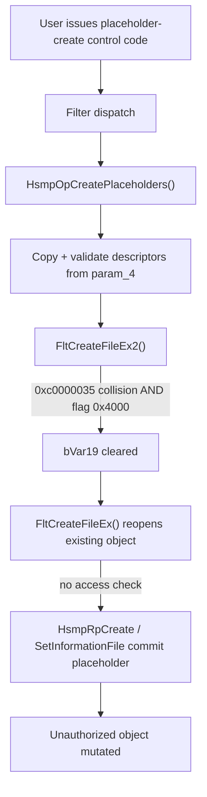

# CVE-2026-69279

**CVE:** CVE-2026-69279  
**Title:** Windows Cloud Files Mini Filter Driver Elevation of Privilege Vulnerability  
**Source:** [https://msrc.microsoft.com/update-guide/vulnerability/CVE-2026-69279](https://msrc.microsoft.com/update-guide/vulnerability/CVE-2026-69279)  
**Component(s):** cldflt.sys  
**Patched Date:** 2026-09-08T07:00:00  
**CWE:** Use after free in Windows Cloud Files Mini Filter Driver allows an authorized attacker to elevate privileges locally.  

---

## Related CVEs (Same Component)

This report covers 3 CVEs affecting the same component(s):

- **CVE-2026-69279**  
- CVE-2026-80093  
- CVE-2026-83991  

### Detailed Information

#### CVE-2026-80093

**Title:** Windows Cloud Files Mini Filter Driver Elevation of Privilege Vulnerability  
**Source:** [https://msrc.microsoft.com/update-guide/vulnerability/CVE-2026-80093](https://msrc.microsoft.com/update-guide/vulnerability/CVE-2026-80093)  
**Patched Date:** 2026-09-08T07:00:00  
**CWE:** Use after free in Windows Cloud Files Mini Filter Driver allows an authorized attacker to elevate privileges locally.  

#### CVE-2026-83991

**Title:** Windows Cloud Files Mini Filter Driver Tampering Vulnerability  
**Source:** [https://msrc.microsoft.com/update-guide/vulnerability/CVE-2026-83991](https://msrc.microsoft.com/update-guide/vulnerability/CVE-2026-83991)  
**Patched Date:** 2026-09-08T07:00:00  
**CWE:** Missing authentication for critical function in Windows Cloud Files Mini Filter Driver allows an authorized attacker to perform tampering locally.  

---

Download Patched & Vulnerable Components:

```bash
# cldflt.sys
wget https://msdl.microsoft.com/download/symbols/cldflt.sys/4DAC1EB794000/cldflt.sys -O cldflt.sys.10.0.26100.9278 # vulnerable
wget https://msdl.microsoft.com/download/symbols/cldflt.sys/CD2CECD294000/cldflt.sys -O cldflt.sys.10.0.26100.9444 # patched
```

## Version Tracking Analysis

**Command:**

```
python ghidra_scripts\ghidra_vt_wrapper.py --old-binary ./reports/2026-Sep/CVE-2026-69279/cldflt.sys.10.0.26100.9278 --new-binary ./reports/2026-Sep/CVE-2026-69279/cldflt.sys.10.0.26100.9444 --project-dir ./reports/2026-Sep/CVE-2026-69279/ghidra_project --project-name cldflt.sys_CVE-2026-69279 --ghidra-dir C:\Tools\ghidra_11.4.2_PUBLIC_20250826\ghidra_11.4.2_PUBLIC --output-dir ./reports/2026-Sep/CVE-2026-69279/ghidra_project/vt_results --max-memory 16g
```

Patched Functions: 5 | New Functions: 9 | Removed Functions: 1 | Total Matches: 8557 | Accepted Matches: 7204

### Patched Functions

| Function Name | Source Address | Dest Address | Similarity | Confidence |
| --- | --- | --- | --- | --- |
| `HsmpOpCreatePlaceholders` | `14005d724` | `14005d8c4` | 0.947 | 10.0 |
| `CldiStreamCompleteRequest` | `1400829ac` | `140082cec` | 0.927 | 10.0 |
| `WPP_SF_qqsDd` | `14001e110` | `14001e244` | 0.842 | 10.0 |
| `CldStreamAbortOperation` | `140040ce8` | `140040af8` | 0.772 | 10.0 |
| `CldStreamReportProgress` | `14004b1d0` | `14004b3f0` | 0.525 | 10.0 |

### New Functions

| Function Name | Address |
| --- | --- |
| `CldiIsStreamListEmpty` | `140011090` |
| `Feature_3750208824__private_IsEnabledDeviceUsageNoInline` | `140011248` |
| `Feature_3750208824__private_IsEnabledFallback` | `140011280` |
| `Feature_544180536__private_IsEnabledDeviceUsageNoInline` | `14001129c` |
| `Feature_544180536__private_IsEnabledFallback` | `1400112d4` |
| `Feature_1245077819__private_IsEnabledDeviceUsageNoInline` | `14001ddd4` |
| `Feature_1245077819__private_IsEnabledFallback` | `14001de0c` |
| `_guard_dispatch_icall` | `14001e7a0` |
| `CldSyncUnregisterStream` | `1400711c0` |

### Removed Functions

| Function Name | Address |
| --- | --- |
| `_guard_dispatch_icall` | `14001e670` |

---

# AI Technical Analysis

## Vulnerability Identification

**Core Vulnerable Function(s):**

- `HsmpOpCreatePlaceholders()` - Reopens an existing
  colliding file object and applies placeholder / reparse
  state without any access check on the name-collision
  branch, permitting an unauthorized caller to convert files
  they do not own into placeholders.

**Supporting Changes:**

- `CldiIsStreamListEmpty()` - New helper that walks the
  stream request list and reports emptiness while skipping
  entries whose cancel word is set. Consumed by the stream
  bookkeeping refactor, not the fix.
- `CldStreamReportProgress()` - Callers of the CDQ-to-CSQ
  dehydration rename; gated new list-empty logic behind a
  feature flag. No authorization change.
- `CldiStreamCompleteRequest()` - Reordered WPP tracing and
  moved the completion callback after lock release; adopts
  `CldiIsStreamListEmpty()`. Concurrency/cleanup refactor.

**Unrelated Changes:**

- `CldStreamAbortOperation()` - CSQ rename plus a feature-
  flag guarded cancel-word check; unrelated to placeholder
  authorization.
- `CldSyncUnregisterStream()` - New teardown routine for the
  per-volume stream AVL table. Not referenced by the
  vulnerable path.
- `memmove` to `memcpy` substitution and all `uVarN`
  renumbering are decompiler/compiler artifacts.

---

## Root Cause Analysis

The flaw is a missing authorization check on an
alternate object-open path inside placeholder creation.
`HsmpOpCreatePlaceholders()` assumed that reaching the file
object through the collision fallback was equivalent, from
an access-rights standpoint, to the normal create path, so
it never re-validated the caller against the pre-existing
target. This violates the invariant that every operation
which reparses or rewrites an on-disk object must confirm
the requesting principal holds the corresponding rights on
that specific object.

Vulnerable code (BEFORE):

```c
uVar7 = FltCreateFileEx2(DAT_14002b188);
HsmDbgBreakOnStatus(uVar7);
if ((uVar7 == 0xc0000035) || (uVar7 == 0xc0000279)) {
  bVar19 = (local_b8._4_4_ & 0x4000) == 0;
}
if (!bVar19) {
  pppplVar18 = (longlong ****)&local_180;
  pauVar15 = pauVar2;
  uVar7 = FltCreateFileEx(DAT_14002b188);
  HsmDbgBreakOnStatus(uVar7);
}
if ((int)uVar7 < 0) {
  /* trace + fail */
}
else if (bVar19) {
  *(longlong ***)pauVar1[1] = local_a8;   /* commit meta */
```

The entry buffer `_Dst` is copied from user memory after
`ProbeForWrite(param_4, ...)`, and each `0x50`-byte record
is validated only for length and separator characters
(`0x5c`, `0x3a`) at offset `*pauVar15`. The primary open
uses `FltCreateFileEx2`. When that returns
`0xc0000035` (name collision) or `0xc0000279`, and the
record flag word `local_b8._4_4_ & 0x4000` is set, the
code clears `bVar19` and unconditionally falls through to
`FltCreateFileEx()`, which opens the already-existing
object referenced by `local_180`. No call to
`HsmpAccessCheck()` guards this branch. On success the
handler proceeds to `HsmpRpCreate()`, sparse-attribute
toggling, and `FltSetInformationFile()`, writing placeholder
reparse data and attributes (`local_1a4`) onto that object.
Because `local_188`, the referenced file object established
earlier via `ObReferenceObjectByHandle()`, is never
re-checked for the write (`0x40`) or delete (`0x10000`)
rights the reparse operation implies, a caller who can name
an existing file they lack rights over can drive the
collision path and have the driver mutate it on their
behalf.

---

## Execution and Trigger Flow

An attacker with the ability to issue the cloud-filter
placeholder-creation control code supplies a crafted input
buffer through `param_4`, sized by `param_5`. The dispatch
layer routes the request into
`HsmpOpCreatePlaceholders()`, which allocates a pool copy
`_Dst`, probes and copies the user buffer, and iterates
each placeholder descriptor. For a chosen descriptor the
attacker sets the record flag bit `0x4000` and names a
path that already exists on the volume. The handler
performs its structural checks on the record, then calls
`FltCreateFileEx2()` to create the placeholder. Because the
target already exists, the create returns
`0xc0000035`. With `0x4000` set, `bVar19` is cleared and
control drops to the unguarded `FltCreateFileEx()`, which
opens the existing victim object. The handler then commits
placeholder metadata through `HsmpRpCreate()`,
`HsmpToggleFileSparseAttribute()`, and
`FltSetInformationFile()`. No point in this sequence
verifies the caller's access to the pre-existing object,
so the operation completes against a file the attacker was
never authorized to modify, yielding an authorization
bypass and potential data tampering or elevation.



---

## Patch Analysis

Patched code (AFTER):

```diff
-  uVar7 = FltCreateFileEx2(DAT_14002b188);
-  HsmDbgBreakOnStatus(uVar7);
-  if ((uVar7 == 0xc0000035) || (uVar7 == 0xc0000279)) {
-    bVar19 = (local_b8._4_4_ & 0x4000) == 0;
-  }
-  if (!bVar19) {
-    uVar7 = FltCreateFileEx(DAT_14002b188);
-  }
+  uVar8 = FltCreateFileEx2(DAT_14002b188);
+  if (((uVar8 == 0xc0000035) || (uVar8 == 0xc0000279)) &&
+     ((local_b8._4_4_ & 0x4000) != 0)) {
+    uVar10 = Feature_1245077819__private_IsEnabledDeviceUsageNoInline();
+    if ((int)uVar10 != 0) {
+      uVar8 = HsmpAccessCheck(param_1,(ulonglong)local_188,0x40);
+      if ((int)uVar8 < 0) {
+        uVar8 = FltCreateFileEx(DAT_14002b188);
+        if (-1 < (int)uVar8) {
+          uVar8 = HsmpAccessCheck(param_1,0,0x10000);
+          ObfDereferenceObject(0);
+          FltClose(local_180);
+        }
+        if ((int)uVar8 < 0) goto LAB_14005e9d7;
+      }
+    }
+    bVar5 = false; bVar6 = false;
+  }
+  else { bVar5 = true; }
```

The patch reshapes the collision branch so that hitting an
existing object is no longer a silent free pass. When
`FltCreateFileEx2()` returns `0xc0000035` or `0xc0000279`
and the descriptor requests the reparse behavior
(`local_b8._4_4_ & 0x4000`), and the runtime feature
`Feature_1245077819` is enabled, the handler calls
`HsmpAccessCheck(param_1, local_188, 0x40)` to confirm the
caller holds write/add-subdirectory rights on the referenced
object. If that check fails, it opens the existing object
and issues a second `HsmpAccessCheck(param_1, 0, 0x10000)`
for DELETE, then releases the reference with
`ObfDereferenceObject()` and closes the handle via
`FltClose()`. The introduced booleans `bVar5` and `bVar6`
replace the single `bVar19` and force the failure status
into `uVar8`, so an access-check denial branches to the
common error label `LAB_14005e9d7` instead of committing
placeholder state.

The fix is effective for the modeled threat: the previously
unguarded reopen now requires the caller to prove the same
rights the reparse/attribute writes demand, and a denial
aborts before any metadata is committed. Gating on a feature
flag lets the enforcement be staged, but once enabled the
check sits directly in the exploitable path and covers both
collision status codes. The added handle cleanup also
prevents leaking the probe-open of the victim object.
Residual exposure is limited to configurations where the
feature remains disabled.

Security impact: the change closes an authorization bypass
in kernel-mode placeholder creation that let an
under-privileged caller mutate files they did not own.
Enforcing write and delete access checks restores the
required object-level authorization invariant.