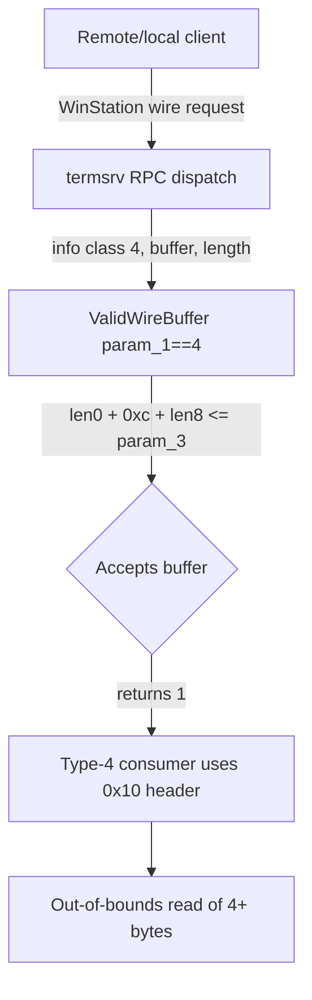

# CVE-2026-69287

**CVE:** CVE-2026-69287  
**Title:** Windows Remote Desktop Services Elevation of Privilege Vulnerability  
**Source:** [https://msrc.microsoft.com/update-guide/vulnerability/CVE-2026-69287](https://msrc.microsoft.com/update-guide/vulnerability/CVE-2026-69287)  
**Component(s):** termsrv.dll  
**Patched Date:** 2026-09-08T07:00:00  
**CWE:** Use after free in Windows Remote Desktop Services allows an authorized attacker to elevate privileges locally.  

---

## Related CVEs (Same Component)

This report covers 9 CVEs affecting the same component(s):

- **CVE-2026-69287**  
- CVE-2026-69475  
- CVE-2026-69514  
- CVE-2026-69525  
- CVE-2026-69536  
- CVE-2026-69539  
- CVE-2026-69599  
- CVE-2026-69616  
- CVE-2026-80096  

### Detailed Information

#### CVE-2026-69475

**Title:** Windows Remote Desktop Services Elevation of Privilege Vulnerability  
**Source:** [https://msrc.microsoft.com/update-guide/vulnerability/CVE-2026-69475](https://msrc.microsoft.com/update-guide/vulnerability/CVE-2026-69475)  
**Patched Date:** 2026-09-08T07:00:00  
**CWE:** Untrusted pointer dereference in Windows Remote Desktop Services allows an authorized attacker to elevate privileges locally.  

#### CVE-2026-69514

**Title:** Remote Desktop Services Remote Code Execution Vulnerability  
**Source:** [https://msrc.microsoft.com/update-guide/vulnerability/CVE-2026-69514](https://msrc.microsoft.com/update-guide/vulnerability/CVE-2026-69514)  
**Patched Date:** 2026-09-08T07:00:00  
**CWE:** Heap-based buffer overflow in Windows Remote Desktop Services allows an authorized attacker to execute code over a network.  

#### CVE-2026-69525

**Title:** Remote Desktop Services Remote Code Execution Vulnerability  
**Source:** [https://msrc.microsoft.com/update-guide/vulnerability/CVE-2026-69525](https://msrc.microsoft.com/update-guide/vulnerability/CVE-2026-69525)  
**Patched Date:** 2026-09-08T07:00:00  
**CWE:** Use after free in Windows Remote Desktop Services allows an unauthorized attacker to execute code over a network.  

#### CVE-2026-69536

**Title:** Remote Desktop Services Remote Code Execution Vulnerability  
**Source:** [https://msrc.microsoft.com/update-guide/vulnerability/CVE-2026-69536](https://msrc.microsoft.com/update-guide/vulnerability/CVE-2026-69536)  
**Patched Date:** 2026-09-08T07:00:00  
**CWE:** Use after free in Windows Remote Desktop Services allows an authorized attacker to execute code over a network.  

#### CVE-2026-69539

**Title:** Remote Desktop Services Remote Code Execution Vulnerability  
**Source:** [https://msrc.microsoft.com/update-guide/vulnerability/CVE-2026-69539](https://msrc.microsoft.com/update-guide/vulnerability/CVE-2026-69539)  
**Patched Date:** 2026-09-08T07:00:00  
**CWE:** Use after free in Windows Remote Desktop Services allows an authorized attacker to execute code over a network.  

#### CVE-2026-69599

**Title:** Remote Desktop Services Remote Code Execution Vulnerability  
**Source:** [https://msrc.microsoft.com/update-guide/vulnerability/CVE-2026-69599](https://msrc.microsoft.com/update-guide/vulnerability/CVE-2026-69599)  
**Patched Date:** 2026-09-08T07:00:00  
**CWE:** Use after free in Windows Remote Desktop Services allows an authorized attacker to execute code over a network.  

#### CVE-2026-69616

**Title:** Windows Remote Desktop Services Information Disclosure Vulnerability  
**Source:** [https://msrc.microsoft.com/update-guide/vulnerability/CVE-2026-69616](https://msrc.microsoft.com/update-guide/vulnerability/CVE-2026-69616)  
**Patched Date:** 2026-09-08T07:00:00  
**CWE:** Out-of-bounds read in Windows Remote Desktop Services allows an authorized attacker to disclose information locally.  

#### CVE-2026-80096

**Title:** Windows Remote Desktop Services Elevation of Privilege Vulnerability  
**Source:** [https://msrc.microsoft.com/update-guide/vulnerability/CVE-2026-80096](https://msrc.microsoft.com/update-guide/vulnerability/CVE-2026-80096)  
**Patched Date:** 2026-09-08T07:00:00  
**CWE:** Out-of-bounds read in Windows Remote Desktop Services allows an authorized attacker to elevate privileges over a network.  

---

Download Patched & Vulnerable Components:

```bash
# termsrv.dll
wget https://msdl.microsoft.com/download/symbols/termsrv.dll/B7CC523F140000/termsrv.dll -O termsrv.dll.10.0.26100.9278 # vulnerable
wget https://msdl.microsoft.com/download/symbols/termsrv.dll/1830D6EB140000/termsrv.dll -O termsrv.dll.10.0.26100.9444 # patched
```

## Version Tracking Analysis

**Command:**

```
python ghidra_scripts\ghidra_vt_wrapper.py --old-binary ./reports/2026-Sep/CVE-2026-69287/termsrv.dll.10.0.26100.9278 --new-binary ./reports/2026-Sep/CVE-2026-69287/termsrv.dll.10.0.26100.9444 --project-dir ./reports/2026-Sep/CVE-2026-69287/ghidra_project --project-name termsrv.dll_CVE-2026-69287 --ghidra-dir C:\Tools\ghidra_11.4.2_PUBLIC_20250826\ghidra_11.4.2_PUBLIC --output-dir ./reports/2026-Sep/CVE-2026-69287/ghidra_project/vt_results --max-memory 16g
```

Patched Functions: 8 | New Functions: 12 | Removed Functions: 1 | Total Matches: 112614 | Accepted Matches: 26509

### Patched Functions

| Function Name | Source Address | Dest Address | Similarity | Confidence |
| --- | --- | --- | --- | --- |
| `CConnectionEx::QueryVirtualChannelModuleData` | `18003aa80` | `18003aa80` | 0.986 | 1.0 |
| `CTSRemoteTerminalTrace::CTSRemoteTerminalTrace` | `18004f4cc` | `18004f524` | 0.810 | 10.0 |
| `CRemoteDisplayDeviceContext::IddStateDriverUnloadedFunc` | `180094cc0` | `1800951b0` | 0.762 | 10.0 |
| `CRemoteDisplayDeviceContext::IddStateInterfaceEnabledFunc` | `180095110` | `180095680` | 0.762 | 10.0 |
| `CRemoteDisplayDeviceContext::~CRemoteDisplayDeviceContext` | `18004f7c8` | `18004f814` | 0.683 | 10.0 |
| `ValidWireBuffer` | `180061f1c` | `18006217c` | 0.657 | 10.0 |
| `CRemoteDisplayDeviceContext::Initialize` | `180095660` | `180095bf0` | 0.602 | 10.0 |
| `CRemoteDisplayDeviceContext::IddStateDeviceHasProblemFunc` | `180094950` | `180094e20` | 0.562 | 10.0 |

### New Functions

*Showing 10 of 12 new functions*

| Function Name | Address |
| --- | --- |
| `Release` | `180049720` |
| `~SmartPtr<IRemoteDisplayDeviceHost>` | `18004f710` |
| `Release`adjustor{1600}'` | `180054850` |
| `GetCachedFeatureEnabledState` | `18006197c` |
| `GetCurrentFeatureEnabledState` | `180061aac` |
| `ReportUsage` | `180061cd8` |
| `__private_IsEnabled` | `180062354` |
| `GetCachedFeatureEnabledState` | `180094c30` |
| `GetCurrentFeatureEnabledState` | `180094d60` |
| `ReportUsage` | `180095ef4` |

### Removed Functions

| Function Name | Address |
| --- | --- |
| `_guard_dispatch_icall` | `1800cdfd0` |

---

# AI Technical Analysis

## Vulnerability Identification

**Core Vulnerable Function(s):**

- `ValidWireBuffer()` - Performs length validation on
  attacker-controlled WinStation wire buffers. For info class
  `4` it computes the required buffer size using a fixed header
  constant of `0xc` (12 bytes) when the true header size is
  `0x10` (16 bytes), under-counting the structure by 4 bytes and
  accepting undersized buffers as valid.

**Supporting Changes:**

- `GetCurrentFeatureEnabledState()` - New WIL feature-state
  helper for `Feature_4089945402`. Queries the live
  velocity/feature state that gates the corrected validation
  path.
- `GetCachedFeatureEnabledState()` - New WIL cache helper for
  `Feature_4089945402`. Caches the enabled state consumed by
  `__private_IsEnabled()` inside `ValidWireBuffer()`, controlling
  whether the fixed (`0x10`) or legacy (`0xc`) path executes.

**Unrelated Changes:**

- `IddStateDriverUnloadedFunc()` - Adds a `Feature_917740858`
  check to select an alternate host object pointer (`0x9d8` vs
  `0x9d0`) and a new vtable slot; the remaining edits are ETW
  telemetry string/offset churn. Not related to buffer
  validation.
- `IddStateInterfaceEnabledFunc()` - Same `Feature_917740858`
  vtable-selection change plus telemetry refactoring. Not
  security-relevant to this CVE.
- `IddStateDeviceHasProblemFunc()` - Same `Feature_917740858`
  vtable-selection change plus stack-variable reshuffling. Not
  security-relevant to this CVE.
- `QueryVirtualChannelModuleData()` - Renamed to
  `getShadowTarget()` with a different signature; body still
  returns the constant `-0x7fffbfff`. Pure symbol/prototype
  refactor.
- `Release()`, `~SmartPtr<IRemoteDisplayDeviceHost>()`,
  `Release adjustor{1600}` - Object lifetime and smart-pointer
  boilerplate. No validation logic.

---

## Root Cause Analysis

The flaw is an insufficient length check: `ValidWireBuffer()`
validates that an incoming wire structure fits within the
caller-supplied length `param_3`, but for info class `4` it
models the fixed portion of the structure as `0xc` bytes when
the structure actually occupies `0x10` bytes. The violated
invariant is that a buffer accepted as valid must be at least as
large as every field the consumer will subsequently dereference.
Because the header constant is 4 bytes too small, a buffer whose
true required size is `N` can pass validation at `N - 4`,
producing a 4-byte out-of-bounds read downstream.

**Vulnerable Code Snippet (BEFORE):**

```c
if (param_1 == 4) {
  if (((0xb < param_3) &&
      (*(short *)((longlong)param_2 + 2) == 0xc)) &&
     ((*(ushort *)((longlong)param_2 + 8) + 0xc +
       (uint)*(ushort *)param_2 <= param_3 &&
      ((uint)*(ushort *)((longlong)param_2 + 2) +
       (uint)*(ushort *)param_2 ==
       (uint)*(ushort *)((longlong)param_2 + 10))))) {
    return '\x01';
  }
  uVar1 = 4;
  goto LAB_180062053;
}
```

The function first requires `0xb < param_3`, ensuring at least
12 bytes are present so the fixed fields can be read. It then
reads a 16-bit type tag at offset `+2` and requires it to equal
`0xc`, confirming the buffer claims to be a type-4 structure.
The size check is
`*(ushort *)(param_2 + 8) + 0xc + *(ushort *)param_2 <= param_3`,
where `*(ushort *)param_2` is a leading length field and
`*(ushort *)(param_2 + 8)` is a trailing payload length. The
literal `0xc` here is the assumed size of the fixed header. The
final equality
`*(ushort *)(param_2 + 2) + *(ushort *)param_2 ==
*(ushort *)(param_2 + 10)` is a self-consistency check on
declared fields, not a bounds check. Nothing in the accepting
path accounts for the extra 4 bytes between offset `0xc` and the
real header end at `0x10`. Consequently, when both length fields
and `param_3` are chosen so the sum lands exactly at `param_3`
using `0xc`, validation succeeds even though the structure needs
`0x10`. All values compared here originate from
attacker-controlled bytes at `param_2`, so the attacker fully
controls the arithmetic. The result is that the parser accepts a
buffer 4 bytes shorter than the object it represents.

---

## Execution and Trigger Flow

An attacker reaches this code through the Terminal Services
WinStation interface, which marshals a `_WINSTATIONINFOCLASS`
selector (`param_1`), an opaque buffer (`param_2`), and its byte
length (`param_3`) from the wire. The request specifies info
class `4`, so control enters the `param_1 == 4` branch. The
attacker sets the 16-bit tag at offset `+2` to `0xc` to satisfy
the type check and sets `param_3` to at least 12 to clear the
`0xb < param_3` gate. The attacker then chooses the leading
length at offset `0` and the payload length at offset `+8` so
that `len0 + 0xc + len8` equals the actual `param_3` exactly,
and sets the field at offset `+10` to satisfy the equality
`*(param_2 + 2) + *(param_2 + 0) == *(param_2 + 10)`. With those
constraints met, the vulnerable path returns `'\x01'`,
signaling the buffer is valid. However, the real consumer of a
type-4 structure treats the fixed header as `0x10` bytes, so it
computes payload placement 4 bytes beyond what was actually
validated. When that consumer reads the trailing payload
described by offset `+8`, it accesses memory past the end of the
allocation, causing an out-of-bounds read of adversary-chosen
extent. Because validation is the sole gate before consumption,
this single arithmetic discrepancy is enough to defeat the
bounds guarantee.



---

## Patch Analysis

The patch introduces a `Feature_4089945402` velocity gate and,
on the enabled path, replaces the `0xc` header constant with
`0x10`.

**Patched Code Snippet (AFTER):**

```diff
-      if (((0xb < param_3) && (*(short *)((longlong)param_2 + 2) == 0xc)) &&
-         ((*(ushort *)((longlong)param_2 + 8) + 0xc + (uint)*(ushort *)param_2 <= param_3 &&
-          ((uint)*(ushort *)((longlong)param_2 + 2) + (uint)*(ushort *)param_2 ==
-           (uint)*(ushort *)((longlong)param_2 + 10))))) {
-        return '\x01';
+      bVar2 = wil::details::FeatureImpl<Feature_4089945402>::__private_IsEnabled(...);
+      if (bVar2) {
+        if ((0xb < param_3) && (*(short *)((longlong)param_2 + 2) == 0xc)) {
+          uVar1 = *(ushort *)param_2;
+          iVar3 = uVar1 + 0x10;
+LAB_18006220c:
+          if ((iVar3 + (uint)*(ushort *)((longlong)param_2 + 8) <= param_3) &&
+             ((uint)*(ushort *)((longlong)param_2 + 2) + (uint)uVar1 ==
+              (uint)*(ushort *)((longlong)param_2 + 10))) {
+            return '\x01';
+          }
+        }
+      }
+      else if ((0xb < param_3) && (*(short *)((longlong)param_2 + 2) == 0xc)) {
+        uVar1 = *(ushort *)param_2;
+        iVar3 = uVar1 + 0xc;
+        goto LAB_18006220c;
+      }
```

The corrected computation caches the leading length in `uVar1`,
then forms `iVar3 = uVar1 + 0x10` and requires
`iVar3 + *(ushort *)(param_2 + 8) <= param_3`. This raises the
minimum accepted buffer size by exactly the 4 bytes that the
legacy code omitted, aligning the validated size with the
`0x10`-byte header the consumer assumes. The self-consistency
equality on offsets `+2`, `+0`, and `+10` is preserved
unchanged, so no legitimate field semantics are altered. The WIL
feature check routes execution to the new arithmetic only when
`Feature_4089945402` is enabled; the `else` branch reconstructs
the original `0xc` computation for staged rollout via
`GetCachedFeatureEnabledState()` and
`GetCurrentFeatureEnabledState()`.

The fix is effective for the enabled state: any buffer that
previously passed at `N - 4` now fails the `<= param_3`
comparison, closing the 4-byte over-read. Because the constant
matches the consumer's header size, the length check and the
downstream parser agree, restoring the size invariant. One
caveat is that the fix is gated behind a runtime feature flag,
so protection is only guaranteed once the feature reaches the
fully enabled state; while disabled, the `else` path still
executes the vulnerable `0xc` arithmetic. This is a deliberate
velocity-controlled deployment rather than an unconditional
correction.

Security impact: exploitation yields an out-of-bounds read in
the Terminal Services service, enabling information disclosure
or denial of service in the `termsrv.dll` context. The patch
eliminates the boundary miscalculation once the gating feature
is enabled, preventing undersized type-4 wire buffers from being
accepted.