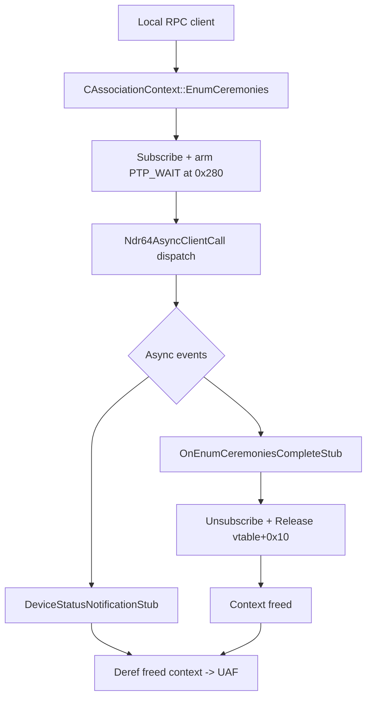

# CVE-2026-69314

**CVE:** CVE-2026-69314  
**Title:** Windows Device Association Broker Service Elevation of Privilege Vulnerability  
**Source:** [https://msrc.microsoft.com/update-guide/vulnerability/CVE-2026-69314](https://msrc.microsoft.com/update-guide/vulnerability/CVE-2026-69314)  
**Component(s):** das.dll  
**Patched Date:** 2026-09-08T07:00:00  
**CWE:** Use after free in Windows Device Association Broker service allows an authorized attacker to elevate privileges over a network.  

---

## Related CVEs (Same Component)

This report covers 2 CVEs affecting the same component(s):

- **CVE-2026-69314**  
- CVE-2026-69693  

### Detailed Information

#### CVE-2026-69693

**Title:** Windows Device Association Broker Service Elevation of Privilege Vulnerability  
**Source:** [https://msrc.microsoft.com/update-guide/vulnerability/CVE-2026-69693](https://msrc.microsoft.com/update-guide/vulnerability/CVE-2026-69693)  
**Patched Date:** 2026-09-08T07:00:00  
**CWE:** Use after free in Windows Device Association Broker service allows an authorized attacker to elevate privileges locally.  

---

Download Patched & Vulnerable Components:

```bash
# das.dll
wget https://msdl.microsoft.com/download/symbols/das.dll/A9678498B7000/das.dll -O das.dll.10.0.26100.9278 # vulnerable
wget https://msdl.microsoft.com/download/symbols/das.dll/4380226EB8000/das.dll -O das.dll.10.0.26100.9444 # patched
```

## Version Tracking Analysis

**Command:**

```
python ghidra_scripts\ghidra_vt_wrapper.py --old-binary ./reports/2026-Sep/CVE-2026-69314/das.dll.10.0.26100.9278 --new-binary ./reports/2026-Sep/CVE-2026-69314/das.dll.10.0.26100.9444 --project-dir ./reports/2026-Sep/CVE-2026-69314/ghidra_project --project-name das.dll_CVE-2026-69314 --ghidra-dir C:\Tools\ghidra_11.4.2_PUBLIC_20250826\ghidra_11.4.2_PUBLIC --output-dir ./reports/2026-Sep/CVE-2026-69314/ghidra_project/vt_results --max-memory 16g
```

Patched Functions: 19 | New Functions: 15 | Removed Functions: 1 | Total Matches: 29672 | Accepted Matches: 13465

### Patched Functions

*Showing top 10 of 19 patched functions*

| Function Name | Source Address | Dest Address | Similarity | Confidence |
| --- | --- | --- | --- | --- |
| `CAssociationContext::~CAssociationContext` | `18004ac50` | `18004aff0` | 0.983 | 10.0 |
| `CAssociationContext::EnumCeremonies` | `18004c0d8` | `18004c590` | 0.943 | 10.0 |
| `CAssociationContext::ReadCeremonyData` | `180051a4c` | `18005243c` | 0.941 | 10.0 |
| `CAssociationContext::FinializeCeremony` | `18004c4cc` | `18004c9c4` | 0.939 | 10.0 |
| `CAssociationContext::RemoveAssociation` | `180051fc4` | `180052a8c` | 0.932 | 10.0 |
| `CAssociationContext::WriteCeremonyData` | `1800530e4` | `180053d04` | 0.921 | 10.0 |
| `CAssociationContext::DeviceStatusNotification` | `18004bafc` | `18004becc` | 0.891 | 10.0 |
| `OnRemoveComplete` | `180050cc0` | `180051634` | 0.889 | 10.0 |
| `OnReadCeremonyDataCompleteStub` | `1800507d8` | `180051120` | 0.847 | 10.0 |
| `CAssociationContext::InitFromOob` | `18004e020` | `18004e928` | 0.837 | 10.0 |

### New Functions

*Showing 10 of 15 new functions*

| Function Name | Address |
| --- | --- |
| `GetCachedFeatureEnabledState` | `180047a08` |
| `GetCurrentFeatureEnabledState` | `180047c68` |
| `ReportUsage` | `18004988c` |
| `__private_IsEnabled` | `18004ab20` |
| `DrainAsyncNotification` | `18004c540` |
| `GetCachedFeatureEnabledState` | `18004cde4` |
| `GetCachedFeatureEnabledState` | `18004cf14` |
| `GetCurrentFeatureEnabledState` | `18004d9c4` |
| `GetCurrentFeatureEnabledState` | `18004da7c` |
| `ReportUsage` | `180052df4` |

### Removed Functions

| Function Name | Address |
| --- | --- |
| `_guard_dispatch_icall` | `1800828b0` |

---

# AI Technical Analysis

## Vulnerability Identification

**Core Vulnerable Function(s):**

- `DeviceStatusNotificationStub()` - Drops the association-context
  reference on the completion path without first cancelling and
  joining the outstanding threadpool-wait notification callback,
  producing a use-after-free race on the context object.
- `OnEnumCeremoniesCompleteStub()` - Contains the identical
  premature-release pattern on the enumerate-ceremonies completion
  path, releasing the context while a pending wait callback can
  still dereference it.

**Supporting Changes:**

- `CAssociationContext::DrainAsyncNotification()` - New helper the
  patch invokes to cancel the wait (`this + 0x280`) and join
  in-flight callbacks before the final `Release`.
- `CAssociationContext::EnumCeremonies()` - Adds the feature-gated
  reference acquisition (`vtable+8`) before the async RPC dispatch;
  a check that supplies the missing lifetime guarantee.
- `CAssociationContext::FinializeCeremony()` - Same feature-gated
  `AddRef` addition on the finalize dispatch path.

**Unrelated Changes:**

- `CAssociationContext::~CAssociationContext()` - Refactor that
  extracts `CAssociationCallback::Deactivate()` from inline
  critical-section code; behavior preserving, not security relevant.
- `GetCachedFeatureEnabledState()`, `GetCurrentFeatureEnabledState()`,
  `ReportUsage()` - Windows Implementation Library feature-flag
  plumbing pulled in by the new gate; no security logic.

---

## Root Cause Analysis

The flaw is a use-after-free driven by an object-lifetime race
between an RPC async completion and an outstanding threadpool-wait
notification callback. The completion stub releases the shared
`CAssociationContext` reference while a device-status notification
callback bound to the same object may still be signaled or running.
The violated invariant is simple: a reference-counted object must
not be released, and thus made eligible for free, while an
asynchronous callback that captured it can still execute.

```c
if (*(int *)((longlong)param_3 + 0x178) != 0) {
  puVar7 = local_res18;
  local_res18[0] = 0;
  RpcServerUnsubscribeForNotification
    (*(undefined8 *)
       (*(longlong *)((longlong)param_3 + 200) + 0x20), 2);
  (**(code **)(*(longlong *)param_3 + 0x10))(param_3);
}
*(undefined4 *)((longlong)param_3 + 0x24) = 1;
uVar3 = RpcAsyncCompleteCall(
          *(PRPC_ASYNC_STATE *)((longlong)param_3 + 200), Reply);
ReleaseSRWLockExclusive(SRWLock);
```

The field at `param_3 + 0x178` flags that the context is subscribed
to notifications and owns the threadpool wait stored at
`param_3 + 0x280`. When set, the stub calls
`RpcServerUnsubscribeForNotification` and then the virtual method at
`vtable+0x10`, which is the `Release` that drops the subscription's
reference on the context. Crucially, `RpcServerUnsubscribeForNotification`
stops future RPC-delivered notifications but performs no
synchronization with the local `PTP_WAIT` object at
`param_3 + 0x280`. A wait callback already dispatched by the thread
pool, or one whose event is already signaled, continues to run and
dereferences the same `param_3`. Because the `Release` at
`vtable+0x10` can drop the last reference, the notification callback
then reads and writes freed heap memory. The completion flag at
`param_3 + 0x24` is written only after the release, so state used to
gate re-entry is updated too late to help. `OnEnumCeremoniesCompleteStub`
repeats the pattern around its own `RpcAsyncCompleteCall`, releasing
`param_4` before the pending wait is quiesced. The result is a race
window in which attacker-influenced timing turns a routine
completion into a dangling-pointer dereference on a service-owned
object.

---

## Execution and Trigger Flow

The Device Association Service exposes these routines over RPC to
local clients, so the trigger begins with a client-issued
enumeration or finalize request. The client calls the enumerate
ceremonies RPC, which reaches `CAssociationContext::EnumCeremonies`
and causes the server to subscribe for device notifications and arm
the threadpool wait at `this + 0x280`. The server dispatches the
asynchronous RPC via `Ndr64AsyncClientCall` and returns, leaving the
context live and referenced by both the RPC async state and the
notification subscription. A device-status change then signals the
wait object, queuing `DeviceStatusNotificationStub` as the
threadpool-wait callback, while the RPC completion path schedules
`OnEnumCeremoniesCompleteStub`. Under contended timing, the
completion stub runs first, takes the SRW lock, unsubscribes, and
invokes the `vtable+0x10` release that can free the context. The
still-pending wait callback then executes against the freed
`param_3`, reading vtable and heap fields such as `*(longlong *)param_3`
and `param_3 + 0x30`. Because the callback writes state and issues a
further virtual call, a freed-then-reallocated buffer yields
attacker-controlled control flow. A local client that rapidly
enumerates and cancels associations while inducing device-state
changes can widen this window deterministically. The impact is
local elevation of privilege within the service context, and
potentially code execution.



---

## Patch Analysis

The patch adds a feature-gated reference acquisition at dispatch and
a synchronized drain at completion, so the context outlives every
callback that can touch it.

```diff
+          bVar3 = wil::details::FeatureImpl<
+                    __WilFeatureTraits_Feature_4114062648>::
+                    __private_IsEnabled(...);
       local_res18[0] = 0;
+      puVar9 = local_res18;
+      if (bVar3) {
+        RpcServerUnsubscribeForNotification();
+        bVar2 = true;
+      }
+      else {
         RpcServerUnsubscribeForNotification(
           *(undefined8 *)
             (*(longlong *)((longlong)param_3 + 200) + 0x20), 2);
         (**(code **)(*(longlong *)param_3 + 0x10))(param_3);
+      }
     }
+    *(undefined4 *)((longlong)param_3 + 0x24) = 1;
     uVar5 = RpcAsyncCompleteCall(..., Reply);
     ReleaseSRWLockExclusive((PSRWLOCK)SRWLock);
+    if ((bVar3) && (bVar2)) {
+      CAssociationContext::DrainAsyncNotification(param_3);
+    }
```

When the feature is enabled the stub no longer performs the inline
`Release` at `vtable+0x10`; it records the intent in `bVar2` and
defers cleanup. After `RpcAsyncCompleteCall` runs and the SRW lock is
released, the stub calls `CAssociationContext::DrainAsyncNotification`,
which issues `SetThreadpoolWait(wait, NULL, NULL)` to cancel the
armed wait, then `WaitForThreadpoolWaitCallbacks(wait, 0)` to block
until any in-flight callback finishes, and only then performs the
`vtable+0x10` release. Complementary changes in `EnumCeremonies` and
`FinializeCeremony` add the `vtable+0x8` `AddRef` before
`Ndr64AsyncClientCall`, guaranteeing the context is referenced for
the whole async window. The completion flag at `param_3 + 0x24` is
also moved ahead of `RpcAsyncCompleteCall`.

The drain is effective because it converts an unsynchronized release
into a join: no callback can be running or pending once
`WaitForThreadpoolWaitCallbacks` returns, so the subsequent release
cannot leave a dangling reference. Performing the drain after
`ReleaseSRWLockExclusive` is essential, since the wait callback
itself acquires the same SRW lock, and draining while holding it
would deadlock. The paired `AddRef` at dispatch ensures the
reference the drain releases actually exists, closing the count. The
WIL feature flag allows the corrected path to ship behind staged
rollout while preserving the legacy path.

The security impact is elimination of a local, race-triggered
use-after-free on a service-owned object. Closing the window removes
the elevation-of-privilege and potential code-execution primitive
reachable by an authenticated local client.