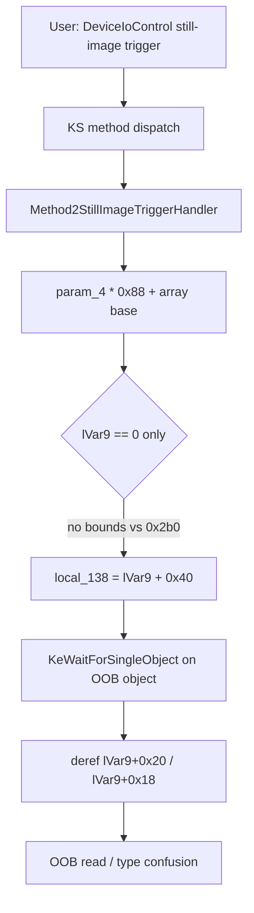

# CVE-2026-69319

**CVE:** CVE-2026-69319  
**Title:** Windows USB Video Driver Elevation of Privilege Vulnerability  
**Source:** [https://msrc.microsoft.com/update-guide/vulnerability/CVE-2026-69319](https://msrc.microsoft.com/update-guide/vulnerability/CVE-2026-69319)  
**Component(s):** usbvideo.sys  
**Patched Date:** 2026-09-08T07:00:00  
**CWE:** Concurrent execution using shared resource with improper synchronization ('race condition') in Windows USB Video Driver allows an authorized attacker to elevate privileges locally.  

---

## Related CVEs (Same Component)

This report covers 5 CVEs affecting the same component(s):

- **CVE-2026-69319**  
- CVE-2026-69422  
- CVE-2026-69423  
- CVE-2026-69584  
- CVE-2026-72962  

### Detailed Information

#### CVE-2026-69422

**Title:** Windows USB Video Driver Elevation of Privilege Vulnerability  
**Source:** [https://msrc.microsoft.com/update-guide/vulnerability/CVE-2026-69422](https://msrc.microsoft.com/update-guide/vulnerability/CVE-2026-69422)  
**Patched Date:** 2026-09-08T07:00:00  
**CWE:** Use after free in Windows USB Video Driver allows an authorized attacker to elevate privileges locally.  

#### CVE-2026-69423

**Title:** Windows USB Video Driver Elevation of Privilege Vulnerability  
**Source:** [https://msrc.microsoft.com/update-guide/vulnerability/CVE-2026-69423](https://msrc.microsoft.com/update-guide/vulnerability/CVE-2026-69423)  
**Patched Date:** 2026-09-08T07:00:00  
**CWE:** Heap-based buffer overflow in Windows USB Video Driver allows an authorized attacker to elevate privileges over a network.  

#### CVE-2026-69584

**Title:** Windows USB Video Driver Elevation of Privilege Vulnerability  
**Source:** [https://msrc.microsoft.com/update-guide/vulnerability/CVE-2026-69584](https://msrc.microsoft.com/update-guide/vulnerability/CVE-2026-69584)  
**Patched Date:** 2026-09-08T07:00:00  
**CWE:** Integer overflow or wraparound in Windows USB Video Driver allows an authorized attacker to elevate privileges locally.  

#### CVE-2026-72962

**Title:** Windows USB Video Driver Elevation of Privilege Vulnerability  
**Source:** [https://msrc.microsoft.com/update-guide/vulnerability/CVE-2026-72962](https://msrc.microsoft.com/update-guide/vulnerability/CVE-2026-72962)  
**Patched Date:** 2026-09-08T07:00:00  
**CWE:** Heap-based buffer overflow in Windows USB Video Driver allows an authorized attacker to elevate privileges locally.  

---

Download Patched & Vulnerable Components:

```bash
# usbvideo.sys
wget https://msdl.microsoft.com/download/symbols/usbvideo.sys/7A1992F466000/usbvideo.sys -O usbvideo.sys.10.0.26100.9278 # vulnerable
wget https://msdl.microsoft.com/download/symbols/usbvideo.sys/C5144DB466000/usbvideo.sys -O usbvideo.sys.10.0.26100.9444 # patched
```

## Version Tracking Analysis

**Command:**

```
python ghidra_scripts\ghidra_vt_wrapper.py --old-binary ./reports/2026-Sep/CVE-2026-69319/usbvideo.sys.10.0.26100.9278 --new-binary ./reports/2026-Sep/CVE-2026-69319/usbvideo.sys.10.0.26100.9444 --project-dir ./reports/2026-Sep/CVE-2026-69319/ghidra_project --project-name usbvideo.sys_CVE-2026-69319 --ghidra-dir C:\Tools\ghidra_11.4.2_PUBLIC_20250826\ghidra_11.4.2_PUBLIC --output-dir ./reports/2026-Sep/CVE-2026-69319/ghidra_project/vt_results --max-memory 16g
```

Patched Functions: 9 | New Functions: 13 | Removed Functions: 1 | Total Matches: 5453 | Accepted Matches: 5023

### Patched Functions

| Function Name | Source Address | Dest Address | Similarity | Confidence |
| --- | --- | --- | --- | --- |
| `CStreamFormatPlugin::MuteSample` | `14001aff0` | `14001b380` | 0.995 | 1.0 |
| `SelectDeviceConfiguration` | `14001fb10` | `140020080` | 0.974 | 10.0 |
| `Method2StillImageTriggerHandler` | `14001eb70` | `14001f018` | 0.917 | 10.0 |
| `StartUSBVideoDevice` | `140013aa0` | `140013be0` | 0.831 | 10.0 |
| `BuildUSBVideoFilterTopology` | `140021c38` | `1400221b8` | 0.766 | 10.0 |
| `FindOptimalAltSetting` | `140015168` | `140015328` | 0.680 | 10.0 |
| `FrameRenderInitializeIsochUrb` | `14001b4c0` | `14001b8b0` | 0.620 | 10.0 |
| `RemoveMatchingIrpFromQueue` | `140017c44` | `140017fa8` | 0.525 | 10.0 |
| `CsCompleteCanceledIrp` | `14003b130` | `14003bb00` | 0.525 | 10.0 |

### New Functions

*Showing 10 of 13 new functions*

| Function Name | Address |
| --- | --- |
| `Feature_294618424__private_IsEnabledDeviceUsageNoInline` | `14001b3e0` |
| `Feature_294618424__private_IsEnabledFallback` | `14001b418` |
| `Feature_3203896632__private_IsEnabledDeviceUsageNoInline` | `14001ebe8` |
| `Feature_3203896632__private_IsEnabledFallback` | `14001ec20` |
| `Feature_855086392__private_IsEnabledDeviceUsageNoInline` | `14001ec3c` |
| `Feature_855086392__private_IsEnabledFallback` | `14001ec74` |
| `WPP_SF_qLL` | `140023680` |
| `WPP_SF_qLLL` | `1400236e8` |
| `WPP_SF_qLLLL` | `14002375c` |
| `WPP_SF_qdLL` | `140026180` |

### Removed Functions

| Function Name | Address |
| --- | --- |
| `_guard_dispatch_icall` | `1400418e0` |

---

# AI Technical Analysis

CVE-2026-69319 affects the USB Video Class driver
`usbvideo.sys`. The patch set touches five functions, but only
one carries the exploitable memory-safety defect. The analysis
below isolates that function and explains the missing bounds
check that allows attacker-controlled indexing of a
kernel-object array.

---

## Vulnerability Identification

**Core Vulnerable Function(s):**

- `Method2StillImageTriggerHandler()` - Uses the
  attacker-controlled index `param_4` to compute an element
  address in the per-pin object array at `param_1 + 0x2e8`
  with no comparison against the element count stored at
  `param_1 + 0x2b0`. The result is a fully attacker-influenced
  kernel pointer that is dereferenced and passed to
  `KeWaitForSingleObject`.

**Supporting Changes:**

- `SelectDeviceConfiguration()` - Gated by the same feature
  flag `Feature_3203896632`. Nulls a freed slot pointer on the
  error path and converts `memmove` to `memcpy`. Hardening of
  the descriptor-copy loop, not the reported flaw.
- `CsCompleteCanceledIrp()` - Under flag
  `Feature_3992169786`, zeroes `param_2 + 0x78` after
  `ExFreePoolWithTag` to prevent a stale-pointer reuse. A
  separate use-after-free hardening path.
- `RemoveMatchingIrpFromQueue()` - Under the same
  `Feature_3992169786` flag, replaces a manual list walk with
  `IoCsqRemoveNextIrp`. Correctness/refactor pairing for the
  IRP-cancel hardening.

**Unrelated Changes:**

- `FrameRenderInitializeIsochUrb()` - Under flag
  `Feature_294618424`, selects a frame-size field from
  `lVar2 + 0x20` instead of computing it. A behavioral feature
  toggle with no memory-safety impact.

---

## Root Cause Analysis

The vulnerability is a classic missing-bounds-check on an
array index supplied from user mode. The KS method handler
receives a pin or stream identifier in `param_4` and uses it
directly as an index into a fixed-stride array of dispatcher
objects. The invariant that `param_4` must be less than the
element count at `param_1 + 0x2b0` was never enforced before
computing the element address.

Vulnerable code (before):

```c
lVar9 = (param_4 & 0xffffffff) * 0x88 +
        *(longlong *)(param_1 + 0x2e8);
if (lVar9 == 0) {
  return uStack_48;
}
local_138 = lVar9 + 0x40;
uVar6 = 0;
_Dst = (longlong *)0x0;
KeWaitForSingleObject(local_138);
lVar7 = KeQueryPerformanceCounter(0);
lVar12 = *(longlong *)(lVar9 + 0x20);
```

The base pointer `*(longlong *)(param_1 + 0x2e8)` addresses an
array whose element stride is `0x88` bytes. The expression
`(param_4 & 0xffffffff) * 0x88` scales the caller index by
that stride, so any `param_4` beyond the valid count yields
`lVar9` pointing past the array into adjacent pool memory. The
only guard is `if (lVar9 == 0)`, which merely rejects a null
base and does nothing for out-of-range indices. The handler
then forms `local_138 = lVar9 + 0x40` and passes it to
`KeWaitForSingleObject`, treating attacker-reachable memory as
a kernel dispatcher (mutex) object. It further dereferences
`*(longlong *)(lVar9 + 0x20)` and later `lVar9 + 0x18` as
embedded structure pointers, propagating the out-of-bounds
read into pointer chases. Because `param_4` was typed
`ulonglong` and only masked to 32 bits, the multiplication
reaches far beyond the intended table. The signature also
returned `uStack_48`, an uninitialized stack slot, on early
exits, compounding the defect with an uninitialized return.
The net effect is an out-of-bounds access on a
type-confused kernel object driven entirely by caller input.

---

## Execution and Trigger Flow

A local user opens the UVC device stream and issues a
`DeviceIoControl` request carrying the still-image trigger
method. The KS framework routes the property/method set to
the driver, which dispatches to
`Method2StillImageTriggerHandler`. The caller controls the pin
index that arrives as `param_4`. Execution confirms
`param_1 != 0`, then immediately computes
`lVar9 = (param_4 & 0xffffffff) * 0x88 + base`, where `base`
is the pin-object array at `param_1 + 0x2e8`. No comparison to
the element count at `param_1 + 0x2b0` occurs, so an index
larger than the table size produces an address past the
allocation. The single `lVar9 == 0` test passes for any
non-null result. The handler builds `local_138 = lVar9 + 0x40`
and calls `KeWaitForSingleObject` on it, forcing the kernel to
interpret out-of-bounds bytes as a dispatcher header. It then
loads `*(longlong *)(lVar9 + 0x20)` and `*(longlong *)(lVar9 +
0x18)` and dereferences those as further object pointers. A
crafted index whose target memory contains attacker-shaped
data yields controlled pointer dereferences and object
operations at `IRQL PASSIVE_LEVEL`, giving an out-of-bounds
read primitive and potential elevation of privilege through
type confusion.



---

## Patch Analysis

The fix narrows the parameter type and inserts an explicit
range check before any address computation.

```diff
-  lVar9 = (param_4 & 0xffffffff) * 0x88 +
-          *(longlong *)(param_1 + 0x2e8);
-  if (lVar9 == 0) {
-    return uStack_48;
-  }
-  local_138 = lVar9 + 0x40;
+  uVar6 = Feature_3203896632__private_IsEnabledDeviceUsageNoInline();
+  if (((int)uVar6 != 0) && (*(uint *)(param_1 + 0x2b0) <= param_4)) {
+    ... WPP_SF_LL(...,0x7a,...,param_4);
+    local_140[2] = 0xa03b9e371;
+    local_128 = 0xc000000d;
+    RtlLogUnexpectedCodepath(local_140 + 2);
+    return 0xc000000d;
+  }
+  lVar11 = (ulonglong)param_4 * 0x88 +
+           *(longlong *)(param_1 + 0x2e8);
+  if (lVar11 == 0) {
+    return 0xc0000001;
+  }
+  local_148 = lVar11 + 0x40;
```

The signature changes `param_4` from `ulonglong` to `uint`,
eliminating the ambiguous 64-bit masking and making the index
a clean 32-bit value. When `Feature_3203896632` is enabled,
the handler compares `param_4` against the valid element count
at `*(uint *)(param_1 + 0x2b0)` using an unsigned
`count <= param_4` test. Any index at or beyond the count is
rejected with `STATUS_INVALID_PARAMETER` (`0xc000000d`), and
`RtlLogUnexpectedCodepath` records the anomalous index for
diagnostics. Only after the check does the code scale the
index by the `0x88` stride and add the array base into
`lVar11`. The early null-base and error paths now return
explicit `NTSTATUS` values (`0xc0000001`, `0xc000000d`)
instead of the uninitialized `uStack_48`, closing the
secondary uninitialized-return issue.

The check is correctly placed before the multiply and every
dereference, so no out-of-bounds address is ever formed. The
unsigned comparison prevents negative-index bypass, and the
32-bit type removes wraparound concerns from the prior mask.
The equivalent slot-nulling and `memcpy` conversion in
`SelectDeviceConfiguration`, gated by the same flag, harden
adjacent freed-pointer reuse but are not the primary fix. The
guard is complete for the reported condition.

Security impact: the patch converts an attacker-controlled
out-of-bounds kernel-object access into a validated,
gracefully rejected request. It removes a local elevation-of-
privilege and information-disclosure primitive reachable from
an unprivileged `DeviceIoControl` caller.