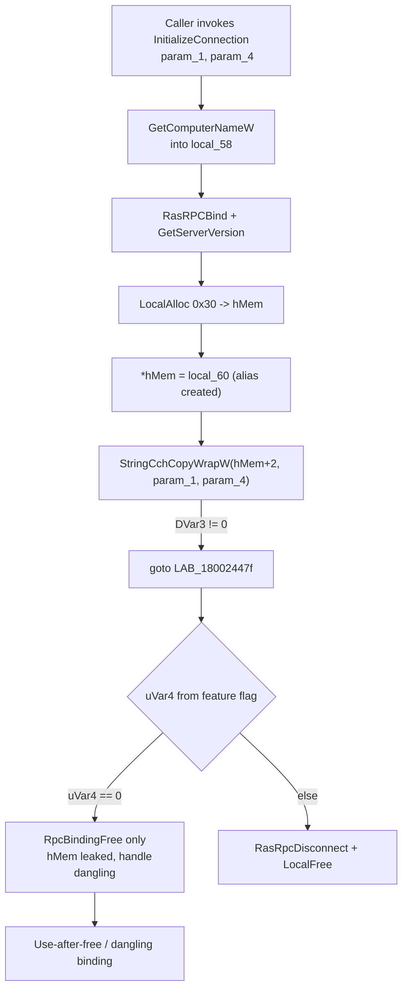

# CVE-2026-69331

**CVE:** CVE-2026-69331  
**Title:** Windows Remote Access Connection Manager Elevation of Privilege Vulnerability  
**Source:** [https://msrc.microsoft.com/update-guide/vulnerability/CVE-2026-69331](https://msrc.microsoft.com/update-guide/vulnerability/CVE-2026-69331)  
**Component(s):** rasman.dll  
**Patched Date:** 2026-09-08T07:00:00  
**CWE:** Use after free in Windows Remote Access Connection Manager allows an authorized attacker to elevate privileges locally.  

---

## Related CVEs (Same Component)

This report covers 7 CVEs affecting the same component(s):

- **CVE-2026-69331**  
- CVE-2026-69455  
- CVE-2026-71333  
- CVE-2026-71342  
- CVE-2026-71343  
- CVE-2026-71352  
- CVE-2026-72966  

### Detailed Information

#### CVE-2026-69455

**Title:** Windows Remote Access Connection Manager Elevation of Privilege Vulnerability  
**Source:** [https://msrc.microsoft.com/update-guide/vulnerability/CVE-2026-69455](https://msrc.microsoft.com/update-guide/vulnerability/CVE-2026-69455)  
**Patched Date:** 2026-09-08T07:00:00  
**CWE:** Heap-based buffer overflow in Windows Remote Access Connection Manager allows an authorized attacker to elevate privileges locally.  

#### CVE-2026-71333

**Title:** Windows Remote Access Connection Manager Elevation of Privilege Vulnerability  
**Source:** [https://msrc.microsoft.com/update-guide/vulnerability/CVE-2026-71333](https://msrc.microsoft.com/update-guide/vulnerability/CVE-2026-71333)  
**Patched Date:** 2026-09-08T07:00:00  
**CWE:** Use after free in Windows Remote Access Connection Manager allows an authorized attacker to elevate privileges locally.  

#### CVE-2026-71342

**Title:** Windows Remote Access Connection Manager Elevation of Privilege Vulnerability  
**Source:** [https://msrc.microsoft.com/update-guide/vulnerability/CVE-2026-71342](https://msrc.microsoft.com/update-guide/vulnerability/CVE-2026-71342)  
**Patched Date:** 2026-09-08T07:00:00  
**CWE:** Use after free in Windows Remote Access Connection Manager allows an authorized attacker to elevate privileges locally.  

#### CVE-2026-71343

**Title:** Windows Remote Access Connection Manager Remote Code Execution Vulnerability  
**Source:** [https://msrc.microsoft.com/update-guide/vulnerability/CVE-2026-71343](https://msrc.microsoft.com/update-guide/vulnerability/CVE-2026-71343)  
**Patched Date:** 2026-09-08T07:00:00  
**CWE:** Heap-based buffer overflow in Windows Remote Access Connection Manager allows an authorized attacker to execute code locally.  

#### CVE-2026-71352

**Title:** Windows Remote Access Connection Manager Remote Code Execution Vulnerability  
**Source:** [https://msrc.microsoft.com/update-guide/vulnerability/CVE-2026-71352](https://msrc.microsoft.com/update-guide/vulnerability/CVE-2026-71352)  
**Patched Date:** 2026-09-08T07:00:00  
**CWE:** Integer underflow (wrap or wraparound) in Windows Remote Access Connection Manager allows an authorized attacker to execute code over a network.  

#### CVE-2026-72966

**Title:** Windows Remote Access Connection Manager Tampering Vulnerability  
**Source:** [https://msrc.microsoft.com/update-guide/vulnerability/CVE-2026-72966](https://msrc.microsoft.com/update-guide/vulnerability/CVE-2026-72966)  
**Patched Date:** 2026-09-08T07:00:00  
**CWE:** Missing authorization in Windows Remote Access Connection Manager allows an authorized attacker to perform tampering locally.  

---

Download Patched & Vulnerable Components:

```bash
# rasman.dll
wget https://msdl.microsoft.com/download/symbols/rasman.dll/173BBBE738000/rasman.dll -O rasman.dll.10.0.26100.8328 # vulnerable
wget https://msdl.microsoft.com/download/symbols/rasman.dll/5E2C7F0636000/rasman.dll -O rasman.dll.10.0.26100.8521 # patched
```

## Version Tracking Analysis

**Command:**

```
python ghidra_scripts\ghidra_vt_wrapper.py --old-binary ./reports/2026-Sep/CVE-2026-69331/rasman.dll.10.0.26100.8328 --new-binary ./reports/2026-Sep/CVE-2026-69331/rasman.dll.10.0.26100.8521 --project-dir ./reports/2026-Sep/CVE-2026-69331/ghidra_project --project-name rasman.dll_CVE-2026-69331 --ghidra-dir C:\Tools\ghidra_11.4.2_PUBLIC_20250826\ghidra_11.4.2_PUBLIC --output-dir ./reports/2026-Sep/CVE-2026-69331/ghidra_project/vt_results --max-memory 16g
```

Patched Functions: 1 | New Functions: 1 | Removed Functions: 16 | Total Matches: 4393 | Accepted Matches: 2955

### Patched Functions

| Function Name | Source Address | Dest Address | Similarity | Confidence |
| --- | --- | --- | --- | --- |
| `InitializeConnection` | `180024374` | `180024338` | 0.694 | 10.0 |

### New Functions

| Function Name | Address |
| --- | --- |
| `_guard_dispatch_icall` | `1800275f0` |

### Removed Functions

*Showing 10 of 16 removed functions*

| Function Name | Address |
| --- | --- |
| `Feature_VPN_BugFixes_25B_Use_After_Free_Fix__private_IsEnabledDeviceUsageNoInline` | `1800242f0` |
| `wil_RtlStagingConfig_QueryFeatureState` | `180024944` |
| `wil_RtlStagingConfig_RecordFeatureUsage` | `180024a3c` |
| `wil_details_AreDependenciesEnabled` | `180024a9c` |
| `wil_details_FeatureReporting_IncrementOpportunityInCache` | `180024b3c` |
| `wil_details_FeatureReporting_IncrementUsageInCache` | `180024c14` |
| `wil_details_FeatureReporting_RecordUsageInCache` | `180024cf8` |
| `wil_details_FeatureReporting_ReportUsageToService` | `180024e78` |
| `wil_details_FeatureReporting_ReportUsageToServiceDirect` | `180024ef4` |
| `wil_details_FeatureStateCache_ReevaluateCachedFeatureEnabledState` | `180024f84` |

---

# AI Technical Analysis

## Vulnerability Identification

**Core Vulnerable Function(s):**

- `InitializeConnection()` - The error-cleanup path at label
  `LAB_18002447f` selects its teardown strategy from a feature
  flag. In the pre-fix default branch it releases the RPC
  binding with `RpcBindingFree()` while a copy of that binding
  handle remains embedded in the heap object `hMem`, and it
  never frees `hMem`. This produces a dangling binding handle
  and a leaked connection object, which is the use-after-free
  condition named directly by the guarding feature flag
  `Feature_VPN_BugFixes_25B_Use_After_Free_Fix`.

**Supporting Changes:**

- `InitializeConnection()` (allocation block) - The statements
  `hMem = LocalAlloc(0x40,0x30)` and `*hMem = (longlong)local_60`
  are not themselves the bug, but they establish the aliasing
  precondition: the binding handle now has two owners.
- `InitializeConnection()` (success path) - Removal of the
  `Feature_..._IsEnabledDeviceUsageNoInline()` probe before
  `*param_2 = hMem` is a dead feature-check cleanup, not a fix.

**Unrelated Changes:**

- Stack-slot and type churn between `local_68` and `local_58`
  (`DWORD` versus `undefined4`) and the renaming of `uVar5`,
  `uVar7`/`iVar7` to `uVar4`, `iVar5` are decompiler and
  recompilation artifacts with no security relevance.

---

## Root Cause Analysis

The flaw is an ownership and lifetime error in the failure
path: a single RPC binding handle becomes owned by two
different cleanup mechanisms, and the chosen mechanism depends
on an unshipped feature flag rather than on the object's actual
state. The invariant that is violated is simple: the binding
handle stored inside the allocated connection object must be
torn down through the same path that frees that object, so the
embedded pointer never outlives the resource it names.

Vulnerable code (before), abbreviated:

```c
    hMem = LocalAlloc(0x40,0x30);
    if (hMem != (longlong *)0x0) {
      *hMem = (longlong)local_60;
      *(int *)(hMem + 1) = iVar7;
      DVar3 = StringCchCopyWrapW((STRSAFE_LPWSTR)(hMem + 2),
                                 0x10,param_1,param_4);
      if (DVar3 == 0) { *param_2 = hMem; return 0; }
      goto LAB_18002447f;
    }
  }
  ...
LAB_18002447f:
  if (local_60 != (RPC_BINDING_HANDLE)0x0) {
    if ((Feature_..._featureState & 0x10) == 0)
      uVar4 = Feature_..._IsEnabledDeviceUsageNoInline();
    else
      uVar4 = Feature_..._featureState & 1;
    if (uVar4 == 0) {
      RVar6 = RpcBindingFree(&local_60);
      ...
    }
    else {
      RasRpcDisconnect(&local_60);
      if (hMem != (longlong *)0x0) LocalFree(hMem);
    }
  }
```

The connection object is allocated by `LocalAlloc(0x40,0x30)`,
and its first quadword is set with `*hMem = (longlong)local_60`,
so `hMem` now aliases the binding held in `local_60`. When
`StringCchCopyWrapW()` fails, control jumps to `LAB_18002447f`
with `hMem` still allocated and still holding that alias. The
cleanup then computes `uVar4` from the feature state. In the
default disabled path, `uVar4` is set from
`IsEnabledDeviceUsageNoInline()`, and the branch taken when
`uVar4 == 0` executes only `RpcBindingFree(&local_60)`. That
call releases the RPC binding but leaves `hMem` allocated and
leaves the copy at `*hMem` pointing at the freed binding. The
correct teardown lives only in the `else` branch, which calls
`RasRpcDisconnect(&local_60)` and then `LocalFree(hMem)`.
Because the branch selection is driven by `uVar4` rather than
by whether `hMem` was allocated, the object and its embedded
binding handle are torn down inconsistently, producing the
dangling handle inside a still-live heap allocation.

---

## Execution and Trigger Flow

An attacker influences `InitializeConnection()` through the
server or phonebook name in `param_1` and the size argument
`param_4`, both of which flow into the terminal
`StringCchCopyWrapW()` call. Execution first resolves the local
computer name with `GetComputerNameW(local_50,local_58)`, then
either adopts the local name (`iVar5 = 1`) or compares the
caller-supplied name via `CompareStringWrapW()`. After
`RasRPCBind(param_1)` and a successful `GetServerVersion()`, the
routine allocates the connection object with
`LocalAlloc(0x40,0x30)` and copies the live binding handle into
it with `*hMem = (longlong)local_60`. The attacker-controlled
copy operation `StringCchCopyWrapW((STRSAFE_LPWSTR)(hMem + 2),
0x10,param_1,param_4)` is then reached. If that copy returns a
nonzero status, control transfers to the cleanup label with
`hMem` allocated and aliasing `local_60`. On a system where the
`Use_After_Free_Fix` feature is not enabled, `uVar4` evaluates
to zero and only `RpcBindingFree(&local_60)` runs. The binding
memory is returned to the allocator, the connection object is
neither disconnected nor freed, and its stored handle is now
dangling, so any later use of that handle constitutes the
use-after-free.



---

## Patch Analysis

The patch removes the feature-flag arbitration and collapses
the two cleanup branches into one unconditional teardown.

```diff
-    if ((Feature_..._featureState & 0x10) == 0) {
-      uVar4 = Feature_..._IsEnabledDeviceUsageNoInline();
-    }
-    else {
-      uVar4 = Feature_..._featureState & 1;
-    }
-    if (uVar4 == 0) {
-      RVar6 = RpcBindingFree(&local_60);
-      if ((RVar6 != 0) && (g_dwTraceId != -1)) {
-        TracePrintfExA(g_dwTraceId,0xc,
-          "InitializeConnection: RpcBindingFree failed ...",
-          RVar6);
-      }
-    }
-    else {
-      if (g_dwTraceId != -1) {
-        TracePrintfExA(g_dwTraceId,0xc,
-          "InitializeConnection: failed with error %#x",DVar3);
-      }
-      RasRpcDisconnect(&local_60);
-      if (hMem != (longlong *)0x0) {
-        LocalFree(hMem);
-      }
-    }
+    if (g_dwTraceId != -1) {
+      TracePrintfExA(g_dwTraceId,0xc,
+        "InitializeConnection: failed with error %#x",DVar3);
+    }
+    RasRpcDisconnect(&local_60);
+    if (hMem != (longlong *)0x0) {
+      LocalFree(hMem);
+    }
```

Technically, the fix deletes the entire `RpcBindingFree()`
branch along with the `uVar4` computation and the
`Feature_..._featureState` reads that selected it. Every error
exit through `LAB_180024443` now performs the same sequence:
emit a trace record if `g_dwTraceId != -1`, call
`RasRpcDisconnect(&local_60)`, and then `LocalFree(hMem)` when
`hMem` is non-null. This guarantees that the binding stored in
`local_60` is torn down through the RAS-aware disconnect routine
rather than the lower-level `RpcBindingFree()`. Critically, the
freeing of the connection object with `LocalFree(hMem)` is now
paired with that disconnect in all failure cases, so the alias
at `*hMem` can no longer outlive the binding it references. The
removal of the flag also eliminates the possibility that a given
deployment silently takes the vulnerable branch.

The patch is effective because the dangling-handle condition
required two things to diverge: the object surviving while its
embedded binding was released. By making disconnect and
`LocalFree` unconditional on the shared error path, both objects
are reclaimed together, closing the window. No caller-controlled
input can now steer teardown toward a partial free, since the
branch that omitted `LocalFree(hMem)` no longer exists. The one
residual behavior, the lost distinction of an `RpcBindingFree`
failure trace, has no security consequence.

Security impact summary: the change converts an inconsistent,
flag-gated teardown into a single deterministic cleanup,
eliminating the use-after-free of the RPC binding handle stored
in the connection object. This removes the memory-corruption
primitive an attacker could reach by forcing the string-copy
step to fail.