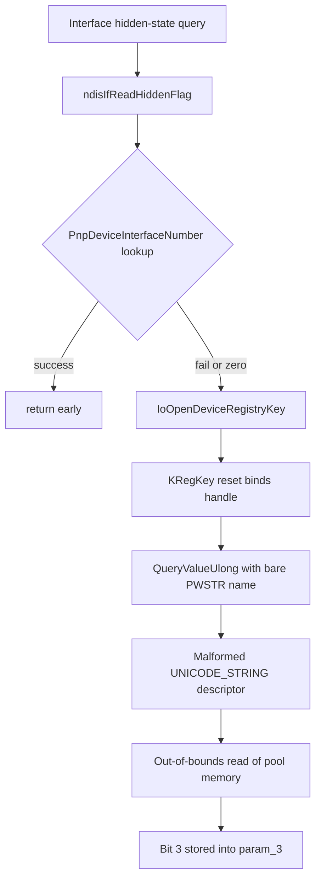

# CVE-2026-69357

**CVE:** CVE-2026-69357  
**Title:** Windows NDIS Elevation of Privilege Vulnerability  
**Source:** [https://msrc.microsoft.com/update-guide/vulnerability/CVE-2026-69357](https://msrc.microsoft.com/update-guide/vulnerability/CVE-2026-69357)  
**Component(s):** ndis.sys  
**Patched Date:** 2026-09-08T07:00:00  
**CWE:** Use after free in Windows NDIS allows an authorized attacker to elevate privileges over a network.  

---

## Related CVEs (Same Component)

This report covers 2 CVEs affecting the same component(s):

- **CVE-2026-69357**  
- CVE-2026-69396  

### Detailed Information

#### CVE-2026-69396

**Title:** Windows NDIS Elevation of Privilege Vulnerability  
**Source:** [https://msrc.microsoft.com/update-guide/vulnerability/CVE-2026-69396](https://msrc.microsoft.com/update-guide/vulnerability/CVE-2026-69396)  
**Patched Date:** 2026-09-08T07:00:00  
**CWE:** Use after free in Windows NDIS allows an authorized attacker to elevate privileges over a network.  

---

Download Patched & Vulnerable Components:

```bash
# ndis.sys
wget https://msdl.microsoft.com/download/symbols/ndis.sys/43103B391BE000/ndis.sys -O ndis.sys.10.0.26100.8972 # vulnerable
wget https://msdl.microsoft.com/download/symbols/ndis.sys/21D1FBEC1CA000/ndis.sys -O ndis.sys.10.0.26100.9278 # patched
```

## Version Tracking Analysis

**Command:**

```
python ghidra_scripts\ghidra_vt_wrapper.py --old-binary ./reports/2026-Sep/CVE-2026-69357/ndis.sys.10.0.26100.8972 --new-binary ./reports/2026-Sep/CVE-2026-69357/ndis.sys.10.0.26100.9278 --project-dir ./reports/2026-Sep/CVE-2026-69357/ghidra_project --project-name ndis.sys_CVE-2026-69357 --ghidra-dir C:\Tools\ghidra_11.4.2_PUBLIC_20250826\ghidra_11.4.2_PUBLIC --output-dir ./reports/2026-Sep/CVE-2026-69357/ghidra_project/vt_results --max-memory 16g
```

Patched Functions: 295 | New Functions: 218 | Removed Functions: 84 | Total Matches: 25579 | Accepted Matches: 21985

### Patched Functions

*Showing top 10 of 295 patched functions*

| Function Name | Source Address | Dest Address | Similarity | Confidence |
| --- | --- | --- | --- | --- |
| `ndisIfQueryMiniportObject` | `140150540` | `14015e010` | 0.986 | 10.0 |
| `BindRules::UnbindOnAttach` | `140157990` | `140165340` | 0.984 | 10.0 |
| `BindRules::UnbindMiniportStack` | `1401583e0` | `140165d80` | 0.984 | 10.0 |
| `ndisOidPreMiniportStats` | `140048630` | `1400555d0` | 0.984 | 10.0 |
| `BindRules::CheckMissingMandatoryFilter` | `140156810` | `140164650` | 0.981 | 10.0 |
| `ndisMInitializeScatterGatherDmaInternal` | `1400daffc` | `1400e2c04` | 0.980 | 10.0 |
| `ndisIfQueryLoopbackObject` | `140159890` | `140168aa0` | 0.979 | 10.0 |
| `BindRules::PauseMiniportStack` | `140156360` | `1401641a0` | 0.976 | 10.0 |
| `ndisInvokeNextReceiveHandler` | `14001b820` | `140029810` | 0.975 | 10.0 |
| `ndisAttachFilterInner` | `1401788c0` | `14018cef0` | 0.973 | 10.0 |

### New Functions

*Showing 10 of 218 new functions*

| Function Name | Address |
| --- | --- |
| `Write<_tlgWrapperByRef<16>,_tlgWrapperByVal<8>,_tlgWrapperByVal<8>,_tlgWrapperByVal<4>,_tlgWrapperByVal<1>,_tlgWrapperByVal<1>,_tlgWrapperByVal<4>,_tlgWrapperByVal<4>,_tlgWrapperByVal<4>,_tlgWrapperByVal<4>,_tlgWrapperByVal<4>,_tlgWrapperByVal<4>,_tlgWrapperByVal<4>,_tlgWrapperByVal<1>_>` | `14000220c` |
| `Write<_tlgWrapperByVal<4>,_tlgWrapperByVal<4>,_tlgWrapperByVal<4>,_tlgWrapperByVal<4>,_tlgWrapperByVal<4>,_tlgWrapperByVal<4>,_tlgWrapperByVal<4>,_tlgWrapperByVal<4>,_tlgWrapperByVal<4>,_tlgWrapperByVal<4>,_tlgWrapperByVal<4>,_tlgWrapperByVal<4>_>` | `140002968` |
| `ndisNblTrackerCanNblBeTracked` | `140009f90` |
| `WPP_RECORDER_SF_LqL` | `140010240` |
| `ndisMInvokeDirectOidRequest` | `140010690` |
| `~NdisStatisticalStopwatch` | `140011be0` |
| `ndisInitializeAdapter` | `14001b530` |
| `ndisCloseULongRef` | `14001bab0` |
| `ndisMLoopbackNetBufferLists` | `14001e390` |
| `FUN_140022540` | `140022540` |

### Removed Functions

*Showing 10 of 84 removed functions*

| Function Name | Address |
| --- | --- |
| `FUN_14000ea2b` | `14000ea2b` |
| `caseD_170002` | `14000ee52` |
| `FUN_14000f35d` | `14000f35d` |
| `FUN_14000f3af` | `14000f3af` |
| `FUN_14000f3dd` | `14000f3dd` |
| `FUN_1400197cb` | `1400197cb` |
| `ndisFreeToLookasideList` | `14001a8a0` |
| `FUN_14001b587` | `14001b587` |
| `ndisAllocateFromLookasideList` | `140025460` |
| `ndisIterativeDPInvokeHandlerOnTracker<2,void___cdecl(void*___ptr64,_NET_BUFFER_LIST*___ptr64,unsigned_long,unsigned_long,unsigned_long)>` | `140026f00` |

---

# AI Technical Analysis

## Vulnerability Identification

**Core Vulnerable Function(s):**

- `ndisIfReadHiddenFlag()` - The pre-patch code passes a bare
  wide-character string pointer where the kernel registry query
  routine consumes a counted `_UNICODE_STRING` descriptor, and it
  supplies no bounded length. This mismatched, unbounded value-name
  descriptor is the actual memory-safety flaw.

**Supporting Changes:**

- `ndisReturnPacketToMiniport()` - Pure refactor. The open-coded
  `KeAcquireSpinLockAtDpcLevel` plus `MiniportThread` store is
  folded into the `NDIS_ACQUIRE_MINIPORT_SPIN_LOCK_DPC()` macro.
  No behavioral change.
- `ndisMResetMiniportInternal()` - Refactor. Spin-lock acquire and
  release are moved to macros, the busy-wait timer is replaced by
  `NdisMSleep()`, and the direct hook-table indirect call is
  replaced by `NdisMIndicateStatusEx()`. The status buffer is still
  fully initialized in both versions.
- `ndisOidNeedArmWatchDog()` - Logic change that routes OID
  `0xfd010109` through `FUN_1400ef630()`. It adds a branch, not a
  memory defect.
- `ndisNblTrackerCanNblBeTracked()` - New validation helper that
  rejects a null or wrong-typed `SourceHandle`. Defensive check.
- `ndisMInvokeDirectOidRequest()` - New OID clone-and-dispatch
  wrapper. Not vulnerable in isolation.

**Unrelated Changes:**

- `_tlgWriteTemplate<...>::Write<...>()` (both template
  instantiations) - Auto-generated TraceLogging marshalling stubs.
- `WPP_RECORDER_SF_LqL()` - WPP trace-emit helper. Diagnostics
  only, not security-relevant.

---

## Root Cause Analysis

The defect is a counted-string descriptor mismatch. The vulnerable
`ndisIfReadHiddenFlag()` reads the `Characteristics` registry value
under a device interface key, but it hands the value-name argument
to `KRegKey::QueryValueUlong()` as a raw `PWSTR` rather than as a
properly sized `_UNICODE_STRING`. The invariant that a counted
kernel string must carry a validated `Length` and `MaximumLength`
in bytes is violated, so the query routine derives its copy bounds
from uninitialized or misinterpreted descriptor fields.

Vulnerable code (before):

```c
local_28 = (KRegKey)0x0;
wil::details::...::reset(
    (unique_storage<...> *)&local_28, local_20);
local_res20[0] = 0;
lVar1 = KRegKey::QueryValueUlong(&local_28,
                                 L"Characteristics",
                                 local_res20);
if (lVar1 != -0x3fffffcc) {
    if (lVar1 == 0) {
        *param_3 = (bool)((byte)(local_res20[0] >> 3) & 1);
        ...
```

Walking the block: `local_28` is the `KRegKey` wrapper bound to the
handle from `IoOpenDeviceRegistryKey()`. The second argument,
`L"Characteristics"`, is a pointer to a wide literal, not a
`_UNICODE_STRING`. When `QueryValueUlong()` treats that argument as
a counted string, the first two 16-bit code units of the literal
are reinterpreted as `Length` and `MaximumLength`, and the field at
offset `0x8` is reinterpreted as `Buffer`. The resulting `Length`
is not the true name length, and no ceiling constrains it, so any
internal copy keyed on that `Length` runs past the intended name
storage. The routine then writes the retrieved DWORD into
`local_res20[0]`, and bit 3 of that value is stored through
`*param_3` as the hidden flag. Because the descriptor is malformed
before the query even executes, the result value and the copy
bounds are both untrustworthy. The fix confirms the descriptor was
the problem: the patched code stops passing a bare pointer and
instead assembles a bounded `_UNICODE_STRING`. This is a classic
`PWSTR`-versus-`PUNICODE_STRING` confusion in a kernel path,
yielding an out-of-bounds read against pool memory adjacent to the
name storage.

---

## Execution and Trigger Flow

The path begins when a caller requests the hidden-interface state
for an NDIS interface, which reaches `ndisIfReadHiddenFlag()` with a
property key and a device object in `param_2`. The function first
tries `NETSETUPPKEY_Interface_PnpDeviceInterfaceNumber`; only when
that lookup fails or returns zero does it fall into the registry
branch that contains the flaw. It calls
`IoOpenDeviceRegistryKey(param_2, 2, 0x80000000, &local_30)` to open
the hardware key, then binds the handle into the `KRegKey` wrapper
`local_28` through the WIL `reset()` shim. Next it zeroes
`local_res20[0]` and invokes `KRegKey::QueryValueUlong()` to read
the `Characteristics` DWORD. In the vulnerable build the value-name
argument is the raw literal `L"Characteristics"`, so the query
routine reads its `Length`, `MaximumLength`, and `Buffer` from the
wrong bytes and performs an unbounded name copy, dereferencing a
descriptor-derived pointer and reading past the valid name buffer.
An attacker who can influence the device interface key contents, or
who can arrange the surrounding pool layout, turns this into a
controlled out-of-bounds read whose retrieved value flows into
`*param_3`. The result then propagates back to the interface query
consumer as the hidden-flag bit `(local_res20[0] >> 3) & 1`.



---

## Patch Analysis

The patch stops passing a raw pointer and constructs a fully
specified `_UNICODE_STRING` before the query.

```diff
-      lVar1 = KRegKey::QueryValueUlong(&local_28,L"Characteristics",local_res20);
-      if (lVar1 != -0x3fffffcc) {
-        if (lVar1 == 0) {
+      local_28.Length = 0;
+      local_28.MaximumLength = 0;
+      local_28._4_4_ = 0;
+      local_28.Buffer = (wchar_t *)0x0;
+      lVar3 = 0x7fff;
+      pwVar4 = L"Characteristics";
+      do {
+        if (*pwVar4 == L'\0') break;
+        pwVar4 = pwVar4 + 1;
+        lVar3 = lVar3 + -1;
+      } while (lVar3 != 0);
+      iVar2 = -0x3ffffff3;
+      if (lVar3 != 0) {
+        local_28.Buffer = L"Characteristics";
+        local_28.Length = (0x7fff - (short)lVar3) * 2;
+        local_28.MaximumLength = local_28.Length + 2;
+        local_28._4_4_ = 0;
+        iVar2 = 0;
+      }
+      if (-1 < iVar2) {
+        iVar2 = KRegKey::QueryValueUlong(&local_38,&local_28,local_res20);
+      }
```

The patched routine declares a real `_UNICODE_STRING local_28` and
initializes all of its fields to zero. It then measures the name
with a length-scan loop seeded at `lVar3 = 0x7fff`, decrementing
once per code unit until the terminating `L'\0'`. If the loop
exhausts its budget without finding the terminator, `lVar3` reaches
zero, the status stays `-0x3ffffff3`, and the query is skipped. On
success it sets `Buffer` to the literal, computes
`Length = (0x7fff - lVar3) * 2` in bytes, and sets
`MaximumLength = Length + 2` to account for the terminator. Only
when `iVar2` is non-negative does it call `QueryValueUlong()` with
the properly formed `&local_28` descriptor and the corrected key
wrapper `local_38`.

This is effective. The descriptor now carries a validated byte
`Length` and `MaximumLength` derived from an explicit scan, so the
query routine can no longer misinterpret literal bytes as size
fields, and the `0x7fff` ceiling guarantees the length can never be
attacker-inflated beyond a fixed bound. The gate on `iVar2` ensures
a malformed or over-long name aborts the call rather than reaching
the kernel routine. Handle cleanup is preserved through the
relocated `local_38` checks and `ZwClose()`.

The change closes an out-of-bounds read in a kernel registry path
that could disclose adjacent pool memory or crash the system. It
restores the counted-string contract that NDIS kernel query
routines depend on.