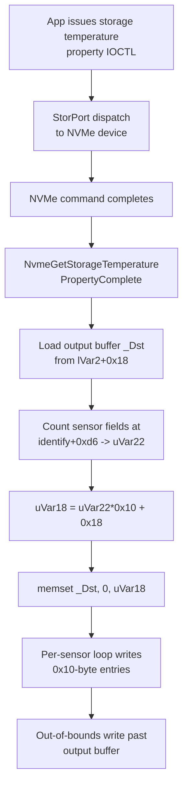

# CVE-2026-69381

**CVE:** CVE-2026-69381  
**Title:** Windows Storage Port Driver Information Disclosure Vulnerability  
**Source:** [https://msrc.microsoft.com/update-guide/vulnerability/CVE-2026-69381](https://msrc.microsoft.com/update-guide/vulnerability/CVE-2026-69381)  
**Component(s):** storport.sys  
**Patched Date:** 2026-09-08T07:00:00  
**CWE:** Out-of-bounds read in Windows Storage Port Driver allows an unauthorized attacker to disclose information with a physical attack.  

Download Patched & Vulnerable Components:

```bash
# storport.sys
wget https://msdl.microsoft.com/download/symbols/storport.sys/91AA396C281000/storport.sys -O storport.sys.10.0.26100.9278 # vulnerable
wget https://msdl.microsoft.com/download/symbols/storport.sys/C6628551281000/storport.sys -O storport.sys.10.0.26100.9444 # patched
```

## Version Tracking Analysis

**Command:**

```
python ghidra_scripts\ghidra_vt_wrapper.py --old-binary ./reports/2026-Sep/CVE-2026-69381/storport.sys.10.0.26100.9278 --new-binary ./reports/2026-Sep/CVE-2026-69381/storport.sys.10.0.26100.9444 --project-dir ./reports/2026-Sep/CVE-2026-69381/ghidra_project --project-name storport.sys_CVE-2026-69381 --ghidra-dir C:\Tools\ghidra_11.4.2_PUBLIC_20250826\ghidra_11.4.2_PUBLIC --output-dir ./reports/2026-Sep/CVE-2026-69381/ghidra_project/vt_results --max-memory 16g
```

Patched Functions: 1 | New Functions: 13 | Removed Functions: 9 | Total Matches: 25817 | Accepted Matches: 23414

### Patched Functions

| Function Name | Source Address | Dest Address | Similarity | Confidence |
| --- | --- | --- | --- | --- |
| `NvmeGetStorageTemperaturePropertyComplete` | `1400e15f0` | `1400e1730` | 0.899 | 10.0 |

### New Functions

*Showing 10 of 13 new functions*

| Function Name | Address |
| --- | --- |
| `Feature_1187221816__private_IsEnabledDeviceUsageNoInline` | `14009362c` |
| `Feature_1187221816__private_IsEnabledFallback` | `140093664` |
| `Feature_3901197625__private_IsEnabledDeviceUsageNoInline` | `1400d0e4c` |
| `Feature_3901197625__private_IsEnabledFallback` | `1400d0e84` |
| `_guard_dispatch_icall` | `140148220` |
| `thunk_FUN_14014b606` | `14014b5fa` |
| `FUN_14015158d` | `14015158d` |
| `FUN_14015165d` | `14015165d` |
| `FUN_1401531ba` | `1401531ba` |
| `FUN_140153fd2` | `140153fd2` |

### Removed Functions

| Function Name | Address |
| --- | --- |
| `_guard_dispatch_icall` | `1401480a0` |
| `thunk_FUN_14014b486` | `14014b47a` |
| `FUN_14015140d` | `14015140d` |
| `FUN_1401514dd` | `1401514dd` |
| `FUN_14015303a` | `14015303a` |
| `FUN_140153e52` | `140153e52` |
| `FUN_140154a52` | `140154a52` |
| `ScsiPortMoveMemory` | `140281000` |
| `ScsiPortNotification` | `140281008` |

---

I'll analyze the diff and produce the report. The single affected function shows an added output-buffer bounds clamp gated behind a feature flag; the three new functions are export forwarders. Below is the report.

---

# AI Technical Analysis

## Vulnerability Identification

**Core Vulnerable Function(s):**

- `NvmeGetStorageTemperaturePropertyComplete()` - Builds a
  temperature descriptor whose entry count is derived from
  device data and written into the caller's output buffer
  without validating that buffer's length, producing an
  out-of-bounds write.

**Supporting Changes:**

- None. The single affected function both contains the flaw
  and receives the fix; there is no separate caller or
  wrapper in the diff.

**Unrelated Changes:**

- `thunk_FUN_14014b606()` - A trampoline thunk emitted by the
  linker; no security logic.
- `ScsiPortMoveMemory()` - Export forwarder to
  `STORPORT.StorPortMoveMemory`; body is a decompiler
  `halt_baddata()` stub.
- `ScsiPortNotification()` - Export forwarder to
  `STORPORT.StorPortNotification`; body is a decompiler stub.

The bulk of the remaining diff is decompiler churn: register
and local renaming (`lVar2` becoming `uVar2`, `uVar18`
becoming `uVar17`) and a re-flattened property-ID switch
ladder. That churn is not security-relevant. The only
behavioral change is the added length clamp before `memset`.

---

## Root Cause Analysis

The function services a `StorageDeviceTemperatureProperty`
query by populating a `STORAGE_TEMPERATURE_DATA_DESCRIPTOR`
in a caller-controlled output buffer. The programming error
is that the number of temperature-sensor entries, and thus
the number of bytes written, is computed purely from
device-side data and a fixed maximum of eight sensors, while
the actual size of the destination buffer is never consulted.
The violated invariant is the fundamental one for any
IOCTL-style completion: never write more bytes than the
requester's declared output length.

```c
_Dst = *(undefined4 **)(lVar2 + 0x18);
sVar21 = 8;
*(undefined4 *)(lVar2 + 0x30) = 0;
lVar11 = *(longlong *)(*param_2 + 0x1040);
psVar7 = (short *)(lVar11 + 0xd6);
do {
  if (*psVar7 != 0) break;
  psVar7 = psVar7 + -1;
  sVar21 = sVar21 + -1;
} while (sVar21 != 0);
uVar22 = sVar21 + 1;
uVar18 = (uint)uVar22 * 0x10 + 0x18;
memset(_Dst,0,(ulonglong)uVar18);
_Dst[1] = uVar18;
*_Dst = 0x28;
*(ushort *)(_Dst + 3) = uVar22;
```

`_Dst` is the output buffer taken from `lVar2 + 0x18`, where
`lVar2` is the request object at `*(*param_2 + 0x1058)`. The
loop scans the eight `short` fields at `lVar11 + 0xd6` from
the identify structure, counting how many trailing entries
are zero, so `sVar21` lands between `0` and `8`. Adding one
gives `uVar22`, the descriptor entry count, in the range
`1` to `9`. The size `uVar18` is then `uVar22 * 0x10 + 0x18`,
so between `0x28` and `0xa8` bytes. This value drives
`memset(_Dst, 0, uVar18)` directly, so if the caller supplied
an output buffer shorter than `uVar18`, the zero-fill already
runs past its end. The subsequent per-sensor loop compounds
the write: it walks `puVar25` in `0x10`-byte strides while
`uVar17 < uVar22`, storing three `ushort` fields per entry
and never rechecking any length. Because `uVar22` comes from
attached device geometry rather than from the request, the
size used for both `memset` and the loop is independent of
the true buffer capacity, and the mismatch is a controller-
influenced out-of-bounds write into a pool allocation.

---

## Execution and Trigger Flow

An application or driver issues a device I/O control request
for the storage temperature property against an NVMe device
serviced by `storport.sys`. StorPort dispatches the query,
issues the NVMe get-log/identify traffic, and on command
completion invokes `NvmeGetStorageTemperaturePropertyComplete`
with the request object reachable through `param_2`. The
function loads the caller's output buffer pointer from
`lVar2 + 0x18` into `_Dst`. It then reads the eight
temperature-sensor `short` fields at offset `0xd6` of the
identify data at `*param_2 + 0x1040` and counts the populated
trailing entries, yielding `uVar22` between `1` and `9`. From
that count it computes `uVar18 = uVar22 * 0x10 + 0x18` and
calls `memset(_Dst, 0, uVar18)`. If the caller's output
buffer is smaller than `uVar18`, this zero-fill immediately
writes beyond the allocation. Control then enters the sensor
loop, which writes descriptor entries in `0x10`-byte steps up
to `uVar22`, extending the overwrite with attacker-adjacent
temperature values and the constant `0x8000`. Because the
number of populated sensor fields is controlled by the
attached device or an emulated/malicious controller, the
overflow length is influenceable rather than fixed. The
result is pool corruption in kernel context, usable for
denial of service and potentially privilege escalation.



---

## Patch Analysis

The fix inserts a bounds clamp between computing the entry
count and computing the byte size, so the write can never
exceed the caller's buffer.

```diff
                   uVar33 = sVar32 + 1;
+                  iVar9 = Feature_3901197625__private_IsEnabledDeviceUsageNoInline();
+                  if ((iVar9 != 0) &&
+                     (uVar16 = (ushort)(*(int *)(*(longlong *)(uVar2 + 0xb8) + 8) - 0x18U >> 4),
+                     uVar16 < uVar33)) {
+                    uVar33 = uVar16;
+                  }
                   uVar17 = (uint)uVar33 * 0x10 + 0x18;
                   memset(_Dst,0,(ulonglong)uVar17);
```

The patch first reads the request's I/O stack location
through `uVar2 + 0xb8`, then reads the 32-bit output length
field at offset `8` within it. It subtracts the `0x18`-byte
descriptor header and divides the remainder by `0x10`, the
size of one temperature entry, using the shift `>> 4`. That
yields `uVar16`, the maximum number of entries the caller's
buffer can actually hold. If `uVar16` is smaller than the
device-derived count `uVar33`, the code lowers `uVar33` to
`uVar16`, so the subsequent `uVar17 = uVar33 * 0x10 + 0x18`
can never exceed the declared output length. Both the
`memset` and the sensor-writing loop consume this clamped
count, closing the overflow at its source. The clamp is
guarded by `Feature_3901197625__private_IsEnabledDeviceUsageNoInline`,
a runtime feature switch, so the safe path activates only
when that feature is enabled.

The clamp is effective for the write it guards: deriving the
capacity from the same length the I/O manager validated at
dispatch and rounding down to whole entries makes the
`memset` and loop provably in-bounds. The use of the header
constant `0x18` and the entry-size shift matches the
descriptor layout exactly, so no off-by-one remains at the
boundary. The one caveat is the feature gate: on builds where
the feature evaluates to zero, the original unbounded size is
still used, so the mitigation depends on that flag being
enabled in shipping configurations. Aside from that gating,
the arithmetic itself is sound and leaves no residual write
past the buffer.

Security impact: the flaw was a kernel-mode out-of-bounds
pool write in `storport.sys` reachable through a standard
storage property query, giving denial of service and a
plausible path to elevation of privilege. The patch removes
the primitive by bounding every write to the caller's
validated output length.