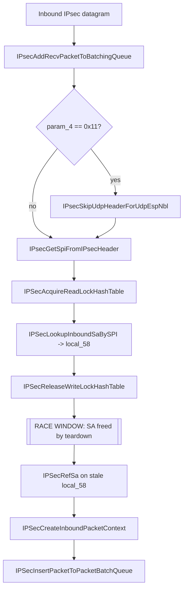

# CVE-2026-69385

**CVE:** CVE-2026-69385  
**Title:** Windows TCP/IP Elevation of Privilege Vulnerability  
**Source:** [https://msrc.microsoft.com/update-guide/vulnerability/CVE-2026-69385](https://msrc.microsoft.com/update-guide/vulnerability/CVE-2026-69385)  
**Component(s):** tcpip.sys  
**Patched Date:** 2026-09-08T07:00:00  
**CWE:** Concurrent execution using shared resource with improper synchronization ('race condition') in Windows TCP/IP allows an authorized attacker to elevate privileges locally.  

---

## Related CVEs (Same Component)

This report covers 6 CVEs affecting the same component(s):

- **CVE-2026-69385**  
- CVE-2026-69404  
- CVE-2026-69588  
- CVE-2026-69757  
- CVE-2026-69761  
- CVE-2026-69793  

### Detailed Information

#### CVE-2026-69404

**Title:** Windows TCP/IP Elevation of Privilege Vulnerability  
**Source:** [https://msrc.microsoft.com/update-guide/vulnerability/CVE-2026-69404](https://msrc.microsoft.com/update-guide/vulnerability/CVE-2026-69404)  
**Patched Date:** 2026-09-08T07:00:00  
**CWE:** Concurrent execution using shared resource with improper synchronization ('race condition') in Windows TCP/IP allows an authorized attacker to elevate privileges locally.  

#### CVE-2026-69588

**Title:** Windows TCP/IP Denial of Service Vulnerability  
**Source:** [https://msrc.microsoft.com/update-guide/vulnerability/CVE-2026-69588](https://msrc.microsoft.com/update-guide/vulnerability/CVE-2026-69588)  
**Patched Date:** 2026-09-08T07:00:00  
**CWE:** Missing release of memory after effective lifetime in Windows TCP/IP allows an unauthorized attacker to deny service over a network.  

#### CVE-2026-69757

**Title:** Windows TCP/IP Elevation of Privilege Vulnerability  
**Source:** [https://msrc.microsoft.com/update-guide/vulnerability/CVE-2026-69757](https://msrc.microsoft.com/update-guide/vulnerability/CVE-2026-69757)  
**Patched Date:** 2026-09-08T07:00:00  
**CWE:** Use after free in Windows TCP/IP allows an authorized attacker to elevate privileges over a network.  

#### CVE-2026-69761

**Title:** Windows TCP/IP Elevation of Privilege Vulnerability  
**Source:** [https://msrc.microsoft.com/update-guide/vulnerability/CVE-2026-69761](https://msrc.microsoft.com/update-guide/vulnerability/CVE-2026-69761)  
**Patched Date:** 2026-09-08T07:00:00  
**CWE:** Use after free in Windows TCP/IP allows an authorized attacker to elevate privileges over a network.  

#### CVE-2026-69793

**Title:** Windows TCP/IP Security Feature Bypass Vulnerability  
**Source:** [https://msrc.microsoft.com/update-guide/vulnerability/CVE-2026-69793](https://msrc.microsoft.com/update-guide/vulnerability/CVE-2026-69793)  
**Patched Date:** 2026-09-08T07:00:00  
**CWE:** Improper validation of consistency within input in Windows TCP/IP allows an unauthorized attacker to bypass a security feature over a network.  

---

Download Patched & Vulnerable Components:

```bash
# tcpip.sys
wget https://msdl.microsoft.com/download/symbols/tcpip.sys/27D9F4AC359000/tcpip.sys -O tcpip.sys.10.0.26100.9278 # vulnerable
wget https://msdl.microsoft.com/download/symbols/tcpip.sys/7636B763359000/tcpip.sys -O tcpip.sys.10.0.26100.9444 # patched
```

## Version Tracking Analysis

**Command:**

```
python ghidra_scripts\ghidra_vt_wrapper.py --old-binary ./reports/2026-Sep/CVE-2026-69385/tcpip.sys.10.0.26100.9278 --new-binary ./reports/2026-Sep/CVE-2026-69385/tcpip.sys.10.0.26100.9444 --project-dir ./reports/2026-Sep/CVE-2026-69385/ghidra_project --project-name tcpip.sys_CVE-2026-69385 --ghidra-dir C:\Tools\ghidra_11.4.2_PUBLIC_20250826\ghidra_11.4.2_PUBLIC --output-dir ./reports/2026-Sep/CVE-2026-69385/ghidra_project/vt_results --max-memory 16g
```

Patched Functions: 1 | New Functions: 55 | Removed Functions: 45 | Total Matches: 51025 | Accepted Matches: 43442

### Patched Functions

| Function Name | Source Address | Dest Address | Similarity | Confidence |
| --- | --- | --- | --- | --- |
| `IPsecAddRecvPacketToBatchingQueue` | `140063d3c` | `140063e0c` | 0.729 | 10.0 |

### New Functions

*Showing 10 of 55 new functions*

| Function Name | Address |
| --- | --- |
| `FUN_14006924f` | `14006924f` |
| `FUN_14007f9f9` | `14007f9f9` |
| `FUN_1400b97e2` | `1400b97e2` |
| `FUN_1400c997a` | `1400c997a` |
| `caseD_24` | `1400ee3a8` |
| `Feature_1748208955__private_IsEnabledDeviceUsageNoInline` | `140157480` |
| `Feature_1748208955__private_IsEnabledFallback` | `1401574b8` |
| `Feature_2037617979__private_IsEnabledDeviceUsageNoInline` | `14015fcac` |
| `Feature_2037617979__private_IsEnabledFallback` | `14015fce4` |
| `Feature_4117992762__private_IsEnabledDeviceUsageNoInline` | `140168380` |

### Removed Functions

*Showing 10 of 45 removed functions*

| Function Name | Address |
| --- | --- |
| `FUN_14006910f` | `14006910f` |
| `FUN_14007f8b9` | `14007f8b9` |
| `FUN_1400b9742` | `1400b9742` |
| `FUN_1400c98da` | `1400c98da` |
| `caseD_24` | `1400ee308` |
| `_guard_dispatch_icall` | `1401b5430` |
| `FUN_1401bcaf5` | `1401bcaf5` |
| `FUN_1401bcb00` | `1401bcb00` |
| `FUN_1401bcb27` | `1401bcb27` |
| `FUN_1401bcdb8` | `1401bcdb8` |

---

# AI Technical Analysis

## Vulnerability Identification

**Core Vulnerable Function(s):**

- `IPsecAddRecvPacketToBatchingQueue()` - The inbound
  Security Association (SA) is looked up under the hash table
  lock, but the lock is released before the reference count is
  taken on the SA object, creating a lookup-to-reference race
  that leads to a use-after-free.

**Supporting Changes:**

- `IPSecLookupInboundSaBySPI()` - Returns the `local_58` SA
  pointer while the caller holds the read lock. It is not
  modified, but it establishes the protected region the bug
  escapes.
- `IPSecRefSa()` / `IPSecReleaseReadLockHashTable()` - The
  patch reorders these calls relative to each other. They are
  the mechanism of the fix, not the flaw.
- `Feature_532385081__private_*` - A new Velocity feature gate
  introduced to stage the corrected ordering. It selects
  between "reference-before-release" (fixed) and
  "reference-after-release" (legacy) behavior.

**Unrelated Changes:**

- `caseD_24()` - A jump-table stub returning a constant `1`.
  It is a switch-case artifact with no security relevance.
- `WfpAleFreeCredentialInformation()` - Frees ALE credential
  buffers via `WfpPoolFree()` and a lookaside list. It
  operates on credential structures, not IPsec SAs, and is
  unrelated to this CVE.
- `WfpReportSysErrorAsNtStatus()` -> `WfpReportAppErrorAsNtStatus()`
  - A logging helper rename with no behavioral impact.

---

## Root Cause Analysis

The vulnerability is a classic time-of-check-to-time-of-use
race on a reference-counted kernel object. The function
violates the invariant that a shared object must be
referenced while the lock protecting its lifetime is still
held. Because the reference is acquired after the lock is
dropped, a concurrent thread can free the SA in the window
between release and reference.

Vulnerable (BEFORE) code:

```c
IPSecAcquireReadLockHashTable(&local_res20);
uVar7 = IPSecLookupInboundSaBySPI(local_60 & 0xffffffff,
                                  &local_58);
if (uVar7 == 0) {
  uVar15 = IPSecReleaseWriteLockHashTable(&local_res20);
  IPSecRefSa(uVar15,local_58);
  if ((Feature_30656824__private_featureState & 0x10) == 0) {
    uVar5 = Feature_30656824__private_IsEnabledDeviceUsageNoInline();
  }
  else {
    uVar5 = Feature_30656824__private_featureState & 1;
  }
  bVar14 = uVar5 != 0;
  ...
```

The code acquires a read lock with
`IPSecAcquireReadLockHashTable`, then resolves an inbound SA
by SPI through `IPSecLookupInboundSaBySPI`, storing the SA
pointer in `local_58`. On success (`uVar7 == 0`), the very
next statement calls `IPSecReleaseWriteLockHashTable`, which
drops the lock that guaranteed `local_58` remained valid.
Only after the lock is released does `IPSecRefSa(uVar15,
local_58)` attempt to increment the SA reference count. The
`local_58` pointer is therefore dereferenced and mutated
outside any synchronization. A second processor executing an
SA teardown path can locate the same SA, observe its current
refcount, and free the backing memory during this gap. Note
also the lock-type mismatch: a read lock is taken but a write
lock release is invoked, indicating the locking discipline
was already incoherent. The subsequent
`IPSecCreateInboundPacketContext` and `IpSecSetSecurityContext`
calls store and operate on `local_58`, so a freed SA
propagates deep into packet-context setup and batch-queue
insertion, turning the stale reference into exploitable
corruption.

---

## Execution and Trigger Flow

An attacker triggers the path by sending a crafted inbound
IPsec datagram, either native ESP/AH or UDP-encapsulated ESP
(`param_4 == 0x11`), whose SPI matches an SA currently in the
inbound hash table. The receive path invokes
`IPsecAddRecvPacketToBatchingQueue` with the network buffer.
The function optionally skips the UDP header, extracts the
SPI via `IPsecGetSpiFromIPsecHeader` into `local_60`, and
acquires the read lock. `IPSecLookupInboundSaBySPI` returns
the matching SA in `local_58`. The vulnerable build then
releases the lock immediately. To win the race, a second
context must delete or expire that SA, dropping its final
reference and freeing it, precisely between the release and
the `IPSecRefSa` call. This is reachable by concurrently
tearing down the SA, for example through rekey, policy
change, or SA expiry, while flooding matching packets to
widen the window. If the free lands in the gap, `IPSecRefSa`
increments a counter inside freed pool memory, and the
stale `local_58` is later passed to
`IPSecCreateInboundPacketContext`, stored at
`*(local_50 + 8)`, and handed to
`IPSecInsertPacketToPacketBatchQueue`. The result is a
kernel-mode use-after-free with attacker-influenced timing,
enabling denial of service and potential elevation of
privilege.



---

## Patch Analysis

The patch reorders reference acquisition to occur before the
lock is released, gated by a new feature flag.

Patched (AFTER) code:

```diff
-      uVar15 = IPSecReleaseWriteLockHashTable(&local_res20);
-      IPSecRefSa(uVar15,local_58);
-      if ((Feature_30656824__private_featureState & 0x10) == 0) {
-        uVar5 = Feature_30656824__private_IsEnabledDeviceUsageNoInline();
-      }
-      else {
-        uVar5 = Feature_30656824__private_featureState & 1;
-      }
-      bVar14 = uVar5 != 0;
+      if ((Feature_532385081__private_featureState & 0x10) == 0) {
+        uVar3 = Feature_532385081__private_IsEnabledDeviceUsageNoInline();
+        uVar14 = extraout_XMM0_Da_00;
+      }
+      else {
+        uVar3 = Feature_532385081__private_featureState & 1;
+        uVar14 = extraout_XMM0_Da;
+      }
+      if (uVar3 != 0) {
+        IPSecRefSa(uVar14,local_58);
+        ...
+        if (uVar3 != 0) { cVar11 = '\x01'; }
+      }
+      uVar14 = IPSecReleaseReadLockHashTable(&local_res20);
```

The corrected code first evaluates the new
`Feature_532385081` gate. When the feature is enabled
(`uVar3 != 0`), `IPSecRefSa(uVar14, local_58)` runs while the
hash table read lock is still held, and only afterward does
`IPSecReleaseReadLockHashTable` drop it. The lock release is
also corrected from the write variant to the matching read
variant, restoring a coherent read-lock discipline. A
sentinel `cVar11` records that the SA was successfully
referenced, and this value flows into `cVar12`, which the
cleanup epilogue consults before calling `IPSecDeRefSa`. The
disabled branch retains the legacy reference-after-release
ordering, letting Microsoft stage the fix without a hard
behavior change. The failed-lookup else branch now calls
`IPSecReleaseReadLockHashTable` and clears `bVar13`,
tightening the error path as well.

The fix is effective because the SA reference count is
incremented atomically with respect to teardown while the
lock is held, closing the race window entirely when the flag
is on. A concurrent free can no longer occur, since deletion
paths must also acquire the same lock and will observe the
elevated refcount. The paired reference and dereference
sentinels prevent both leaks and premature releases. The one
caveat is that protection depends on `Feature_532385081`
being enabled in the deployed configuration; the legacy path
remains present and vulnerable when the flag is off.

The security impact is a remotely reachable kernel
use-after-free in the IPsec inbound receive path. Successful
exploitation permits denial of service and potential
elevation of privilege in kernel mode. Correct
lock-ordered referencing eliminates the primitive.