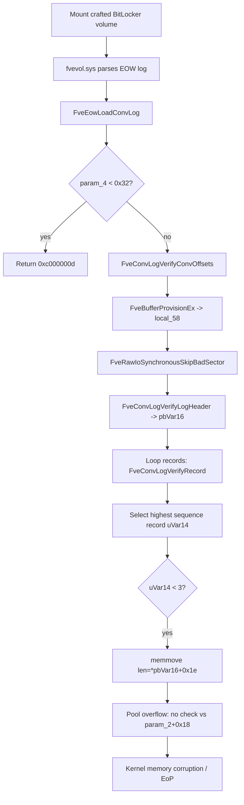

# CVE-2026-69449

**CVE:** CVE-2026-69449  
**Title:** Windows BitLocker Remote Code Execution Vulnerability  
**Source:** [https://msrc.microsoft.com/update-guide/vulnerability/CVE-2026-69449](https://msrc.microsoft.com/update-guide/vulnerability/CVE-2026-69449)  
**Component(s):** fvevol.sys  
**Patched Date:** 2026-09-08T07:00:00  
**CWE:** Heap-based buffer overflow in Windows BitLocker allows an authorized attacker to execute code locally.  

---

## Related CVEs (Same Component)

This report covers 2 CVEs affecting the same component(s):

- **CVE-2026-69449**  
- CVE-2026-69458  

### Detailed Information

#### CVE-2026-69458

**Title:** Windows BitLocker Elevation of Privilege Vulnerability  
**Source:** [https://msrc.microsoft.com/update-guide/vulnerability/CVE-2026-69458](https://msrc.microsoft.com/update-guide/vulnerability/CVE-2026-69458)  
**Patched Date:** 2026-09-08T07:00:00  
**CWE:** Out-of-bounds read in Windows BitLocker allows an authorized attacker to elevate privileges over a network.  

---

Download Patched & Vulnerable Components:

```bash
# fvevol.sys
wget https://msdl.microsoft.com/download/symbols/fvevol.sys/6F0A494CF1000/fvevol.sys -O fvevol.sys.10.0.26100.9278 # vulnerable
wget https://msdl.microsoft.com/download/symbols/fvevol.sys/9A24DF20F1000/fvevol.sys -O fvevol.sys.10.0.26100.9444 # patched
```

## Version Tracking Analysis

**Command:**

```
python ghidra_scripts\ghidra_vt_wrapper.py --old-binary ./reports/2026-Sep/CVE-2026-69449/fvevol.sys.10.0.26100.9278 --new-binary ./reports/2026-Sep/CVE-2026-69449/fvevol.sys.10.0.26100.9444 --project-dir ./reports/2026-Sep/CVE-2026-69449/ghidra_project --project-name fvevol.sys_CVE-2026-69449 --ghidra-dir C:\Tools\ghidra_11.4.2_PUBLIC_20250826\ghidra_11.4.2_PUBLIC --output-dir ./reports/2026-Sep/CVE-2026-69449/ghidra_project/vt_results --max-memory 16g
```

Patched Functions: 2 | New Functions: 3 | Removed Functions: 1 | Total Matches: 12824 | Accepted Matches: 12516

### Patched Functions

| Function Name | Source Address | Dest Address | Similarity | Confidence |
| --- | --- | --- | --- | --- |
| `FveConvLogVerifyLogHeader` | `140014a34` | `140014a88` | 0.900 | 10.0 |
| `FveEowLoadConvLog` | `14006901c` | `14006901c` | 0.819 | 10.0 |

### New Functions

| Function Name | Address |
| --- | --- |
| `Feature_3467875643__private_IsEnabledDeviceUsageNoInline` | `140010610` |
| `Feature_3467875643__private_IsEnabledFallback` | `140010648` |
| `_guard_dispatch_icall` | `14001bd70` |

### Removed Functions

| Function Name | Address |
| --- | --- |
| `_guard_dispatch_icall` | `14001bcf0` |

---

# AI Technical Analysis

## Vulnerability Identification

**Core Vulnerable Function(s):**

- `FveEowLoadConvLog()` - Performs an unchecked `memmove` into a
  caller-supplied output buffer using a copy length taken directly
  from attacker-controlled conversion-log header data at offset
  `0x1e`, without validating that length against the destination
  buffer capacity stored at `param_2 + 0x18`. This is the site of
  the actual memory corruption.

**Supporting Changes:**

- `FveConvLogVerifyLogHeader()` - Header validation helper. The
  patch corrects an error-propagation defect where a failed
  maximum-record-size computation returned `STATUS_SUCCESS`
  instead of the error code. This is defense-in-depth that
  tightens upstream validation but is not itself the overflow.

**Unrelated Changes:**

- WPP tracing edits in `FveEowLoadConvLog()` (GUID renames,
  `WPP_SF_*` format-specifier changes such as `WPP_SF_qiD` to
  `WPP_SF_iid`, and message-id renumbering `0x3b` to `0x3c`) are
  logging refactors with no security effect.
- Decompiler variable renames (`uVar15` to `uVar13`, `pbVar16` to
  `pbVar11`, label renumbering) are cosmetic and reflect register
  reallocation, not behavioral change.

---

## Root Cause Analysis

The vulnerability is a kernel pool buffer overflow caused by
trusting an attacker-controlled length field when copying data
into a fixed-capacity output buffer. The code violated the
invariant that a copy size must never exceed the destination
buffer size. The size field lives in the BitLocker conversion-log
header, which is read from on-disk volume metadata, so it is
fully attacker-influenced.

Vulnerable code (`FveEowLoadConvLog`, before):

```c
*(bool *)(param_2 + 0x30) = uVar13 != 0;
*(ulonglong *)(param_2 + 0x28) = uVar15;
memmove(*(void **)(param_2 + 0x10),pbVar3 + local_68[uVar14],
        (ulonglong)*(uint *)(pbVar16 + 0x1e));
*(undefined8 *)(param_2 + 0x58) = local_60;
goto LAB_1400693e6;
```

The destination pointer is `*(void **)(param_2 + 0x10)` and its
associated capacity is `*(uint *)(param_2 + 0x18)`, but that
capacity field is never read anywhere in the pre-patch copy path.
The copy length is `*(uint *)(pbVar16 + 0x1e)`, a 32-bit value
drawn from the verified log header at `pbVar16`. `pbVar16` points
either at the primary log at `local_58` or at a secondary copy at
`local_58 + (param_4 - *(uint *)(param_1 + 0x49c))`. The source
offset `local_68[uVar14]` selects the winning record chosen in the
preceding loop by highest sequence number at `pbVar10 + 4`. The
loop iterates `*(uint *)(pbVar16 + 0x26)` records, and the only
guard on the length field before the copy is inside
`FveConvLogVerifyLogHeader()`, which compares offset `0x1e`
against `local_res8[0]` (the computed maximum record size derived
from the header itself). Because that bound is header-relative
rather than buffer-relative, a header whose `0x1e` value is
self-consistent yet larger than the caller's output buffer passes
verification. The `memmove` then writes past the end of the
destination allocation, corrupting adjacent kernel pool memory.

---

## Execution and Trigger Flow

The attacker supplies a crafted BitLocker volume, for example via
a malicious VHD, removable device, or manipulated on-disk
metadata. When the volume is mounted, `fvevol.sys` parses the
Encrypt-On-Write conversion log and reaches `FveEowLoadConvLog()`.
The function first rejects buffers smaller than `0x32`, then calls
`FveConvLogVerifyConvOffsets()` and provisions a read buffer with
`FveBufferProvisionEx()` into `local_58`. Raw sectors are read via
`FveRawIoSynchronousSkipBadSector()` into that buffer. The header
is validated by `FveConvLogVerifyLogHeader()`; on success
`pbVar16` points at the accepted header. The code copies the log
descriptor fields into the output structure at `param_2 + 0x20`
and iterates the record table, calling `FveConvLogVerifyRecord()`
for each of `*(uint *)(pbVar16 + 0x26)` records. It selects the
record with the greatest 8-byte sequence number and, if the
winning index `uVar14` is below `3`, performs the final copy of
`*(uint *)(pbVar16 + 0x1e)` bytes into `*(void **)(param_2 +
0x10)`. Since no comparison against `*(uint *)(param_2 + 0x18)`
occurs, an oversized `0x1e` value drives the overflow, yielding
kernel pool corruption and potential local privilege escalation.



---

## Patch Analysis

Patched code (`FveEowLoadConvLog`, after):

```diff
-        *(bool *)(param_2 + 0x30) = uVar13 != 0;
-        *(ulonglong *)(param_2 + 0x28) = uVar15;
-        memmove(*(void **)(param_2 + 0x10),pbVar3 + local_68[uVar14],
-                (ulonglong)*(uint *)(pbVar16 + 0x1e));
-        *(undefined8 *)(param_2 + 0x58) = local_60;
-        goto LAB_1400693e6;
+        *(ulonglong *)(param_2 + 0x28) = uVar13;
+        *(bool *)(param_2 + 0x30) = uVar15 != 0;
+        uVar6 = Feature_3467875643__private_IsEnabledDeviceUsageNoInline();
+        if (((int)uVar6 == 0) ||
+           (*(uint *)(pbVar11 + 0x1e) <= *(uint *)(param_2 + 0x18))) {
+          memcpy(*(void **)(param_2 + 0x10),local_58 + local_60[uVar15],
+                 (ulonglong)*(uint *)(pbVar11 + 0x1e));
+          *(undefined8 *)(param_2 + 0x58) = local_68;
+          goto LAB_14006945f;
+        }
+        goto LAB_14006945a;
```

The patch introduces an explicit destination-capacity check
immediately before the copy. It compares the header length
`*(uint *)(pbVar11 + 0x1e)` against the output buffer size
`*(uint *)(param_2 + 0x18)`, the field the vulnerable code
ignored. The copy proceeds only when the length fits, or when the
`Feature_3467875643__private_IsEnabledDeviceUsageNoInline()`
feature flag is disabled, preserving legacy behavior behind a
kill switch. When the length exceeds capacity, control jumps to
`LAB_14006945a`, which sets `uVar4` to `0xc0210002`
(`FVE_E_...` conversion failure) and frees the buffer through
`FveBufferFree()`, aborting the load. A diagnostic trace with
message id `0x3b` records the offending `0x1e` length. In parallel,
`FveConvLogVerifyLogHeader()` now returns `uVar2` instead of `0`
when `FveConvLogComputeMaxRecordSize()` fails, so a header whose
maximum record size cannot be computed is rejected rather than
accepted as valid.

The fix is effective because it enforces the missing
buffer-relative bound directly at the vulnerable copy, closing the
gap where header-relative validation alone allowed oversized
lengths. Routing failures to `LAB_14006945a` guarantees no partial
or full write occurs when the check fails. The companion
`FveConvLogVerifyLogHeader()` correction removes an upstream path
that could mark a malformed header valid, adding depth. The feature
flag implies staged rollout, so environments with the flag off
remain exposed until enabled.

The vulnerability was an attacker-controlled length driving an
unbounded kernel pool write from parsed BitLocker metadata,
exploitable for privilege escalation. The patch converts the
condition into a validated, recoverable error, eliminating the
overflow.