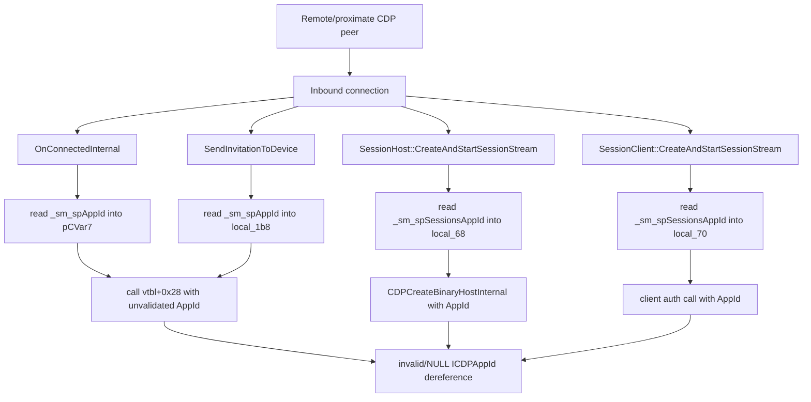

# CVE-2026-69516

**CVE:** CVE-2026-69516  
**Title:** Connected Devices Platform Service (Cdpsvc) Elevation of Privilege Vulnerability  
**Source:** [https://msrc.microsoft.com/update-guide/vulnerability/CVE-2026-69516](https://msrc.microsoft.com/update-guide/vulnerability/CVE-2026-69516)  
**Component(s):** cdpsvc.dll  
**Patched Date:** 2026-09-08T07:00:00  
**CWE:** Use after free in Connected Devices Platform Service (Cdpsvc) allows an authorized attacker to elevate privileges locally.  

Download Patched & Vulnerable Components:

```bash
# cdpsvc.dll
wget https://msdl.microsoft.com/download/symbols/cdpsvc.dll/B88A3E96D5000/cdpsvc.dll -O cdpsvc.dll.10.0.26100.9278 # vulnerable
wget https://msdl.microsoft.com/download/symbols/cdpsvc.dll/9DF14DE7D7000/cdpsvc.dll -O cdpsvc.dll.10.0.26100.9444 # patched
```

## Version Tracking Analysis

**Command:**

```
python ghidra_scripts\ghidra_vt_wrapper.py --old-binary ./reports/2026-Sep/CVE-2026-69516/cdpsvc.dll.10.0.26100.9278 --new-binary ./reports/2026-Sep/CVE-2026-69516/cdpsvc.dll.10.0.26100.9444 --project-dir ./reports/2026-Sep/CVE-2026-69516/ghidra_project --project-name cdpsvc.dll_CVE-2026-69516 --ghidra-dir C:\Tools\ghidra_11.4.2_PUBLIC_20250826\ghidra_11.4.2_PUBLIC --output-dir ./reports/2026-Sep/CVE-2026-69516/ghidra_project/vt_results --max-memory 16g
```

Patched Functions: 6 | New Functions: 51 | Removed Functions: 10 | Total Matches: 98347 | Accepted Matches: 21646

### Patched Functions

| Function Name | Source Address | Dest Address | Similarity | Confidence |
| --- | --- | --- | --- | --- |
| `Module<1,CdpServiceModule>::RegisterWinRTObject` | `1800368b0` | `1800371e0` | 0.995 | 1.0 |
| `SendInvitationHelper::SendInvitationToDevice` | `18004ee50` | `1800503c0` | 0.912 | 10.0 |
| `Details::MakeAndInitialize<SharingPlatform::Internal::CDPListener,SharingPlatform::Internal::CDPListener,char_const*___ptr64>` | `1800056a0` | `180005710` | 0.884 | 10.0 |
| `SessionClient::CreateAndStartSessionStream` | `180054800` | `180055d60` | 0.830 | 10.0 |
| `SessionHost::CreateAndStartSessionStream` | `1800593c4` | `18005a934` | 0.810 | 10.0 |
| `SessionDiscoveryAsyncOperation::OnConnectedInternal` | `18005f6a8` | `180060c28` | 0.792 | 10.0 |

### New Functions

*Showing 10 of 51 new functions*

| Function Name | Address |
| --- | --- |
| ``dynamic_initializer_for_'g_enabledStateManager''` | `180002890` |
| ``dynamic_initializer_for_'g_header_init_InitializeStagingSRUMFeatureReporting''` | `180002a40` |
| `~EnabledStateManager` | `18000b474` |
| `~unique_storage<wil::details::resource_policy<FEATURE_STATE_CHANGE_SUBSCRIPTION__*___ptr64,void_(__cdecl*)(FEATURE_STATE_CHANGE_SUBSCRIPTION__*___ptr64),&void___cdecl_wil::details::WilApi_UnsubscribeFeatureStateChangeNotification(struct_FEATURE_STATE_CHANGE_SUBSCRIPTION__*___ptr64),wistd::integral_constant<unsigned___int64,0>,FEATURE_STATE_CHANGE_SUBSCRIPTION__*___ptr64,FEATURE_STATE_CHANGE_SUBSCRIPTION__*___ptr64,0,std::nullptr_t>_>` | `18000dd84` |
| `EnabledStateManager` | `18000dda4` |
| `WilApi_RecordFeatureUsage` | `18000e404` |
| `_Lock` | `180012030` |
| `_Unlock` | `180012040` |
| `showmanyc` | `180012050` |
| `uflow` | `180012060` |

### Removed Functions

| Function Name | Address |
| --- | --- |
| `_Lock` | `180011ec0` |
| `_Unlock` | `180011ed0` |
| `showmanyc` | `180011ee0` |
| `uflow` | `180011ef0` |
| `xsgetn` | `180011f00` |
| `xsputn` | `180011f10` |
| `setbuf` | `180011f20` |
| `sync` | `180011f30` |
| `imbue` | `180011f40` |
| `_guard_dispatch_icall` | `180063a40` |

---

# AI Technical Analysis

## Vulnerability Identification

**Core Vulnerable Function(s):**

- `SendInvitationHelper::SendInvitationToDevice()` - Reads the
  process-global cached AppId pointer `_sm_spAppId` directly and
  passes it to a COM interface method without guaranteeing the
  object was initialized.
- `SessionDiscoveryAsyncOperation::OnConnectedInternal()` - Reads
  `_sm_spAppId` into `pCVar7` and forwards it to a virtual call
  with no validation of the pointer itself; reachable from a
  remote connection callback.
- `SessionHost::CreateAndStartSessionStream()` - Reads the global
  `_sm_spSessionsAppId` directly and passes it to
  `CDPCreateBinaryHostInternal()`.
- `SessionClient::CreateAndStartSessionStream()` - Reads
  `_sm_spSessionsAppId` directly and passes it into the client
  authorization call.

All four share one defect: consumption of a lazily-populated
global COM pointer without an initialization guarantee.

**Supporting Changes:**

- `SharingPlatformStatics::GetDefaultAppId()` /
  `GetSessionsAppId()` - New accessor calls that replace the raw
  global reads (referenced by the patched callers).

**Unrelated Changes:**

- `Module<1,CdpServiceModule>::RegisterWinRTObject()` - The
  symbol was re-resolved to `GetTrustLevel()`; the body only
  calls `RoOriginateError(0x80004001,0)`. This is a
  recompilation/symbol-layout artifact, not a security fix.
- `EnabledStateManager()`, `~EnabledStateManager()`,
  `~unique_storage<...FEATURE_STATE_CHANGE_SUBSCRIPTION__...>()`,
  and the two `_dynamic_initializer_for_*` routines - `WIL`
  feature-staging and SRUM usage-reporting infrastructure emitted
  by the toolchain. Not security-relevant to this CVE.

---

## Root Cause Analysis

The flaw is use of an uninitialized or unsynchronized global COM
interface pointer. The affected functions assumed that the cached
singletons `_sm_spAppId` and `_sm_spSessionsAppId` were always
valid at the point of use, an invariant the code never enforced.
Ghidra flagged this directly with `Globals starting with '_'
overlap smaller symbols at the same address`, a marker of a
lazily-initialized static being read outside its guard.

Vulnerable code from `SendInvitationToDevice()` (before):

```c
local_1b8 = (longlong *)0x0;
InternalRelease((ComPtr<ICDPAFSUserSettings> *)&local_1b8);
if (_sm_spAppId != (longlong *)0x0) {
  (**(code **)(*_sm_spAppId + 8))(_sm_spAppId);
}
local_1b8 = _sm_spAppId;
iVar2 = (**(code **)(*(longlong *)param_1 + 0x28))
          (param_1,_sm_spAppId,"SharingBinaryHost",&local_188);
```

Vulnerable code from `OnConnectedInternal()` (before):

```c
local_1d0 = (CDPTarget *)0x0;
if (_sm_spAppId != (CDPTarget *)0x0) {
  (**(code **)(*(longlong *)_sm_spAppId + 8))(_sm_spAppId);
}
pCVar7 = _sm_spAppId;
local_1d0 = _sm_spAppId;
```

The `if (_sm_spAppId != 0)` guard protects only the `AddRef` at
vtable offset `+8`; it proves the developers knew the global
could be `NULL`. Despite that, `pCVar7` and `local_1b8` are then
assigned the raw value unconditionally. In `SendInvitationToDevice()`
the potentially null `_sm_spAppId` is passed as the second
argument to the method at offset `+0x28`. In `OnConnectedInternal()`
`pCVar7` is forwarded to `(**(code **)(**(longlong **)(this +
200) + 0x28))(...)` with no null check on the AppId at all, and
the only error test (`-1 < lVar3`) covers the call result rather
than the pointer. Because `_sm_spAppId` and `_sm_spSessionsAppId`
are read with no lazy-init call and no lock, a caller reaching
these paths before or during singleton population consumes a
`NULL` or partially-constructed interface pointer, producing a
dereference of an invalid `ICDPAppId`. The same unchecked read of
`_sm_spSessionsAppId` appears in both
`CreateAndStartSessionStream()` variants.

---

## Execution and Trigger Flow

The Connected Devices Platform service (`cdpsvc.dll`) exposes
these routines through its session and discovery surface. A
remote or proximate peer establishes a CDP connection, which
drives `SessionDiscoveryAsyncOperation::OnConnectedInternal()`
when the endpoint transitions to connected. That handler takes
the `state - 1U < 4` branch and immediately reads the global
`_sm_spAppId`. If the AppId singleton has not been populated,
`pCVar7` becomes `NULL`, and the code still calls the interface
method at offset `+0x28` with that value, dereferencing an
invalid object. The invitation path is reachable the same way:
an inbound session request drives
`SendInvitationHelper::SendInvitationToDevice()`, which reads
`_sm_spAppId` after two vtable calls succeed, then passes it to
the `+0x28` method. The host and client stream-creation paths
(`SessionHost::CreateAndStartSessionStream()` and
`SessionClient::CreateAndStartSessionStream()`) reach the same
defect through `_sm_spSessionsAppId`, feeding it to
`CDPCreateBinaryHostInternal()` and the client authorization
call respectively. Because the trigger depends on the timing of
singleton initialization relative to the first inbound request,
an attacker who can prompt an early connection controls whether
the read observes an unset global. The result is an invalid
pointer use inside a network-facing service.



---

## Patch Analysis

The patch removes every direct global read and routes each call
site through a dedicated accessor that returns an `HRESULT`.

```diff
-            if (_sm_spAppId != (longlong *)0x0) {
-              (**(code **)(*_sm_spAppId + 8))(_sm_spAppId);
-            }
-            local_1b8 = _sm_spAppId;
-            iVar2 = (**(code **)(*(longlong *)param_1 + 0x28))
-                      (param_1,_sm_spAppId,"SharingBinaryHost",&local_188);
-            if (iVar2 < 0) { ... }
+            lVar2 = SharingPlatformStatics::GetDefaultAppId(&local_1b8);
+            if (lVar2 < 0) {
+              uVar4 = 0x6e;
+              goto LAB_180050507;
+            }
+            else {
+              lVar2 = (**(code **)(*(longlong *)param_1 + 0x28))
+                        (param_1,local_1b8,"SharingBinaryHost",&local_188);
+              if (lVar2 < 0) { uVar4 = 0x6f; goto LAB_180050507; }
+            }
```

The equivalent transform appears in the two stream-creation
functions, where `SharingPlatformStatics::GetSessionsAppId()`
replaces the `_sm_spSessionsAppId` read. `GetDefaultAppId()` and
`GetSessionsAppId()` receive the address of the local `ComPtr`
slot (`&local_1b8`, `&local_78`) and populate it, so the AppId is
obtained through an accessor that owns the object's lifecycle
rather than by copying a raw shared global. The manual guarded
`AddRef` at vtable offset `+8` is deleted because the accessor
now returns an owned, referenced pointer. Each caller checks the
returned `lVar2`/`lVar5` and diverts to a `Return_Hr` error path
on failure, so an unavailable AppId yields a clean HRESULT
(`0x6e`, `0x8c`, `0x148`) instead of an invalid dereference. The
change also converts the result variable from `int iVar2` to
`long lVar2`, aligning the compare width with the returned
`HRESULT`.

The fix is effective for the identified defect: the invariant
"the AppId exists before use" is now established by the accessor
on every path rather than assumed. Failure to produce an AppId is
detectable and non-fatal, converting a potential crash into a
recoverable error return. Because the accessor centralizes
initialization, the prior window where a global could be read
unset is closed. `OnConnectedInternal()` still leaves the
`GetDefaultAppId()` result unchecked, but the object is now
sourced safely, removing the invalid-pointer condition.

Security impact: the patch eliminates an uninitialized/null COM
pointer dereference in a network-facing service, closing a
denial-of-service and potential memory-safety exposure in the
CDP session and discovery paths. It hardens four attacker-
reachable entry points behind validated singleton accessors.