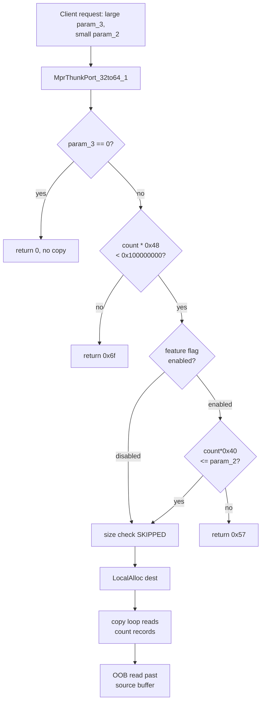

# CVE-2026-69590

**CVE:** CVE-2026-69590  
**Title:** Windows Routing and Remote Access Service (RRAS) Remote Code Execution Vulnerability  
**Source:** [https://msrc.microsoft.com/update-guide/vulnerability/CVE-2026-69590](https://msrc.microsoft.com/update-guide/vulnerability/CVE-2026-69590)  
**Component(s):** mprapi.dll  
**Patched Date:** 2026-09-08T07:00:00  
**CWE:** Remote Code Execution in Windows Routing and Remote Access Service (RRAS) allows attacker to gain an unauthorized access to victim's machine  

---

## Related CVEs (Same Component)

This report covers 8 CVEs affecting the same component(s):

- **CVE-2026-69590**  
- CVE-2026-69852  
- CVE-2026-70570  
- CVE-2026-71351  
- CVE-2026-71353  
- CVE-2026-72939  
- CVE-2026-72950  
- CVE-2026-72959  

### Detailed Information

#### CVE-2026-69852

**Title:** Windows Routing and Remote Access Service (RRAS) Remote Code Execution Vulnerability  
**Source:** [https://msrc.microsoft.com/update-guide/vulnerability/CVE-2026-69852](https://msrc.microsoft.com/update-guide/vulnerability/CVE-2026-69852)  
**Patched Date:** 2026-09-08T07:00:00  
**CWE:** Remote Code Execution in Windows Routing and Remote Access Service (RRAS) allows attacker to gain an unauthorized access to victim's machine  

#### CVE-2026-70570

**Title:** Windows Routing and Remote Access Service (RRAS) Remote Code Execution Vulnerability  
**Source:** [https://msrc.microsoft.com/update-guide/vulnerability/CVE-2026-70570](https://msrc.microsoft.com/update-guide/vulnerability/CVE-2026-70570)  
**Patched Date:** 2026-09-08T07:00:00  
**CWE:** Remote Code Execution in Windows Routing and Remote Access Service (RRAS) allows attacker to gain an unauthorized access to victim's machine  

#### CVE-2026-71351

**Title:** Windows Routing and Remote Access Service (RRAS) Elevation of Privilege Vulnerability  
**Source:** [https://msrc.microsoft.com/update-guide/vulnerability/CVE-2026-71351](https://msrc.microsoft.com/update-guide/vulnerability/CVE-2026-71351)  
**Patched Date:** 2026-09-08T07:00:00  
**CWE:** Double free in Windows Routing and Remote Access Service (RRAS) allows an authorized attacker to elevate privileges locally.  

#### CVE-2026-71353

**Title:** Windows Routing and Remote Access Service (RRAS) Elevation of Privilege Vulnerability  
**Source:** [https://msrc.microsoft.com/update-guide/vulnerability/CVE-2026-71353](https://msrc.microsoft.com/update-guide/vulnerability/CVE-2026-71353)  
**Patched Date:** 2026-09-08T07:00:00  
**CWE:** Double free in Windows Routing and Remote Access Service (RRAS) allows an authorized attacker to elevate privileges locally.  

#### CVE-2026-72939

**Title:** Windows Routing and Remote Access Service (RRAS) Denial of Service Vulnerability  
**Source:** [https://msrc.microsoft.com/update-guide/vulnerability/CVE-2026-72939](https://msrc.microsoft.com/update-guide/vulnerability/CVE-2026-72939)  
**Patched Date:** 2026-09-08T07:00:00  
**CWE:** Null pointer dereference in Windows Routing and Remote Access Service (RRAS) allows an authorized attacker to deny service over a network.  

#### CVE-2026-72950

**Title:** Windows Routing and Remote Access Service (RRAS) Remote Code Execution Vulnerability  
**Source:** [https://msrc.microsoft.com/update-guide/vulnerability/CVE-2026-72950](https://msrc.microsoft.com/update-guide/vulnerability/CVE-2026-72950)  
**Patched Date:** 2026-09-08T07:00:00  
**CWE:** Remote Code Execution in Windows Routing and Remote Access Service (RRAS) allows attacker to gain an unauthorized access to victim's machine  

#### CVE-2026-72959

**Title:** Windows Routing and Remote Access Service (RRAS) Remote Code Execution Vulnerability  
**Source:** [https://msrc.microsoft.com/update-guide/vulnerability/CVE-2026-72959](https://msrc.microsoft.com/update-guide/vulnerability/CVE-2026-72959)  
**Patched Date:** 2026-09-08T07:00:00  
**CWE:** Remote Code Execution in Windows Routing and Remote Access Service (RRAS) allows attacker to gain an unauthorized access to victim's machine  

---

Download Patched & Vulnerable Components:

```bash
# mprapi.dll
wget https://msdl.microsoft.com/download/symbols/mprapi.dll/3C9247C684000/mprapi.dll -O mprapi.dll.10.0.26100.7705 # vulnerable
wget https://msdl.microsoft.com/download/symbols/mprapi.dll/290F8AC484000/mprapi.dll -O mprapi.dll.10.0.26100.7920 # patched
```

## Version Tracking Analysis

**Command:**

```
python ghidra_scripts\ghidra_vt_wrapper.py --old-binary ./reports/2026-Sep/CVE-2026-69590/mprapi.dll.10.0.26100.7705 --new-binary ./reports/2026-Sep/CVE-2026-69590/mprapi.dll.10.0.26100.7920 --project-dir ./reports/2026-Sep/CVE-2026-69590/ghidra_project --project-name mprapi.dll_CVE-2026-69590 --ghidra-dir C:\Tools\ghidra_11.4.2_PUBLIC_20250826\ghidra_11.4.2_PUBLIC --output-dir ./reports/2026-Sep/CVE-2026-69590/ghidra_project/vt_results --max-memory 16g
```

Patched Functions: 4 | New Functions: 9 | Removed Functions: 17 | Total Matches: 18331 | Accepted Matches: 7660

### Patched Functions

| Function Name | Source Address | Dest Address | Similarity | Confidence |
| --- | --- | --- | --- | --- |
| `FUN_180045300` | `180045300` | `180044960` | 0.988 | 1.0 |
| `MprThunkPort_32to64_0` | `1800327e4` | `1800327a8` | 0.908 | 10.0 |
| `MprThunkPort_32to64_2` | `180032b3c` | `180032ad4` | 0.877 | 10.0 |
| `MprThunkPort_32to64_1` | `1800329f8` | `1800329a8` | 0.747 | 10.0 |

### New Functions

| Function Name | Address |
| --- | --- |
| `operator_delete` | `180002861` |
| `what` | `1800028d0` |
| `~exception` | `1800028dc` |
| `exception` | `1800028e8` |
| `exception` | `1800028f4` |
| `exception` | `180002900` |
| `GdiGradientFill` | `180044990` |
| `MulDiv` | `1800449d0` |
| `_guard_dispatch_icall` | `180056370` |

### Removed Functions

*Showing 10 of 17 removed functions*

| Function Name | Address |
| --- | --- |
| `operator_delete` | `180002861` |
| `what` | `1800028d0` |
| `~exception` | `1800028dc` |
| `exception` | `1800028e8` |
| `exception` | `1800028f4` |
| `exception` | `180002900` |
| `Feature_1108386105__private_IsEnabledDeviceUsageNoInline` | `1800305a4` |
| `wil_details_FeatureReporting_RecordUsageInCache` | `180032f64` |
| `wil_details_FeatureReporting_ReportUsageToService` | `180033258` |
| `wil_details_FeatureReporting_ReportUsageToServiceDirect` | `180033374` |

---

# AI Technical Analysis

## Vulnerability Identification

**Core Vulnerable Function(s):**

- `MprThunkPort_32to64_1()` - Performs the bounds check on the
  caller-supplied input size behind a runtime feature flag, so the
  check is skipped when the flag is disabled, allowing an
  out-of-bounds read of the source buffer.
- `MprThunkPort_32to64_0()` - Contains the identical
  feature-flag-gated size check (`count * 0x17c <= param_2`) with
  the same bypass and over-read of the source array.
- `MprThunkPort_32to64_2()` - Contains the identical
  feature-flag-gated size check (`count * 0x1f0 <= param_2`) with
  the same bypass.

**Supporting Changes:**

- None among the patched routines. All three affected functions
  carry the same flaw; the deep analysis below uses
  `MprThunkPort_32to64_1()` as the representative case and notes the
  offsets that differ in the two siblings.

**Unrelated Changes:**

- `operator_delete()` - Compiler-emitted tail-call thunk. Not
  security-relevant.
- `exception::what()` - Runtime stub (indirect jump thunk). Not
  security-relevant.
- `exception::~exception()` - Destructor thunk. Not
  security-relevant.
- `exception::exception(char const * const &)` - Constructor thunk.
  Not security-relevant.
- `exception::exception(class exception const &)` - Copy
  constructor thunk. Not security-relevant.

The five new functions are C++ runtime and exception-handling
stubs pulled into the binary as linkage artifacts. None participate
in the vulnerable data path.

---

## Root Cause Analysis

The three routines convert an array of 32-bit interop structures
into their 64-bit equivalents. Each computes an element count from
`param_3`, allocates a destination buffer sized by that count, then
copies `param_3` fixed-size records out of the caller-supplied
source buffer `param_1`. The security invariant is that the source
buffer must be at least `count * element_size` bytes, and the
caller passes the true source size in `param_2`. The flaw is that
the check enforcing this invariant was executed only when a runtime
feature flag was enabled, so when the flag was disabled the copy
proceeded with no size validation at all.

```c
uVar6 = (ulonglong)param_3;
if (param_3 == 0) {
  *param_6 = 0;
}
else if (uVar6 * 0x48 < 0x100000000) {
  uVar1 = Feature_1108386105__private_IsEnabledDeviceUsageNoInline();
  if ((uVar1 == 0) || (uVar6 << 6 <= (ulonglong)param_2)) {
    pvVar2 = LocalAlloc(0x40, uVar6 * 0x48 & 0xffffffff);
    ...
    do {                       /* copies uVar6 records */
      *puVar3 = *puVar4;
      ...
      puVar3 = puVar3 + 0x12;  /* dest stride 0x48 */
      puVar4 = puVar4 + 0x10;  /* source stride 0x40 */
    } while (uVar6 != 0);
  }
  else {
    uVar5 = 0x57;              /* ERROR_INVALID_PARAMETER */
  }
}
```

The record count `uVar6` is taken directly from the attacker
controlled `param_3`. The guard `uVar6 * 0x48 < 0x100000000` only
prevents 32-bit overflow of the destination allocation size; it
does not validate the source. The decisive condition is
`(uVar1 == 0) || (uVar6 << 6 <= param_2)`. Here `uVar6 << 6` equals
`count * 0x40`, the number of source bytes the loop will read
(source stride is `0x10` uints, that is `0x40` bytes per record).
Because the expression is a logical OR, when
`Feature_1108386105__private_IsEnabledDeviceUsageNoInline()` returns
`0` the left operand is true and the right comparison against
`param_2` is never evaluated. Control then falls straight into
`LocalAlloc` and the copy loop, which reads `count` records from
`param_1` regardless of the real buffer length declared in
`param_2`. Supplying a large `param_3` with a small `param_2` drives
the loop past the end of the source allocation, producing a linear
out-of-bounds read. `MprThunkPort_32to64_0()` and
`MprThunkPort_32to64_2()` repeat the pattern with source strides of
`0x17c` and `0x1f0` bytes respectively.

---

## Execution and Trigger Flow

The affected routines are 32-to-64 marshalling thunks in
`mprapi.dll`, invoked when a 32-bit client's request is translated
for the 64-bit service worker. An attacker constructs a request in
which the element count and the declared buffer size are
independent fields. First the caller sets `param_3` to a large
count and `param_2` to a small byte length that does not match the
actual source buffer. Execution enters `MprThunkPort_32to64_1()`
and passes the `param_3 == 0` test. Next the overflow guard
`uVar6 * 0x48 < 0x100000000` succeeds because the count, while
large, stays under the 32-bit product ceiling. Control reaches the
feature-flag test. When
`Feature_1108386105__private_IsEnabledDeviceUsageNoInline()` returns
zero, the short-circuit OR skips the `count * 0x40 <= param_2`
comparison entirely. `LocalAlloc` then allocates a destination of
`count * 0x48` bytes, which succeeds. The copy loop iterates
`count` times, advancing the source pointer `puVar4` by `0x40`
bytes each pass. Once the loop index passes the number of records
the source buffer actually holds, every subsequent read touches
memory beyond the source allocation. The over-read data is written
into the freshly allocated 64-bit structure and returned to the
caller through `*param_6`, disclosing adjacent heap contents, or
faulting when an unmapped page is crossed.



---

## Patch Analysis

The patch removes the feature-flag gate and makes the size
validation unconditional and fail-closed.

```diff
-  else if (uVar6 * 0x48 < 0x100000000) {
-    uVar1 = Feature_1108386105__private_IsEnabledDeviceUsageNoInline();
-    if ((uVar1 == 0) || (uVar6 << 6 <= (ulonglong)param_2)) {
-      pvVar2 = LocalAlloc(0x40,uVar6 * 0x48 & 0xffffffff);
-      if (pvVar2 == (HLOCAL)0x0) {
-        uVar5 = 8;
-      }
-      ...
-    }
-    else {
-      uVar5 = 0x57;
-    }
-  }
+  else if (uVar5 * 0x48 < 0x100000000) {
+    if ((param_2 & 0xffffffff) < uVar5 << 6) {
+      uVar4 = 0x57;
+    }
+    else {
+      pvVar1 = LocalAlloc(0x40,uVar5 * 0x48 & 0xffffffff);
+      if (pvVar1 == (HLOCAL)0x0) {
+        uVar4 = 8;
+      }
+      ...
+    }
+  }
```

The call to
`Feature_1108386105__private_IsEnabledDeviceUsageNoInline()` is
deleted, so the size check is no longer conditional on any runtime
state. The logic is also inverted into a guard clause: the code now
tests `(param_2 & 0xffffffff) < uVar5 << 6` first, and on failure
returns `0x57` (`ERROR_INVALID_PARAMETER`) before any allocation or
copy. The mask `param_2 & 0xffffffff` reflects the signature change
of `param_2` from `uint` to `ulonglong`; only the low 32 bits carry
the declared size, and masking prevents any high-order bits in the
64-bit register from perturbing the comparison. The comparison
threshold is unchanged: `uVar5 << 6` is still `count * 0x40`, the
exact number of source bytes the loop consumes. The two sibling
routines receive the same rewrite against their respective strides,
`count * 0x17c` in `MprThunkPort_32to64_0()` and `count * 0x1f0` in
`MprThunkPort_32to64_2()`.

The fix is effective because the bounds check now executes on every
code path that reaches the copy loop, closing the bypass regardless
of feature configuration. Because the comparison uses the same
`count * element_size` value that governs the loop's total read
span, a request whose declared `param_2` is smaller than the data
the loop would read is rejected up front. The fail-closed ordering
means an undersized buffer can no longer reach `LocalAlloc` or the
copy, eliminating the over-read at its source. The overflow guard
`count * 0x48 < 0x100000000` is retained, preserving protection
against 32-bit multiplication wrap on the allocation size.

The vulnerability was an out-of-bounds read of the source buffer in
a 32-to-64 marshalling path reachable through the routing service
interface. Exploitation yields disclosure of adjacent heap memory
and can crash the service when an unmapped page is reached. The
patch fully remediates the flaw by enforcing the size invariant
unconditionally across all three affected routines.