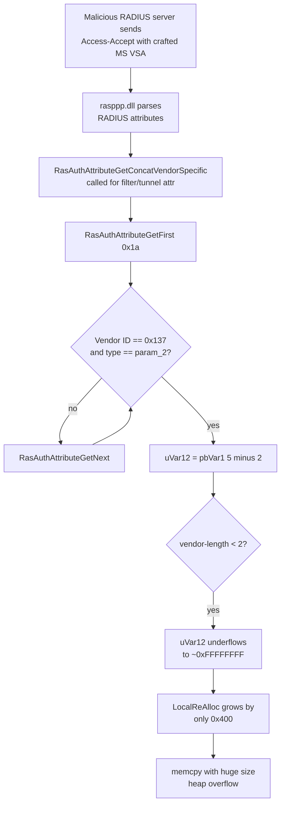

# CVE-2026-69590

**CVE:** CVE-2026-69590  
**Title:** Windows Routing and Remote Access Service (RRAS) Remote Code Execution Vulnerability  
**Source:** [https://msrc.microsoft.com/update-guide/vulnerability/CVE-2026-69590](https://msrc.microsoft.com/update-guide/vulnerability/CVE-2026-69590)  
**Component(s):** rasppp.dll  
**Patched Date:** 2026-09-08T07:00:00  
**CWE:** Remote Code Execution in Windows Routing and Remote Access Service (RRAS) allows attacker to gain an unauthorized access to victim's machine  

---

## Related CVEs (Same Component)

This report covers 8 CVEs affecting the same component(s):

- **CVE-2026-69590**  
- CVE-2026-69852  
- CVE-2026-70570  
- CVE-2026-71351  
- CVE-2026-71353  
- CVE-2026-72939  
- CVE-2026-72950  
- CVE-2026-72959  

### Detailed Information

#### CVE-2026-69852

**Title:** Windows Routing and Remote Access Service (RRAS) Remote Code Execution Vulnerability  
**Source:** [https://msrc.microsoft.com/update-guide/vulnerability/CVE-2026-69852](https://msrc.microsoft.com/update-guide/vulnerability/CVE-2026-69852)  
**Patched Date:** 2026-09-08T07:00:00  
**CWE:** Remote Code Execution in Windows Routing and Remote Access Service (RRAS) allows attacker to gain an unauthorized access to victim's machine  

#### CVE-2026-70570

**Title:** Windows Routing and Remote Access Service (RRAS) Remote Code Execution Vulnerability  
**Source:** [https://msrc.microsoft.com/update-guide/vulnerability/CVE-2026-70570](https://msrc.microsoft.com/update-guide/vulnerability/CVE-2026-70570)  
**Patched Date:** 2026-09-08T07:00:00  
**CWE:** Remote Code Execution in Windows Routing and Remote Access Service (RRAS) allows attacker to gain an unauthorized access to victim's machine  

#### CVE-2026-71351

**Title:** Windows Routing and Remote Access Service (RRAS) Elevation of Privilege Vulnerability  
**Source:** [https://msrc.microsoft.com/update-guide/vulnerability/CVE-2026-71351](https://msrc.microsoft.com/update-guide/vulnerability/CVE-2026-71351)  
**Patched Date:** 2026-09-08T07:00:00  
**CWE:** Double free in Windows Routing and Remote Access Service (RRAS) allows an authorized attacker to elevate privileges locally.  

#### CVE-2026-71353

**Title:** Windows Routing and Remote Access Service (RRAS) Elevation of Privilege Vulnerability  
**Source:** [https://msrc.microsoft.com/update-guide/vulnerability/CVE-2026-71353](https://msrc.microsoft.com/update-guide/vulnerability/CVE-2026-71353)  
**Patched Date:** 2026-09-08T07:00:00  
**CWE:** Double free in Windows Routing and Remote Access Service (RRAS) allows an authorized attacker to elevate privileges locally.  

#### CVE-2026-72939

**Title:** Windows Routing and Remote Access Service (RRAS) Denial of Service Vulnerability  
**Source:** [https://msrc.microsoft.com/update-guide/vulnerability/CVE-2026-72939](https://msrc.microsoft.com/update-guide/vulnerability/CVE-2026-72939)  
**Patched Date:** 2026-09-08T07:00:00  
**CWE:** Null pointer dereference in Windows Routing and Remote Access Service (RRAS) allows an authorized attacker to deny service over a network.  

#### CVE-2026-72950

**Title:** Windows Routing and Remote Access Service (RRAS) Remote Code Execution Vulnerability  
**Source:** [https://msrc.microsoft.com/update-guide/vulnerability/CVE-2026-72950](https://msrc.microsoft.com/update-guide/vulnerability/CVE-2026-72950)  
**Patched Date:** 2026-09-08T07:00:00  
**CWE:** Remote Code Execution in Windows Routing and Remote Access Service (RRAS) allows attacker to gain an unauthorized access to victim's machine  

#### CVE-2026-72959

**Title:** Windows Routing and Remote Access Service (RRAS) Remote Code Execution Vulnerability  
**Source:** [https://msrc.microsoft.com/update-guide/vulnerability/CVE-2026-72959](https://msrc.microsoft.com/update-guide/vulnerability/CVE-2026-72959)  
**Patched Date:** 2026-09-08T07:00:00  
**CWE:** Remote Code Execution in Windows Routing and Remote Access Service (RRAS) allows attacker to gain an unauthorized access to victim's machine  

---

Download Patched & Vulnerable Components:

```bash
# rasppp.dll
wget https://msdl.microsoft.com/download/symbols/rasppp.dll/1978B0E953000/rasppp.dll -O rasppp.dll.10.0.26100.7920 # vulnerable
wget https://msdl.microsoft.com/download/symbols/rasppp.dll/EA8C41EF54000/rasppp.dll -O rasppp.dll.10.0.26100.9444 # patched
```

## Version Tracking Analysis

**Command:**

```
python ghidra_scripts\ghidra_vt_wrapper.py --old-binary ./reports/2026-Sep/CVE-2026-69590/rasppp.dll.10.0.26100.7920 --new-binary ./reports/2026-Sep/CVE-2026-69590/rasppp.dll.10.0.26100.9444 --project-dir ./reports/2026-Sep/CVE-2026-69590/ghidra_project --project-name rasppp.dll_CVE-2026-69590 --ghidra-dir C:\Tools\ghidra_11.4.2_PUBLIC_20250826\ghidra_11.4.2_PUBLIC --output-dir ./reports/2026-Sep/CVE-2026-69590/ghidra_project/vt_results --max-memory 16g
```

Patched Functions: 1 | New Functions: 16 | Removed Functions: 1 | Total Matches: 5273 | Accepted Matches: 5251

### Patched Functions

| Function Name | Source Address | Dest Address | Similarity | Confidence |
| --- | --- | --- | --- | --- |
| `RasAuthAttributeGetConcatVendorSpecific` | `18001b238` | `18001b274` | 0.683 | 10.0 |

### New Functions

*Showing 10 of 16 new functions*

| Function Name | Address |
| --- | --- |
| `Feature_2881723706__private_IsEnabledDeviceUsageNoInline` | `1800197c8` |
| `wil_RtlStagingConfig_QueryFeatureState` | `18001ba60` |
| `wil_RtlStagingConfig_RecordFeatureUsage` | `18001bb58` |
| `wil_details_AreDependenciesEnabled` | `18001bbb8` |
| `wil_details_FeatureReporting_IncrementOpportunityInCache` | `18001bc58` |
| `wil_details_FeatureReporting_IncrementUsageInCache` | `18001bd30` |
| `wil_details_FeatureReporting_RecordUsageInCache` | `18001be14` |
| `wil_details_FeatureReporting_ReportUsageToService` | `18001bf94` |
| `wil_details_FeatureReporting_ReportUsageToServiceDirect` | `18001c010` |
| `wil_details_FeatureStateCache_ReevaluateCachedFeatureEnabledState` | `18001c0a0` |

### Removed Functions

| Function Name | Address |
| --- | --- |
| `_guard_dispatch_icall` | `180033df0` |

---

# AI Technical Analysis

## Vulnerability Identification

**Core Vulnerable Function(s):**

- `RasAuthAttributeGetConcatVendorSpecific()` - Computes a copy
  length by subtracting a constant from an attacker-controlled
  vendor-length byte without validating it, causing an integer
  underflow that drives an oversized `memcpy` into a heap
  buffer.

**Supporting Changes:**

- `wil_RtlStagingConfig_QueryFeatureState()` - Windows
  Implementation Library (WIL) helper that queries the runtime
  state of a staged feature through
  `RtlQueryFeatureConfiguration`. It backs the feature gate
  that enables the new bounds check. Not vulnerable.

- `wil_RtlStagingConfig_RecordFeatureUsage()` - WIL helper that
  reports feature usage through `RtlNotifyFeatureUsage`. It is
  telemetry plumbing for the feature gate. Not vulnerable.

**Unrelated Changes:**

- The renaming of local variables (`piVar5` to `piVar6`,
  `pbVar1` to `pbVar2`, and similar) and the conversion of the
  `while` loop into a `do/while` loop with a pre-check are
  decompiler artifacts and control-flow rewrites. They carry no
  security significance on their own.

---

## Root Cause Analysis

The flaw is a classic unsigned integer underflow driven by an
unvalidated length field taken directly from network-supplied
RADIUS attribute data. The function assumes that the internal
vendor-length byte of a Microsoft Vendor-Specific Attribute
(VSA) is always at least `2` and never larger than the enclosing
attribute, but neither invariant is enforced before the value is
used as a `memcpy` size. When that byte is `0` or `1`, the
subtraction wraps to a near-maximum unsigned value, and the
subsequent copy reads and writes far past the destination heap
allocation.

```c
uVar12 = pbVar1[5] - 2;
puVar3 = local_48;
if (local_res8 - uVar9 < uVar12) {
  local_res8 = local_res8 + 0x400;
  puVar6 = LocalReAlloc(hMem,(ulonglong)local_res8,0x42);
  uVar4 = iVar8 - 0x12U;
  puVar3 = puVar6;
  if (puVar6 == (undefined4 *)0x0) goto LAB_18001b3bc;
}
local_48 = puVar3;
_Size = (undefined8 *)(ulonglong)uVar12;
bVar2 = true;
memcpy((void *)(uVar10 + (longlong)puVar6),
       (void *)(*(longlong *)(piVar5 + 2) + 6),(size_t)_Size);
uVar10 = (ulonglong)(uVar9 + uVar12);
```

The attribute enumeration only checks `iVar8 - 0x12U <=
(uint)piVar5[1]`, meaning the attribute length `piVar5[1]` is at
least `8`; it never relates that length to the inner
vendor-length byte. The pointer `pbVar1` addresses the VSA body,
where `pbVar1[0..3]` is the big-endian vendor identifier
compared against `0x137` (Microsoft, decimal 311), `pbVar1[4]`
is the vendor type matched against `param_2`, and `pbVar1[5]` is
the vendor-length byte. The copy size `uVar12` is derived solely
from `pbVar1[5] - 2`, so a byte value of `0` yields `0xFFFFFFFE`
and a value of `1` yields `0xFFFFFFFF`. The growth test
`local_res8 - uVar9 < uVar12` then passes trivially, but the
`LocalReAlloc` only extends the buffer by a fixed `0x400`, so
the buffer remains tiny relative to `uVar12`. The `memcpy`
proceeds with the enormous size, producing a controlled
heap-based buffer overflow. The running offset `uVar10` is
likewise corrupted, compounding damage across subsequent loop
iterations.

---

## Execution and Trigger Flow

The attacker is a malicious or compromised RADIUS server, or a
party able to inject RADIUS responses, during PPP-based remote
access authentication handled by `rasppp.dll`. During
authentication the RAS client parses the RADIUS Access-Accept
attributes and, for certain filter and tunnel attribute types
(`param_2` values `0x16`, `0x24`, `0x33`, `0x34`, `0x35`),
invokes `RasAuthAttributeGetConcatVendorSpecific` to reassemble
a value that a server may have split across several
Vendor-Specific Attributes. The function calls
`RasAuthAttributeGetFirst(0x1a, ...)` to obtain the first
type-26 attribute, then iterates with
`RasAuthAttributeGetNext`. For each attribute it confirms the
vendor identifier equals `0x137` and the vendor type equals
`param_2`. Once matched, it reads the inner vendor-length byte
at `pbVar1[5]` and computes the copy length. An attacker crafts
a Microsoft VSA whose outer attribute length satisfies the weak
`>= 8` check but whose inner vendor-length byte is `0` or `1`.
The subtraction underflows, the destination buffer is
under-grown, and `memcpy` overflows the heap allocation returned
by the earlier `LocalAlloc`/`LocalReAlloc`. Because the source
and size are attacker-influenced, this yields memory corruption
that can lead to remote code execution in the RAS process
context.



---

## Patch Analysis

The patch introduces an explicit validation of the vendor-length
byte before it is used to compute the copy size, gated behind a
Windows feature-staging flag.

```diff
-      uVar12 = pbVar1[5] - 2;
-      puVar3 = local_48;
-      if (local_res8 - uVar9 < uVar12) {
-        local_res8 = local_res8 + 0x400;
-        puVar6 = LocalReAlloc(hMem,(ulonglong)local_res8,0x42);
-        uVar4 = iVar8 - 0x12U;
-        puVar3 = puVar6;
-        if (puVar6 == (undefined4 *)0x0) goto LAB_18001b3bc;
-      }
-      local_48 = puVar3;
-      _Size = (undefined8 *)(ulonglong)uVar12;
-      bVar2 = true;
-      memcpy(...);
-      uVar10 = (ulonglong)(uVar9 + uVar12);
+      uVar5 = Feature_2881723706__private_IsEnabledDeviceUsageNoInline();
+      bVar1 = *(byte *)(*(longlong *)(piVar6 + 2) + 5);
+      if ((uVar5 == 0) || ((2 < bVar1 && ((uint)bVar1 <= piVar6[1] - 4U)))) {
+        uVar12 = bVar1 - 2;
+        puVar4 = local_48;
+        if (local_res8 - (int)uVar10 < uVar12) {
+          local_res8 = local_res8 + 0x400;
+          puVar7 = LocalReAlloc(hMem,(ulonglong)local_res8,0x42);
+          uVar5 = iVar9 - 0x12U;
+          puVar4 = puVar7;
+          if (puVar7 == (undefined4 *)0x0) goto LAB_18001b428;
+        }
+        local_48 = puVar4;
+        _Size = (undefined8 *)(ulonglong)uVar12;
+        bVar3 = true;
+        memcpy(...);
+        uVar10 = (ulonglong)((int)uVar10 + uVar12);
+      }
```

The patch reads the vendor-length byte into `bVar1` and requires
two conditions before any copy occurs: `2 < bVar1` and `(uint)
bVar1 <= piVar6[1] - 4U`. The first condition guarantees the
byte is at least `3`, so the subtraction `bVar1 - 2` always
yields a positive value of at least `1` and can never underflow.
The second condition ties the inner vendor-length to the outer
attribute length `piVar6[1]`, ensuring the declared vendor data
fits within the space accounted for by the attribute header
(vendor identifier and type occupy four bytes). Together they
re-establish the invariant that the copy size is bounded by the
real size of the source attribute. The entire guarded block is
skipped when both checks fail, so an oversized or malformed
attribute is silently ignored rather than copied.

The check is wrapped in
`Feature_2881723706__private_IsEnabledDeviceUsageNoInline()`, a
staged feature gate backed by the new
`wil_RtlStagingConfig_QueryFeatureState` and
`wil_RtlStagingConfig_RecordFeatureUsage` helpers, which query
and record feature state through `RtlQueryFeatureConfiguration`
and `RtlNotifyFeatureUsage`. When the feature is disabled
(`uVar5 == 0`) the original unchecked path still runs, so full
protection depends on the feature being enabled in production.

The validation is correct and complete against the underflow and
the out-of-bounds source read, closing the memory-corruption
primitive when active. The residual concern is purely the gating
mechanism: environments where the feature is off retain the
vulnerable behavior. Overall the fix converts a remotely
triggerable heap buffer overflow into a safely rejected
malformed attribute, eliminating the remote code execution risk
once the gate is enabled.