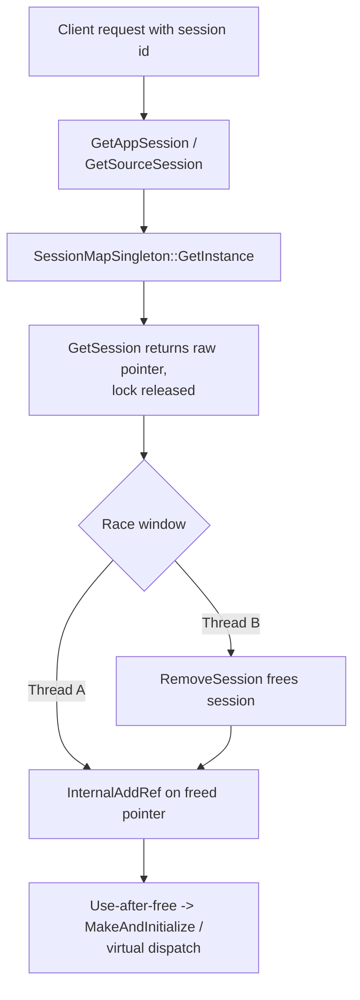

# CVE-2026-69602

**CVE:** CVE-2026-69602  
**Title:** Windows PrintWorkflowUserSvc Elevation of Privilege Vulnerability  
**Source:** [https://msrc.microsoft.com/update-guide/vulnerability/CVE-2026-69602](https://msrc.microsoft.com/update-guide/vulnerability/CVE-2026-69602)  
**Component(s):** printworkflowservice.dll  
**Patched Date:** 2026-09-08T07:00:00  
**CWE:** Use after free in Windows PrintWorkflowUserSvc allows an authorized attacker to elevate privileges over a network.  

Download Patched & Vulnerable Components:

```bash
# printworkflowservice.dll
wget https://msdl.microsoft.com/download/symbols/printworkflowservice.dll/70BF938295000/printworkflowservice.dll -O printworkflowservice.dll.10.0.26100.9278 # vulnerable
wget https://msdl.microsoft.com/download/symbols/printworkflowservice.dll/C0AB537597000/printworkflowservice.dll -O printworkflowservice.dll.10.0.26100.9444 # patched
```

## Version Tracking Analysis

**Command:**

```
python ghidra_scripts\ghidra_vt_wrapper.py --old-binary ./reports/2026-Sep/CVE-2026-69602/printworkflowservice.dll.10.0.26100.9278 --new-binary ./reports/2026-Sep/CVE-2026-69602/printworkflowservice.dll.10.0.26100.9444 --project-dir ./reports/2026-Sep/CVE-2026-69602/ghidra_project --project-name printworkflowservice.dll_CVE-2026-69602 --ghidra-dir C:\Tools\ghidra_11.4.2_PUBLIC_20250826\ghidra_11.4.2_PUBLIC --output-dir ./reports/2026-Sep/CVE-2026-69602/ghidra_project/vt_results --max-memory 16g
```

Patched Functions: 5 | New Functions: 11 | Removed Functions: 1 | Total Matches: 128026 | Accepted Matches: 18729

### Patched Functions

| Function Name | Source Address | Dest Address | Similarity | Confidence |
| --- | --- | --- | --- | --- |
| `Module<1,Windows::Internal::SvcHostModule>::RegisterWinRTObject` | `18000fc70` | `18000fc70` | 0.992 | 1.0 |
| `CWorkflowSessionManager::GetAppSession` | `180016c00` | `180016e40` | 0.796 | 10.0 |
| `CWorkflowSessionManager::GetSourceSession` | `180017210` | `180017680` | 0.741 | 10.0 |
| `_Tree<std::_Tmap_traits<unsigned_long,Windows::Graphics::Internal::Printing::Workflow::IWorkflowSession*___ptr64,std::less<unsigned_long>,std::allocator<std::pair<unsigned_long_const_,Windows::Graphics::Internal::Printing::Workflow::IWorkflowSession*___ptr64>_>,0>_>::_Erase` | `180018464` | `180018b90` | 0.683 | 10.0 |
| `SessionMapSingleton::AddSession` | `180017fdc` | `180018584` | 0.648 | 10.0 |

### New Functions

*Showing 10 of 11 new functions*

| Function Name | Address |
| --- | --- |
| `~lambda_call<<lambda_db4f682bfed4b68cc37b4e221b8b0c8e>_>` | `18001646c` |
| `operator=` | `180016560` |
| `operator=` | `1800165a4` |
| `GetCachedFeatureEnabledState` | `180017098` |
| `GetCurrentFeatureEnabledState` | `1800171c8` |
| `ReportUsage` | `180018090` |
| `__private_IsEnabled` | `1800181b8` |
| `GetSessionStabilized` | `18001886c` |
| `_Erase_unchecked` | `180018c44` |
| `_guard_dispatch_icall` | `18005b6a0` |

### Removed Functions

| Function Name | Address |
| --- | --- |
| `_guard_dispatch_icall` | `18005af40` |

---

# AI Technical Analysis

## Vulnerability Identification

**Core Vulnerable Function(s):**

- `CWorkflowSessionManager::GetAppSession()` - Retrieves a
  raw `IWorkflowSession` pointer from the shared session map
  and increments its reference count only after the map lock
  has been released, creating a time-of-check to
  time-of-use race that leads to a use-after-free.
- `CWorkflowSessionManager::GetSourceSession()` - Contains
  the identical unsafe lookup-then-AddRef sequence against
  the same singleton map; it is the second instance of the
  same root cause.

**Supporting Changes:**

- `SessionMapSingleton::AddSession()` - Adds an owning
  `AddRef` (`(**(code **)(*param_1 + 8))(param_1)`) when the
  feature is enabled, so the map itself holds a strong
  reference to each stored session.
- `~lambda_call<...>()` - New scope-exit helper that calls
  `SessionMapSingleton::RemoveSession` to balance the new
  ownership model.
- `ComPtr<IWorkflowSession>::operator=()` (both overloads) -
  New reference-safe assignment helpers used to move or copy
  the stabilized pointer with correct `AddRef`/`Release`.
- `FeatureImpl<...1001620794>::GetCachedFeatureEnabledState()`
  and `GetCurrentFeatureEnabledState()` - WIL feature-flag
  plumbing that gates the fix behind a staged rollout.

**Unrelated Changes:**

- `Module<1,...>::RegisterWinRTObject()` - A symbol
  re-resolution to `RegisterCOMObject`; the body only calls
  `RoOriginateError` and is not security-relevant.
- `_Tree<...>::_Erase()` - Container refactoring that
  replaces an inline `_Extract`/`_Deallocate` pair with
  `_Erase_unchecked`; no security impact.

---

## Root Cause Analysis

The flaw is a concurrency defect: a reference count is
incremented on an object after the lock protecting that
object's lifetime has already been dropped. The invariant
that a strong reference must be acquired while the object is
provably alive (that is, under the same critical section
that guards the session map) is violated. This opens a
narrow race window in which a competing thread can remove
and free the session between lookup and `AddRef`.

Vulnerable `GetAppSession()` (before):

```c
this_00 = SessionMapSingleton::GetInstance();
pIVar2  = SessionMapSingleton::GetSession(this_00,param_1);
local_10 = pIVar2;
Microsoft::WRL::ComPtr<...IPrintWorkflowForegroundSession>::
InternalAddRef((ComPtr<...> *)&local_10);
if (pIVar2 == (IWorkflowSession *)0x0) {
  lVar1 = -0x7ff8fff2;
  wil::details::in1diag3::Return_Hr(unaff_retaddr,0x69, ...);
}
```

`GetSession()` takes the map's critical section, locates the
entry keyed by `param_1`, and returns a bare
`IWorkflowSession *` in `pIVar2` after releasing the lock.
The returned pointer carries no owning reference. Control
then assigns `pIVar2` into `local_10` and only afterward
calls `InternalAddRef` on it. Any thread that calls
`RemoveSession` for the same session id during this gap can
drop the final reference and free the object. The subsequent
`InternalAddRef` then dereferences `local_10`, reading the
vtable of freed memory, and the freed pointer is later passed
into `MakeAndInitialize<CWorkflowAppSession,...>` at
`local_18`. The null check `if (pIVar2 == 0)` guards only
against a missing entry, not against a concurrent free, so it
provides no protection here. Because `GetSession` returned an
unstabilized pointer, the reference count and the object's
liveness are never coupled atomically. `GetSourceSession`
repeats the same `GetSession` then `InternalAddRef` ordering
against `local_res20`, so both entry points share one root
cause. The result is a classic lookup-then-use race yielding
a use-after-free on a reference-counted COM session object.

---

## Execution and Trigger Flow

A client with access to the print workflow broker interface
invokes an operation that resolves to `GetAppSession` or
`GetSourceSession`, passing a session identifier in
`param_1`. The handler obtains the process-wide
`SessionMapSingleton` and calls `GetSession`, which briefly
locks the map, reads the stored raw pointer for that id, and
returns it without incrementing the reference count. At this
moment the handler holds a dangling-capable raw pointer while
no lock is held. Concurrently, a second thread servicing a
teardown or completion path invokes `RemoveSession` for the
same identifier, drops the last strong reference, and frees
the underlying session object. The first thread now executes
`InternalAddRef` on the freed pointer, writing to reclaimed
memory. If the allocation has been reused by attacker-shaped
data, the vtable pointer read during `AddRef`, or the later
virtual dispatch through `MakeAndInitialize` and the
`QueryInterface` at offset `0x18`, can redirect control flow.
The race is reachable repeatedly because both getters are
routine session-resolution calls, allowing an attacker to
retry until the window is won. Successful exploitation yields
memory corruption in the service process, which runs with
elevated privilege, enabling local privilege escalation.



---

## Patch Analysis

The patch replaces the unsafe lookup-then-`AddRef` sequence
with an atomic stabilized retrieval, gated behind a WIL
feature flag.

Patched `GetAppSession()` (after):

```diff
-  this_00 = SessionMapSingleton::GetInstance();
-  pIVar2 = SessionMapSingleton::GetSession(this_00,param_1);
-  local_10 = pIVar2;
-  ...InternalAddRef((ComPtr<...> *)&local_10);
-  if (pIVar2 == (IWorkflowSession *)0x0) {
+  local_10 = (longlong *)0x0;
+  bVar2 = FeatureImpl<...1001620794>::__private_IsEnabled(...);
+  if (bVar2) {
+    pSVar4 = SessionMapSingleton::GetInstance();
+    pCVar5 = SessionMapSingleton::GetSessionStabilized
+               (pSVar4,(ulong)&local_res20);
+    ComPtr<...IWorkflowSession>::operator=(&local_10,pCVar5);
+    plVar1 = local_res20;
+    if (local_res20 != (longlong *)0x0) {
+      local_res20 = (longlong *)0x0;
+      (**(code **)(*plVar1 + 0x10))();
+    }
+  }
+  else { ... GetSession legacy path ... }
+  if (local_10 == (longlong *)0x0) {
```

When the feature is enabled the code calls the new
`GetSessionStabilized`, which performs the map lookup and the
reference-count increment together while the critical section
is held, returning an already-owned `ComPtr`. The result is
assigned through the new `ComPtr::operator=`, which correctly
manages ownership, and the temporary in `local_res20` is
released via the virtual `Release` at offset `0x10`. The null
test now inspects `local_10`, the stabilized handle, rather
than the raw `pIVar2`. Complementing this, `AddSession` now
issues an owning `AddRef` at insertion so the map itself holds
a strong reference, and the new `~lambda_call` scope guard
calls `RemoveSession` to release it on teardown. Together
these changes make map membership and reference ownership
consistent.

The fix is effective because the increment can no longer
happen after the lock is released; there is no interval in
which the object can be freed while a caller still intends to
use it. The retained legacy `GetSession` branch preserves old
behavior only when the flag is disabled, so a staged rollout
can revert instantly if regressions appear. The stabilized
path also cleanly handles the not-found case by leaving
`local_10` null, so error handling is unchanged in intent.
The added `AddRef` in `AddSession` closes the complementary
gap where the map held only a borrowed pointer.

Security impact: the change eliminates a concurrent
use-after-free in a privileged print service, removing a
local privilege-escalation and memory-corruption primitive.
The remaining risk is confined to configurations where the
feature flag is off, which retain the original race by design.