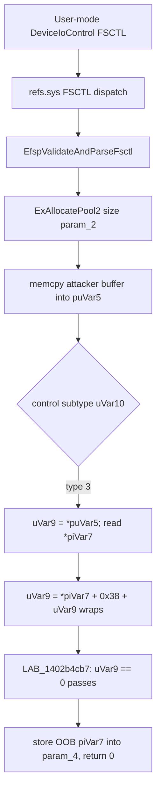

# CVE-2026-69617

**CVE:** CVE-2026-69617  
**Title:** Windows Resilient File System (ReFS) Elevation of Privilege Vulnerability  
**Source:** [https://msrc.microsoft.com/update-guide/vulnerability/CVE-2026-69617](https://msrc.microsoft.com/update-guide/vulnerability/CVE-2026-69617)  
**Component(s):** refs.sys  
**Patched Date:** 2026-09-08T07:00:00  
**CWE:** Out-of-bounds read in Windows Resilient File System (ReFS) allows an authorized attacker to elevate privileges locally.  

---

## Related CVEs (Same Component)

This report covers 2 CVEs affecting the same component(s):

- **CVE-2026-69617**  
- CVE-2026-83952  

### Detailed Information

#### CVE-2026-83952

**Title:** Windows Resilient File System (ReFS) Elevation of Privilege Vulnerability  
**Source:** [https://msrc.microsoft.com/update-guide/vulnerability/CVE-2026-83952](https://msrc.microsoft.com/update-guide/vulnerability/CVE-2026-83952)  
**Patched Date:** 2026-09-08T07:00:00  
**CWE:** Heap-based buffer overflow in Windows Resilient File System (ReFS) allows an authorized attacker to elevate privileges locally.  

---

Download Patched & Vulnerable Components:

```bash
# refs.sys
wget https://msdl.microsoft.com/download/symbols/refs.sys/2ECE2B2437F000/refs.sys -O refs.sys.10.0.26100.9278 # vulnerable
wget https://msdl.microsoft.com/download/symbols/refs.sys/BF102E5737F000/refs.sys -O refs.sys.10.0.26100.9444 # patched
```

## Version Tracking Analysis

**Command:**

```
python ghidra_scripts\ghidra_vt_wrapper.py --old-binary ./reports/2026-Sep/CVE-2026-69617/refs.sys.10.0.26100.9278 --new-binary ./reports/2026-Sep/CVE-2026-69617/refs.sys.10.0.26100.9444 --project-dir ./reports/2026-Sep/CVE-2026-69617/ghidra_project --project-name refs.sys_CVE-2026-69617 --ghidra-dir C:\Tools\ghidra_11.4.2_PUBLIC_20250826\ghidra_11.4.2_PUBLIC --output-dir ./reports/2026-Sep/CVE-2026-69617/ghidra_project/vt_results --max-memory 16g
```

Patched Functions: 4 | New Functions: 33 | Removed Functions: 25 | Total Matches: 47079 | Accepted Matches: 36659

### Patched Functions

| Function Name | Source Address | Dest Address | Similarity | Confidence |
| --- | --- | --- | --- | --- |
| `RefsDuplicateExtents` | `1400bd964` | `1400bda24` | 0.963 | 10.0 |
| `RefsAttributeManager::ConvertFoundRowToAttribute` | `1400a2080` | `1400a2080` | 0.845 | 10.0 |
| `EfspValidateAndParseFsctl` | `1402b4900` | `1402b4900` | 0.787 | 10.0 |
| `EfspValidateStreamTransitionMetadata` | `1402b9d14` | `1402b9db4` | 0.632 | 10.0 |

### New Functions

*Showing 10 of 33 new functions*

| Function Name | Address |
| --- | --- |
| `FUN_14000f3ca` | `14000f3ca` |
| `FUN_14003c90a` | `14003c90a` |
| `FUN_14007801d` | `14007801d` |
| `FUN_14007d1ef` | `14007d1ef` |
| `FUN_140086355` | `140086355` |
| `Feature_1466667320__private_IsEnabledDeviceUsageNoInline` | `1400c3ca8` |
| `Feature_1466667320__private_IsEnabledFallback` | `1400c3ce0` |
| `Feature_709593401__private_IsEnabledDeviceUsageNoInline` | `1400de4a8` |
| `Feature_709593401__private_IsEnabledFallback` | `1400de4e0` |
| `Feature_591104313__private_IsEnabledDeviceUsageNoInline` | `1400e104c` |

### Removed Functions

*Showing 10 of 25 removed functions*

| Function Name | Address |
| --- | --- |
| `FUN_14000f3ca` | `14000f3ca` |
| `FUN_14003c90a` | `14003c90a` |
| `FUN_14007801d` | `14007801d` |
| `FUN_14007d1ef` | `14007d1ef` |
| `FUN_140086355` | `140086355` |
| `_guard_dispatch_icall` | `1401bd900` |
| `FUN_1401c23bd` | `1401c23bd` |
| `FUN_1401c2420` | `1401c2420` |
| `FUN_1401c281d` | `1401c281d` |
| `FUN_1401c2884` | `1401c2884` |

---

# AI Technical Analysis

## Vulnerability Identification

**Core Vulnerable Function(s):**

- `EfspValidateAndParseFsctl()` - Parses an attacker-supplied
  FSCTL input buffer and computes read offsets from embedded
  length fields (`*puVar5`, `*piVar7`) without bounding them
  against the allocation size `param_2`. The arithmetic
  `uVar9 = *piVar7 + 0x38 + uVar9` overflows and yields an
  out-of-bounds pointer/length that reaches `memcmp` and is
  stored into the output structure `param_4`.

**Supporting Changes:**

- `EfspValidateStreamTransitionMetadata()` - Refactored into
  guard-clause form and hardened with an explicit
  `uVar2 + 0x48` size check and a feature-gated alignment
  check on `*(param_1 + 0x10)`. The size validation existed
  before the patch, so this function is defensive hardening,
  not the flaw.

- `RefsAttributeManager::ConvertFoundRowToAttribute()` - Adds a
  second, feature-gated bounds re-check that uses subtraction
  (`uVar8 - uVar1`) instead of addition to avoid wraparound.
  This is an added overflow-safe check that complements the
  core fix.

**Unrelated Changes:**

- The `memmove` to `memcpy` substitution, the added
  `EfspTraceLogAssert` error-code arguments (`uVar10` values
  such as `0xea0`, `0xeb3`, `0xf92`), and the WPP trace-GUID
  renames are cosmetic or diagnostic and carry no security
  weight.

---

## Root Cause Analysis

The defect is an out-of-bounds read caused by trusting
length fields that live inside an attacker-controlled buffer.
`EfspValidateAndParseFsctl()` copies the caller's FSCTL data
into a pool allocation of size `param_2`, then derives offsets
from 32-bit length words read out of that same buffer. The
violated invariant is that every derived offset must remain
strictly within `[0, param_2]`; the code enforces this only
partially and performs the arithmetic in 32-bit unsigned
space where it can wrap.

```c
if (uVar10 == 3) {
  if (0x37 < param_2) {
    uVar9 = *puVar5;
    if ((ulonglong)uVar9 + 0x44 <= (ulonglong)param_2) {
      piVar7 = (int *)((longlong)puVar5 + (ulonglong)uVar9 + 0x38);
      uVar9 = *piVar7 + 0x38 + uVar9;
      param_4[3] = puVar5;
      param_4[2] = piVar7;
      goto LAB_1402b4cb7;
    }
  }
}
LAB_1402b4cb7:
  if ((uVar9 == 0) ||
     ((((uVar9 <= param_2 && ((uVar9 + 0xf & 0xfffffff0) == param_2)) &&
       (param_2 - uVar9 < 0x11)) &&
      (iVar4 = memcmp(&local_50,(void *)((ulonglong)uVar9 + (longlong)puVar5),
                      (ulonglong)(param_2 - uVar9)), iVar4 == 0)))) {
```

The outer length `uVar9 = *puVar5` is checked only by
`uVar9 + 0x44 <= param_2`, which guards the single 4-byte read
of `*piVar7` but nothing after it. The nested length `*piVar7`
is never validated against the remaining buffer. The line
`uVar9 = *piVar7 + 0x38 + uVar9` adds two attacker-influenced
values in `uint` width, so a large `*piVar7` wraps `uVar9`
around 2^32. When the wrap yields `0`, the first clause
`uVar9 == 0` short-circuits the entire condition to true, and
the function stores `param_4[2] = piVar7` and returns success
even though `piVar7` points past the allocation. When the wrap
yields a small non-zero value, `uVar9 <= param_2` passes and
`memcmp` reads at `puVar5 + uVar9` with a caller-visible result.
The sibling `uVar10 == 1` path repeats the pattern with
`uVar9 = *puVar5 + 0x38` guarded only by `param_2 < 0x38`,
leaving `*puVar5` unbounded. In both paths an unchecked
in-buffer length propagates into pointer arithmetic and into
the output structure consumed by later code.

---

## Execution and Trigger Flow

An unprivileged caller opens a ReFS volume handle and issues a
crafted file system control request through `DeviceIoControl`.
The ReFS dispatch path forwards the input buffer and its length
to `EfspValidateAndParseFsctl()`. The function sets `bVar2`
according to the buffered flag, subtracts the fixed header
(`param_2 - 0x20` or `param_2 - 0x10`), and rejects only
misaligned or sub-header sizes. It allocates a pool buffer of
the remaining `param_2` bytes with `ExAllocatePool2` and copies
the attacker payload into it. It then reads the control subtype
from `*(uint *)((longlong)param_4 + 4)` and maps it to
`uVar10`. For subtype values that resolve to `uVar10 == 3`, the
code reads the outer length `*puVar5`, follows it to a nested
length at `puVar5 + uVar9 + 0x38`, and computes
`uVar9 = *piVar7 + 0x38 + uVar9`. By setting `*piVar7` to a
value that makes this 32-bit sum wrap to zero, the attacker
satisfies the `uVar9 == 0` clause at `LAB_1402b4cb7`. The
function then writes the out-of-bounds `piVar7` into
`param_4[2]`, records `param_4[4] = puVar5`, and returns
success. The downstream FSCTL handler consumes these pointers
and lengths as trusted, dereferencing memory beyond the
allocation. Because the primitive is reached directly from a
user-mode control code with attacker-defined buffer contents,
it is remotely reachable by any process that can open the
volume, producing kernel out-of-bounds access.



---

## Patch Analysis

The patch gates the length handling behind
`Feature_709593401__private_IsEnabledDeviceUsageNoInline()` and,
when enabled, replaces the loose checks with strict range
validation for both the type-3 and type-1 paths.

```diff
+            iVar4 = Feature_709593401__private_IsEnabledDeviceUsageNoInline();
+            if (iVar4 == 0) {
+              uVar8 = *puVar5;
+              if ((ulonglong)uVar8 + 0x44 <= (ulonglong)param_2) {
+                puVar7 = (uint *)((longlong)puVar5 + (ulonglong)uVar8 + 0x38);
+                local_94 = *puVar7 + 0x38 + uVar8;
+                goto LAB_1402b4cc8;
+              }
+            }
+            else {
+              if (0x43 < param_2) {
+                uVar8 = *puVar5;
+                if ((uVar8 < 0x409) && ((ulonglong)uVar8 <= (ulonglong)param_2 - 0x44)) {
+                  uVar8 = uVar8 + 0x38;
+                  puVar7 = (uint *)((ulonglong)uVar8 + (longlong)puVar5);
+                  uVar1 = *puVar7;
+                  if ((7 < uVar1) && (uVar1 <= param_2 - uVar8)) {
+                    local_94 = uVar1 + uVar8;
+                    goto LAB_1402b4cc8;
```

The patched type-3 path first requires `0x43 < param_2` so the
header and both length words are present. It then caps the
outer length with `uVar8 < 0x409` and requires
`uVar8 <= param_2 - 0x44`, computing the subtraction in 64-bit
width to prevent underflow. After advancing `uVar8` by `0x38`
it reads the nested length `uVar1 = *puVar7` and validates it
with `7 < uVar1` and `uVar1 <= param_2 - uVar8`, guaranteeing
the nested region lies inside the buffer. Only then does it
form `local_94 = uVar1 + uVar8`, where both terms are already
bounded. The type-1 path receives the analogous guard
`*puVar5 < 0x409 && *puVar5 <= param_2 - 0x38`.

The fix is effective because it removes every path in which an
in-buffer length reaches offset arithmetic without a prior
range check, and it eliminates the 32-bit wraparound by
constraining each operand well below the overflow boundary and
by using 64-bit comparisons. The `uVar1 <= param_2 - uVar8`
test in particular closes the exact clause the exploit relied
on, since a nested length can no longer drive the computed
offset outside the allocation. The parallel hardening in
`ConvertFoundRowToAttribute()` and the tightened size check in
`EfspValidateStreamTransitionMetadata()` apply the same
bounded-arithmetic discipline to adjacent parsing code.

The change converts a kernel out-of-bounds read reachable from
an unprivileged FSCTL into a cleanly rejected request. It
removes an information-disclosure and memory-corruption
primitive in `refs.sys` without altering the valid parsing
behavior for well-formed input.