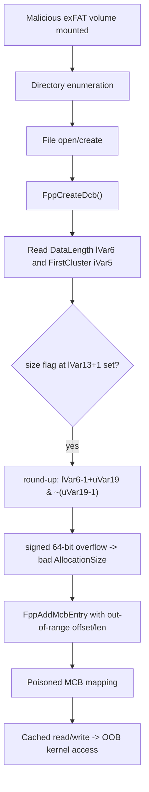

# CVE-2026-69619

**CVE:** CVE-2026-69619  
**Title:** Windows exFAT File System Elevation of Privilege Vulnerability  
**Source:** [https://msrc.microsoft.com/update-guide/vulnerability/CVE-2026-69619](https://msrc.microsoft.com/update-guide/vulnerability/CVE-2026-69619)  
**Component(s):** exfat.sys  
**Patched Date:** 2026-09-08T07:00:00  
**CWE:** Out-of-bounds read in Windows exFAT File System allows an authorized attacker to elevate privileges over a network.  

Download Patched & Vulnerable Components:

```bash
# exfat.sys
wget https://msdl.microsoft.com/download/symbols/exfat.sys/0FEF08DA69000/exfat.sys -O exfat.sys.10.0.26100.9278 # vulnerable
wget https://msdl.microsoft.com/download/symbols/exfat.sys/9837873F69000/exfat.sys -O exfat.sys.10.0.26100.9444 # patched
```

## Version Tracking Analysis

**Command:**

```
python ghidra_scripts\ghidra_vt_wrapper.py --old-binary ./reports/2026-Sep/CVE-2026-69619/exfat.sys.10.0.26100.9278 --new-binary ./reports/2026-Sep/CVE-2026-69619/exfat.sys.10.0.26100.9444 --project-dir ./reports/2026-Sep/CVE-2026-69619/ghidra_project --project-name exfat.sys_CVE-2026-69619 --ghidra-dir C:\Tools\ghidra_11.4.2_PUBLIC_20250826\ghidra_11.4.2_PUBLIC --output-dir ./reports/2026-Sep/CVE-2026-69619/ghidra_project/vt_results --max-memory 16g
```

Patched Functions: 12 | New Functions: 7 | Removed Functions: 1 | Total Matches: 6225 | Accepted Matches: 5726

### Patched Functions

*Showing top 10 of 12 patched functions*

| Function Name | Source Address | Dest Address | Similarity | Confidence |
| --- | --- | --- | --- | --- |
| `FppOpenExistingFile` | `14003256c` | `14003257c` | 0.989 | 10.0 |
| `FppCreateNewFile` | `1400307e4` | `1400307e4` | 0.987 | 10.0 |
| `NtOfsCreateAttributeEx` | `140007a74` | `1400084b4` | 0.971 | 10.0 |
| `FppDeleteFile` | `14003af88` | `14003af98` | 0.921 | 10.0 |
| `wil_details_FeatureReporting_ReportUsageToService` | `14000dbbc` | `1400059d0` | 0.905 | 10.0 |
| `EfspValidateAndParseFsctl` | `140052384` | `140052574` | 0.787 | 10.0 |
| `wil_details_FeatureStateCache_TryEnableDeviceUsageFastPath` | `14000e074` | `140005e98` | 0.729 | 10.0 |
| `wil_details_FeatureReporting_ReportUsageToServiceDirect` | `14000dcd8` | `140005af8` | 0.639 | 10.0 |
| `FppCreateFcb` | `1400482bc` | `1400483bc` | 0.635 | 10.0 |
| `EfspValidateStreamTransitionMetadata` | `14005769c` | `14005792c` | 0.632 | 10.0 |

### New Functions

| Function Name | Address |
| --- | --- |
| `Feature_3332605243__private_IsEnabledDeviceUsageNoInline` | `14000379c` |
| `Feature_3332605243__private_IsEnabledFallback` | `1400037d4` |
| `Feature_709593401__private_IsEnabledDeviceUsageNoInline` | `14000e2c8` |
| `Feature_709593401__private_IsEnabledFallback` | `14000e300` |
| `Feature_591104313__private_IsEnabledDeviceUsageNoInline` | `14001092c` |
| `Feature_591104313__private_IsEnabledFallback` | `140010964` |
| `_guard_dispatch_icall` | `140012ea0` |

### Removed Functions

| Function Name | Address |
| --- | --- |
| `_guard_dispatch_icall` | `140012c30` |

---

# AI Technical Analysis

## Vulnerability Identification

**Core Vulnerable Function(s):**

- `FppCreateDcb()` - Computes a file's `AllocationSize` by
  rounding the on-disk data length up to a cluster boundary
  using an overflow-prone expression, and builds the Mapped
  Control Block (MCB) from an unvalidated starting cluster.
  This is where attacker-controlled directory metadata is
  first trusted.

**Supporting Changes:**

- `FppFreeSecondaryAllocation()` - Contains a second instance
  of the identical round-up-and-map logic for secondary
  allocations. It receives the same feature-gated overflow
  and cluster-range hardening, confirming the root cause, but
  is a parallel path rather than the primary trigger.
- `EfspValidateStreamTransitionMetadata()` - A defensive
  validator. The patch adds a stack cookie and 512-byte
  alignment/range checks on EFS stream offsets. It hardens
  input parsing but is not the memory-corruption site.

**Unrelated Changes:**

- `FppOpenExistingFile()` - Only adds one trailing argument
  (`uVar14 = 0`) to the `FsRtlCheckOplockEx()` call and
  renames basic-block labels. A prototype change, not
  security-relevant to this CVE.
- `FppCreateNewFile()` - Same mechanical `FsRtlCheckOplockEx()`
  argument addition (`uVar25 = 0`) plus `memmove`-to-`memcpy`
  swaps. No behavioral security change.

---

## Root Cause Analysis

The flaw is an unvalidated-trust boundary combined with a
signed 64-bit integer overflow. `FppCreateDcb()` reads a
file's data length and first cluster straight from an on-disk
exFAT stream-extension directory entry and never confirms
they describe a region that fits inside the mounted volume.
The invariant that "allocation size, cluster count, and the
computed disk offset stay within the cluster heap" is
violated.

```c
uVar19 = 1 << (*(byte *)(param_2 + 0x145) & 0x1f);
if ((*(byte *)(lVar13 + 1) & 2) == 0) {
  *(undefined8 *)(_Dst + 6) = 0x7fffffffffffffff;
}
else {
  if (lVar6 == 0) {                 /* only size==0 checked */
    FppPopUpFileCorrupt(param_1,(longlong)_Dst);
    ExRaiseStatus();
  }
  _Dst[0x30] = _Dst[0x30] | 0x400;
  uVar18 = lVar6 + -1 + (ulonglong)uVar19 & ~(ulonglong)(uVar19 - 1);
  *(ulonglong *)(_Dst + 6) = uVar18;          /* AllocationSize */
  cVar10 = FppAddMcbEntry(param_2,puVar1,0,
      ((ulonglong)(iVar5 - 2) << (bVar2 & 0x3f)) + lVar13, uVar18);
}
```

Here `uVar19` is the bytes-per-cluster value derived from the
volume shift at `param_2 + 0x145`. `lVar6` is the file data
length taken from `lVar13 + 0x18`, where `lVar13` is the
stream-extension entry. The expression
`lVar6 + -1 + uVar19 & ~(uVar19 - 1)` rounds `lVar6` up to the
next cluster. When `lVar6` approaches `0x7fffffffffffffff`,
the addition of `uVar19 - 1` overflows the signed 64-bit
range and wraps to a tiny or negative value, so the stored
`AllocationSize` in `_Dst[6]` no longer matches the file's
real length. The only pre-existing guard is `lVar6 == 0`,
which catches an empty file but nothing at the high end.
Separately, `iVar5` (the first cluster, stored in `_Dst[0x20]`)
is fed directly into the disk-offset math
`((iVar5 - 2) << shift) + heap_base` with no check that
`iVar5 >= 2` or that `iVar5` is below the volume's total
cluster count at `param_2 + 0x138`. A crafted entry can
therefore make `FppAddMcbEntry()` map a run that begins or
extends outside the cluster heap, and the mismatched sizes
propagate into every later cached read and write of the file.

---

## Execution and Trigger Flow

An attacker prepares a malicious exFAT image and presents it
to the target, for example on a USB mass-storage device or a
mountable disk image. When the volume is mounted, the exFAT
driver enumerates directory entries and, for each file that
is opened or created, calls `FppCreateDcb()` to build the
Data Control Block. The function locates the stream-extension
entry through `lVar13 = *(longlong *)(puVar17 + 0xd0)` and
copies the raw data length from `lVar13 + 0x18` into `lVar6`
and the first-cluster index into `iVar5` (`_Dst[0x20]`). The
attacker sets the data length to a value near
`0x7fffffffffffffff` and sets the first cluster to an index
outside the valid range. Execution enters the `else` branch
because the size flag bit at `lVar13 + 1` is set. The
round-up expression overflows, yielding a corrupt
`AllocationSize`, and no bound rejects the out-of-range
`iVar5`. `FppAddMcbEntry()` is then invoked with the bad disk
offset and length, inserting a mapping that points beyond the
cluster heap. When the file system subsequently services a
cached read or write against this DCB, it translates file
offsets through the poisoned MCB and accesses kernel pool
memory outside the intended buffer, producing corruption or a
bug check. Because mounting can be triggered without user
interaction, this is reachable by an unprivileged local
attacker with physical or image-mount access.



---

## Patch Analysis

The patch gates new validation behind
`Feature_3332605243__private_IsEnabledDeviceUsageNoInline()`
and inserts checks at each point where untrusted length and
cluster values are consumed.

```diff
-      if (lVar6 == 0) {
-        FppPopUpFileCorrupt(param_1,(longlong)_Dst);
-        ...
-      }
-      uVar18 = lVar6 + -1 + (ulonglong)uVar19 & ~(ulonglong)(uVar19 - 1);
-      *(ulonglong *)(_Dst + 6) = uVar18;
+      if ((int)uVar13 != 0 &&
+         ((uint)_Dst[0x20] < 2 ||
+          (*(uint *)(param_2 + 0x138) <= _Dst[0x20] - 2))) {
+        FppPopUpFileCorrupt(param_1,(longlong)_Dst);
+        ...ExRaiseStatus();
+      }
+      if ((*(longlong *)(_Dst + 8) < 1) ||
+         ((longlong)(0x7fffffffffffffff - (ulonglong)(uVar18 - 1))
+           < *(longlong *)(_Dst + 8))) {
+        FppPopUpFileCorrupt(param_1,(longlong)_Dst);
+        ...ExRaiseStatus();
+      }
+      *(ulonglong *)(_Dst + 6) =
+        *(longlong *)(_Dst + 8) + ((ulonglong)uVar18 - 1)
+        & ~(ulonglong)(uVar18 - 1);
```

The first block validates the first cluster `_Dst[0x20]`:
values below `2` (the reserved cluster floor) or at or above
the total cluster count at `param_2 + 0x138` are rejected as
corruption. The second block is a pre-addition overflow guard:
it confirms the data length in `_Dst[8]` is positive and that
`0x7fffffffffffffff - (uVar18 - 1)` still leaves room before
the round-up adds `uVar18 - 1`. Only after both pass is
`AllocationSize` computed. A further feature-gated block
recomputes the cluster count implied by the rounded size,
`(_Dst[0x20] - 2) + (AllocationSize >> shift)`, and rejects it
if it exceeds the volume cluster count. On any failure the
code calls `FppPopUpFileCorrupt()`, sets status
`0xc0000102` (`STATUS_FILE_CORRUPT_ERROR`), and raises,
aborting the operation cleanly. The same overflow and range
guards are mirrored into `FppFreeSecondaryAllocation()`.

The fix is effective: every value that feeds the disk-offset
and MCB computation is now bounded before use, so the signed
overflow cannot occur and no run can map outside the heap.
Rejecting rather than clamping is correct, since a length or
cluster out of range signals a corrupt or hostile volume that
should not be trusted. The guards are placed before the first
dependent arithmetic, closing the window fully. Behavior for
legitimate volumes is unchanged because valid metadata always
satisfies these bounds.

Security impact summary: the patch converts a kernel
out-of-bounds access driven by attacker-supplied filesystem
metadata into a controlled corruption error. It removes a
local elevation-of-privilege and denial-of-service vector
reachable through mounting a malicious exFAT volume.