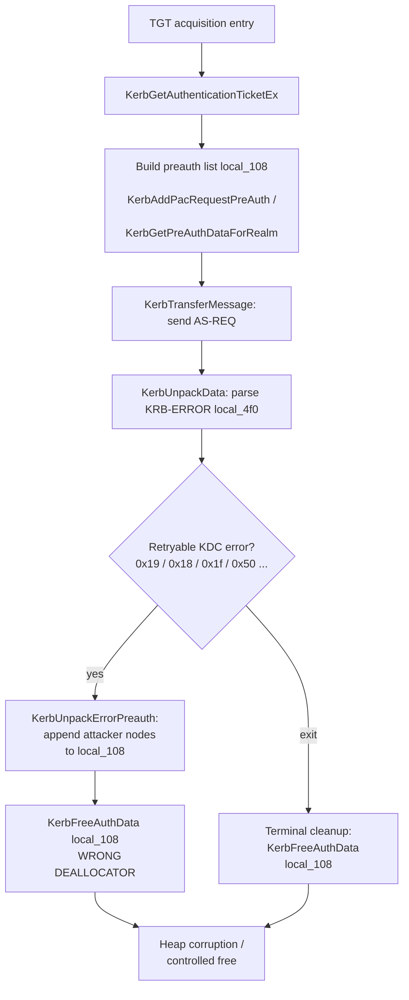

# CVE-2026-69676

**CVE:** CVE-2026-69676  
**Title:** Windows Kerberos Remote Code Execution Vulnerability  
**Source:** [https://msrc.microsoft.com/update-guide/vulnerability/CVE-2026-69676](https://msrc.microsoft.com/update-guide/vulnerability/CVE-2026-69676)  
**Component(s):** kerberos.dll  
**Patched Date:** 2026-09-08T07:00:00  
**CWE:** Authentication bypass by capture-replay in Windows Kerberos allows an authorized attacker to execute code over a network.  

---

## Related CVEs (Same Component)

This report covers 5 CVEs affecting the same component(s):

- **CVE-2026-69676**  
- CVE-2026-69685  
- CVE-2026-69744  
- CVE-2026-69760  
- CVE-2026-69822  

### Detailed Information

#### CVE-2026-69685

**Title:** Windows Kerberos Elevation of Privilege Vulnerability  
**Source:** [https://msrc.microsoft.com/update-guide/vulnerability/CVE-2026-69685](https://msrc.microsoft.com/update-guide/vulnerability/CVE-2026-69685)  
**Patched Date:** 2026-09-08T07:00:00  
**CWE:** Heap-based buffer overflow in Windows Kerberos allows an authorized attacker to elevate privileges locally.  

#### CVE-2026-69744

**Title:** Windows Kerberos Denial of Service Vulnerability  
**Source:** [https://msrc.microsoft.com/update-guide/vulnerability/CVE-2026-69744](https://msrc.microsoft.com/update-guide/vulnerability/CVE-2026-69744)  
**Patched Date:** 2026-09-08T07:00:00  
**CWE:** Null pointer dereference in Windows Kerberos allows an unauthorized attacker to deny service over a network.  

#### CVE-2026-69760

**Title:** Windows Kerberos Denial of Service Vulnerability  
**Source:** [https://msrc.microsoft.com/update-guide/vulnerability/CVE-2026-69760](https://msrc.microsoft.com/update-guide/vulnerability/CVE-2026-69760)  
**Patched Date:** 2026-09-08T07:00:00  
**CWE:** Out-of-bounds read in Windows Kerberos allows an unauthorized attacker to deny service over a network.  

#### CVE-2026-69822

**Title:** Windows Kerberos Elevation of Privilege Vulnerability  
**Source:** [https://msrc.microsoft.com/update-guide/vulnerability/CVE-2026-69822](https://msrc.microsoft.com/update-guide/vulnerability/CVE-2026-69822)  
**Patched Date:** 2026-09-08T07:00:00  
**CWE:** Numeric truncation error in Windows Kerberos allows an authorized attacker to elevate privileges locally.  

---

Download Patched & Vulnerable Components:

```bash
# kerberos.dll
wget https://msdl.microsoft.com/download/symbols/kerberos.dll/57A0C991168000/kerberos.dll -O kerberos.dll.10.0.26100.9278 # vulnerable
wget https://msdl.microsoft.com/download/symbols/kerberos.dll/789CAAEC168000/kerberos.dll -O kerberos.dll.10.0.26100.9444 # patched
```

## Version Tracking Analysis

**Command:**

```
python ghidra_scripts\ghidra_vt_wrapper.py --old-binary ./reports/2026-Sep/CVE-2026-69676/kerberos.dll.10.0.26100.9278 --new-binary ./reports/2026-Sep/CVE-2026-69676/kerberos.dll.10.0.26100.9444 --project-dir ./reports/2026-Sep/CVE-2026-69676/ghidra_project --project-name kerberos.dll_CVE-2026-69676 --ghidra-dir C:\Tools\ghidra_11.4.2_PUBLIC_20250826\ghidra_11.4.2_PUBLIC --output-dir ./reports/2026-Sep/CVE-2026-69676/ghidra_project/vt_results --max-memory 16g
```

Patched Functions: 15 | New Functions: 45 | Removed Functions: 23 | Total Matches: 213921 | Accepted Matches: 21624

### Patched Functions

*Showing top 10 of 15 patched functions*

| Function Name | Source Address | Dest Address | Similarity | Confidence |
| --- | --- | --- | --- | --- |
| `KerbGetAuthenticationTicketEx` | `1800704b0` | `18006eba0` | 0.999 | 10.0 |
| `SpInitLsaModeContext_Old` | `180047d70` | `1800435a0` | 0.997 | 10.0 |
| `KerbCredIsoApi::ConvertBoundEncryptionKey` | `1800b79f0` | `1800b7ef0` | 0.983 | 1.0 |
| `KerbAcceptFinalizeContext` | `1800f0464` | `1800f0cc4` | 0.981 | 10.0 |
| `KerbMakeTokenInformationV3` | `18009f070` | `18009d9c4` | 0.961 | 10.0 |
| `KerbGetPreAuthDataForRealm` | `180075410` | `180073b00` | 0.946 | 10.0 |
| `KerbProcessTargetNames` | `18004c1f0` | `180047a00` | 0.932 | 10.0 |
| `KerbAcceptStream` | `1800f0ad8` | `1800f1340` | 0.910 | 10.0 |
| `KerbCreateServerContext` | `180003e00` | `180003800` | 0.902 | 10.0 |
| `KerbDecryptServiceTicket` | `180069c40` | `18006a3c0` | 0.852 | 10.0 |

### New Functions

*Showing 10 of 45 new functions*

| Function Name | Address |
| --- | --- |
| `KerbIsServiceHostTarget` | `18000c654` |
| `KerbGetApOptionsInAD` | `180020aa8` |
| `KerbDuplicateString` | `180037640` |
| `CheckForLocalClient` | `180039c7c` |
| `~basic_streambuf<unsigned_short,std::char_traits<unsigned_short>_>` | `18008a288` |
| `_Lock` | `18008a2a0` |
| `_Unlock` | `18008a2b0` |
| `showmanyc` | `18008a2c0` |
| `uflow` | `18008a2d0` |
| `xsgetn` | `18008a2e0` |

### Removed Functions

*Showing 10 of 23 removed functions*

| Function Name | Address |
| --- | --- |
| `Write<_tlgWrapperByVal<8>,_tlgWrapperByVal<4>,_tlgWrapperByVal<2>,_tlgWrapperByVal<4>,_tlgWrapBuffer<_UNICODE_STRING>,_tlgWrapperByVal<4>_>` | `180002230` |
| `~basic_streambuf<unsigned_short,std::char_traits<unsigned_short>_>` | `18008bc28` |
| `_Lock` | `18008bc40` |
| `_Unlock` | `18008bc50` |
| `showmanyc` | `18008bc60` |
| `uflow` | `18008bc70` |
| `xsgetn` | `18008bc80` |
| `xsputn` | `18008bc90` |
| `setbuf` | `18008bca0` |
| `sync` | `18008bcb0` |

---

# AI Technical Analysis

## Vulnerability Identification

**Core Vulnerable Function(s):**

- `KerbGetAuthenticationTicketEx()` - Frees the KDC-request
  pre-authentication list `local_108`, a
  `KERB_KDC_REQUEST_preauth_data_s` linked list with nested
  heap buffers, using the wrong deallocator `KerbFreeAuthData()`
  instead of `KerbFreePreAuthData()`. Because the list is
  populated from attacker-controlled KDC error responses, the
  mismatched free mishandles inner pointers and corrupts the
  heap.

**Supporting Changes:**

- `KerbGetAuthenticationTicketEx()` cleanup tail - The related
  switch of flat wire buffers (`local_320`, `local_370`,
  `local_308`, `local_330`, `local_2c0`) from `KerbFree()` to
  `MIDL_user_free()` corrects a companion allocator mismatch on
  RPC/MIDL-owned memory. These harden deallocation but are not
  the primary type-confusion sink.

**Unrelated Changes:**

- WPP trace renumbering (`WPP_173971...` to `WPP_40ecdcdb...`,
  event ids `0x65` to `0x66`, etc.) - Logging metadata only.
- Telemetry refactor (`_tlgWrapperByVal<4>::...` to
  `_tlgWrapAuto<long>`) and decompiler-level register/type
  renames (`uVar51` to `uVar56`, `local_51c` to `bVar9`) -
  No behavioral effect.
- The DMSA `if`/`else` reordering around
  `KerbHandleDmsaMigrationComplete()` is semantically
  equivalent branch presentation, not a fix.

---

## Root Cause Analysis

The defect is a deallocator type confusion. The function
tracks an outbound pre-authentication data list in `local_108`,
typed `KERB_KDC_REQUEST_preauth_data_s *`. Each node is a
singly linked record carrying an owned, separately allocated
payload buffer. The code releases this list with
`KerbFreeAuthData()`, whose structural contract differs from
the pre-auth record layout, violating the invariant that a
structure must be released by the allocator family that
understands its fields.

Vulnerable construction of a list node:

```c
puVar29 = _KerbAllocate__YAPEAX_K_Z(0x20);
*(undefined8 **)pKVar42 = puVar29;
if (puVar29 != (undefined8 *)0x0) {
  *puVar29 = 0;                         /* next  @0x00 */
  *(undefined4 *)(puVar29 + 1) = 0x82;  /* type  @0x08 */
  *(ulong *)(puVar29 + 2) = uVar52;      /* size  @0x10 */
  _Dst = _KerbAllocate__YAPEAX_K_Z(uVar34);
  puVar29[3] = _Dst;                     /* buf   @0x18 */
  if (_Dst != (void *)0x0) {
    memcpy(_Dst,local_388,uVar34);
```

Vulnerable release:

```c
KerbFreeAuthData((undefined8 *)local_108);
local_108 = (KERB_KDC_REQUEST_preauth_data_s *)0x0;
```

Each node is `0x20` bytes: `next` at `0x00`, a type tag at
`0x08` (here `0x82`, or `0x83` on the sibling path), a length
at `0x10`, and an owned buffer pointer at `0x18`. The length
field `uVar52` and tag are derived from KDC responses, and the
buffer at `0x18` is filled by `memcpy` from `local_388`. The
correct routine `KerbFreePreAuthData()` walks the `next` chain
and frees both the node and its `0x18` payload. `KerbFreeAuthData()`
instead applies the authorization-data layout, so it dereferences
node offsets under the wrong schema. Fields that hold scalar
values under the pre-auth layout (the `0x10` length, populated
from `uVar52`/`local_50c`, itself taken from
`*(ulong *)(local_4f0 + 0x34)`, the KDC error code) can be
interpreted as pointers and passed to the heap free path. The
list also grows across the retry loop, since
`KerbUnpackErrorPreauth(local_4f0,&local_3d0)` and
`KerbGetPreAuthDataForRealm()` add entries per KDC round trip.
That gives an attacker positioned as, or between the client
and, the KDC repeated control over node contents before the
mismatched free executes, producing heap corruption or a
partially controlled free primitive.

---

## Execution and Trigger Flow

The function runs during interactive or service TGT
acquisition, building an AS-REQ and exchanging it with a KDC.
It first assembles `local_108` through
`KerbAddPacRequestPreAuth()` and
`KerbGetPreAuthDataForRealm()`, then packs and transmits the
request via `KerbTransferMessage()`. The KDC replies, and for
error classes handled in the retry loop, such as
`KDC_ERR_PREAUTH_REQUIRED` (`local_518 == 0x19`), etype or
salt errors (`0x18`, `0x1f`), and SHA2 or FAST errors, the code
loops back to `LAB_18006fd60`. On each pass it invokes
`KerbUnpackErrorPreauth()` to append KDC-supplied pre-auth
entries into the node chain, then calls
`KerbFreeAuthData((undefined8 *)local_108)` before rebuilding.
Because the chain and its `0x18` payloads were shaped by the
attacker-controlled error, the wrong deallocator misparses the
records at free time. A malicious or compromised KDC, or an
on-path attacker, only needs to return crafted `KRB-ERROR`
pre-auth data across one or more rounds, then let the client
reach either the loop free or the terminal cleanup free at
function exit. The consequence is heap metadata corruption in
the LSASS process, which is a path to privilege escalation or
remote code execution in the security authority.



---

## Patch Analysis

The patch replaces every release of `local_108` with the
type-correct routine and aligns companion buffer frees to the
RPC allocator.

```diff
-                      KerbFreeAuthData((undefined8 *)local_108);
+                      KerbFreePreAuthData((undefined8 *)local_108);
```

```diff
-  KerbFreeAuthData((undefined8 *)local_108);
+  KerbFreePreAuthData((undefined8 *)local_108);
```

```diff
-    KerbFree(local_320);
+    MIDL_user_free(local_320);
```

The core change routes deallocation of the
`KERB_KDC_REQUEST_preauth_data_s` chain to
`KerbFreePreAuthData()`, the function whose layout matches the
node structure produced at allocation time. This ensures the
`next` pointer at offset `0x00` is followed correctly, the
owned payload at offset `0x18` is freed as a heap buffer, and
the scalar fields at `0x08` and `0x10` are never treated as
pointers. Both the retry-loop release and the terminal cleanup
release are converted, closing every reachable path to the
sink. The companion edits move `local_320`, `local_370`,
`local_308`, `local_330`, and `local_2c0` from `KerbFree()` to
`MIDL_user_free()`, matching how those network and marshalled
buffers were allocated. Together these keep each object with a
single, consistent allocator across its lifetime.

The fix is effective because the vulnerability is a static
mismatch between an allocation shape and a free routine, and
the patch removes the mismatch at its only sinks rather than
adding a runtime guard that could be bypassed. Since both the
loop and exit frees are corrected, an attacker cannot steer
execution to a surviving vulnerable free. No new input
validation is required because the flaw was never about input
range; it was about structural interpretation at free time.
The change is low risk, as it swaps a callee for its correct
counterpart without altering control flow or the request
protocol.

Security impact: the mismatched free operated on
attacker-influenced pre-authentication records inside the
security authority, enabling heap corruption and a potential
controlled-free primitive. Correcting the deallocator
eliminates the type confusion and the associated privilege
escalation and remote-code-execution exposure through a
malicious or on-path KDC.