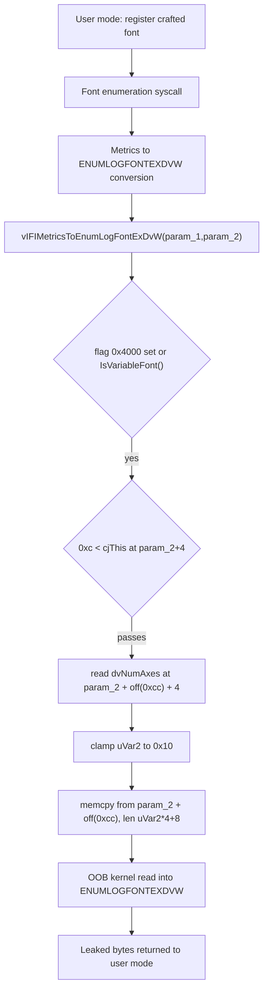

# CVE-2026-70289

**CVE:** CVE-2026-70289  
**Title:** Windows Win32k Elevation of Privilege Vulnerability  
**Source:** [https://msrc.microsoft.com/update-guide/vulnerability/CVE-2026-70289](https://msrc.microsoft.com/update-guide/vulnerability/CVE-2026-70289)  
**Component(s):** win32kfull.sys  
**Patched Date:** 2026-09-08T07:00:00  
**CWE:** Heap-based buffer overflow in Windows Win32 Kernel Subsystem allows an authorized attacker to elevate privileges locally.  

---

## Related CVEs (Same Component)

This report covers 2 CVEs affecting the same component(s):

- **CVE-2026-70289**  
- CVE-2026-70290  

### Detailed Information

#### CVE-2026-70290

**Title:** Win32k Information Disclosure Vulnerability  
**Source:** [https://msrc.microsoft.com/update-guide/vulnerability/CVE-2026-70290](https://msrc.microsoft.com/update-guide/vulnerability/CVE-2026-70290)  
**Patched Date:** 2026-09-08T07:00:00  
**CWE:** Use of uninitialized resource in Windows Win32 Kernel Subsystem allows an authorized attacker to disclose information locally.  

---

Download Patched & Vulnerable Components:

```bash
# win32kfull.sys
wget https://msdl.microsoft.com/download/symbols/win32kfull.sys/81EDD1DD430000/win32kfull.sys -O win32kfull.sys.10.0.26100.9278 # vulnerable
wget https://msdl.microsoft.com/download/symbols/win32kfull.sys/A326E51B431000/win32kfull.sys -O win32kfull.sys.10.0.26100.9444 # patched
```

## Version Tracking Analysis

**Command:**

```
python ghidra_scripts\ghidra_vt_wrapper.py --old-binary ./reports/2026-Sep/CVE-2026-70289/win32kfull.sys.10.0.26100.9278 --new-binary ./reports/2026-Sep/CVE-2026-70289/win32kfull.sys.10.0.26100.9444 --project-dir ./reports/2026-Sep/CVE-2026-70289/ghidra_project --project-name win32kfull.sys_CVE-2026-70289 --ghidra-dir C:\Tools\ghidra_11.4.2_PUBLIC_20250826\ghidra_11.4.2_PUBLIC --output-dir ./reports/2026-Sep/CVE-2026-70289/ghidra_project/vt_results --max-memory 16g
```

Patched Functions: 24 | New Functions: 71 | Removed Functions: 23 | Total Matches: 247365 | Accepted Matches: 62375

### Patched Functions

*Showing top 10 of 24 patched functions*

| Function Name | Source Address | Dest Address | Similarity | Confidence |
| --- | --- | --- | --- | --- |
| `RundownAPCInvalidateCOMPOSITEDWnd` | `14021a760` | `1402191b0` | 0.992 | 1.0 |
| `PUBLIC_PFTOBJ::bLoadFonts` | `1400ecf88` | `1400ee858` | 0.988 | 10.0 |
| `cMapRemoteFonts` | `140197eb8` | `140196d48` | 0.972 | 10.0 |
| `bProxyDrvTextOut` | `1400992e8` | `140099008` | 0.949 | 10.0 |
| `GreMakeFontDir` | `1401feb2c` | `1401ddd4c` | 0.947 | 10.0 |
| `ESTROBJ::bLinkedTextToPath` | `1400977dc` | `140097704` | 0.942 | 10.0 |
| `NtGdiAddRemoteFontToDC` | `14031a780` | `14031ac00` | 0.927 | 10.0 |
| `GrepAddFontMemResource` | `140197d94` | `140196c24` | 0.914 | 10.0 |
| `_SetCursorIconDataEx` | `140154ed8` | `14014f478` | 0.864 | 10.0 |
| `bCreateFontFileView` | `1400929a0` | `1400929a0` | 0.798 | 10.0 |

### New Functions

*Showing 10 of 71 new functions*

| Function Name | Address |
| --- | --- |
| `vFontSet` | `140099888` |
| `bIFIMetricsToLogFontW2` | `1401941f8` |
| `ulGetNearestFromPalentry` | `1401a8da4` |
| `FUN_14027413f` | `14027413f` |
| `PopulateCustomDispatcherObjectsArray` | `14028bec0` |
| `RegisterInputDispatcherObjects` | `14028bee0` |
| `Delete` | `14028bf20` |
| `IsDestroyed` | `14028c140` |
| `DestroyCursorIfNotRoot` | `14028ecd4` |
| `Feature_2349311290__private_IsEnabledDeviceUsageNoInline` | `140298eb8` |

### Removed Functions

*Showing 10 of 23 removed functions*

| Function Name | Address |
| --- | --- |
| `FUN_140273d0f` | `140273d0f` |
| `PopulateCustomDispatcherObjectsArray` | `14028bd80` |
| `RegisterInputDispatcherObjects` | `14028bda0` |
| `Delete` | `14028bde0` |
| `IsDestroyed` | `14028c000` |
| `_guard_dispatch_icall` | `14035b5a0` |
| `RtlCaptureContext` | `140430000` |
| `RtlCopyMemory` | `140430008` |
| `RtlCopyMemoryNonTemporal` | `140430010` |
| `RtlFillMemory` | `140430018` |

---

# AI Technical Analysis

## Vulnerability Identification

**Core Vulnerable Function(s):**

- `vIFIMetricsToEnumLogFontExDvW()` - Performs an unchecked
  `memcpy()` sourced from an attacker-influenced font design
  vector whose offset and axis count are only loosely validated
  by an integer size test, enabling an out-of-bounds read of
  kernel memory into a caller-visible output structure.

- `PFEMEMOBJ::bInit()` - Consumes the same design vector axis
  count (`dvNumAxes`) with the identical weak `0x10 < size`
  guard to size a font object allocation, so it shares the root
  cause and was patched with the same new validator.

**Supporting Changes:**

- `NtGdiAddRemoteMMInstanceToDC()` - Caller/entry refactor. The
  user buffer bound (`param_3 <= 0x50`) and `local_6c <= 0x10`
  copy limit exist before and after; the diff adds feature-flag
  branches, `vUnmapRemoteFonts()` cleanup, and a larger
  `PALLOCMEM(0x88)` record. Not the flaw.

- `EFSOBJ::WriteEFE()` - Defensive patch. A raw `memcpy()` to a
  destination pointer is replaced, under a feature flag, by
  `GreProbeAndWriteToUntrustedVa()`. Hardening of a separate
  write path, not the identified vulnerability.

- `_SetCursorIconDataEx()` - Hardening refactor. Handle-flag
  validation is tightened and `RtlCopyVolatileMemory()` becomes
  `RtlpCopyDeviceMemory()`; the bounds loops are preserved.

**Unrelated Changes:**

- `bIFIMetricsToLogFontW2()` - New sibling conversion routine;
  no unbounded copy of the design vector.
- `vFontSet()`, `ulGetNearestFromPalentry()`,
  `PopulateCustomDispatcherObjectsArray()`,
  `RegisterInputDispatcherObjects()` - Feature-flag toggles,
  palette dispatch, and thunk stubs. No memory-safety relevance.

---

## Root Cause Analysis

The vulnerability is a trust boundary error: the code treats a
length field embedded in a font's `_IFIMETRICS` structure as
sufficient proof that a nested variable-font design vector is
well formed, then copies that design vector without confirming
its offset and element count actually lie inside the structure.
The violated invariant is that `dpDesignVector` (at offset
`0xcc`) and the axis count stored at `dpDesignVector + 4` must
both describe memory contained within the allocated
`_IFIMETRICS` buffer before any copy occurs.

Vulnerable code (before):

```c
if ((*(uint *)(param_2 + 0x30) & 0x4000) == 0) {
  bVar1 = IsVariableFont(param_2);
  if (bVar1) goto LAB_1401477f2;
}
else {
LAB_1401477f2:
  if (0xc < *(uint *)(param_2 + 4)) {
    uVar2 = *(uint *)(param_2 + *(int *)(param_2 + 0xcc) + 4);
    if (0x10 < uVar2) {
      uVar2 = 0x10;
    }
    memcpy(param_1 + 0x15c,
           param_2 + *(int *)(param_2 + 0xcc),
           (ulonglong)uVar2 * 4 + 8);
    goto LAB_1401477db;
  }
}
```

The guard `0xc < *(uint *)(param_2 + 4)` only asserts that the
whole-structure size field `cjThis` exceeds twelve bytes. It
says nothing about the design vector. Execution then reads
`*(int *)(param_2 + 0xcc)`, an offset that is added directly to
`param_2` to locate the design vector; a malformed font can set
this offset to point past the end of the buffer. The axis count
`uVar2` is loaded from `param_2 + offset + 4`, itself a
potentially out-of-bounds fetch. The `if (0x10 < uVar2)` clamp
caps `uVar2` at sixteen, so the copy length `uVar2 * 4 + 8`
never exceeds `0x48` bytes and the destination field at
`param_1 + 0x15c` cannot overflow. The unbounded quantity is the
source: `param_2 + *(int *)(param_2 + 0xcc)` is never checked
against the buffer end, so up to `0x48` bytes are read from
wherever that offset lands. Those bytes are written into the
`ENUMLOGFONTEXDVW` output at `param_1 + 0x15c` and
`param_1 + 0x160` gets `uVar2`, both returned toward the caller.
The result is a disclosure of adjacent kernel pool memory. The
same weak pattern (`0x10 < *(uint *)(param_5 + 4)`) drives a
size computation in `PFEMEMOBJ::bInit()`, confirming the flaw
is design-vector validation, not a single call site.

---

## Execution and Trigger Flow

An attacker begins by crafting a font whose `_IFIMETRICS`
carries a design vector: the flags word at offset `0x30` has bit
`0x4000` set (or `IsVariableFont()` returns true), which steers
control to `LAB_1401477f2`. The attacker sets the structure size
field at offset `4` to any value above twelve so the sole guard
passes. The malicious payload is the design vector pointer at
offset `0xcc`, which is given a value that places
`param_2 + offset` outside the real bounds of the structure.
The font is registered and then enumerated through the standard
Windows font enumeration path, which converts each face's
metrics into an `ENUMLOGFONTEXDVW` record and invokes
`vIFIMetricsToEnumLogFontExDvW()`. Inside, `uVar2` is read from
the far offset and clamped to sixteen, and `memcpy()` copies
`uVar2 * 4 + 8` bytes from the out-of-bounds source into the
output. Because the clamp bounds only the destination, the
copy reads kernel memory beyond the font buffer. The populated
`ENUMLOGFONTEXDVW`, now containing leaked bytes, is delivered
back through the enumeration callback to user mode. Repeated
enumeration with varied offsets lets the attacker walk kernel
pool memory and defeat address-space layout randomization,
staging a follow-on exploit.



---

## Patch Analysis

Patched code (after):

```diff
-    if (0xc < *(uint *)(param_2 + 4)) {
+    bVar1 = HasValidDesignVector(param_2);
+    if (bVar1) {
       uVar2 = *(uint *)(param_2 + *(int *)(param_2 + 0xcc) + 4);
       if (0x10 < uVar2) {
         uVar2 = 0x10;
       }
       memcpy(param_1 + 0x15c,
              param_2 + *(int *)(param_2 + 0xcc),
              (ulonglong)uVar2 * 4 + 8);
     }
```

The correction replaces the crude numeric test on the
structure size field with a semantic predicate,
`HasValidDesignVector(param_2)`, whose boolean result gates the
entire copy. Where the old code accepted any `_IFIMETRICS` whose
`cjThis` at offset `4` exceeded twelve, the new code requires
that the design vector itself be internally consistent. The
validator is positioned before both the axis-count fetch at
`param_2 + *(int *)(param_2 + 0xcc) + 4` and the `memcpy()`, so a
font that fails validation now falls through to the error path
that writes the sentinel `0x8007664` into `param_1 + 0x15c`.
`PFEMEMOBJ::bInit()` receives the parallel fix, swapping its
`0x10 < *(uint *)(param_5 + 4)` test for
`HasValidAxesList(param_5)` before it scales the allocation by
`dvNumAxes * 0x28`. The two validators share a naming and design
convention indicating a single hardening effort against
malformed design vectors.

The fix is effective for the disclosure primitive because the
out-of-bounds source read can only occur when `dpDesignVector`
and the axis count describe memory inside the structure, which
`HasValidDesignVector()` now enforces. Since the copy is
skipped entirely on failure, there is no residual partial-read
window, and the sentinel value keeps the output field
deterministic. Effectiveness ultimately depends on
`HasValidDesignVector()` correctly bounding both the offset at
offset `0xcc` and the count at `offset + 4` against the true
buffer length; the diff does not expose that routine's body, so
its completeness cannot be verified from the code shown.
Assuming a correct implementation, both the enumeration read and
the `bInit()` sizing computation are constrained to in-bounds
data.

Security impact: the flaw permitted an unprivileged process to
leak up to `0x48` bytes of adjacent kernel pool memory per
enumerated face, a repeatable kernel information disclosure
useful for breaking kernel ASLR. The patch closes the read by
validating the design vector before any offset dereference,
neutralizing the leak at its source.