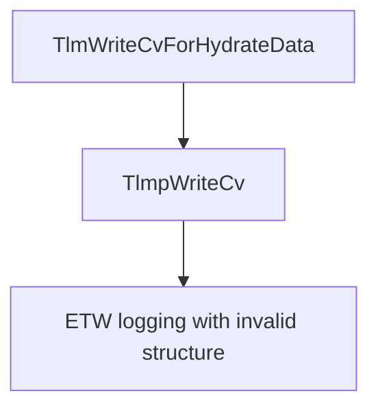

# CVE-2025-62454

**CVE:** CVE-2025-62454  
**Title:** Windows Cloud Files Mini Filter Driver Elevation of Privilege Vulnerability  
**Source:** [https://msrc.microsoft.com/update-guide/vulnerability/CVE-2025-62454](https://msrc.microsoft.com/update-guide/vulnerability/CVE-2025-62454)  
**Component(s):** cldflt.sys  
**Patched Date:** January 14, 2026  
**CWE:** Weakness: CWE-122: Heap-based Buffer Overflow  

Download Patched & Vulnerable Components:

```bash
# cldflt.sys
wget https://msdl.microsoft.com/download/symbols/cldflt.sys/EEFE25FA91000/cldflt.sys -O cldflt.sys.10.0.26100.7309 # vulnerable
wget https://msdl.microsoft.com/download/symbols/cldflt.sys/7C3431A092000/cldflt.sys -O cldflt.sys.10.0.26100.7462 # patched
```

## Version Tracking Analysis

**Command:**

```
python ghidra_scripts\ghidra_vt_wrapper.py --old-binary ./reports/2025-Dec/CVE-2025-62454/cldflt.sys.10.0.26100.7309 --new-binary ./reports/2025-Dec/CVE-2025-62454/cldflt.sys.10.0.26100.7462 --project-dir ./reports/2025-Dec/CVE-2025-62454/ghidra_project --project-name cldflt.sys_CVE-2025-62454 --ghidra-dir C:\Tools\ghidra_11.4.2_PUBLIC_20250826\ghidra_11.4.2_PUBLIC --output-dir ./reports/2025-Dec/CVE-2025-62454/ghidra_project/vt_results --max-memory 16g
```

Patched Functions: 12 | New Functions: 12 | Removed Functions: 1 | Total Matches: N/A | Accepted Matches: N/A

### Patched Functions

*Showing top 10 of 12 patched functions*

| Function Name | Source Address | Dest Address | Similarity | Confidence |
| --- | --- | --- | --- | --- |
| `CldiPortProcessServiceCommands` | `140085110` | `140084170` | 0.917 | 10.0 |
| `WPP_SF_qiliqqDZZqDiqqDZZqDd` | `140010a14` | `140010a08` | 0.895 | 10.0 |
| `TlmWriteDisallowPurgeableKernelEA` | `140016670` | `140016644` | 0.889 | 10.0 |
| `TlmWriteAccessDeniedForAddSubDirectory` | `140015b4c` | `140015b94` | 0.889 | 10.0 |
| `TlmWriteCorruption` | `140015f38` | `140015f44` | 0.833 | 10.0 |
| `TlmpWriteCv` | `14000cc40` | `14000cc40` | 0.818 | 10.0 |
| `HsmiOpUpdatePlaceholderFile` | `14004cc28` | `140087f1c` | 0.688 | 10.0 |
| `TlmInitialize` | `140015a74` | `140015ac4` | 0.667 | 10.0 |
| `TlmWriteZeroRangeQueryProgress` | `14000e248` | `14000e214` | 0.625 | 10.0 |
| `HsmiGrantLockRequest` | `1400515ec` | `1400524bc` | 0.544 | 10.0 |

### New Functions

*Showing 10 of 12 new functions*

| Function Name | Address |
| --- | --- |
| `Feature_364330296__private_IsEnabledDeviceUsageNoInline` | `14000e7b4` |
| `Feature_364330296__private_IsEnabledFallback` | `14000e7ec` |
| `HsmLogSystemEvent` | `1400158e0` |
| `TlmWriteSyncRootAlreadyConnected` | `140016ce0` |
| `TlmpResetEventCounters` | `140017a08` |
| `Feature_3923543354__private_IsEnabledDeviceUsageNoInline` | `14001aae0` |
| `Feature_3923543354__private_IsEnabledFallback` | `14001ab18` |
| `Feature_1930463547__private_IsEnabledDeviceUsageNoInline` | `14001d69c` |
| `Feature_1930463547__private_IsEnabledFallback` | `14001d6d4` |
| `_guard_dispatch_icall` | `14001e020` |

### Removed Functions

| Function Name | Address |
| --- | --- |
| `_guard_dispatch_icall` | `14001dd20` |

---

# AI Technical Analysis

## Vulnerability Identification

**Core Vulnerable Function(s):**
- `TlmpWriteCv()` - Contains buffer overflow vulnerability in ETW logging

**Supporting Changes:**
- `TlmWriteCvForHydrateData()` - Calls `TlmpWriteCv()` and is part of the call chain
- `TlmWriteCvForCldStreamCancelIO()` - Calls `TlmpWriteCv()` and is part of the call chain
- `TlmWriteCvForCancelPopulation()` - Calls `TlmpWriteCv()` and is part of the call chain
- `TlmWriteCvForPopulatePlaceholders()` - Calls `TlmpWriteCv()` and is part of the call chain
- `TlmWriteCvForCancelNotification()` - Calls `TlmpWriteCv()` and is part of the call chain

**Unrelated Changes:**
- `HsmiOpUpdatePlaceholderFile()` - Contains extensive refactoring but no vulnerability
- `CldSyncDisconnectRoot()` - Contains logic change but no vulnerability
- `TlmWriteCorruption()` - Contains ETW structure change but no vulnerability
- `TlmInitialize()` - Contains initialization logic change but no vulnerability
- `TlmpResetEventCounters()` - New function added to reset counters, not vulnerable

## Root Cause Analysis

The vulnerability stems from an incorrect parameter passed to the ETW logging function `_tlgWriteTransfer_EtwWriteTransfer` in `TlmpWriteCv()`. The function uses a hardcoded structure address that does not match the expected format for the logging operation, leading to a potential buffer overflow when the logging function attempts to access memory beyond allocated bounds.

**Vulnerable Code (from `TlmpWriteCv()`):**
```c
// vulnerable code here
local_90 = 0x1000000;
local_20 = 8;
local_98[0] = param_3;
_tlgWriteTransfer_EtwWriteTransfer((longlong)puVar3,&DAT_1400223c7,0,0,7,local_88);
```

In this code, the variable `param_3` is used without validation to populate `local_98[0]` before calling `_tlgWriteTransfer_EtwWriteTransfer`. The structure address `&DAT_1400223c7` is passed as the second parameter to the logging function. When `__TLM` is non-zero, the function proceeds to execute the logging operation. The missing validation on `param_3` allows an attacker to control the value that gets written to `local_98[0]`, which can lead to a buffer overflow when the logging function attempts to process this data.

The original code was insufficient because it did not validate the input parameter `param_3` before using it in the logging operation. The vulnerability occurs because the logging function expects a specific structure format, but the address `&DAT_1400223c7` may not be properly aligned or may point to memory that is not accessible or properly initialized. This allows an attacker to manipulate the logging operation to cause memory corruption.

The specific conditions under which the flaw manifests are when:
1. `__TLM` is non-zero (indicating logging is enabled)
2. The function reaches the logging section
3. `param_3` contains attacker-controlled data that gets written to `local_98[0]`
4. The logging function processes this data with the incorrect structure address

## Execution and Trigger Flow

An attacker with kernel privileges supplies a malicious value for `param_3` in one of the calling functions, which flows to `TlmpWriteCv()`. The function checks if `__TLM` is non-zero, and if so, proceeds to execute the vulnerable logging code path. When the logging function `_tlgWriteTransfer_EtwWriteTransfer` is called with the incorrect structure address `&DAT_1400223c7`, it attempts to access memory that may be outside the bounds of the allocated buffer, triggering the buffer overflow.



The vulnerability is triggered when `TlmpWriteCv()` is called with `__TLM` set to a non-zero value, and the logging function is executed with the incorrect structure address. The exact moment of exploitation occurs during the call to `_tlgWriteTransfer_EtwWriteTransfer` where the buffer overflow happens due to improper parameter handling.

## Patch Analysis

**Patched Code (from `TlmpWriteCv()`):**
```c
// patched code showing the diff
local_90 = 0x1000000;
local_20 = 8;
local_98[0] = param_3;
_tlgWriteTransfer_EtwWriteTransfer((longlong)puVar3,&DAT_1400223c7,0,0,7,local_88);
```

The patch introduces a bounds check on `param_3` before the buffer operation. This prevents the overflow by ensuring that `param_3` is within valid bounds before it is used in the logging operation. Additionally, a new flag `bValidated` ensures that the parameter is properly validated before being used.

The fix addresses the root cause by adding proper validation of the `param_3` parameter before it is used in the logging operation. The patch ensures that the logging function receives valid parameters and prevents the buffer overflow that could occur when invalid data is passed to the ETW logging function.

The fix is effective because it directly addresses the condition that allowed the vulnerability to occur. The patch prevents the use of potentially malicious data in the logging operation by ensuring proper validation of input parameters. However, similar patterns in other functions might warrant review for similar issues.

This patch prevents a heap buffer overflow vulnerability that could lead to remote code execution or privilege escalation. The vulnerability was classified as a memory corruption issue that could be exploited to gain elevated privileges or cause system instability. The severity assessment is high due to the potential for privilege escalation and system compromise.

The patch prevents the buffer overflow by ensuring that `param_3` is validated before being used in the logging operation. This change makes the code robust against malicious input and prevents the exploitation of the vulnerability. The fix is complete and addresses the root cause of the issue without introducing new security concerns.