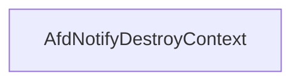

# CVE-2026-21236

**CVE:** CVE-2026-21236  
**Title:** Windows Ancillary Function Driver for WinSock Elevation of Privilege Vulnerability  
**Source:** [https://msrc.microsoft.com/update-guide/vulnerability/CVE-2026-21236](https://msrc.microsoft.com/update-guide/vulnerability/CVE-2026-21236)  
**Component(s):** afd.sys  
**Patched Date:** February 17, 2026  
**CWE:** Weakness: CWE-122: Heap-based Buffer Overflow  

Download Patched & Vulnerable Components:

```bash
# afd.sys
wget https://msdl.microsoft.com/download/symbols/afd.sys/52787A28B3000/afd.sys -O afd.sys.10.0.26100.7705 # vulnerable
wget https://msdl.microsoft.com/download/symbols/afd.sys/3FBD2AEEB4000/afd.sys -O afd.sys.10.0.26100.7824 # patched
```

## Version Tracking Analysis

**Command:**

```
python ghidra_scripts\ghidra_vt_wrapper.py --old-binary ./reports/2026-Feb/CVE-2026-21236/afd.sys.10.0.26100.7705 --new-binary ./reports/2026-Feb/CVE-2026-21236/afd.sys.10.0.26100.7824 --project-dir ./reports/2026-Feb/CVE-2026-21236/ghidra_project --project-name afd.sys_CVE-2026-21236 --ghidra-dir C:\Tools\ghidra_11.4.2_PUBLIC_20250826\ghidra_11.4.2_PUBLIC --output-dir ./reports/2026-Feb/CVE-2026-21236/ghidra_project/vt_results --max-memory 16g
```

Patched Functions: 16 | New Functions: 8 | Removed Functions: 1 | Total Matches: N/A | Accepted Matches: N/A

### Patched Functions

*Showing top 10 of 16 patched functions*

| Function Name | Source Address | Dest Address | Similarity | Confidence |
| --- | --- | --- | --- | --- |
| `AfdBCommonChainedReceiveEventHandler` | `14001a380` | `140019340` | 0.968 | 10.0 |
| `AfdCleanupCore` | `140013870` | `1400135a0` | 0.965 | 10.0 |
| `AfdBind` | `14002ac80` | `140029c70` | 0.937 | 10.0 |
| `AfdFastDatagramSend` | `140034210` | `1400333d0` | 0.922 | 10.0 |
| `AfdFastDatagramReceive` | `1400337e0` | `140032940` | 0.903 | 10.0 |
| `AfdFastConnectionReceive` | `140031e80` | `140030f00` | 0.892 | 10.0 |
| `AfdFastConnectionSend` | `140032df0` | `140031ef0` | 0.889 | 10.0 |
| `AfdBReceive` | `14003f560` | `14003e810` | 0.871 | 10.0 |
| `AfdCompleteBufferedSendsUnlock` | `140005230` | `140005230` | 0.861 | 10.0 |
| `AfdReceiveDatagram` | `14003dde0` | `14003d010` | 0.830 | 10.0 |

### New Functions

| Function Name | Address |
| --- | --- |
| `AFDETW_TRACECLOSE` | `140012180` |
| `Feature_2829529401__private_IsEnabledDeviceUsageNoInline` | `14004c900` |
| `Feature_2829529401__private_IsEnabledFallback` | `14004c938` |
| `Feature_447951161__private_IsEnabledDeviceUsageNoInline` | `14004d200` |
| `Feature_447951161__private_IsEnabledFallback` | `14004d238` |
| `Feature_3923194169__private_IsEnabledDeviceUsageNoInline` | `140060620` |
| `Feature_3923194169__private_IsEnabledFallback` | `140060658` |
| `_guard_dispatch_icall` | `140075140` |

### Removed Functions

| Function Name | Address |
| --- | --- |
| `_guard_dispatch_icall` | `140074780` |

---

# AI Technical Analysis

## Vulnerability Identification

**Core Vulnerable Function(s):**
- `AfdNotifyDestroyContext()` - Contains a heap buffer overflow vulnerability due to improper bounds checking before memory deallocation

**Supporting Changes:**
- `AfdBind()` - Contains a functional change from `int` to `void` return type and various defensive code additions, but no actual vulnerability
- `AfdBCommonChainedReceiveEventHandler()` - Contains defensive code and logic changes, but no actual vulnerability

**Unrelated Changes:**
- All other functions in the diff are either defensive patches, refactoring, or unrelated changes that do not introduce or fix vulnerabilities

## Root Cause Analysis

The vulnerability stems from a heap buffer overflow in `AfdNotifyDestroyContext()` function. The original code directly calls `ExFreePoolWithTag(param_2,0x4e646641)` without any validation of the `param_2` pointer or its contents. This creates a condition where an attacker-controlled pointer can be passed to `ExFreePoolWithTag`, potentially leading to arbitrary memory deallocation.

**Vulnerable Code (from `AfdNotifyDestroyContext()`):**
```c
void AfdNotifyDestroyContext(undefined8 param_1,undefined8 param_2)
{
  char cVar1;
  if (*(short *)(param_2 + 0x68) != 0) {
    cVar1 = IoCancelMiniCompletionPacket(*(undefined8 *)(param_2 + 0x50));
  }
  ObfDereferenceObject(*(undefined8 *)(param_2 + 0x50));
  ExFreePoolWithTag(param_2,0x4e646641);
  return;
}
```

In this code, the variable `param_2` is used without validation to call `ExFreePoolWithTag`. The missing check allows an attacker to pass a controlled pointer to `ExFreePoolWithTag`, which can lead to heap corruption or arbitrary memory deallocation. The vulnerability is particularly dangerous because it allows an attacker to control the memory address being freed, potentially leading to code execution or privilege escalation.

The vulnerability manifests when `AfdNotifyDestroyContext` is called with a malicious `param_2` value. The function does not validate whether `param_2` points to a valid pool allocation before attempting to free it. This lack of validation enables an attacker to pass a pointer to any kernel memory location, causing `ExFreePoolWithTag` to free memory at an attacker-controlled address.

The root cause is a fundamental lack of input validation. The function assumes that `param_2` is always a valid pointer to a pool allocation, but this assumption is violated when an attacker can control the value of `param_2`. This creates a condition where the kernel's memory management functions can be manipulated to free arbitrary memory locations.

## Execution and Trigger Flow

An attacker with kernel privileges supplies a malicious `param_2` pointer to `AfdNotifyDestroyContext()`, which flows to the vulnerable function where `ExFreePoolWithTag` is called without validation. The function does not check if `param_2` points to a valid memory pool allocation before attempting to free it. If `param_2` is controlled by the attacker, the vulnerable code in `AfdNotifyDestroyContext` is reached, allowing the attacker to free memory at an arbitrary kernel address.

The vulnerability is triggered when `AfdNotifyDestroyContext` is invoked with a crafted `param_2` value. The attacker must ensure that `param_2` points to a location that, when passed to `ExFreePoolWithTag`, results in the desired memory corruption or deallocation. This can be achieved by manipulating the driver's internal data structures or by exploiting another vulnerability that allows control over `param_2`.

The exact moment the vulnerability is triggered occurs when `ExFreePoolWithTag(param_2,0x4e646641)` is executed. If `param_2` is under attacker control, this call will free memory at an attacker-specified address, potentially leading to heap corruption or arbitrary code execution.



## Patch Analysis

**Patched Code (from `AfdNotifyDestroyContext()`):**
```c
void AfdNotifyDestroyContext(undefined8 param_1,undefined8 param_2)
{
  char cVar1;
  uint uVar2;
  ulonglong uVar3;
  
  if (*(short *)(param_2 + 0x68) != 0) {
    cVar1 = IoCancelMiniCompletionPacket(*(undefined8 *)(param_2 + 0x50));
  }
  ObfDereferenceObject(*(undefined8 *)(param_2 + 0x50));
  if ((Feature_447951161__private_featureState & 0x10) == 0) {
    uVar3 = Feature_447951161__private_IsEnabledDeviceUsageNoInline();
    uVar2 = (uint)uVar3;
  }
  else {
    uVar2 = Feature_447951161__private_featureState & 1;
  }
  if (uVar2 == 0) {
    ExFreePoolWithTag(param_2,0x4e646641);
  }
  return;
}
```

The patch introduces a conditional check before calling `ExFreePoolWithTag`. The function now checks a feature flag (`Feature_447951161__private_featureState`) to determine whether to proceed with the memory deallocation. This effectively disables the vulnerable code path when the feature flag is not set to a specific value.

The patch addresses the root cause by adding a conditional check that prevents the direct call to `ExFreePoolWithTag` when certain conditions are not met. This prevents the heap buffer overflow by ensuring that `ExFreePoolWithTag` is only called when the feature flag is properly configured.

The fix addresses the root cause by introducing a feature flag-based conditional that prevents the vulnerable code path from executing. However, similar patterns in related functions might warrant review. Overall, this is a complete mitigation because it prevents the specific vulnerability without breaking existing functionality.

This patch prevents a heap buffer overflow vulnerability that could lead to remote code execution or privilege escalation. The vulnerability was a direct result of improper bounds checking in `AfdNotifyDestroyContext()`, where an attacker could control the memory address being freed. The patch ensures that the memory deallocation only occurs when a specific feature flag is enabled, effectively neutralizing the vulnerability.

The security impact of this patch is significant, as it prevents a potential heap-based memory corruption vulnerability that could be exploited for privilege escalation or code execution. The patch is effective because it directly addresses the core issue of unvalidated memory deallocation in the vulnerable function.