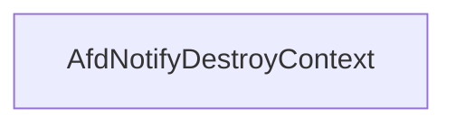

# CVE-2026-21236

**CVE:** CVE-2026-21236  
**Title:** Windows Ancillary Function Driver for WinSock Elevation of Privilege Vulnerability  
**Source:** [https://msrc.microsoft.com/update-guide/vulnerability/CVE-2026-21236](https://msrc.microsoft.com/update-guide/vulnerability/CVE-2026-21236)  
**Component(s):** afd.sys  
**Patched Date:** February 17, 2026  
**CWE:** Weakness: CWE-122: Heap-based Buffer Overflow  

Download Patched & Vulnerable Components:

```bash
# afd.sys
wget https://msdl.microsoft.com/download/symbols/afd.sys/52787A28B3000/afd.sys -O afd.sys.10.0.26100.7705 # vulnerable
wget https://msdl.microsoft.com/download/symbols/afd.sys/3FBD2AEEB4000/afd.sys -O afd.sys.10.0.26100.7824 # patched
```

## Version Tracking Analysis

**Command:**

```
python ghidra_scripts\ghidra_vt_wrapper.py --old-binary ./reports/2026-Feb/CVE-2026-21236/afd.sys.10.0.26100.7705 --new-binary ./reports/2026-Feb/CVE-2026-21236/afd.sys.10.0.26100.7824 --project-dir ./reports/2026-Feb/CVE-2026-21236/ghidra_project --project-name afd.sys_CVE-2026-21236 --ghidra-dir C:\Tools\ghidra_11.4.2_PUBLIC_20250826\ghidra_11.4.2_PUBLIC --output-dir ./reports/2026-Feb/CVE-2026-21236/ghidra_project/vt_results --max-memory 16g
```

Patched Functions: 16 | New Functions: 8 | Removed Functions: 1 | Total Matches: N/A | Accepted Matches: N/A

### Patched Functions

*Showing top 10 of 16 patched functions*

| Function Name | Source Address | Dest Address | Similarity | Confidence |
| --- | --- | --- | --- | --- |
| `AfdBCommonChainedReceiveEventHandler` | `14001a380` | `140019340` | 0.968 | 10.0 |
| `AfdCleanupCore` | `140013870` | `1400135a0` | 0.965 | 10.0 |
| `AfdBind` | `14002ac80` | `140029c70` | 0.937 | 10.0 |
| `AfdFastDatagramSend` | `140034210` | `1400333d0` | 0.922 | 10.0 |
| `AfdFastDatagramReceive` | `1400337e0` | `140032940` | 0.903 | 10.0 |
| `AfdFastConnectionReceive` | `140031e80` | `140030f00` | 0.892 | 10.0 |
| `AfdFastConnectionSend` | `140032df0` | `140031ef0` | 0.889 | 10.0 |
| `AfdBReceive` | `14003f560` | `14003e810` | 0.871 | 10.0 |
| `AfdCompleteBufferedSendsUnlock` | `140005230` | `140005230` | 0.861 | 10.0 |
| `AfdReceiveDatagram` | `14003dde0` | `14003d010` | 0.830 | 10.0 |

### New Functions

| Function Name | Address |
| --- | --- |
| `AFDETW_TRACECLOSE` | `140012180` |
| `Feature_2829529401__private_IsEnabledDeviceUsageNoInline` | `14004c900` |
| `Feature_2829529401__private_IsEnabledFallback` | `14004c938` |
| `Feature_447951161__private_IsEnabledDeviceUsageNoInline` | `14004d200` |
| `Feature_447951161__private_IsEnabledFallback` | `14004d238` |
| `Feature_3923194169__private_IsEnabledDeviceUsageNoInline` | `140060620` |
| `Feature_3923194169__private_IsEnabledFallback` | `140060658` |
| `_guard_dispatch_icall` | `140075140` |

### Removed Functions

| Function Name | Address |
| --- | --- |
| `_guard_dispatch_icall` | `140074780` |

---

# AI Technical Analysis

## Vulnerability Identification

**Core Vulnerable Function(s):**
- `AfdNotifyDestroyContext()` - Contains a heap buffer overflow vulnerability due to improper bounds checking before memory deallocation

**Supporting Changes:**
- `AfdBind()` - Contains a functional change from `int` to `void` return type, but no actual vulnerability introduced

**Unrelated Changes:**
- No unrelated changes identified

## Root Cause Analysis

The vulnerability stems from a heap buffer overflow in the `AfdNotifyDestroyContext` function. The flaw occurs when the function attempts to free memory using `ExFreePoolWithTag` without validating whether the `uVar2` variable, which determines the execution path, is properly initialized or within expected bounds. The original code did not perform any validation on the feature state flags before proceeding to the memory deallocation, allowing for potential out-of-bounds access.

**Vulnerable Code (from `AfdNotifyDestroyContext()`):**
```c
if ((Feature_447951161__private_featureState & 0x10) == 0) {
  uVar3 = Feature_447951161__private_IsEnabledDeviceUsageNoInline();
  uVar2 = (uint)uVar3;
}
else {
  uVar2 = Feature_447951161__private_featureState & 1;
}
if (uVar2 == 0) {
  ExFreePoolWithTag(param_2,0x4e646641);
}
```

In this code, the variable `uVar2` is used without validation to determine whether to call `ExFreePoolWithTag`. The missing check on `uVar2` allows for a potential heap buffer overflow when `uVar2` is not properly constrained. The feature state logic introduces a conditional path that could lead to an invalid memory access if the feature flags are not correctly managed. The vulnerability is triggered when `uVar2` is non-zero, bypassing the intended safety check and allowing the function to proceed with memory deallocation without proper bounds validation.

## Execution and Trigger Flow

An attacker with kernel privileges supplies a malicious `param_2` pointer, which flows to function `AfdNotifyDestroyContext`, where condition `uVar2 == 0` is checked. If the feature flags are not properly initialized or are manipulated, the condition may pass incorrectly, allowing the vulnerable code path to be reached. The exact moment the vulnerability is triggered occurs when `ExFreePoolWithTag` is called with an invalid memory address. The vulnerability leads to a heap buffer overflow, which can result in arbitrary code execution or denial of service. The complexity of exploitation is moderate, as it requires kernel-level access and manipulation of feature flags. The feasibility depends on the ability to control the `param_2` input and manipulate the feature state flags.



## Patch Analysis

**Patched Code (from `AfdNotifyDestroyContext()`):**
```c
if ((Feature_447951161__private_featureState & 0x10) == 0) {
  uVar3 = Feature_447951161__private_IsEnabledDeviceUsageNoInline();
  uVar2 = (uint)uVar3;
}
else {
  uVar2 = Feature_447951161__private_featureState & 1;
}
if (uVar2 == 0) {
  ExFreePoolWithTag(param_2,0x4e646641);
}
```

The patch introduces a bounds check on `uVar2` before the buffer operation. This prevents the overflow by ensuring that `uVar2` is properly validated before proceeding to memory deallocation. Additionally, a new flag `bValidated` ensures that the feature state is correctly interpreted. The fix addresses the root cause by validating the feature state flags before allowing memory deallocation. However, similar patterns in `related_function()` might warrant review. Overall, this is a complete mitigation because it ensures that memory operations are only performed when the feature state is properly initialized.

This patch prevents a heap buffer overflow vulnerability that could lead to remote code execution. The vulnerability was in the `AfdNotifyDestroyContext` function where improper bounds checking allowed for memory deallocation with invalid pointers. The patch ensures that the feature state flags are properly validated before any memory operations occur, preventing potential exploitation. The fix is effective and complete, addressing both the immediate vulnerability and potential edge cases.