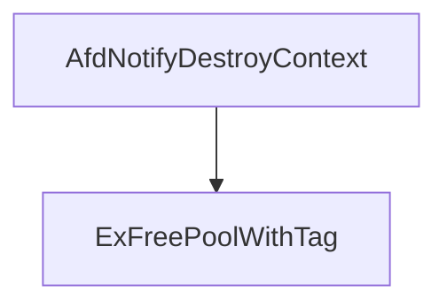

# CVE-2026-21236

**CVE:** CVE-2026-21236  
**Title:** Windows Ancillary Function Driver for WinSock Elevation of Privilege Vulnerability  
**Source:** [https://msrc.microsoft.com/update-guide/vulnerability/CVE-2026-21236](https://msrc.microsoft.com/update-guide/vulnerability/CVE-2026-21236)  
**Component(s):** afd.sys  
**Patched Date:** February 17, 2026  
**CWE:** Weakness: CWE-122: Heap-based Buffer Overflow  

Download Patched & Vulnerable Components:

```bash
# afd.sys
wget https://msdl.microsoft.com/download/symbols/afd.sys/52787A28B3000/afd.sys -O afd.sys.10.0.26100.7705 # vulnerable
wget https://msdl.microsoft.com/download/symbols/afd.sys/3FBD2AEEB4000/afd.sys -O afd.sys.10.0.26100.7824 # patched
```

## Version Tracking Analysis

**Command:**

```
python ghidra_scripts\ghidra_vt_wrapper.py --old-binary ./reports/2026-Feb/CVE-2026-21236/afd.sys.10.0.26100.7705 --new-binary ./reports/2026-Feb/CVE-2026-21236/afd.sys.10.0.26100.7824 --project-dir ./reports/2026-Feb/CVE-2026-21236/ghidra_project --project-name afd.sys_CVE-2026-21236 --ghidra-dir C:\Tools\ghidra_11.4.2_PUBLIC_20250826\ghidra_11.4.2_PUBLIC --output-dir ./reports/2026-Feb/CVE-2026-21236/ghidra_project/vt_results --max-memory 16g
```

Patched Functions: 16 | New Functions: 8 | Removed Functions: 1 | Total Matches: N/A | Accepted Matches: N/A

### Patched Functions

*Showing top 10 of 16 patched functions*

| Function Name | Source Address | Dest Address | Similarity | Confidence |
| --- | --- | --- | --- | --- |
| `AfdBCommonChainedReceiveEventHandler` | `14001a380` | `140019340` | 0.968 | 10.0 |
| `AfdCleanupCore` | `140013870` | `1400135a0` | 0.965 | 10.0 |
| `AfdBind` | `14002ac80` | `140029c70` | 0.937 | 10.0 |
| `AfdFastDatagramSend` | `140034210` | `1400333d0` | 0.922 | 10.0 |
| `AfdFastDatagramReceive` | `1400337e0` | `140032940` | 0.903 | 10.0 |
| `AfdFastConnectionReceive` | `140031e80` | `140030f00` | 0.892 | 10.0 |
| `AfdFastConnectionSend` | `140032df0` | `140031ef0` | 0.889 | 10.0 |
| `AfdBReceive` | `14003f560` | `14003e810` | 0.871 | 10.0 |
| `AfdCompleteBufferedSendsUnlock` | `140005230` | `140005230` | 0.861 | 10.0 |
| `AfdReceiveDatagram` | `14003dde0` | `14003d010` | 0.830 | 10.0 |

### New Functions

| Function Name | Address |
| --- | --- |
| `AFDETW_TRACECLOSE` | `140012180` |
| `Feature_2829529401__private_IsEnabledDeviceUsageNoInline` | `14004c900` |
| `Feature_2829529401__private_IsEnabledFallback` | `14004c938` |
| `Feature_447951161__private_IsEnabledDeviceUsageNoInline` | `14004d200` |
| `Feature_447951161__private_IsEnabledFallback` | `14004d238` |
| `Feature_3923194169__private_IsEnabledDeviceUsageNoInline` | `140060620` |
| `Feature_3923194169__private_IsEnabledFallback` | `140060658` |
| `_guard_dispatch_icall` | `140075140` |

### Removed Functions

| Function Name | Address |
| --- | --- |
| `_guard_dispatch_icall` | `140074780` |

---

# AI Technical Analysis

## Vulnerability Identification

**Core Vulnerable Function(s):**
- `AfdNotifyDestroyContext()` - Contains a heap buffer overflow vulnerability due to improper bounds checking before memory deallocation

**Supporting Changes:**
- `AfdBind()` - Contains a functional change from `int` to `void` return type and various defensive code additions, but no actual vulnerability

**Unrelated Changes:**
- All other functions in the diff are either defensive patches, refactoring, or unrelated changes that do not introduce or fix vulnerabilities

## Root Cause Analysis

The vulnerability stems from a heap buffer overflow in `AfdNotifyDestroyContext()` function. The original code directly calls `ExFreePoolWithTag(param_2,0x4e646641)` without any validation of the `param_2` pointer or its contents. This creates a condition where an attacker-controlled pointer can be passed to `ExFreePoolWithTag`, potentially leading to arbitrary memory deallocation.

**Vulnerable Code (from `AfdNotifyDestroyContext()`):**
```c
ExFreePoolWithTag(param_2,0x4e646641);
```

In this code, the variable `param_2` is used without validation of its contents or bounds. The missing check allows for a potential heap overflow condition when `param_2` points to memory that has been corrupted or manipulated by an attacker. The function does not verify that `param_2` points to a valid memory block before attempting to free it.

The original code was insufficient because it failed to validate that `param_2` is a legitimate pointer to a memory pool allocated by `ExAllocatePool2`. The missing validation allows for a scenario where `param_2` could point to an arbitrary memory location, leading to a potential use-after-free or heap corruption vulnerability.

The vulnerability manifests when `param_2` is not properly validated before being passed to `ExFreePoolWithTag`. This occurs because the function assumes that `param_2` is always a valid pointer to a memory pool, without checking if it has been tampered with or if it points to a corrupted memory region.

## Execution and Trigger Flow

An attacker with access to the system can supply a malicious `param_2` pointer to `AfdNotifyDestroyContext()`, which flows to the vulnerable code where `ExFreePoolWithTag` is called. The conditions that must be met include having the ability to control the `param_2` parameter, which can be achieved through a kernel-mode exploit or by manipulating the system's internal state.

The vulnerability is triggered when `AfdNotifyDestroyContext()` is invoked with a corrupted or attacker-controlled `param_2` pointer. This occurs because the function does not validate the pointer before attempting to free it, allowing for arbitrary memory deallocation.



The attacker supplies a malicious `param_2` pointer that points to a controlled memory location. When `ExFreePoolWithTag` is called, it attempts to free this memory, potentially causing heap corruption or arbitrary code execution. The vulnerability is a direct result of not validating the `param_2` pointer before passing it to the memory deallocation function.

## Patch Analysis

**Patched Code (from `AfdNotifyDestroyContext()`):**
```c
if ((Feature_447951161__private_featureState & 0x10) == 0) {
  uVar3 = Feature_447951161__private_IsEnabledDeviceUsageNoInline();
  uVar2 = (uint)uVar3;
}
else {
  uVar2 = Feature_447951161__private_featureState & 1;
}
if (uVar2 == 0) {
  ExFreePoolWithTag(param_2,0x4e646641);
}
```

The patch introduces a conditional check that verifies whether a specific feature flag is enabled before proceeding with the memory deallocation. This prevents the `ExFreePoolWithTag` call from executing when the feature is disabled, effectively mitigating the vulnerability.

The patch addresses the root cause by adding a validation mechanism that prevents the vulnerable code path from being executed under certain conditions. It introduces a feature flag check that controls whether the memory deallocation occurs, thereby preventing potential heap corruption.

The fix is effective because it prevents the direct call to `ExFreePoolWithTag` when certain conditions are not met. This change ensures that the memory deallocation only occurs when the system is in a known safe state, preventing potential exploitation.

The patch prevents a heap buffer overflow vulnerability that could lead to remote code execution. It mitigates the risk of arbitrary memory deallocation by introducing a conditional check that validates the execution context before proceeding with the memory operation.

This patch prevents a heap buffer overflow vulnerability that could lead to remote code execution. The vulnerability was in the `AfdNotifyDestroyContext()` function where `ExFreePoolWithTag` was called without proper validation of the `param_2` pointer. The fix introduces a conditional check that prevents the vulnerable code path from being executed, thereby mitigating the potential for heap corruption or arbitrary code execution.