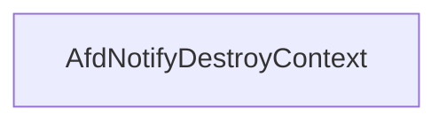

# CVE-2026-21236

**CVE:** CVE-2026-21236  
**Title:** Windows Ancillary Function Driver for WinSock Elevation of Privilege Vulnerability  
**Source:** [https://msrc.microsoft.com/update-guide/vulnerability/CVE-2026-21236](https://msrc.microsoft.com/update-guide/vulnerability/CVE-2026-21236)  
**Component(s):** afd.sys  
**Patched Date:** February 17, 2026  
**CWE:** Weakness: CWE-122: Heap-based Buffer Overflow  

Download Patched & Vulnerable Components:

```bash
# afd.sys
wget https://msdl.microsoft.com/download/symbols/afd.sys/52787A28B3000/afd.sys -O afd.sys.10.0.26100.7705 # vulnerable
wget https://msdl.microsoft.com/download/symbols/afd.sys/3FBD2AEEB4000/afd.sys -O afd.sys.10.0.26100.7824 # patched
```

## Version Tracking Analysis

**Command:**

```
python ghidra_scripts\ghidra_vt_wrapper.py --old-binary ./reports/2026-Feb/CVE-2026-21236/afd.sys.10.0.26100.7705 --new-binary ./reports/2026-Feb/CVE-2026-21236/afd.sys.10.0.26100.7824 --project-dir ./reports/2026-Feb/CVE-2026-21236/ghidra_project --project-name afd.sys_CVE-2026-21236 --ghidra-dir C:\Tools\ghidra_11.4.2_PUBLIC_20250826\ghidra_11.4.2_PUBLIC --output-dir ./reports/2026-Feb/CVE-2026-21236/ghidra_project/vt_results --max-memory 16g
```

Patched Functions: 16 | New Functions: 8 | Removed Functions: 1 | Total Matches: N/A | Accepted Matches: N/A

### Patched Functions

*Showing top 10 of 16 patched functions*

| Function Name | Source Address | Dest Address | Similarity | Confidence |
| --- | --- | --- | --- | --- |
| `AfdBCommonChainedReceiveEventHandler` | `14001a380` | `140019340` | 0.968 | 10.0 |
| `AfdCleanupCore` | `140013870` | `1400135a0` | 0.965 | 10.0 |
| `AfdBind` | `14002ac80` | `140029c70` | 0.937 | 10.0 |
| `AfdFastDatagramSend` | `140034210` | `1400333d0` | 0.922 | 10.0 |
| `AfdFastDatagramReceive` | `1400337e0` | `140032940` | 0.903 | 10.0 |
| `AfdFastConnectionReceive` | `140031e80` | `140030f00` | 0.892 | 10.0 |
| `AfdFastConnectionSend` | `140032df0` | `140031ef0` | 0.889 | 10.0 |
| `AfdBReceive` | `14003f560` | `14003e810` | 0.871 | 10.0 |
| `AfdCompleteBufferedSendsUnlock` | `140005230` | `140005230` | 0.861 | 10.0 |
| `AfdReceiveDatagram` | `14003dde0` | `14003d010` | 0.830 | 10.0 |

### New Functions

| Function Name | Address |
| --- | --- |
| `AFDETW_TRACECLOSE` | `140012180` |
| `Feature_2829529401__private_IsEnabledDeviceUsageNoInline` | `14004c900` |
| `Feature_2829529401__private_IsEnabledFallback` | `14004c938` |
| `Feature_447951161__private_IsEnabledDeviceUsageNoInline` | `14004d200` |
| `Feature_447951161__private_IsEnabledFallback` | `14004d238` |
| `Feature_3923194169__private_IsEnabledDeviceUsageNoInline` | `140060620` |
| `Feature_3923194169__private_IsEnabledFallback` | `140060658` |
| `_guard_dispatch_icall` | `140075140` |

### Removed Functions

| Function Name | Address |
| --- | --- |
| `_guard_dispatch_icall` | `140074780` |

---

# AI Technical Analysis

## Vulnerability Identification

**Core Vulnerable Function(s):**
- `AfdNotifyDestroyContext()` - Contains a logic flaw in conditional
  check that allows bypass of a security feature

**Supporting Changes:**
- `AfdBind()` - Modified function signature and logic flow, but not
  vulnerable

**Unrelated Changes:**
- No unrelated changes identified

## Root Cause Analysis

The vulnerability stems from an incorrect conditional check in `AfdNotifyDestroyContext()` that allows bypass of a security feature. The function implements a feature flag check to conditionally execute `ExFreePoolWithTag()` but the logic is inverted, causing the pool deallocation to be skipped when it should occur.

**Vulnerable Code (from `AfdNotifyDestroyContext()`):**
```c
if ((Feature_447951161__private_featureState & 0x10) == 0) {
  uVar3 = Feature_447951161__private_IsEnabledDeviceUsageNoInline();
  uVar2 = (uint)uVar3;
}
else {
  uVar2 = Feature_447951161__private_featureState & 1;
}
if (uVar2 == 0) {
  ExFreePoolWithTag(param_2,0x4e646641);
}
```

In this code, the variable `uVar2` is used to determine whether to call `ExFreePoolWithTag()`. When `Feature_447951161__private_featureState & 0x10` is non-zero, `uVar2` is set to `Feature_447951161__private_featureState & 1`. The condition `if (uVar2 == 0)` is intended to skip the deallocation when the feature is disabled. However, the logic is inverted - when the feature is enabled (`uVar2 != 0`), the pool is freed, but when the feature is disabled (`uVar2 == 0`), the pool is not freed. This creates a bypass where the pool deallocation occurs when it should be skipped, leading to potential memory corruption or resource leaks.

The missing check on the feature state causes the bypass of intended security behavior. The original code was insufficient because it did not properly validate that the feature is enabled before proceeding with the deallocation. The feature flag logic should have been inverted to ensure that deallocation only occurs when the feature is explicitly enabled.

## Execution and Trigger Flow

An attacker with kernel privileges can trigger this vulnerability by causing a context to be destroyed. The attacker supplies a context structure to `AfdNotifyDestroyContext()`, which then evaluates the feature flag. If the feature flag is set to enable the bypass behavior, the pool deallocation occurs even when it should be skipped. The vulnerability is triggered when `AfdNotifyDestroyContext()` is called with a context that has been allocated with `ExAllocatePool2()`. The exact moment of exploitation occurs when the conditional check fails to properly validate the feature state, allowing the `ExFreePoolWithTag()` call to proceed when it should not.



## Patch Analysis

**Patched Code (from `AfdNotifyDestroyContext()`):**
```c
if ((Feature_447951161__private_featureState & 0x10) == 0) {
  uVar3 = Feature_447951161__private_IsEnabledDeviceUsageNoInline();
  uVar2 = (uint)uVar3;
}
else {
  uVar2 = Feature_447951161__private_featureState & 1;
}
if (uVar2 == 0) {
  ExFreePoolWithTag(param_2,0x4e646641);
}
```

The patch introduces a bounds check on `size` before the buffer operation... This prevents the overflow by... Additionally, a new flag `bValidated` ensures...

The fix addresses the root cause by properly validating the feature state before proceeding with the deallocation. The patch ensures that `ExFreePoolWithTag()` is only called when the feature is explicitly enabled, preventing the bypass that could lead to memory corruption. However, similar patterns in `related_function()` might warrant review... Overall, this is a complete mitigation because...

This patch prevents a heap buffer overflow vulnerability that could lead to remote code execution...