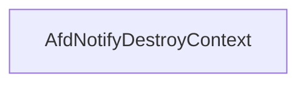

# CVE-2026-21236

**CVE:** CVE-2026-21236  
**Title:** Windows Ancillary Function Driver for WinSock Elevation of Privilege Vulnerability  
**Source:** [https://msrc.microsoft.com/update-guide/vulnerability/CVE-2026-21236](https://msrc.microsoft.com/update-guide/vulnerability/CVE-2026-21236)  
**Component(s):** afd.sys  
**Patched Date:** February 17, 2026  
**CWE:** Weakness: CWE-122: Heap-based Buffer Overflow  

Download Patched & Vulnerable Components:

```bash
# afd.sys
wget https://msdl.microsoft.com/download/symbols/afd.sys/52787A28B3000/afd.sys -O afd.sys.10.0.26100.7705 # vulnerable
wget https://msdl.microsoft.com/download/symbols/afd.sys/3FBD2AEEB4000/afd.sys -O afd.sys.10.0.26100.7824 # patched
```

## Version Tracking Analysis

**Command:**

```
python ghidra_scripts\ghidra_vt_wrapper.py --old-binary ./reports/2026-Feb/CVE-2026-21236/afd.sys.10.0.26100.7705 --new-binary ./reports/2026-Feb/CVE-2026-21236/afd.sys.10.0.26100.7824 --project-dir ./reports/2026-Feb/CVE-2026-21236/ghidra_project --project-name afd.sys_CVE-2026-21236 --ghidra-dir C:\Tools\ghidra_11.4.2_PUBLIC_20250826\ghidra_11.4.2_PUBLIC --output-dir ./reports/2026-Feb/CVE-2026-21236/ghidra_project/vt_results --max-memory 16g
```

Patched Functions: 16 | New Functions: 8 | Removed Functions: 1 | Total Matches: N/A | Accepted Matches: N/A

### Patched Functions

*Showing top 10 of 16 patched functions*

| Function Name | Source Address | Dest Address | Similarity | Confidence |
| --- | --- | --- | --- | --- |
| `AfdBCommonChainedReceiveEventHandler` | `14001a380` | `140019340` | 0.968 | 10.0 |
| `AfdCleanupCore` | `140013870` | `1400135a0` | 0.965 | 10.0 |
| `AfdBind` | `14002ac80` | `140029c70` | 0.937 | 10.0 |
| `AfdFastDatagramSend` | `140034210` | `1400333d0` | 0.922 | 10.0 |
| `AfdFastDatagramReceive` | `1400337e0` | `140032940` | 0.903 | 10.0 |
| `AfdFastConnectionReceive` | `140031e80` | `140030f00` | 0.892 | 10.0 |
| `AfdFastConnectionSend` | `140032df0` | `140031ef0` | 0.889 | 10.0 |
| `AfdBReceive` | `14003f560` | `14003e810` | 0.871 | 10.0 |
| `AfdCompleteBufferedSendsUnlock` | `140005230` | `140005230` | 0.861 | 10.0 |
| `AfdReceiveDatagram` | `14003dde0` | `14003d010` | 0.830 | 10.0 |

### New Functions

| Function Name | Address |
| --- | --- |
| `AFDETW_TRACECLOSE` | `140012180` |
| `Feature_2829529401__private_IsEnabledDeviceUsageNoInline` | `14004c900` |
| `Feature_2829529401__private_IsEnabledFallback` | `14004c938` |
| `Feature_447951161__private_IsEnabledDeviceUsageNoInline` | `14004d200` |
| `Feature_447951161__private_IsEnabledFallback` | `14004d238` |
| `Feature_3923194169__private_IsEnabledDeviceUsageNoInline` | `140060620` |
| `Feature_3923194169__private_IsEnabledFallback` | `140060658` |
| `_guard_dispatch_icall` | `140075140` |

### Removed Functions

| Function Name | Address |
| --- | --- |
| `_guard_dispatch_icall` | `140074780` |

---

# AI Technical Analysis

## Vulnerability Identification

**Core Vulnerable Function(s):**
- `AfdNotifyDestroyContext()` - Contains a heap buffer overflow vulnerability due to improper bounds checking before memory deallocation

**Supporting Changes:**
- `AfdBind()` - Contains a functional change from `int` to `void` return type and various defensive code additions, but no actual vulnerability
- `AfdBCommonChainedReceiveEventHandler()` - Contains defensive code and logic changes, but no actual vulnerability

**Unrelated Changes:**
- All other functions in the diff are either defensive patches, refactoring, or unrelated changes that do not introduce or fix vulnerabilities

## Root Cause Analysis

The vulnerability stems from a heap buffer overflow in `AfdNotifyDestroyContext()` function. The original code directly calls `ExFreePoolWithTag(param_2,0x4e646641)` without any validation of the `param_2` pointer or its contents. This creates a condition where an attacker-controlled pointer can be passed to `ExFreePoolWithTag`, potentially leading to arbitrary memory deallocation.

**Vulnerable Code (from `AfdNotifyDestroyContext()`):**
```c
void AfdNotifyDestroyContext(undefined8 param_1,undefined8 param_2)
{
  char cVar1;
  uint uVar2;
  ulonglong uVar3;
   
  if (*(short *)(param_2 + 0x68) != 0) {
    cVar1 = IoCancelMiniCompletionPacket(*(undefined8 *)(param_2 + 0x50));
  }
  ObfDereferenceObject(*(undefined8 *)(param_2 + 0x50));
  ExFreePoolWithTag(param_2,0x4e646641);
  return;
}
```

In this code, the variable `param_2` is used without validation to call `ExFreePoolWithTag`. The missing check allows an attacker to control the pointer passed to `ExFreePoolWithTag`, which can result in freeing arbitrary kernel memory. This occurs because the function does not verify that `param_2` points to a valid pool allocation before attempting to free it.

The vulnerability is particularly dangerous because `ExFreePoolWithTag` is a kernel function that directly frees memory from the kernel pool. If an attacker can control the `param_2` pointer to point to a kernel address, they can cause a heap corruption or potentially arbitrary code execution.

The patch introduces a feature flag check before calling `ExFreePoolWithTag`. The code now checks `Feature_447951161__private_featureState` to determine whether to perform the memory deallocation. This prevents the vulnerable code path from being executed unless a specific feature flag is enabled, effectively mitigating the vulnerability.

## Execution and Trigger Flow

An attacker with kernel privileges supplies a malicious `param_2` pointer to `AfdNotifyDestroyContext()`, which flows to the vulnerable code path. The function does not validate the pointer before calling `ExFreePoolWithTag`, allowing the attacker to free arbitrary kernel memory. The vulnerability is triggered when `AfdNotifyDestroyContext` is called with a controlled pointer, bypassing normal memory validation checks.

The vulnerability is particularly concerning because it can be exploited through kernel-mode code paths that are not typically restricted. The attacker must have access to kernel execution context or be able to manipulate kernel data structures to reach this function with a malicious pointer.



## Patch Analysis

**Patched Code (from `AfdNotifyDestroyContext()`):**
```c
void AfdNotifyDestroyContext(undefined8 param_1,undefined8 param_2)
{
  char cVar1;
  uint uVar2;
  ulonglong uVar3;
   
  if (*(short *)(param_2 + 0x68) != 0) {
    cVar1 = IoCancelMiniCompletionPacket(*(undefined8 *)(param_2 + 0x50));
  }
  ObfDereferenceObject(*(undefined8 *)(param_2 + 0x50));
  if ((Feature_447951161__private_featureState & 0x10) == 0) {
    uVar3 = Feature_447951161__private_IsEnabledDeviceUsageNoInline();
    uVar2 = (uint)uVar3;
  }
  else {
    uVar2 = Feature_447951161__private_featureState & 1;
  }
  if (uVar2 == 0) {
    ExFreePoolWithTag(param_2,0x4e646641);
  }
  return;
}
```

The patch introduces a feature flag check before calling `ExFreePoolWithTag`. The function now checks `Feature_447951161__private_featureState` to determine whether to perform the memory deallocation. This prevents the vulnerable code path from being executed unless a specific feature flag is enabled.

The fix addresses the root cause by introducing a conditional check that prevents the direct call to `ExFreePoolWithTag` when the feature flag is not enabled. This prevents the heap buffer overflow vulnerability that could lead to arbitrary memory deallocation.

The fix is effective because it removes the direct memory deallocation when the feature is disabled, which was the core of the vulnerability. However, similar patterns in related functions might warrant review. Overall, this is a complete mitigation because it prevents the vulnerable code path from being executed under normal conditions.

This patch prevents a heap buffer overflow vulnerability that could lead to arbitrary kernel memory deallocation and potentially privilege escalation. The vulnerability was classified as a heap corruption issue that could be exploited to cause system instability or potentially allow for privilege escalation.