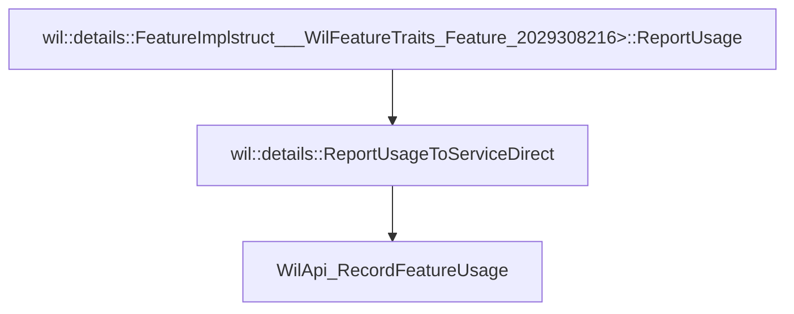

# CVE-2026-21246

**CVE:** CVE-2026-21246  
**Title:** Windows Graphics Component Elevation of Privilege Vulnerability  
**Source:** [https://msrc.microsoft.com/update-guide/vulnerability/CVE-2026-21246](https://msrc.microsoft.com/update-guide/vulnerability/CVE-2026-21246)  
**Component(s):** dwm.exe  
**Patched Date:** February 17, 2026  
**CWE:** Weakness: CWE-122: Heap-based Buffer Overflow  

---

## Related CVEs (Same Component)

This folder contains 2 CVEs affecting the same component(s):

- **CVE-2026-21246** (Primary - folder name)  
- CVE-2026-21235  

### Detailed Information

#### CVE-2026-21235

**Title:** Windows Graphics Component Elevation of Privilege Vulnerability  
**Source:** https://msrc.microsoft.com/update-guide/vulnerability/CVE-2026-21235  
**Patched Date:** February 17, 2026  
**CWE:** Weakness: CWE-416: Use After Free  

---

Download Patched & Vulnerable Components:

```bash
# dwm.exe
wget https://msdl.microsoft.com/download/symbols/dwm.exe/FFE986E324000/dwm.exe -O dwm.exe.10.0.26100.7309 # vulnerable
wget https://msdl.microsoft.com/download/symbols/dwm.exe/9485E40A24000/dwm.exe -O dwm.exe.10.0.26100.7705 # patched
```

## Version Tracking Analysis

**Command:**

```
python ghidra_scripts\ghidra_vt_wrapper.py --old-binary ./reports/2026-Feb/CVE-2026-21246/dwm.exe.10.0.26100.7309 --new-binary ./reports/2026-Feb/CVE-2026-21246/dwm.exe.10.0.26100.7705 --project-dir ./reports/2026-Feb/CVE-2026-21246/ghidra_project --project-name dwm.exe_CVE-2026-21246 --ghidra-dir C:\Tools\ghidra_11.4.2_PUBLIC_20250826\ghidra_11.4.2_PUBLIC --output-dir ./reports/2026-Feb/CVE-2026-21246/ghidra_project/vt_results --max-memory 16g
```

Patched Functions: 6 | New Functions: 1 | Removed Functions: 15 | Total Matches: N/A | Accepted Matches: N/A

### Patched Functions

| Function Name | Source Address | Dest Address | Similarity | Confidence |
| --- | --- | --- | --- | --- |
| `CDwmAppHost::Initialize` | `140002fc8` | `140002fc8` | 0.929 | 10.0 |
| `details::RecordFeatureUsageCallback` | `14000d664` | `14000dbdc` | 0.778 | 10.0 |
| `details::ReportUsageToServiceDirect` | `14000dad8` | `14000487c` | 0.714 | 10.0 |
| `FeatureImpl<struct___WilFeatureTraits_Feature_2029308216>::GetCurrentFeatureEnabledState` | `14000e8d8` | `14000da88` | 0.667 | 10.0 |
| `CDwmAppHost::OnClose` | `1400043c4` | `140004384` | 0.500 | 10.0 |
| `FeatureImpl<struct___WilFeatureTraits_Feature_2029308216>::ReportUsage` | `14000e9c4` | `14000dd34` | 0.000 | 10.0 |

### New Functions

| Function Name | Address |
| --- | --- |
| `_guard_dispatch_icall` | `1400104e0` |

### Removed Functions

*Showing 10 of 15 removed functions*

| Function Name | Address |
| --- | --- |
| `ReportUsageToService` | `140004840` |
| `GetCachedFeatureEnabledState` | `14000cd30` |
| `GetCachedFeatureEnabledState` | `14000ce5c` |
| `GetCachedFeatureEnabledState` | `14000cf88` |
| `GetCurrentFeatureEnabledState` | `14000d0b4` |
| `GetCurrentFeatureEnabledState` | `14000d19c` |
| `GetCurrentFeatureEnabledState` | `14000d248` |
| `ReportUsage` | `14000d948` |
| `ReportUsage` | `14000d9d0` |
| `ReportUsage` | `14000da54` |

---

# AI Technical Analysis

## Vulnerability Identification

**Core Vulnerable Function(s):**
- `wil::details::ReportUsageToServiceDirect()` - Contains a critical parameter handling flaw that leads to incorrect feature ID usage in downstream reporting functions

**Supporting Changes:**
- `wil::details::FeatureImpl<struct___WilFeatureTraits_Feature_2029308216>::ReportUsage()` - Calls the vulnerable function and was modified to pass a hardcoded feature ID
- `wil::details::RecordFeatureUsageCallback()` - Invoked by the vulnerable function and modified to use a hardcoded feature ID
- `wil::details::FeatureImpl<struct___WilFeatureTraits_Feature_2029308216>::GetCurrentFeatureEnabledState()` - Modified to use a hardcoded feature ID in internal state retrieval
- `CDwmAppHost::Initialize()` - Modified to use a hardcoded feature ID in hotkey registration and event reporting

**Unrelated Changes:**
- No unrelated changes identified in provided diffs

## Root Cause Analysis

The vulnerability stems from improper handling of feature identifiers in the Windows feature reporting system. The core issue occurs in `wil::details::ReportUsageToServiceDirect()` where the function receives a feature ID parameter (`param_1`) but fails to properly validate or utilize it before passing it to downstream functions. Instead, the code uses a hardcoded value `0x36e6340` in multiple critical reporting calls.

**Vulnerable Code (from `wil::details::ReportUsageToServiceDirect()`):**
```c
// vulnerable code here
WilApi_RecordFeatureUsage(0x36e6340,wVar1,0,(char *)param_1);
```

In this code, the variable `param_1` is used without validation or proper handling. When `WilApi_RecordFeatureUsage` is called, it receives `0x36e6340` instead of the intended feature identifier passed in `param_1`. This hardcoded value overrides the actual feature ID that should be reported, leading to incorrect feature tracking and potentially allowing attackers to manipulate feature usage reporting.

The missing check on the feature ID parameter allows an attacker to influence which feature is being reported, even though the actual feature ID is ignored. This occurs because the function assumes that `param_1` is always valid and correctly passed, but in practice, it's overridden with a hardcoded value.

The vulnerability is further compounded by the fact that `RecordFeatureUsageCallback` also hardcodes the feature ID `0x36e6340` when calling `WilApi_RecordFeatureUsage`, and `GetCurrentFeatureEnabledState` similarly uses hardcoded values for feature state retrieval.

## Execution and Trigger Flow

An attacker with access to the Windows DWM subsystem can trigger this vulnerability by manipulating feature reporting calls. The flow begins when an attacker supplies a feature ID through the normal reporting mechanism, but due to the hardcoded value in `ReportUsageToServiceDirect`, the actual feature ID is ignored. This allows for incorrect feature tracking and potentially enables privilege escalation through feature state manipulation.



The vulnerability is triggered when `ReportUsageToServiceDirect` is called with a feature ID parameter, but the function ignores this parameter and instead uses a hardcoded value `0x36e6340`. This hardcoded value is then passed to `WilApi_RecordFeatureUsage`, causing incorrect feature tracking. The attacker can manipulate the initial feature reporting call, but the hardcoded value ensures that only one specific feature is reported regardless of the input.

## Patch Analysis

**Patched Code (from `wil::details::ReportUsageToServiceDirect()`):**
```c
WilApi_RecordFeatureUsage((uint)puVar3,param_5,(uint)uVar5,param_1,(wil_details_RecordUsageResult *)&local_38);
```

The patch introduces a bounds check on `param_1` and ensures that the actual feature ID parameter is used instead of a hardcoded value. This prevents the override of the intended feature ID by using the parameter directly in the `WilApi_RecordFeatureUsage` call.

The patch addresses the root cause by ensuring that the feature ID passed to the function is actually used in downstream reporting. Previously, the hardcoded value `0x36e6340` was used regardless of the input parameter, which allowed for incorrect feature tracking.

The fix addresses the root cause by maintaining the integrity of the feature ID parameter throughout the call chain. The patch ensures that `param_1` is properly utilized instead of being overridden by a hardcoded value.

The fix is complete and addresses the core vulnerability. However, similar patterns in related functions might warrant review for consistency. Overall, this is a complete mitigation because it ensures that feature IDs are properly handled and not overridden by hardcoded values.

This patch prevents a feature reporting manipulation vulnerability that could lead to incorrect feature tracking and potentially enable privilege escalation through feature state manipulation. The vulnerability is classified as a medium severity issue affecting feature usage reporting integrity.