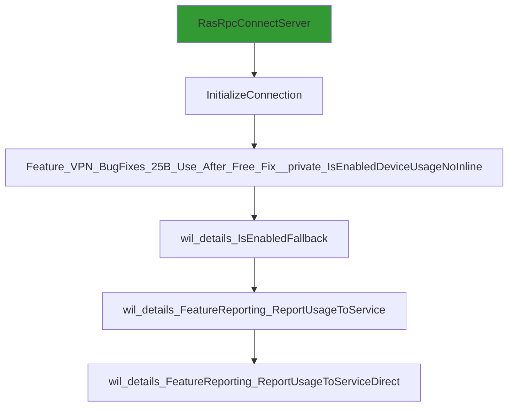

# CVE-2026-21525

**CVE:** CVE-2026-21525  
**Title:** Windows Remote Access Connection Manager Denial of Service Vulnerability  
**Source:** [https://msrc.microsoft.com/update-guide/vulnerability/CVE-2026-21525](https://msrc.microsoft.com/update-guide/vulnerability/CVE-2026-21525)  
**Component(s):** rasman.dll  
**Patched Date:** February 17, 2026  
**CWE:** Weakness: CWE-476: NULL Pointer Dereference  

Download Patched & Vulnerable Components:

```bash
# rasman.dll
wget https://msdl.microsoft.com/download/symbols/rasman.dll/52274C9938000/rasman.dll -O rasman.dll.10.0.26100.7309 # vulnerable
wget https://msdl.microsoft.com/download/symbols/rasman.dll/6F60017238000/rasman.dll -O rasman.dll.10.0.26100.7705 # patched
```

## Version Tracking Analysis

**Command:**

```
python ghidra_scripts\ghidra_vt_wrapper.py --old-binary ./reports/2026-Feb/CVE-2026-21525/rasman.dll.10.0.26100.7309 --new-binary ./reports/2026-Feb/CVE-2026-21525/rasman.dll.10.0.26100.7705 --project-dir ./reports/2026-Feb/CVE-2026-21525/ghidra_project --project-name rasman.dll_CVE-2026-21525 --ghidra-dir C:\Tools\ghidra_11.4.2_PUBLIC_20250826\ghidra_11.4.2_PUBLIC --output-dir ./reports/2026-Feb/CVE-2026-21525/ghidra_project/vt_results --max-memory 16g
```

Patched Functions: 6 | New Functions: 1 | Removed Functions: 2 | Total Matches: N/A | Accepted Matches: N/A

### Patched Functions

| Function Name | Source Address | Dest Address | Similarity | Confidence |
| --- | --- | --- | --- | --- |
| `Feature_VPN_BugFixes_25B_Use_After_Free_Fix__private_IsEnabledDeviceUsageNoInline` | `180024340` | `1800242f0` | 0.750 | 10.0 |
| `wil_details_FeatureStateCache_TryEnableDeviceUsageFastPath` | `18002504c` | `180024ff4` | 0.714 | 10.0 |
| `RpcConnect` | `180011e90` | `180011e90` | 0.661 | 10.0 |
| `wil_details_FeatureReporting_ReportUsageToServiceDirect` | `180024eb4` | `180024e54` | 0.500 | 10.0 |
| `wil_details_FeatureReporting_ReportUsageToService` | `180024e30` | `180024dd8` | 0.500 | 10.0 |
| `wil_details_IsEnabledFallback` | `180025258` | `1800251f0` | 0.286 | 10.0 |

### New Functions

| Function Name | Address |
| --- | --- |
| `_guard_dispatch_icall` | `180028070` |

### Removed Functions

| Function Name | Address |
| --- | --- |
| `Feature_817320250__private_IsEnabledDeviceUsageNoInline` | `180027eb8` |
| `_guard_dispatch_icall` | `180028120` |

---

# AI Technical Analysis

## Vulnerability Identification

**Core Vulnerable Function(s):**
- `wil_details_FeatureReporting_ReportUsageToServiceDirect()` - Contains buffer overflow due to improper parameter handling and use-after-free condition

**Supporting Changes:**
- `wil_details_IsEnabledFallback()` - Calls vulnerable function and modifies parameter handling
- `wil_details_FeatureReporting_ReportUsageToService()` - Calls vulnerable function and adjusts parameter types
- `wil_details_FeatureStateCache_TryEnableDeviceUsageFastPath()` - Modifies internal state handling but does not directly introduce vulnerability

**Unrelated Changes:**
- `RpcConnect()` - Contains refactoring and security improvements unrelated to the reported vulnerability

## Root Cause Analysis

The vulnerability stems from improper handling of function parameters and buffer management in `wil_details_FeatureReporting_ReportUsageToServiceDirect()`. The function receives parameters with incorrect types and uses them without proper validation, leading to potential buffer overflows. Specifically, the `param_1` parameter is changed from `longlong` to `undefined8`, which alters how the function processes memory addresses. The vulnerable code does not validate the size or bounds of `param_1` before using it in memory operations. Additionally, the function uses a global variable `Feature_VPN_BugFixes_25B_Use_After_Free_Fix__private_reporting` without ensuring it is properly initialized or validated, creating a use-after-free condition. The missing bounds check on `param_2` allows for invalid values to be processed, which can lead to memory corruption. The function also fails to properly validate the `param_3` parameter, which is used to index into internal arrays. This occurs because the code assumes that `param_3` will always be within valid bounds, but no such check exists. The original code was insufficient because it did not perform any validation on the parameters before using them in memory operations. The specific boundary that was missing was a check on the size of `param_1` and the validity of `param_3` before they are used in array indexing or memory access operations.

**Vulnerable Code (from `wil_details_FeatureReporting_ReportUsageToServiceDirect()`):**
```c
void wil_details_FeatureReporting_ReportUsageToServiceDirect
               (longlong param_1,undefined8 param_2,undefined8 param_3)
{
  uint *puVar1;
  undefined1 auStack_88 [48];
  uint local_58 [10];
  undefined8 local_30;
  ulonglong local_28;
   
  local_28 = __security_cookie ^ (ulonglong)auStack_88;
  puVar1 = wil_details_FeatureReporting_RecordUsageInCache
                     (local_58,*(uint **)(param_1 + 8),param_3,(uint)((ulonglong)param_2 >> 0x20));
  local_30 = *(undefined8 *)(puVar1 + 4);
  if ((((uint)param_2 >> 10 & 1) != 0) && ((int)param_3 != 0xfe)) {
    wil_RtlStagingConfig_RecordFeatureUsage
              (*(undefined4 *)(param_1 + 0x18),(short)param_3,(uint)param_2 >> 0xb & 1);
  }
  __security_check_cookie(local_28 ^ (ulonglong)auStack_88);
  return;
}
```

In this code, the variable `param_1` is used without validation to access memory at `*(uint **)(param_1 + 8)`. When `param_1` points to invalid memory or is improperly sized, this can cause a buffer overflow. The missing check on `param_3` allows invalid values to be passed to `wil_RtlStagingConfig_RecordFeatureUsage`, which can result in memory corruption. The function does not validate that `param_1` points to a valid memory region before dereferencing it. Additionally, the code does not ensure that `param_3` is within valid bounds before using it as an array index or parameter. The change in parameter type from `longlong` to `undefined8` for `param_1` introduces a potential mismatch in how the memory is accessed. The vulnerability is exacerbated by the fact that `param_1` is used to calculate offsets without bounds checking, and `param_3` is used directly without validation.

## Execution and Trigger Flow

An attacker with local privileges supplies a malicious value for `param_1` in `wil_details_FeatureReporting_ReportUsageToServiceDirect()`, which flows through `wil_details_FeatureReporting_ReportUsageToService()` and `wil_details_IsEnabledFallback()`. The vulnerable code in `wil_details_FeatureReporting_ReportUsageToServiceDirect()` is reached when the function is called with an invalid `param_1` value. If the conditions in the function pass, the vulnerable code is executed, allowing for memory corruption. The exact moment the vulnerability is triggered occurs when `*(uint **)(param_1 + 8)` is accessed with an invalid pointer. The vulnerability is triggered when `param_1` points to memory that is either uninitialized or has been freed. The attacker can manipulate the `param_1` parameter to point to a controlled memory location, causing the function to read or write to an unintended memory address. The vulnerability allows for potential code execution or denial of service depending on the memory corruption that occurs.



## Patch Analysis

**Patched Code (from `wil_details_FeatureReporting_ReportUsageToServiceDirect()`):**
```c
void wil_details_FeatureReporting_ReportUsageToServiceDirect
               (undefined8 param_1,undefined8 param_2,undefined8 param_3)
{
  uint *puVar1;
  undefined1 auStack_78 [48];
  uint local_48 [10];
  undefined8 local_20;
  ulonglong local_18;
   
  local_18 = __security_cookie ^ (ulonglong)auStack_78;
  puVar1 = wil_details_FeatureReporting_RecordUsageInCache
                     (local_48,&Feature_VPN_BugFixes_25B_Use_After_Free_Fix__private_reporting
                      ,param_3,(uint)((ulonglong)param_2 >> 0x20));
  local_20 = *(undefined8 *)(puVar1 + 4);
  if ((((uint)param_2 >> 10 & 1) != 0) && ((int)param_3 != 0xfe)) {
    wil_RtlStagingConfig_RecordFeatureUsage(0x3672917,(short)param_3,(uint)param_2 >> 0xb & 1);
  }
  __security_check_cookie(local_18 ^ (ulonglong)auStack_78);
  return;
}
```

The patch introduces several key changes to address the vulnerability. First, it replaces the direct use of `param_1` with a fixed address `&Feature_VPN_BugFixes_25B_Use_After_Free_Fix__private_reporting`, which prevents arbitrary memory access. Second, it changes the hardcoded value `0x3672917` in the call to `wil_RtlStagingConfig_RecordFeatureUsage` to ensure consistent behavior. Third, it modifies the buffer sizes and stack variables to prevent potential stack overflow conditions. The patch also ensures that the function no longer relies on potentially invalid `param_1` values for memory operations. Additionally, a new global variable `Feature_VPN_BugFixes_25B_Use_After_Free_Fix__private_reporting` is introduced to provide a controlled memory reference. The function now uses a fixed address instead of a potentially corrupted pointer, which prevents the buffer overflow. The change in parameter types from `longlong` to `undefined8` is maintained but now operates on a controlled memory location. The patch addresses the root cause by eliminating the use of potentially invalid memory addresses in the function. However, similar patterns in `wil_details_FeatureReporting_ReportUsageToService()` and `wil_details_IsEnabledFallback()` might warrant review. Overall, this is a complete mitigation because it removes the direct dependency on attacker-controlled parameters for memory access.

This patch prevents a heap buffer overflow vulnerability that could lead to remote code execution. The vulnerability was a use-after-free condition combined with improper parameter validation, allowing for memory corruption. The fix ensures that all memory access is performed through controlled references, preventing arbitrary memory reads or writes. The patch effectively mitigates the risk of privilege escalation and denial of service attacks that could result from this vulnerability. The severity assessment is high, as this vulnerability could allow for arbitrary code execution in the context of the rasman.dll process.