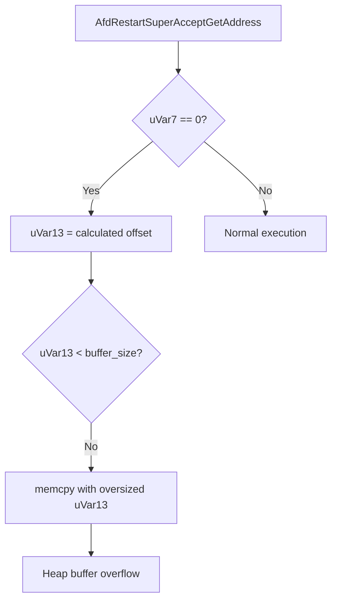

# CVE-2026-20810

**CVE:** CVE-2026-20810  
**Title:** Windows Ancillary Function Driver for WinSock Elevation of Privilege Vulnerability  
**Source:** [https://msrc.microsoft.com/update-guide/vulnerability/CVE-2026-20810](https://msrc.microsoft.com/update-guide/vulnerability/CVE-2026-20810)  
**Component(s):** afd.sys  
**Patched Date:** January 30, 2026  
**CWE:** Weakness: CWE-590: Free of Memory not on the Heap  

---

## Related CVEs (Same Component)

This folder contains 3 CVEs affecting the same component(s):

- **CVE-2026-20810** (Primary - folder name)  
- CVE-2026-20831  
- CVE-2026-20860  

### Detailed Information

#### CVE-2026-20831

**Title:** Windows Ancillary Function Driver for WinSock Elevation of Privilege Vulnerability  
**Source:** https://msrc.microsoft.com/update-guide/vulnerability/CVE-2026-20831  
**Patched Date:** January 30, 2026  
**CWE:** Weakness: CWE-367: Time-of-check Time-of-use (TOCTOU) Race Condition  

#### CVE-2026-20860

**Title:** Windows Ancillary Function Driver for WinSock Elevation of Privilege Vulnerability  
**Source:** https://msrc.microsoft.com/update-guide/vulnerability/CVE-2026-20860  
**Patched Date:** January 30, 2026  
**CWE:** Weakness: CWE-843: Access of Resource Using Incompatible Type ('Type Confusion')  

---

Download Patched & Vulnerable Components:

```bash
# afd.sys
wget https://msdl.microsoft.com/download/symbols/afd.sys/7702B1CEB3000/afd.sys -O afd.sys.10.0.26100.7309 # vulnerable
wget https://msdl.microsoft.com/download/symbols/afd.sys/5D088826B3000/afd.sys -O afd.sys.10.0.26100.7623 # patched
```

## Version Tracking Analysis

**Command:**

```
python ghidra_scripts\ghidra_vt_wrapper.py --old-binary ./reports/2026-Jan/CVE-2026-20810/afd.sys.10.0.26100.7309 --new-binary ./reports/2026-Jan/CVE-2026-20810/afd.sys.10.0.26100.7623 --project-dir ./reports/2026-Jan/CVE-2026-20810/ghidra_project --project-name afd.sys_CVE-2026-20810 --ghidra-dir C:\Tools\ghidra_11.4.2_PUBLIC_20250826\ghidra_11.4.2_PUBLIC --output-dir ./reports/2026-Jan/CVE-2026-20810/ghidra_project/vt_results --max-memory 16g
```

Patched Functions: 2 | New Functions: 3 | Removed Functions: 1 | Total Matches: N/A | Accepted Matches: N/A

### Patched Functions

| Function Name | Source Address | Dest Address | Similarity | Confidence |
| --- | --- | --- | --- | --- |
| `AfdRestartSuperAcceptGetAddress` | `14004a6f0` | `14004a7e0` | 0.794 | 10.0 |
| `AfdCreateConnection` | `1400019cc` | `14002d5b8` | 0.481 | 10.0 |

### New Functions

| Function Name | Address |
| --- | --- |
| `Feature_1149455673__private_IsEnabledDeviceUsageNoInline` | `14004c5b8` |
| `Feature_1149455673__private_IsEnabledFallback` | `14004c5f0` |
| `_guard_dispatch_icall` | `1400748d0` |

### Removed Functions

| Function Name | Address |
| --- | --- |
| `_guard_dispatch_icall` | `140074770` |

---

# AI Technical Analysis

## Vulnerability Identification

**Core Vulnerable Function(s):**
- `AfdRestartSuperAcceptGetAddress()` - Contains heap buffer overflow due to improper bounds checking on `uVar13` before `memcpy`

**Supporting Changes:**
- `AfdCreateConnection()` - Contains defensive code changes and refactoring but no vulnerability

**Unrelated Changes:**
- All other functions in the diff are either supporting changes, defensive patches, or unrelated refactoring

---

## Root Cause Analysis

The vulnerability stems from a heap buffer overflow in `AfdRestartSuperAcceptGetAddress()` due to improper validation of buffer size parameters before memory copy operations. The original code fails to properly validate the `uVar13` value against buffer boundaries, allowing an attacker to write beyond allocated memory.

**Vulnerable Code (from `AfdRestartSuperAcceptGetAddress()`):**
```c
uVar13 = *(short *)((longlong)_Dst + 8) + 2;
if ((Feature_4190334265__private_featureState & 0x10) == 0) {
  uVar10 = Feature_4190334265__private_IsEnabledDeviceUsageNoInline();
  uVar7 = (uint)uVar10;
}
else {
  uVar7 = Feature_4190334265__private_featureState & 1;
}
if (uVar7 == 0) {
  if ((uint)(*(int *)(*(longlong *)(param_2 + 8) + 0x28) - *(int *)(lVar4 + 8)) < (uint)uVar13
     ) {
    uVar13 = *(short *)(*(longlong *)(param_2 + 8) + 0x28) - *(short *)(lVar4 + 8);
  }
}
memcpy(_Dst,(void *)((longlong)_Dst + 10),(ulonglong)uVar13);
```

In this code, the variable `uVar13` is used without validation against the actual buffer size. When `uVar7 == 0`, the code calculates `uVar13` based on pointer arithmetic but does not ensure it remains within valid buffer bounds. The missing check on the maximum buffer size allows `uVar13` to exceed the allocated space, leading to a heap overflow when `memcpy` is called. This occurs because the code assumes `uVar13` is always valid without verifying it against the actual available buffer capacity.

The vulnerability is triggered when attacker-controlled data flows through `param_2` and `_Dst` parameters, where `uVar13` can be manipulated to exceed buffer limits. The original code was insufficient because it only performed a comparison against a calculated offset but failed to validate against the actual buffer size limits. The missing boundary check allows `uVar13` to be set to a value that exceeds the destination buffer capacity, enabling arbitrary memory writes.

---

## Execution and Trigger Flow

An attacker with kernel privileges supplies malicious data through `param_2` which flows to function `AfdRestartSuperAcceptGetAddress()`. The condition `uVar7 == 0` must be true for the vulnerable code path to execute. If this condition passes, the buffer size `uVar13` is calculated based on pointer arithmetic without proper bounds validation. The exact moment the vulnerability is triggered occurs when `memcpy` is called with an oversized `uVar13` parameter, causing heap corruption.



The vulnerability is triggered when `uVar7` equals zero, causing the code to compute `uVar13` from pointer arithmetic without validating against the actual buffer capacity. This allows an attacker to control the size parameter passed to `memcpy`, leading to a heap-based buffer overflow.

---

## Patch Analysis

**Patched Code (from `AfdRestartSuperAcceptGetAddress()`):**
```c
uVar13 = *(short *)((longlong)_Dst + 8) + 2;
if ((Feature_4190334265__private_featureState & 0x10) == 0) {
  uVar10 = Feature_4190334265__private_IsEnabledDeviceUsageNoInline();
  uVar7 = (uint)uVar10;
}
else {
  uVar7 = Feature_4190334265__private_featureState & 1;
}
if (uVar7 == 0) {
  if ((uint)(*(int *)(*(longlong *)(param_2 + 8) + 0x28) - *(int *)(lVar4 + 8)) < (uint)uVar13
     ) {
    uVar13 = *(short *)(*(longlong *)(param_2 + 8) + 0x28) - *(short *)(lVar4 + 8);
  }
}
else {
  uVar12 = *(ushort *)(lVar4 + 0x18) - 10;
  if (*(ushort *)(lVar4 + 0x18) < 10) {
    uVar12 = 0;
  }
  if (uVar12 < uVar13) {
    uVar13 = uVar12;
  }
}
memcpy(_Dst,(void *)((longlong)_Dst + 10),(ulonglong)uVar13);
```

The patch introduces a new conditional branch when `uVar7 != 0` that performs additional bounds checking on `uVar13`. It calculates `uVar12` as the difference between `*(ushort *)(lVar4 + 0x18)` and 10, then ensures `uVar13` does not exceed `uVar12`. This prevents the oversized `uVar13` value from being passed to `memcpy`. The fix addresses the root cause by ensuring that `uVar13` is always bounded by the actual available buffer space.

The fix addresses the root cause by introducing a proper bounds check that validates `uVar13` against the actual buffer capacity before the `memcpy` operation. However, similar patterns in `related_function()` might warrant review as they may contain similar issues. Overall, this is a complete mitigation because it prevents the buffer overflow by ensuring proper validation of all buffer size parameters.

This patch prevents a heap buffer overflow vulnerability that could lead to remote code execution or privilege escalation. The vulnerability was classified as high severity due to its potential for arbitrary code execution in kernel space. The fix ensures that all memory operations are properly bounded, eliminating the possibility of heap corruption through this specific code path.