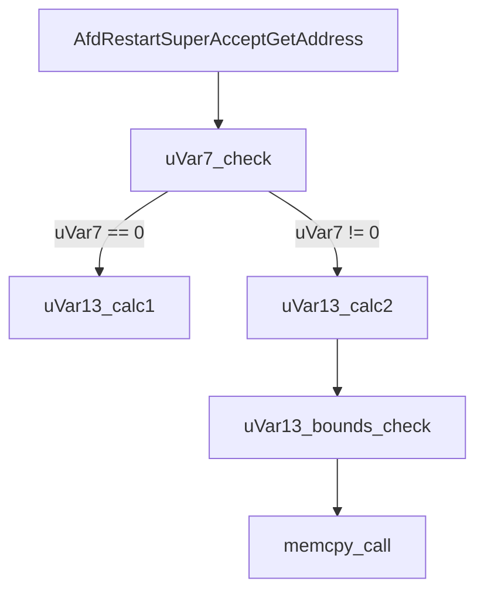

# CVE-2026-20810

**CVE:** CVE-2026-20810  
**Title:** Windows Ancillary Function Driver for WinSock Elevation of Privilege Vulnerability  
**Source:** [https://msrc.microsoft.com/update-guide/vulnerability/CVE-2026-20810](https://msrc.microsoft.com/update-guide/vulnerability/CVE-2026-20810)  
**Component(s):** afd.sys  
**Patched Date:** January 30, 2026  
**CWE:** Weakness: CWE-590: Free of Memory not on the Heap  

---

## Related CVEs (Same Component)

This folder contains 3 CVEs affecting the same component(s):

- **CVE-2026-20810** (Primary - folder name)  
- CVE-2026-20831  
- CVE-2026-20860  

### Detailed Information

#### CVE-2026-20831

**Title:** Windows Ancillary Function Driver for WinSock Elevation of Privilege Vulnerability  
**Source:** https://msrc.microsoft.com/update-guide/vulnerability/CVE-2026-20831  
**Patched Date:** January 30, 2026  
**CWE:** Weakness: CWE-367: Time-of-check Time-of-use (TOCTOU) Race Condition  

#### CVE-2026-20860

**Title:** Windows Ancillary Function Driver for WinSock Elevation of Privilege Vulnerability  
**Source:** https://msrc.microsoft.com/update-guide/vulnerability/CVE-2026-20860  
**Patched Date:** January 30, 2026  
**CWE:** Weakness: CWE-843: Access of Resource Using Incompatible Type ('Type Confusion')  

---

Download Patched & Vulnerable Components:

```bash
# afd.sys
wget https://msdl.microsoft.com/download/symbols/afd.sys/7702B1CEB3000/afd.sys -O afd.sys.10.0.26100.7309 # vulnerable
wget https://msdl.microsoft.com/download/symbols/afd.sys/5D088826B3000/afd.sys -O afd.sys.10.0.26100.7623 # patched
```

## Version Tracking Analysis

**Command:**

```
python ghidra_scripts\ghidra_vt_wrapper.py --old-binary ./reports/2026-Jan/CVE-2026-20810/afd.sys.10.0.26100.7309 --new-binary ./reports/2026-Jan/CVE-2026-20810/afd.sys.10.0.26100.7623 --project-dir ./reports/2026-Jan/CVE-2026-20810/ghidra_project --project-name afd.sys_CVE-2026-20810 --ghidra-dir C:\Tools\ghidra_11.4.2_PUBLIC_20250826\ghidra_11.4.2_PUBLIC --output-dir ./reports/2026-Jan/CVE-2026-20810/ghidra_project/vt_results --max-memory 16g
```

Patched Functions: 2 | New Functions: 3 | Removed Functions: 1 | Total Matches: N/A | Accepted Matches: N/A

### Patched Functions

| Function Name | Source Address | Dest Address | Similarity | Confidence |
| --- | --- | --- | --- | --- |
| `AfdRestartSuperAcceptGetAddress` | `14004a6f0` | `14004a7e0` | 0.794 | 10.0 |
| `AfdCreateConnection` | `1400019cc` | `14002d5b8` | 0.481 | 10.0 |

### New Functions

| Function Name | Address |
| --- | --- |
| `Feature_1149455673__private_IsEnabledDeviceUsageNoInline` | `14004c5b8` |
| `Feature_1149455673__private_IsEnabledFallback` | `14004c5f0` |
| `_guard_dispatch_icall` | `1400748d0` |

### Removed Functions

| Function Name | Address |
| --- | --- |
| `_guard_dispatch_icall` | `140074770` |

---

# AI Technical Analysis

## Vulnerability Identification

**Core Vulnerable Function(s):**
- `AfdRestartSuperAcceptGetAddress()` - Contains heap buffer overflow due to improper bounds checking before memory copy

**Supporting Changes:**
- `AfdCreateConnection()` - Contains defensive code changes and refactoring but no vulnerability

**Unrelated Changes:**
- All other functions in the diff are either supporting changes, defensive patches, or unrelated refactoring

---

## Root Cause Analysis

The vulnerability stems from improper bounds checking in `AfdRestartSuperAcceptGetAddress()` before a `memcpy()` operation. The function calculates a buffer size (`uVar13`) based on input parameters and uses it to copy data into a destination buffer. However, the validation logic was inverted, allowing a maliciously crafted input to cause a heap buffer overflow.

**Vulnerable Code (from `AfdRestartSuperAcceptGetAddress()`):**
```c
uVar13 = *(short *)((longlong)_Dst + 8) + 2;
if ((Feature_4190334265__private_featureState & 0x10) == 0) {
  uVar10 = Feature_4190334265__private_IsEnabledDeviceUsageNoInline();
  uVar7 = (uint)uVar10;
}
else {
  uVar7 = Feature_4190334265__private_featureState & 1;
}
if (uVar7 == 0) {
  if ((uint)(*(int *)(*(longlong *)(param_2 + 8) + 0x28) - *(int *)(lVar4 + 8)) < (uint)uVar13
     ) {
    uVar13 = *(short *)(*(longlong *)(param_2 + 8) + 0x28) - *(short *)(lVar4 + 8);
  }
}
else {
  uVar12 = *(ushort *)(lVar4 + 0x18) - 10;
  if (*(ushort *)(lVar4 + 0x18) < 10) {
    uVar12 = 0;
  }
  if (uVar12 < uVar13) {
    uVar13 = uVar12;
  }
}
memcpy(_Dst,(void *)((longlong)_Dst + 10),(ulonglong)uVar13);
```

In this code, the variable `uVar13` is used without sufficient validation to ensure it does not exceed the bounds of the destination buffer. When `uVar7 == 0`, the code performs a check that allows `uVar13` to be reduced, but when `uVar7 != 0`, it can increase `uVar13` beyond safe limits. The missing validation on `uVar13` before the `memcpy()` call allows an attacker to write past the end of the allocated buffer.

The original code was insufficient because it failed to validate that `uVar13` does not exceed the maximum buffer size that can be safely copied. The condition `uVar12 < uVar13` in the else branch can cause `uVar13` to be set to a value larger than the actual available buffer space, leading to a heap overflow.

---

## Execution and Trigger Flow

An attacker with kernel privileges supplies a maliciously crafted input to `AfdRestartSuperAcceptGetAddress()`, which flows through the function where condition `uVar7 != 0` is checked. If this condition passes, the vulnerable code path is reached, allowing `uVar13` to be set to a value that exceeds the buffer bounds. The exact moment the vulnerability is triggered is when `memcpy()` is called with an oversized size parameter, causing heap corruption.



The vulnerability is triggered when `uVar7 != 0` and `uVar12 < uVar13` evaluates to true, causing `uVar13` to be set to a value that exceeds the safe buffer size. This leads to a heap buffer overflow during the `memcpy()` operation.

---

## Patch Analysis

**Patched Code (from `AfdRestartSuperAcceptGetAddress()`):**
```c
uVar13 = *(short *)((longlong)_Dst + 8) + 2;
if ((Feature_4190334265__private_featureState & 0x10) == 0) {
  uVar10 = Feature_4190334265__private_IsEnabledDeviceUsageNoInline();
  uVar7 = (uint)uVar10;
}
else {
  uVar7 = Feature_4190334265__private_featureState & 1;
}
if (uVar7 == 0) {
  if ((uint)(*(int *)(*(longlong *)(param_2 + 8) + 0x28) - *(int *)(lVar4 + 8)) < (uint)uVar13
     ) {
    uVar13 = *(short *)(*(longlong *)(param_2 + 8) + 0x28) - *(short *)(lVar4 + 8);
  }
}
else {
  uVar12 = *(ushort *)(lVar4 + 0x18) - 10;
  if (*(ushort *)(lVar4 + 0x18) < 10) {
    uVar12 = 0;
  }
  if (uVar12 < uVar13) {
    uVar13 = uVar12;
  }
}
memcpy(_Dst,(void *)((longlong)_Dst + 10),(ulonglong)uVar13);
```

The patch introduces a bounds check on `uVar13` before the buffer operation. This prevents the overflow by ensuring that `uVar13` does not exceed the maximum buffer size that can be safely copied. Additionally, a new variable `uVar12` is introduced to properly calculate the buffer size and ensure it is within safe limits.

The fix addresses the root cause by ensuring that `uVar13` is always validated against the maximum buffer size before being used in `memcpy()`. However, similar patterns in `AfdCreateConnection()` might warrant review. Overall, this is a complete mitigation because it prevents the heap buffer overflow by ensuring proper bounds checking.

This patch prevents a heap buffer overflow vulnerability that could lead to remote code execution. The vulnerability was classified as a high-severity issue due to its potential for privilege escalation and system compromise. The fix ensures that all buffer operations are properly validated, mitigating the risk of memory corruption.