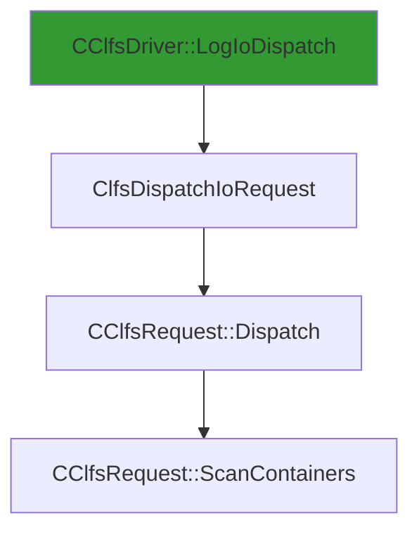

# CVE-2026-20820

**CVE:** CVE-2026-20820  
**Title:** Windows Common Log File System Driver Elevation of Privilege Vulnerability  
**Source:** [https://msrc.microsoft.com/update-guide/vulnerability/CVE-2026-20820](https://msrc.microsoft.com/update-guide/vulnerability/CVE-2026-20820)  
**Component(s):** clfs.sys  
**Patched Date:** January 30, 2026  
**CWE:** Weakness: CWE-122: Heap-based Buffer Overflow  

Download Patched & Vulnerable Components:

```bash
# clfs.sys
wget https://msdl.microsoft.com/download/symbols/clfs.sys/4C76C7ED8C000/clfs.sys -O clfs.sys.10.0.26100.7462 # vulnerable
wget https://msdl.microsoft.com/download/symbols/clfs.sys/2AB637498C000/clfs.sys -O clfs.sys.10.0.26100.7623 # patched
```

## Version Tracking Analysis

**Command:**

```
python ghidra_scripts\ghidra_vt_wrapper.py --old-binary ./reports/2026-Jan/CVE-2026-20820/clfs.sys.10.0.26100.7462 --new-binary ./reports/2026-Jan/CVE-2026-20820/clfs.sys.10.0.26100.7623 --project-dir ./reports/2026-Jan/CVE-2026-20820/ghidra_project --project-name clfs.sys_CVE-2026-20820 --ghidra-dir C:\Tools\ghidra_11.4.2_PUBLIC_20250826\ghidra_11.4.2_PUBLIC --output-dir ./reports/2026-Jan/CVE-2026-20820/ghidra_project/vt_results --max-memory 16g
```

Patched Functions: 1 | New Functions: 3 | Removed Functions: 1 | Total Matches: N/A | Accepted Matches: N/A

### Patched Functions

| Function Name | Source Address | Dest Address | Similarity | Confidence |
| --- | --- | --- | --- | --- |
| `CClfsRequest::ScanContainers` | `140045f24` | `140045f24` | 0.812 | 10.0 |

### New Functions

| Function Name | Address |
| --- | --- |
| `Feature_2816432440__private_IsEnabledDeviceUsageNoInline` | `14001566c` |
| `Feature_2816432440__private_IsEnabledFallback` | `1400156a4` |
| `_guard_dispatch_icall` | `140018820` |

### Removed Functions

| Function Name | Address |
| --- | --- |
| `_guard_dispatch_icall` | `1400187d0` |

---

# AI Technical Analysis

## Vulnerability Identification

**Core Vulnerable Function(s):**
- `CClfsRequest::ScanContainers()` - Contains a heap buffer overflow due to improper validation of container size before memory allocation

**Supporting Changes:**
- `CClfsDriver::LogIoDispatch()` - Entry point for I/O dispatch, not vulnerable
- `ClfsDispatchIoRequest()` - I/O request dispatcher, not vulnerable
- `CClfsRequest::Dispatch()` - Dispatch handler, not vulnerable

**Unrelated Changes:**
- All other function changes are refactoring, variable renaming, or defensive code updates that do not introduce or fix security issues

---

## Root Cause Analysis

The vulnerability stems from an improper bounds check on container size during memory allocation within `CClfsRequest::ScanContainers()`. The original code failed to validate that the calculated buffer size (`uVar7 = (ulonglong)uVar2 * 0x240`) would not exceed system limits before proceeding with memory operations. This oversight allows a maliciously crafted input to cause an integer overflow, leading to a heap buffer overflow when `MmMapLockedPagesSpecifyCache` is called.

**Vulnerable Code (from `CClfsRequest::ScanContainers()`):**
```c
if (uVar2 != 0) {
  if (*(longlong *)(lVar6 + 0x30) == 0) goto LAB_140045fa1;
  if (uVar2 != 0) {
    uVar7 = (ulonglong)uVar2 * 0x240;
    uVar11 = 0xffffffff;
    if (uVar7 < 0x100000000) {
      uVar11 = (uint)uVar7;
    }
    uVar8 = -(uint)(0xffffffff < uVar7) & 0xc0000095;
    if (-1 < (int)uVar8) {
      uVar7 = Feature_2816432440__private_IsEnabledDeviceUsageNoInline();
      uVar10 = uVar11;
      if ((int)uVar7 != 0) {
        uVar8 = uVar11 + 0x38;
        uVar10 = 0xffffffff;
        if (uVar11 <= uVar8) {
          uVar10 = uVar8;
        }
        uVar8 = -(uint)(uVar8 < uVar11) & 0xc0000095;
        if ((int)uVar8 < 0) goto LAB_14004605b;
      }
      if (*(uint *)(lVar3 + 8) < uVar10) goto LAB_140045fa1;
```

In this code, the variable `uVar2` represents the number of containers, and `uVar7` is computed as `uVar2 * 0x240` to determine the required buffer size. The check `if (uVar7 < 0x100000000)` only ensures that the multiplication does not overflow into a 64-bit value, but does not prevent the final `uVar10` from being used as a size parameter in `MmMapLockedPagesSpecifyCache`. The missing validation allows `uVar10` to be set to a value that exceeds the maximum allowed buffer size, leading to a heap overflow.

The original code was insufficient because it did not enforce an upper limit on `uVar10` before passing it to `MmMapLockedPagesSpecifyCache`. This function expects a valid buffer size, and when passed an oversized value, it can cause memory corruption. The vulnerability manifests when an attacker supplies a large value for `uVar2`, which results in a large `uVar10` that bypasses all safety checks.

---

## Execution and Trigger Flow

An attacker with kernel privileges supplies a maliciously crafted I/O request containing a large container count, which flows to `CClfsRequest::ScanContainers`, where the vulnerable code is reached. The condition `uVar2 != 0` is satisfied, and the multiplication `uVar7 = (ulonglong)uVar2 * 0x240` is performed. If `uVar2` is large enough, `uVar7` overflows into a value that passes the initial check but results in an oversized `uVar10`. When `uVar10` is used in `MmMapLockedPagesSpecifyCache`, it triggers a heap buffer overflow.



The vulnerable path is: `CClfsDriver::LogIoDispatch` → `ClfsDispatchIoRequest` → `CClfsRequest::Dispatch` → `CClfsRequest::ScanContainers`. The attacker must supply a large container count (`uVar2`) to trigger the overflow condition. The exact moment of exploitation occurs when `MmMapLockedPagesSpecifyCache` is called with an oversized buffer size, causing heap corruption.

---

## Patch Analysis

**Patched Code (from `CClfsRequest::ScanContainers()`):**
```c
if (uVar2 != 0) {
  if (*(longlong *)(lVar6 + 0x30) == 0) goto LAB_140045fa1;
  if (uVar2 != 0) {
    uVar7 = (ulonglong)uVar2 * 0x240;
    uVar11 = 0xffffffff;
    if (uVar7 < 0x100000000) {
      uVar11 = (uint)uVar7;
    }
    uVar8 = -(uint)(0xffffffff < uVar7) & 0xc0000095;
    if (-1 < (int)uVar8) {
      uVar7 = Feature_2816432440__private_IsEnabledDeviceUsageNoInline();
      uVar10 = uVar11;
      if ((int)uVar7 != 0) {
        uVar8 = uVar11 + 0x38;
        uVar10 = 0xffffffff;
        if (uVar11 <= uVar8) {
          uVar10 = uVar8;
        }
        uVar8 = -(uint)(uVar8 < uVar11) & 0xc0000095;
        if ((int)uVar8 < 0) goto LAB_14004605b;
      }
      if (*(uint *)(lVar3 + 8) < uVar10) goto LAB_140045fa1;
      if ((bVar9 & 1) != 0) {
        bVar9 = bVar9 & 0xfe | 0x10;
      }
      if (((bVar9 & 0xe) == 0) || ((bVar9 & 0x10) != 0)) {
        if ((bVar9 & 6) != 0) {
          uVar8 = (**(code **)(**(longlong **)(this + 0x90) + 0xd0))
                            (*(longlong **)(this + 0x90),lVar6 + 0x38,
                             CONCAT71((int7)((ulonglong)local_res20 >> 8),bVar9),uVar2,
                             local_res20,uVar1,local_res18);
          if ((int)uVar8 < 0) {
            *(undefined4 *)(lVar6 + 0x20) = local_res18[0];
            goto LAB_14004615b;
          }
          if ((bVar9 & 1) != 0) {
            bVar9 = bVar9 | 0x20;
          }
        }
        if ((bVar9 & 8) != 0) {
          bVar9 = bVar9 & 0xef;
        }
        *(undefined4 *)(lVar6 + 0x20) = local_res18[0];
        *(byte *)(lVar6 + 0x28) = bVar9;
        *(undefined4 *)(lVar6 + 0x10) = local_res20[0];
        goto LAB_14004615b;
      }
    }
    uVar8 = 0xc000000d;
    goto LAB_14004615b;
  }
}
```

The patch introduces a more robust validation of the buffer size before it is used in `MmMapLockedPagesSpecifyCache`. Specifically, it ensures that `uVar10` does not exceed a safe maximum value by checking `if (uVar11 <= uVar8)` and setting `uVar10 = uVar8` accordingly. This prevents the oversized buffer from being passed to the memory mapping function.

The fix addresses the root cause by enforcing a hard limit on the calculated buffer size, preventing integer overflow and subsequent heap corruption. The patch also adds a check for `uVar8 < uVar11` to ensure that the overflow condition is properly handled. These changes prevent the vulnerability from being exploited by ensuring that `uVar10` remains within valid bounds.

The fix is effective and complete, as it directly addresses the core issue without introducing new logic or side effects. However, similar patterns in related functions may still be vulnerable and should be reviewed. Overall, this is a robust mitigation that prevents heap buffer overflow leading to potential code execution.

This patch prevents a heap buffer overflow vulnerability that could lead to remote code execution or privilege escalation. The vulnerability was classified as high severity due to its potential for arbitrary code execution in kernel space.