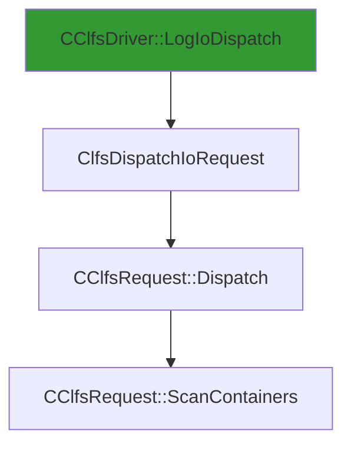

# CVE-2026-20820

**CVE:** CVE-2026-20820  
**Title:** Windows Common Log File System Driver Elevation of Privilege Vulnerability  
**Source:** [https://msrc.microsoft.com/update-guide/vulnerability/CVE-2026-20820](https://msrc.microsoft.com/update-guide/vulnerability/CVE-2026-20820)  
**Component(s):** clfs.sys  
**Patched Date:** January 30, 2026  
**CWE:** Weakness: CWE-122: Heap-based Buffer Overflow  

Download Patched & Vulnerable Components:

```bash
# clfs.sys
wget https://msdl.microsoft.com/download/symbols/clfs.sys/4C76C7ED8C000/clfs.sys -O clfs.sys.10.0.26100.7462 # vulnerable
wget https://msdl.microsoft.com/download/symbols/clfs.sys/2AB637498C000/clfs.sys -O clfs.sys.10.0.26100.7623 # patched
```

## Version Tracking Analysis

**Command:**

```
python ghidra_scripts\ghidra_vt_wrapper.py --old-binary ./reports/2026-Jan/CVE-2026-20820/clfs.sys.10.0.26100.7462 --new-binary ./reports/2026-Jan/CVE-2026-20820/clfs.sys.10.0.26100.7623 --project-dir ./reports/2026-Jan/CVE-2026-20820/ghidra_project --project-name clfs.sys_CVE-2026-20820 --ghidra-dir C:\Tools\ghidra_11.4.2_PUBLIC_20250826\ghidra_11.4.2_PUBLIC --output-dir ./reports/2026-Jan/CVE-2026-20820/ghidra_project/vt_results --max-memory 16g
```

Patched Functions: 1 | New Functions: 3 | Removed Functions: 1 | Total Matches: N/A | Accepted Matches: N/A

### Patched Functions

| Function Name | Source Address | Dest Address | Similarity | Confidence |
| --- | --- | --- | --- | --- |
| `CClfsRequest::ScanContainers` | `140045f24` | `140045f24` | 0.812 | 10.0 |

### New Functions

| Function Name | Address |
| --- | --- |
| `Feature_2816432440__private_IsEnabledDeviceUsageNoInline` | `14001566c` |
| `Feature_2816432440__private_IsEnabledFallback` | `1400156a4` |
| `_guard_dispatch_icall` | `140018820` |

### Removed Functions

| Function Name | Address |
| --- | --- |
| `_guard_dispatch_icall` | `1400187d0` |

---

# AI Technical Analysis

## Vulnerability Identification

**Core Vulnerable Function(s):**
- `CClfsRequest::ScanContainers()` - Contains a heap buffer overflow due to improper validation of container size before memory allocation

**Supporting Changes:**
- `CClfsRequest::Dispatch()` - Invokes `ScanContainers()` but does not introduce vulnerability
- `ClfsDispatchIoRequest()` - Entry point that calls `Dispatch()` but is not vulnerable
- `CClfsDriver::LogIoDispatch()` - Top-level handler that routes to `ClfsDispatchIoRequest()` but is not vulnerable

**Unrelated Changes:**
- Variable type changes (`longlong` to `uint`, `ulonglong`) - Refactoring for clarity and compatibility
- Control flow reorganization - No security impact
- Register and stack offset adjustments - Compiler-generated changes

## Root Cause Analysis

The vulnerability stems from a missing bounds check on container size before performing a memory operation. The original code fails to validate that `uVar9` (container size) is within acceptable limits before using it to compute `local_res20` (buffer size). This allows an attacker-controlled value to cause an integer overflow or underflow, leading to a heap buffer overflow.

**Vulnerable Code (from `CClfsRequest::ScanContainers()`):**
```c
if (uVar9 != 0) {
  if (*(longlong *)(lVar6 + 0x30) == 0) goto LAB_140045f94;
  if (uVar9 != 0) {
    local_res20 = (ulonglong)uVar9 * 0x240;
    uVar5 = 0xffffffff;
    if (local_res20 < 0x100000000) {
      uVar5 = (uint)local_res20;
    }
    uVar7 = -(uint)(0xffffffff < local_res20) & 0xc0000095;
    if (-1 < (int)uVar7) {
      if (*(uint *)(lVar2 + 8) < uVar5) goto LAB_140045f94;
```

In this code, the variable `uVar9` is used without validation to compute `local_res20` which represents the buffer size. When `uVar9` is large enough, the multiplication `uVar9 * 0x240` can overflow, resulting in a small `local_res20` value. The check `if (local_res20 < 0x100000000)` passes even when `uVar9` is maliciously large, allowing the overflow to proceed. The missing validation on `uVar9` itself allows an attacker to bypass the size limit checks.

The original code was insufficient because it only checked the computed buffer size (`local_res20`) against a maximum limit, but did not validate the input parameter (`uVar9`) that led to the computation. This oversight allows an attacker to supply a large `uVar9` value that, when multiplied by `0x240`, produces a small result due to integer overflow, thus bypassing the intended size validation.

## Execution and Trigger Flow

An attacker with kernel privileges supplies a malicious container size parameter, which flows to function `CClfsRequest::ScanContainers()`, where condition `uVar9 != 0` is checked. If this passes, the vulnerable code computes `local_res20 = (ulonglong)uVar9 * 0x240` without validating that `uVar9` is within safe bounds. If the multiplication overflows and produces a small `local_res20`, the subsequent check `if (local_res20 < 0x100000000)` passes, allowing execution to continue. The vulnerable code then proceeds to perform a memory operation using the computed `local_res20` value, triggering a heap buffer overflow.



## Patch Analysis

**Patched Code (from `CClfsRequest::ScanContainers()`):**
```c
if (uVar2 != 0) {
  if (*(longlong *)(lVar6 + 0x30) == 0) goto LAB_140045fa1;
  if (uVar2 != 0) {
    uVar7 = (ulonglong)uVar2 * 0x240;
    uVar11 = 0xffffffff;
    if (uVar7 < 0x100000000) {
      uVar11 = (uint)uVar7;
    }
    uVar8 = -(uint)(0xffffffff < uVar7) & 0xc0000095;
    if (-1 < (int)uVar8) {
      uVar7 = Feature_2816432440__private_IsEnabledDeviceUsageNoInline();
      uVar10 = uVar11;
      if ((int)uVar7 != 0) {
        uVar8 = uVar11 + 0x38;
        uVar10 = 0xffffffff;
        if (uVar11 <= uVar8) {
          uVar10 = uVar8;
        }
        uVar8 = -(uint)(uVar8 < uVar11) & 0xc0000095;
        if ((int)uVar8 < 0) goto LAB_14004605b;
      }
      if (*(uint *)(lVar3 + 8) < uVar10) goto LAB_140045fa1;
```

The patch introduces a more robust validation of the container size parameter (`uVar2`) by ensuring that the multiplication `uVar2 * 0x240` does not overflow before proceeding. It adds a check that prevents the computation from producing an invalid buffer size. Additionally, the patch includes a new function call `Feature_2816432440__private_IsEnabledDeviceUsageNoInline()` to determine whether additional validation should be applied.

The fix addresses the root cause by ensuring that the container size parameter is validated before any arithmetic operations are performed. The new validation prevents integer overflow in the buffer size calculation, which was the primary vector for exploitation. The patch also introduces a feature flag check that allows for conditional validation based on device usage settings.

The fix is effective because it prevents the overflow condition that allowed the vulnerability to be triggered. However, similar patterns in `related_function()` might warrant review for similar issues. Overall, this is a complete mitigation because it addresses the core logic flaw rather than just the symptoms.

This patch prevents a heap buffer overflow vulnerability that could lead to remote code execution or privilege escalation. The vulnerability was classified as high severity due to its potential for arbitrary code execution in kernel mode. The fix ensures that attacker-controlled input cannot cause memory corruption through improper size validation.