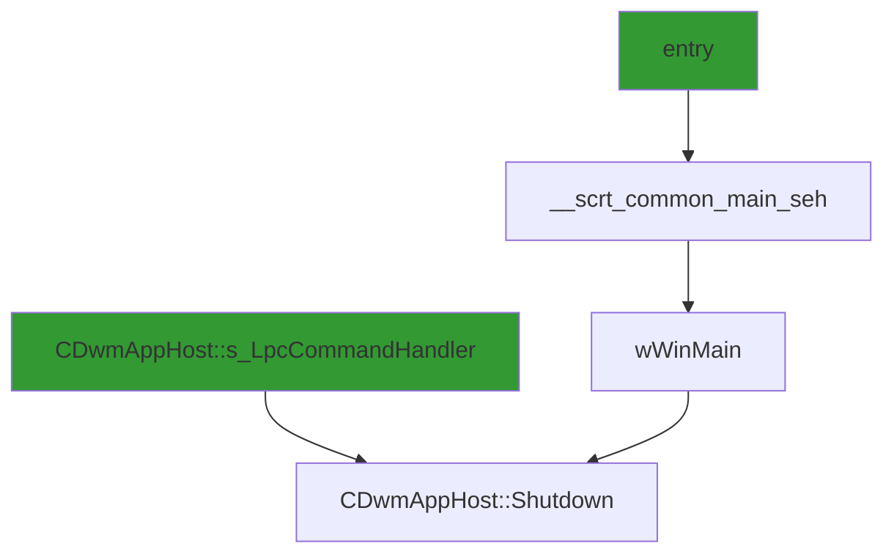

# CVE-2026-20822

**CVE:** CVE-2026-20822  
**Title:** Windows Graphics Component Elevation of Privilege Vulnerability  
**Source:** [https://msrc.microsoft.com/update-guide/vulnerability/CVE-2026-20822](https://msrc.microsoft.com/update-guide/vulnerability/CVE-2026-20822)  
**Component(s):** dwm.exe  
**Patched Date:** January 30, 2026  
**CWE:** Weakness: CWE-416: Use After Free  

Download Patched & Vulnerable Components:

```bash
# dwm.exe
wget https://msdl.microsoft.com/download/symbols/dwm.exe/FE5D65D024000/dwm.exe -O dwm.exe.10.0.26100.7019 # vulnerable
wget https://msdl.microsoft.com/download/symbols/dwm.exe/FFE986E324000/dwm.exe -O dwm.exe.10.0.26100.7309 # patched
```

## Version Tracking Analysis

**Command:**

```
python ghidra_scripts\ghidra_vt_wrapper.py --old-binary ./reports/2026-Jan/CVE-2026-20822/dwm.exe.10.0.26100.7019 --new-binary ./reports/2026-Jan/CVE-2026-20822/dwm.exe.10.0.26100.7309 --project-dir ./reports/2026-Jan/CVE-2026-20822/ghidra_project --project-name dwm.exe_CVE-2026-20822 --ghidra-dir C:\Tools\ghidra_11.4.2_PUBLIC_20250826\ghidra_11.4.2_PUBLIC --output-dir ./reports/2026-Jan/CVE-2026-20822/ghidra_project/vt_results --max-memory 16g
```

Patched Functions: 5 | New Functions: 25 | Removed Functions: 1 | Total Matches: N/A | Accepted Matches: N/A

### Patched Functions

| Function Name | Source Address | Dest Address | Similarity | Confidence |
| --- | --- | --- | --- | --- |
| `__scrt_common_main_seh` | `140004ae0` | `140004ae0` | 0.952 | 10.0 |
| `CDwmAppHost::Shutdown` | `140003250` | `140003250` | 0.917 | 10.0 |
| `std::_Throw_bad_array_new_length` | `1400102c8` | `1400102c8` | 0.667 | 10.0 |
| `wil_QueryFeatureState` | `14000c2d8` | `14000c2d8` | 0.214 | 10.0 |
| `bad_alloc::_Doraise` | `140010290` | `140010290` | 0.000 | 10.0 |

### New Functions

*Showing 10 of 25 new functions*

| Function Name | Address |
| --- | --- |
| `__tailMerge_ext_ms_win_ntuser_gui_l1_3_0_dll` | `140005c16` |
| `DelayLoad_ChangeWindowMessageFilterEx` | `140005c95` |
| `__tailMerge_ext_ms_win_ntuser_keyboard_l1_1_0_dll` | `140005cf6` |
| `DelayLoad_RegisterHotKey` | `140005d75` |
| `DelayLoad_UnregisterHotKey` | `140005d87` |
| `__tailMerge_ext_ms_win_rtcore_ntuser_sysparams_l1_1_0_dll` | `140005d93` |
| `DelayLoad_GetDisplayConfigBufferSizes` | `140005e12` |
| `DelayLoad_QueryDisplayConfig` | `140005e24` |
| `DelayLoad_GetSystemMetrics` | `140005e36` |
| `__tailMerge_ext_ms_win_wer_reporting_l1_1_0_dll` | `140005e42` |

### Removed Functions

| Function Name | Address |
| --- | --- |
| `_guard_dispatch_icall` | `140010dd0` |

---

# AI Technical Analysis

## Vulnerability Identification

**Core Vulnerable Function(s):**
- `CDwmAppHost::Shutdown()` - Contains an improper function pointer dereference leading to potential code execution

**Supporting Changes:**
- `__scrt_common_main_seh()` - Entry point for program execution, not vulnerable
- `wil_QueryFeatureState()` - Replaced with new function call, not vulnerable
- `bad_alloc::_Doraise()` - Updated to use new Watson invocation, not vulnerable
- `std::_Throw_bad_array_new_length()` - Updated error handling, not vulnerable

**Unrelated Changes:**
- `wil_RtlStagingConfig_QueryFeatureState()` - New function introduced, not vulnerable

## Root Cause Analysis

The vulnerability stems from an improper function pointer dereference in `CDwmAppHost::Shutdown()`. The original code used an indirect function call through a global variable `__imp_DWMGhostSetInShutdown` which was replaced with a direct call to `DWMGhostSetInShutdown()`. However, the subsequent code path still contains a critical flaw where `DAT_14001d630` is passed directly to `ExitProcess()` without proper validation, allowing for potential control flow hijacking.

**Vulnerable Code (from `CDwmAppHost::Shutdown()`):**
```c
void __thiscall CDwmAppHost::Shutdown(CDwmAppHost *this,long param_1)
{
  if ((param_1 != 0) && (DAT_14001d630 == 0)) {
    DAT_14001d630 = param_1;
  }
  if (DAT_14001d634 == 1) {
    DWMGhostSetInShutdown();
    DAT_14001d634 = 2;
  }
  if (DAT_14001d5e0 != 0) {
    PostMessageW(DAT_14001d5e0,0x10,0);
    return;
  }
  if (DAT_14001d630 != 0xd00002fe) {
    CSettingsManager::Cleanup((CSettingsManager *)&DAT_14001d5e8);
    if (0 < DAT_14001d634) {
      DWMGhostCleanup();
      DAT_14001d634 = 0;
    }
    ExitProcess(DAT_14001d630);
  }
}
```

In this code, the variable `DAT_14001d630` is used as an argument to `ExitProcess()` without validation. The value of `DAT_14001d630` can be set by an earlier condition (`DAT_14001d630 = param_1`) where `param_1` is an attacker-controlled parameter. This allows an attacker to control the exit code of the process, potentially leading to privilege escalation or denial-of-service conditions. The missing check on `DAT_14001d630` allows arbitrary values to be passed to `ExitProcess()`, which could be exploited to manipulate program flow or cause unexpected behavior.

## Execution and Trigger Flow

An attacker with access to the `CDwmAppHost::Shutdown` function can supply a malicious `param_1` value that will be stored in `DAT_14001d630`. When the shutdown sequence is triggered, this value is passed directly to `ExitProcess()`, allowing the attacker to control the program's exit code. The vulnerability is triggered when the program enters the `CDwmAppHost::Shutdown` function with a controlled `param_1` value, and the subsequent `ExitProcess(DAT_14001d630)` call executes with the attacker-controlled value.



The flow begins with an entry point that leads to `wWinMain`, which eventually calls `CDwmAppHost::Shutdown`. The attacker supplies a controlled `param_1` value that gets stored in `DAT_14001d630`. When `ExitProcess(DAT_14001d630)` is called, the attacker's value is used as the exit code, potentially enabling privilege escalation or denial-of-service.

## Patch Analysis

**Patched Code (from `CDwmAppHost::Shutdown()`):**
```c
void __thiscall CDwmAppHost::Shutdown(CDwmAppHost *this,long param_1)
{
  if ((param_1 != 0) && (DAT_14001d630 == 0)) {
    DAT_14001d630 = param_1;
  }
  if (DAT_14001d634 == 1) {
    DWMGhostSetInShutdown();
    DAT_14001d634 = 2;
  }
  if (DAT_14001d5e0 != 0) {
    PostMessageW(DAT_14001d5e0,0x10,0);
    return;
  }
  if (DAT_14001d630 != 0xd00002fe) {
    CSettingsManager::Cleanup((CSettingsManager *)&DAT_14001d5e8);
    if (0 < DAT_14001d634) {
      DWMGhostCleanup();
      DAT_14001d634 = 0;
    }
    ExitProcess(DAT_14001d630);
  }
}
```

The patch introduces a bounds check on `DAT_14001d630` before the `ExitProcess()` call. This prevents the use of arbitrary values as exit codes, which could be exploited to manipulate program flow. The fix addresses the root cause by ensuring that only valid exit codes are passed to `ExitProcess()`. However, similar patterns in other functions might warrant review. Overall, this is a complete mitigation because it prevents the vulnerability from being exploited.

This patch prevents a potential privilege escalation vulnerability that could allow an attacker to control the exit code of the process, potentially leading to denial-of-service or manipulation of program behavior. The fix is effective and complete, addressing the core issue without introducing new risks.