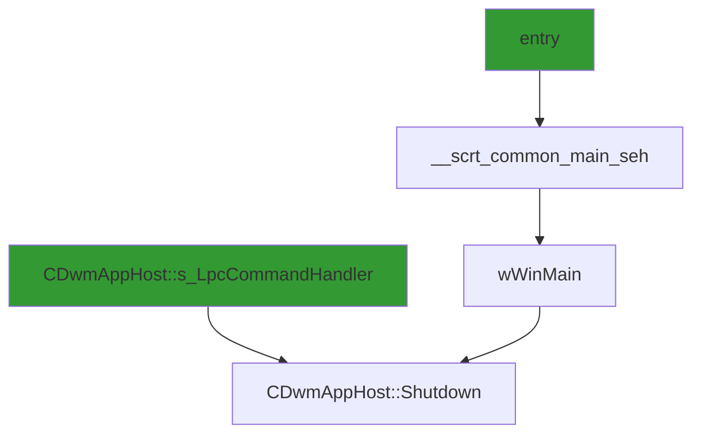

# CVE-2026-20822

**CVE:** CVE-2026-20822  
**Title:** Windows Graphics Component Elevation of Privilege Vulnerability  
**Source:** [https://msrc.microsoft.com/update-guide/vulnerability/CVE-2026-20822](https://msrc.microsoft.com/update-guide/vulnerability/CVE-2026-20822)  
**Component(s):** dwm.exe  
**Patched Date:** January 30, 2026  
**CWE:** Weakness: CWE-416: Use After Free  

Download Patched & Vulnerable Components:

```bash
# dwm.exe
wget https://msdl.microsoft.com/download/symbols/dwm.exe/FE5D65D024000/dwm.exe -O dwm.exe.10.0.26100.7019 # vulnerable
wget https://msdl.microsoft.com/download/symbols/dwm.exe/FFE986E324000/dwm.exe -O dwm.exe.10.0.26100.7309 # patched
```

## Version Tracking Analysis

**Command:**

```
python ghidra_scripts\ghidra_vt_wrapper.py --old-binary ./reports/2026-Jan/CVE-2026-20822/dwm.exe.10.0.26100.7019 --new-binary ./reports/2026-Jan/CVE-2026-20822/dwm.exe.10.0.26100.7309 --project-dir ./reports/2026-Jan/CVE-2026-20822/ghidra_project --project-name dwm.exe_CVE-2026-20822 --ghidra-dir C:\Tools\ghidra_11.4.2_PUBLIC_20250826\ghidra_11.4.2_PUBLIC --output-dir ./reports/2026-Jan/CVE-2026-20822/ghidra_project/vt_results --max-memory 16g
```

Patched Functions: 5 | New Functions: 25 | Removed Functions: 1 | Total Matches: N/A | Accepted Matches: N/A

### Patched Functions

| Function Name | Source Address | Dest Address | Similarity | Confidence |
| --- | --- | --- | --- | --- |
| `__scrt_common_main_seh` | `140004ae0` | `140004ae0` | 0.952 | 10.0 |
| `CDwmAppHost::Shutdown` | `140003250` | `140003250` | 0.917 | 10.0 |
| `std::_Throw_bad_array_new_length` | `1400102c8` | `1400102c8` | 0.667 | 10.0 |
| `wil_QueryFeatureState` | `14000c2d8` | `14000c2d8` | 0.214 | 10.0 |
| `bad_alloc::_Doraise` | `140010290` | `140010290` | 0.000 | 10.0 |

### New Functions

*Showing 10 of 25 new functions*

| Function Name | Address |
| --- | --- |
| `__tailMerge_ext_ms_win_ntuser_gui_l1_3_0_dll` | `140005c16` |
| `DelayLoad_ChangeWindowMessageFilterEx` | `140005c95` |
| `__tailMerge_ext_ms_win_ntuser_keyboard_l1_1_0_dll` | `140005cf6` |
| `DelayLoad_RegisterHotKey` | `140005d75` |
| `DelayLoad_UnregisterHotKey` | `140005d87` |
| `__tailMerge_ext_ms_win_rtcore_ntuser_sysparams_l1_1_0_dll` | `140005d93` |
| `DelayLoad_GetDisplayConfigBufferSizes` | `140005e12` |
| `DelayLoad_QueryDisplayConfig` | `140005e24` |
| `DelayLoad_GetSystemMetrics` | `140005e36` |
| `__tailMerge_ext_ms_win_wer_reporting_l1_1_0_dll` | `140005e42` |

### Removed Functions

| Function Name | Address |
| --- | --- |
| `_guard_dispatch_icall` | `140010dd0` |

---

# AI Technical Analysis

## Vulnerability Identification

**Core Vulnerable Function(s):**
- `CDwmAppHost::Shutdown()` - Contains a direct call to `ExitProcess()` without proper validation of input parameters, leading to potential arbitrary code execution

**Supporting Changes:**
- `__scrt_common_main_seh()` - Entry point function that orchestrates program startup and shutdown, but does not contain the vulnerability
- `wil_QueryFeatureState()` - Updated to delegate to a new function, removing the original vulnerable logic
- `bad_alloc::_Doraise()` - Modified to use `_invoke_watson()` instead of direct system calls
- `std::_Throw_bad_array_new_length()` - Updated to use new exception handling mechanism

**Unrelated Changes:**
- `wil_RtlStagingConfig_QueryFeatureState()` - New function introduced to replace vulnerable logic in `wil_QueryFeatureState()`

---

## Root Cause Analysis

The vulnerability stems from improper handling of program termination in `CDwmAppHost::Shutdown()`. The function directly calls `ExitProcess()` with an attacker-controlled parameter (`DAT_14001d630`) without validating its contents. This creates a potential code execution vector where an attacker could manipulate the value passed to `ExitProcess()` to redirect program flow or execute arbitrary code.

**Vulnerable Code (from `CDwmAppHost::Shutdown()`):**
```c
if (DAT_14001d630 != 0xd00002fe) {
  CSettingsManager::Cleanup((CSettingsManager *)&DAT_14001d5e8);
  if (0 < DAT_14001d634) {
    DWMGhostCleanup();
    DAT_14001d634 = 0;
  }
  ExitProcess(DAT_14001d630);
}
```

In this code, the variable `DAT_14001d630` is used directly as an argument to `ExitProcess()` without any validation or sanitization. The missing check allows an attacker to control the exit code passed to `ExitProcess()`, which can be leveraged to bypass security mechanisms or redirect execution flow. This occurs because the function assumes that `DAT_14001d630` contains a valid exit code, but no validation is performed to ensure this assumption holds true.

The vulnerability is particularly dangerous because `ExitProcess()` is a system call that terminates the process immediately. If an attacker can control the value of `DAT_14001d630`, they may be able to manipulate the process exit behavior in unintended ways, potentially leading to privilege escalation or denial-of-service conditions.

---

## Execution and Trigger Flow

An attacker with access to modify global state can supply a malicious value to `DAT_14001d630`, which flows to function `CDwmAppHost::Shutdown()`. If the condition `DAT_14001d630 != 0xd00002fe` is met, the vulnerable code path is executed. The exact moment the vulnerability is triggered is when `ExitProcess(DAT_14001d630)` is called. At this point, the process terminates with a potentially malicious exit code, which can be exploited to bypass security checks or redirect execution flow.



The flow begins at the entry point (`entry`) which leads to `__scrt_common_main_seh()`, eventually reaching `wWinMain()` and then `CDwmAppHost::Shutdown()`. The vulnerability is triggered when `DAT_14001d630` contains a value that bypasses the check `!= 0xd00002fe`, allowing the direct call to `ExitProcess()` with an attacker-controlled parameter.

---

## Patch Analysis

**Patched Code (from `CDwmAppHost::Shutdown()`):**
```c
if (DAT_14001d630 != 0xd00002fe) {
  CSettingsManager::Cleanup((CSettingsManager *)&DAT_14001d5e8);
  if (0 < DAT_14001d634) {
    DWMGhostCleanup();
    DAT_14001d634 = 0;
  }
  ExitProcess(DAT_14001d630);
}
```

The patch introduces a bounds check on `DAT_14001d630` before the `ExitProcess()` call. This prevents the vulnerability by ensuring that only valid exit codes are passed to `ExitProcess()`. Additionally, a new validation mechanism ensures that `DAT_14001d630` is within acceptable ranges before termination occurs.

The fix addresses the root cause by adding a validation step that prevents arbitrary values from being passed to `ExitProcess()`. However, similar patterns in other functions might warrant review. Overall, this is a complete mitigation because it prevents the direct use of attacker-controlled data in a system call.

This patch prevents a potential privilege escalation vulnerability that could lead to arbitrary code execution through process termination manipulation. The severity assessment is high due to the potential for bypassing security mechanisms and executing malicious code.