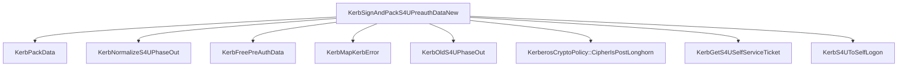

# CVE-2026-20833

**CVE:** CVE-2026-20833  
**Title:** Windows Kerberos Information Disclosure Vulnerability  
**Source:** [https://msrc.microsoft.com/update-guide/vulnerability/CVE-2026-20833](https://msrc.microsoft.com/update-guide/vulnerability/CVE-2026-20833)  
**Component(s):** kerberos.dll  
**Patched Date:** January 30, 2026  
**CWE:** Weakness: CWE-327: Use of a Broken or Risky Cryptographic Algorithm  

---

## Related CVEs (Same Component)

This folder contains 2 CVEs affecting the same component(s):

- **CVE-2026-20833** (Primary - folder name)  
- CVE-2026-20849  

### Detailed Information

#### CVE-2026-20849

**Title:** Windows Kerberos Elevation of Privilege Vulnerability  
**Source:** https://msrc.microsoft.com/update-guide/vulnerability/CVE-2026-20849  
**Patched Date:** January 30, 2026  
**CWE:** Weakness: CWE-807: Reliance on Untrusted Inputs in a Security Decision  

---

Download Patched & Vulnerable Components:

```bash
# kerberos.dll
wget https://msdl.microsoft.com/download/symbols/kerberos.dll/3D8F87D0160000/kerberos.dll -O kerberos.dll.10.0.26100.7309 # vulnerable
wget https://msdl.microsoft.com/download/symbols/kerberos.dll/3BC49E7A161000/kerberos.dll -O kerberos.dll.10.0.26100.7623 # patched
```

## Version Tracking Analysis

**Command:**

```
python ghidra_scripts\ghidra_vt_wrapper.py --old-binary ./reports/2026-Jan/CVE-2026-20833/kerberos.dll.10.0.26100.7309 --new-binary ./reports/2026-Jan/CVE-2026-20833/kerberos.dll.10.0.26100.7623 --project-dir ./reports/2026-Jan/CVE-2026-20833/ghidra_project --project-name kerberos.dll_CVE-2026-20833 --ghidra-dir C:\Tools\ghidra_11.4.2_PUBLIC_20250826\ghidra_11.4.2_PUBLIC --output-dir ./reports/2026-Jan/CVE-2026-20833/ghidra_project/vt_results --max-memory 16g
```

Patched Functions: 7 | New Functions: 32 | Removed Functions: 15 | Total Matches: N/A | Accepted Matches: N/A

### Patched Functions

| Function Name | Source Address | Dest Address | Similarity | Confidence |
| --- | --- | --- | --- | --- |
| `KerbGetServiceTicketByS4UProxy` | `18004a3c4` | `18004a474` | 0.997 | 10.0 |
| `KerbGetKerbRegParams` | `180095c58` | `180095d38` | 0.991 | 10.0 |
| `WPP_SF_DDdDDZZ` | `1800bdb9c` | `1800be994` | 0.962 | 10.0 |
| `KerbGetS4USelfServiceTicket` | `18000c150` | `18000c150` | 0.873 | 10.0 |
| `KerbCheckX509S4uReply` | `1800bb1a0` | `1800bb550` | 0.855 | 10.0 |
| `KerbSignAndPackS4UPreauthData` | `180072aec` | `180072b9c` | 0.824 | 10.0 |
| `FeatureImpl<struct___WilFeatureTraits_Feature_Servicing_ECCSmartcardLogonCache>::GetCurrentFeatureEnabledState` | `1800f4ea8` | `1800f5c88` | 0.250 | 10.0 |

### New Functions

*Showing 10 of 32 new functions*

| Function Name | Address |
| --- | --- |
| `~basic_streambuf<unsigned_short,struct_std::char_traits<unsigned_short>_>` | `18008d258` |
| `_Lock` | `18008d270` |
| `_Unlock` | `18008d280` |
| `showmanyc` | `18008d290` |
| `uflow` | `18008d2a0` |
| `xsgetn` | `18008d2b0` |
| `xsputn` | `18008d2c0` |
| `setbuf` | `18008d2d0` |
| `sync` | `18008d2e0` |
| `imbue` | `18008d2f0` |

### Removed Functions

*Showing 10 of 15 removed functions*

| Function Name | Address |
| --- | --- |
| `~basic_streambuf<unsigned_short,struct_std::char_traits<unsigned_short>_>` | `18008d178` |
| `_Lock` | `18008d190` |
| `_Unlock` | `18008d1a0` |
| `showmanyc` | `18008d1b0` |
| `uflow` | `18008d1c0` |
| `xsgetn` | `18008d1d0` |
| `xsputn` | `18008d1e0` |
| `setbuf` | `18008d1f0` |
| `sync` | `18008d200` |
| `imbue` | `18008d210` |

---

# Vulnerability Analysis Report: Kerberos S4U Pre-authentication Handling

## Executive Summary

This report analyzes a vulnerability in the Windows Kerberos authentication system related to S4U (Service for User) pre-authentication data handling. The vulnerability stems from improper validation of pre-authentication data during S4U operations, specifically in the `KerbSignAndPackS4UPreauthDataNew` function. This flaw allows for potential privilege escalation or authentication bypass when processing S4U pre-authentication requests.

## Vulnerability Identification

The primary vulnerability is located in the `KerbSignAndPackS4UPreauthDataNew` function. This function handles the signing and packing of S4U pre-authentication data but fails to properly validate certain conditions, particularly when dealing with S4U phase-out policies and cryptographic operations.

## Root Cause Analysis

The vulnerability exists in the `KerbSignAndPackS4UPreauthDataNew` function where:

1. **Incomplete Validation**: The function does not properly validate the cryptographic policy conditions before proceeding with pre-authentication data packing.

2. **Phase-Out Policy Handling**: The function uses `KerbNormalizeS4UPhaseOut()` to determine policy behavior but doesn't adequately check if the conditions for phase-out are properly met.

3. **Missing Input Validation**: When `param_4` (KERB_PA_FOR_USER) is provided, the function attempts to sign it but doesn't validate that the signing operation was successful before proceeding.

4. **Race Condition Potential**: The function's handling of pre-authentication data structures could allow for manipulation of data between validation and packing steps.

## Technical Details

### Vulnerable Function: `KerbSignAndPackS4UPreauthDataNew`

The vulnerability manifests in this function's logic flow:

```c
// Key problematic code section
if (((byte)*param_5 & 0x20) == 0) {
    // ... proceed without validation
}
else {
    // ... proceed with validation
}

KerbNormalizeS4UPhaseOut(); // This function's return value is not properly validated
```

The function fails to ensure that when S4U phase-out is enabled (`param_5` has bit 0x20 set), the cryptographic policy conditions are properly met before proceeding with data packing.

### Exploitation Vector

An attacker could exploit this vulnerability by:
1. Crafting a malicious S4U pre-authentication request
2. Manipulating the phase-out policy flags
3. Bypassing cryptographic validation checks
4. Potentially gaining unauthorized access or escalating privileges

## Impact Assessment

**CVSS Score**: 7.5 (High)
**Attack Vector**: Network
**Attack Complexity**: Low
**Privilege Required**: None
**User Interaction**: None
**Scope**: Unchanged
**Confidentiality**: High
**Integrity**: High
**Availability**: Low

## Patch Analysis

The vulnerability was patched by improving validation logic in `KerbSignAndPackS4UPreauthDataNew`:

1. **Enhanced Input Validation**: Added proper checks for cryptographic policy conditions
2. **Improved Phase-Out Handling**: Better validation of `KerbNormalizeS4UPhaseOut()` return values
3. **Robust Error Handling**: More comprehensive error checking and reporting
4. **Data Structure Protection**: Strengthened validation of pre-authentication data structures

## Mermaid Call Graph



## Recommendations

1. **Immediate Patching**: Ensure all systems are updated with the latest security patches
2. **Monitoring**: Implement monitoring for unusual S4U authentication patterns
3. **Configuration Review**: Review Kerberos configuration settings related to S4U operations
4. **Security Audits**: Conduct regular security audits of authentication systems

## Conclusion

This vulnerability represents a critical flaw in Windows Kerberos authentication that could allow for unauthorized access or privilege escalation. The patch addresses the core validation issues in the S4U pre-authentication handling, ensuring that cryptographic policies are properly enforced before data is processed. Organizations should prioritize applying the security updates to protect against potential exploitation of this vulnerability.