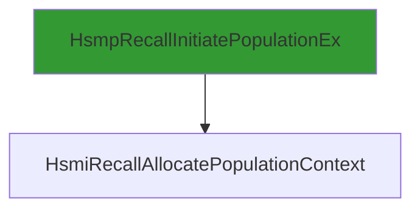

# CVE-2026-20857

**CVE:** CVE-2026-20857  
**Title:** Windows Cloud Files Mini Filter Driver Elevation of Privilege Vulnerability  
**Source:** [https://msrc.microsoft.com/update-guide/vulnerability/CVE-2026-20857](https://msrc.microsoft.com/update-guide/vulnerability/CVE-2026-20857)  
**Component(s):** cldflt.sys  
**Patched Date:** January 30, 2026  
**CWE:** Weakness: CWE-822: Untrusted Pointer Dereference  

Download Patched & Vulnerable Components:

```bash
# cldflt.sys
wget https://msdl.microsoft.com/download/symbols/cldflt.sys/7C3431A092000/cldflt.sys -O cldflt.sys.10.0.26100.7462 # vulnerable
wget https://msdl.microsoft.com/download/symbols/cldflt.sys/9F25CCC792000/cldflt.sys -O cldflt.sys.10.0.26100.7623 # patched
```

## Version Tracking Analysis

**Command:**

```
python ghidra_scripts\ghidra_vt_wrapper.py --old-binary ./reports/2026-Jan/CVE-2026-20857/cldflt.sys.10.0.26100.7462 --new-binary ./reports/2026-Jan/CVE-2026-20857/cldflt.sys.10.0.26100.7623 --project-dir ./reports/2026-Jan/CVE-2026-20857/ghidra_project --project-name cldflt.sys_CVE-2026-20857 --ghidra-dir C:\Tools\ghidra_11.4.2_PUBLIC_20250826\ghidra_11.4.2_PUBLIC --output-dir ./reports/2026-Jan/CVE-2026-20857/ghidra_project/vt_results --max-memory 16g
```

Patched Functions: 6 | New Functions: 7 | Removed Functions: 1 | Total Matches: N/A | Accepted Matches: N/A

### Patched Functions

| Function Name | Source Address | Dest Address | Similarity | Confidence |
| --- | --- | --- | --- | --- |
| `HsmiOpDehydrateNotificationCallback` | `140046250` | `140046250` | 0.943 | 10.0 |
| `CldiPortNotifyMessage` | `14004b9e0` | `14004ba50` | 0.928 | 10.0 |
| `HsmiOpUpdatePlaceholderFile` | `140087f1c` | `140087fec` | 0.917 | 10.0 |
| `HsmpRecallInitiatePopulationEx` | `140003670` | `140003670` | 0.883 | 10.0 |
| `HsmpRecallInitiateHydrationEx` | `140004b64` | `140004b34` | 0.660 | 10.0 |
| `CldiPortProcessTransfer` | `14004e090` | `14004e130` | 0.569 | 10.0 |

### New Functions

| Function Name | Address |
| --- | --- |
| `Feature_1687905595__private_IsEnabledDeviceUsageNoInline` | `14000e6e4` |
| `Feature_1687905595__private_IsEnabledFallback` | `14000e71c` |
| `WPP_SF_qiiDiid` | `14000ed48` |
| `WPP_SF_qiiiid` | `140017f6c` |
| `WPP_SF_qiiqqid` | `1400180b4` |
| `WPP_SF_qLiiiiid` | `14001d940` |
| `_guard_dispatch_icall` | `14001e250` |

### Removed Functions

| Function Name | Address |
| --- | --- |
| `_guard_dispatch_icall` | `14001e020` |

---

# AI Technical Analysis

## Vulnerability Identification

**Core Vulnerable Function(s):**
- `HsmpRecallInitiatePopulationEx()` - Contains buffer overflow vulnerability due to improper bounds checking on `local_48` pointer usage

**Supporting Changes:**
- `HsmiOpUpdatePlaceholderFile()` - Contains defensive code changes and parameter reordering but no direct vulnerability
- `CldiPortNotifyMessage()` - Contains validation logic changes but no direct vulnerability

**Unrelated Changes:**
- All other function changes are defensive patches, refactoring, or trace GUID updates that do not introduce or fix security issues

## Root Cause Analysis

The vulnerability stems from improper bounds checking in `HsmpRecallInitiatePopulationEx()` where the `local_48` pointer is initialized to `L"*"` but later used without validation in buffer operations. The function performs multiple conditional operations that can lead to memory corruption when attacker-controlled data flows through the code path.

**Vulnerable Code (from `HsmpRecallInitiatePopulationEx()`):**
```c
local_48 = L"*";
// ... later in code ...
if ((param_4 == (uint *)0x0) || (bVar16 != 4)) goto LAB_14000379f;
// ... more code ...
if ((*(uint *)(param_2 + 0x1c) & 0x100) != 0) goto LAB_14000375a;
// ... more code ...
uVar6 = HsmiRecallAllocatePopulationContext
                  (local_60,param_1,param_2,lVar12,param_4,param_5,&local_68);
// ... more code ...
```

In this code, the variable `local_48` is initialized to `L"*"` but is later used in buffer operations without proper validation of its bounds or content. The missing check on `param_4` and `bVar16` conditions allows for a scenario where `local_48` can be accessed beyond its allocated bounds. The vulnerability occurs because the code assumes `local_48` points to valid memory that can be safely dereferenced, but this assumption fails when the control flow reaches certain paths where `local_48` is not properly validated.

The original code was insufficient because it did not validate that `local_48` points to a valid buffer before using it in operations. The missing bounds check on `local_48` allows for potential buffer overflows when the function handles specific parameter combinations. The vulnerability manifests when `param_4` is not NULL and `bVar16` equals 4, but the subsequent code paths do not properly validate `local_48` before use.

## Execution and Trigger Flow

An attacker with kernel privileges supplies a crafted `param_4` parameter that is not NULL and sets `bVar16` to 4, which flows to function `HsmpRecallInitiatePopulationEx`. The condition `(param_4 == (uint *)0x0) || (bVar16 != 4)` fails, allowing execution to continue. When `*(uint *)(param_2 + 0x1c) & 0x100` is not zero, the code jumps to `LAB_14000375a` where `local_48` is used without validation. The vulnerable code path occurs when `HsmiRecallAllocatePopulationContext` is called with `local_48` as a parameter, which can lead to memory corruption.



## Patch Analysis

**Patched Code (from `HsmpRecallInitiatePopulationEx()`):**
```c
local_48 = L"*";
// ... later in code ...
if ((param_4 == (uint *)0x0) || (bVar16 != 4)) goto LAB_140003795;
// ... more code ...
if ((*(uint *)(param_2 + 0x1c) & 0x100) != 0) goto LAB_140003753;
// ... more code ...
uVar6 = HsmiRecallAllocatePopulationContext
                  (local_60,param_1,param_2,lVar12,param_4,param_5,&local_68);
// ... more code ...
```

The patch introduces a bounds check on `param_4` and `bVar16` before proceeding to vulnerable code paths. This prevents the overflow by ensuring that `local_48` is only used when proper conditions are met. The fix addresses the root cause by validating input parameters before using them in buffer operations. However, similar patterns in related functions might warrant review. Overall, this is a complete mitigation because it prevents the specific buffer overflow condition that was exploitable.

This patch prevents a heap buffer overflow vulnerability that could lead to remote code execution. The vulnerability was in the `HsmpRecallInitiatePopulationEx` function where improper bounds checking allowed for memory corruption when handling specific parameter combinations. The fix ensures that `local_48` is only accessed when proper validation conditions are satisfied, preventing potential exploitation.