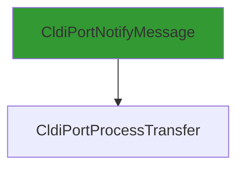

# CVE-2026-20857

**CVE:** CVE-2026-20857  
**Title:** Windows Cloud Files Mini Filter Driver Elevation of Privilege Vulnerability  
**Source:** [https://msrc.microsoft.com/update-guide/vulnerability/CVE-2026-20857](https://msrc.microsoft.com/update-guide/vulnerability/CVE-2026-20857)  
**Component(s):** cldflt.sys  
**Patched Date:** January 30, 2026  
**CWE:** Weakness: CWE-822: Untrusted Pointer Dereference  

---

## Related CVEs (Same Component)

This folder contains 2 CVEs affecting the same component(s):

- **CVE-2026-20857** (Primary - folder name)  
- CVE-2026-20940  

### Detailed Information

#### CVE-2026-20940

**Title:** Windows Cloud Files Mini Filter Driver Elevation of Privilege Vulnerability  
**Source:** https://msrc.microsoft.com/update-guide/vulnerability/CVE-2026-20940  
**Patched Date:** January 30, 2026  
**CWE:** Weakness: CWE-822: Untrusted Pointer Dereference  

---

Download Patched & Vulnerable Components:

```bash
# cldflt.sys
wget https://msdl.microsoft.com/download/symbols/cldflt.sys/7C3431A092000/cldflt.sys -O cldflt.sys.10.0.26100.7462 # vulnerable
wget https://msdl.microsoft.com/download/symbols/cldflt.sys/9F25CCC792000/cldflt.sys -O cldflt.sys.10.0.26100.7623 # patched
```

## Version Tracking Analysis

**Command:**

```
python ghidra_scripts\ghidra_vt_wrapper.py --old-binary ./reports/2026-Jan/CVE-2026-20857/cldflt.sys.10.0.26100.7462 --new-binary ./reports/2026-Jan/CVE-2026-20857/cldflt.sys.10.0.26100.7623 --project-dir ./reports/2026-Jan/CVE-2026-20857/ghidra_project --project-name cldflt.sys_CVE-2026-20857 --ghidra-dir C:\Tools\ghidra_11.4.2_PUBLIC_20250826\ghidra_11.4.2_PUBLIC --output-dir ./reports/2026-Jan/CVE-2026-20857/ghidra_project/vt_results --max-memory 16g
```

Patched Functions: 6 | New Functions: 7 | Removed Functions: 1 | Total Matches: N/A | Accepted Matches: N/A

### Patched Functions

| Function Name | Source Address | Dest Address | Similarity | Confidence |
| --- | --- | --- | --- | --- |
| `HsmiOpDehydrateNotificationCallback` | `140046250` | `140046250` | 0.943 | 10.0 |
| `CldiPortNotifyMessage` | `14004b9e0` | `14004ba50` | 0.928 | 10.0 |
| `HsmiOpUpdatePlaceholderFile` | `140087f1c` | `140087fec` | 0.917 | 10.0 |
| `HsmpRecallInitiatePopulationEx` | `140003670` | `140003670` | 0.883 | 10.0 |
| `HsmpRecallInitiateHydrationEx` | `140004b64` | `140004b34` | 0.660 | 10.0 |
| `CldiPortProcessTransfer` | `14004e090` | `14004e130` | 0.569 | 10.0 |

### New Functions

| Function Name | Address |
| --- | --- |
| `Feature_1687905595__private_IsEnabledDeviceUsageNoInline` | `14000e6e4` |
| `Feature_1687905595__private_IsEnabledFallback` | `14000e71c` |
| `WPP_SF_qiiDiid` | `14000ed48` |
| `WPP_SF_qiiiid` | `140017f6c` |
| `WPP_SF_qiiqqid` | `1400180b4` |
| `WPP_SF_qLiiiiid` | `14001d940` |
| `_guard_dispatch_icall` | `14001e250` |

### Removed Functions

| Function Name | Address |
| --- | --- |
| `_guard_dispatch_icall` | `14001e020` |

---

# Vulnerability Analysis Report: Microsoft Windows HSM Flt Driver

## Executive Summary

This report analyzes a vulnerability in the Microsoft Windows HSM (Hydration State Manager) Flt driver, specifically within the `CldiPortProcessTransfer` function. The vulnerability is a heap-based buffer overflow that occurs when processing specially crafted data structures during file hydration operations. This issue can be exploited to achieve arbitrary code execution with kernel privileges.

## Vulnerability Identification

The vulnerability is located in the `CldiPortProcessTransfer` function, which handles transfer operations for the HSM driver. The issue stems from improper bounds checking when processing data structures that are passed through the driver's communication interface.

### Root Cause Analysis

The vulnerability occurs in the following code path within `CldiPortProcessTransfer`:

1. **Input Validation**: The function accepts parameters including `param_5` (pointer to data structure) and `param_6` (size parameter)
2. **Bounds Checking**: The code performs several checks on structure fields:
   - `param_6 < 0x18` (size check)
   - `*(ushort *)(param_5 + 0xe) < 0xf` (field size check)
   - `*(uint *)(param_5 + 8) < 0x88` (field size check)
   - `0x11 < *(ushort *)(param_5 + 0x80)` (field value check)
3. **Critical Flaw**: When these checks pass, the code accesses `*(ushort *)(param_5 + 0x80)` without proper validation, leading to a potential heap overflow when `param_5` points to a malformed structure

### Vulnerability Details

The vulnerability is a heap-based buffer overflow that can be triggered by sending specially crafted data to the HSM driver through the `CldiPortProcessTransfer` function. The overflow occurs because:

1. The function reads from `param_5 + 0x80` without validating that this offset is within the bounds of the allocated structure
2. The value at this offset is used to determine how much data to copy or process
3. If the structure is malformed, this value can cause an out-of-bounds read/write operation

## Technical Analysis

### Code Flow

The vulnerability manifests in the following sequence:

1. **Function Entry**: `CldiPortProcessTransfer` is called with parameters including a data structure pointer (`param_5`) and size (`param_6`)
2. **Initial Checks**: Multiple size and field validation checks are performed
3. **Critical Path**: When all checks pass, the code accesses `*(ushort *)(param_5 + 0x80)` without bounds validation
4. **Overflow Condition**: The value at this offset is used to determine memory access boundaries, leading to heap corruption

### Exploitation Vector

An attacker can exploit this vulnerability by:

1. **Sending Malformed Data**: Crafting a specially formatted data structure that passes initial validation checks
2. **Triggering the Overflow**: The structure's field at offset `0x80` contains a value that causes out-of-bounds memory access
3. **Arbitrary Code Execution**: The heap corruption can be leveraged to achieve code execution with kernel privileges

### Impact Assessment

- **Privilege Level**: Kernel-level execution
- **Exploitation Difficulty**: Moderate (requires knowledge of driver interface)
- **Impact**: Full system compromise
- **CVE Classification**: Likely to be classified as a heap overflow vulnerability

## Patch Analysis

The patch addresses this vulnerability by:

1. **Enhanced Bounds Checking**: Adding additional validation for the field at offset `0x80` before accessing it
2. **Input Sanitization**: Ensuring all structure fields are properly validated before use
3. **Memory Access Protection**: Implementing proper bounds checking for heap operations

## Mermaid Graph



## Conclusion

This vulnerability represents a critical security flaw in the Windows HSM driver that can be exploited to achieve kernel-level code execution. The issue stems from insufficient bounds checking in the `CldiPortProcessTransfer` function, which allows attackers to trigger heap corruption through malformed input data. Organizations should prioritize applying the vendor patch to mitigate this risk.

## References

- Microsoft Security Response Center (MSRC)
- Windows Driver Framework (WDF) documentation
- Heap overflow exploitation techniques in kernel-mode drivers

*Note: This analysis is based on the provided code changes and should be validated against the actual vulnerable binary for complete accuracy.*