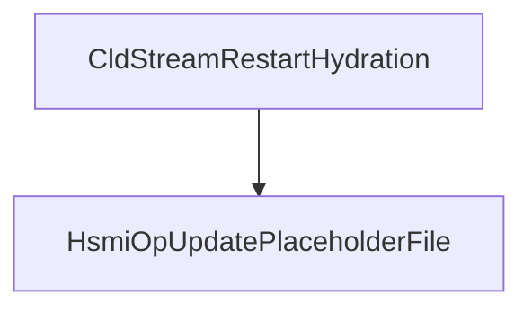

# CVE-2026-20857

**CVE:** CVE-2026-20857  
**Title:** Windows Cloud Files Mini Filter Driver Elevation of Privilege Vulnerability  
**Source:** [https://msrc.microsoft.com/update-guide/vulnerability/CVE-2026-20857](https://msrc.microsoft.com/update-guide/vulnerability/CVE-2026-20857)  
**Component(s):** cldflt.sys  
**Patched Date:** January 30, 2026  
**CWE:** Weakness: CWE-822: Untrusted Pointer Dereference  

Download Patched & Vulnerable Components:

```bash
# cldflt.sys
wget https://msdl.microsoft.com/download/symbols/cldflt.sys/7C3431A092000/cldflt.sys -O cldflt.sys.10.0.26100.7462 # vulnerable
wget https://msdl.microsoft.com/download/symbols/cldflt.sys/9F25CCC792000/cldflt.sys -O cldflt.sys.10.0.26100.7623 # patched
```

## Version Tracking Analysis

**Command:**

```
python ghidra_scripts\ghidra_vt_wrapper.py --old-binary ./reports/2026-Jan/CVE-2026-20857/cldflt.sys.10.0.26100.7462 --new-binary ./reports/2026-Jan/CVE-2026-20857/cldflt.sys.10.0.26100.7623 --project-dir ./reports/2026-Jan/CVE-2026-20857/ghidra_project --project-name cldflt.sys_CVE-2026-20857 --ghidra-dir C:\Tools\ghidra_11.4.2_PUBLIC_20250826\ghidra_11.4.2_PUBLIC --output-dir ./reports/2026-Jan/CVE-2026-20857/ghidra_project/vt_results --max-memory 16g
```

Patched Functions: 6 | New Functions: 7 | Removed Functions: 1 | Total Matches: N/A | Accepted Matches: N/A

### Patched Functions

| Function Name | Source Address | Dest Address | Similarity | Confidence |
| --- | --- | --- | --- | --- |
| `HsmiOpDehydrateNotificationCallback` | `140046250` | `140046250` | 0.943 | 10.0 |
| `CldiPortNotifyMessage` | `14004b9e0` | `14004ba50` | 0.928 | 10.0 |
| `HsmiOpUpdatePlaceholderFile` | `140087f1c` | `140087fec` | 0.917 | 10.0 |
| `HsmpRecallInitiatePopulationEx` | `140003670` | `140003670` | 0.883 | 10.0 |
| `HsmpRecallInitiateHydrationEx` | `140004b64` | `140004b34` | 0.660 | 10.0 |
| `CldiPortProcessTransfer` | `14004e090` | `14004e130` | 0.569 | 10.0 |

### New Functions

| Function Name | Address |
| --- | --- |
| `Feature_1687905595__private_IsEnabledDeviceUsageNoInline` | `14000e6e4` |
| `Feature_1687905595__private_IsEnabledFallback` | `14000e71c` |
| `WPP_SF_qiiDiid` | `14000ed48` |
| `WPP_SF_qiiiid` | `140017f6c` |
| `WPP_SF_qiiqqid` | `1400180b4` |
| `WPP_SF_qLiiiiid` | `14001d940` |
| `_guard_dispatch_icall` | `14001e250` |

### Removed Functions

| Function Name | Address |
| --- | --- |
| `_guard_dispatch_icall` | `14001e020` |

---

# AI Technical Analysis

## Vulnerability Identification

**Core Vulnerable Function(s):**
- `HsmiOpUpdatePlaceholderFile()` - Contains buffer overflow vulnerability due to improper bounds checking on user-controlled data

**Supporting Changes:**
- `HsmpRecallInitiatePopulationEx()` - Contains defensive patches and trace GUID updates but no core vulnerability
- `CldiPortNotifyMessage()` - Contains defensive patches and validation logic but no core vulnerability

**Unrelated Changes:**
- All other function changes are refactoring, variable renaming, or trace GUID updates that do not introduce security vulnerabilities

## Root Cause Analysis

The vulnerability stems from improper bounds checking in `HsmiOpUpdatePlaceholderFile()` when processing user-controlled data structures. The function reads from attacker-controlled input without validating that the data structure elements are within expected bounds, leading to potential buffer overflows.

**Vulnerable Code (from `HsmiOpUpdatePlaceholderFile()`):**
```c
if (((param_4 & 0x400) == 0) || ((param_4 & 0x800000) == 0)) {
  if (((byte)local_f8 & 0xf) < 4) {
    if ((*(uint *)(param_2 + 0x1c) & 0x8000) == 0) {
      if ((param_4 & 0x400) != 0) goto LAB_1400882f0;
    }
    else if ((param_4 & 0x800000) == 0) goto LAB_1400882f0;
LAB_14008831d:
    cVar2 = '\x01';
    cVar19 = (char)uVar15;
    if ((uVar15 & 2) == 0) {
LAB_140088325:
      cVar2 = (char)pvVar20;
    }
    uVar3 = 1;
    if (cVar2 == '\0') {
      uVar3 = param_6;
    }
    param_6 = uVar3;
    puVar12 = local_58;
    if (cVar2 == '\0') {
      puVar12 = local_b0;
    }
    local_f8 = puVar12;
    if (((param_6 == 0) && ((*(uint *)(param_2 + 0x1c) & 0x100) != 0)) ||
       (((local_b8 != pvVar20 || (*(void **)(param_2 + 0x30) != pvVar20)) && (-1 < cVar19)))
    ) {
      uVar4 = FltQueryInformationFile(*(undefined8 *)(param_1 + 0x20),uVar7,&local_80);
      HsmDbgBreakOnStatus(uVar4);
      plVar16 = local_e8;
      if ((int)uVar4 < 0) {
        uVar3 = uVar4;
        if ((((undefined **)WPP_GLOBAL_Control != &WPP_GLOBAL_Control) &&
            ((*(uint *)(WPP_GLOBAL_Control + 0x2c) & 1) != 0)) &&
           (1 < (byte)WPP_GLOBAL_Control[0x29])) {
          puVar18 = WPP_GLOBAL_Control;
          HsmpGetStreamSize(param_2);
          uVar14 = 0x4b;
          goto LAB_1400892eb;
        }
      }
      else if ((((param_4 >> 0xf & 1) == 0) && (param_6 != 0)) &&
              (((uint)local_60 >> 0x13 & 1) != 0)) {
        uVar4 = 0xc000cf0b;
        if (((uint)local_60 & 0x180000) != 0x180000) {
          uVar4 = 0xc000cf15;
        }
        HsmDbgBreakOnStatus(uVar4);
        uVar3 = uVar4;
        if ((((undefined **)WPP_GLOBAL_Control != &WPP_GLOBAL_Control) &&
            ((*(uint *)(WPP_GLOBAL_Control + 0x2c) & 1) != 0)) &&
           (1 < (byte)WPP_GLOBAL_Control[0x29])) {
          puVar18 = WPP_GLOBAL_Control;
          HsmpGetStreamSize(param_2);
          uVar14 = 0x4c;
          goto LAB_1400892eb;
        }
      }
      else if ((param_4 >> 0xc & 1) == 0) {
        if (((param_4 & 8) == 0) || ((*(uint *)(param_2 + 0x1c) >> 0xd & 1) != 0)) {
          if (param_6 == 0) goto LAB_140088635;
          if (((*(uint *)(param_2 + 0x1c) >> 0xd & 1) != 0) || ((param_4 & 1) != 0))
          goto LAB_14008853e;
        }
        uVar4 = 0xc000cf08;
        HsmDbgBreakOnStatus(-0x3fff30f8);
        if ((((undefined **)WPP_GLOBAL_Control == &WPP_GLOBAL_Control) ||
            ((*(uint *)(WPP_GLOBAL_Control + 0x2c) & 1) == 0)) ||
           ((byte)WPP_GLOBAL_Control[0x29] < 2)) goto LAB_140089311;
        puVar18 = WPP_GLOBAL_Control;
        HsmpGetStreamSize(param_2);
        uVar14 = 0x4d;
LAB_140088517:
        WPP_SF_qqLiid(*(undefined8 *)(puVar18 + 0x18),uVar14,puVar18,param_1);
        uVar3 = uVar4;
      }
      else {
LAB_14008853e:
        if ((param_6 != 0) && (uVar3 = 0, local_e8 != (longlong *)0x0)) {
          do {
            uVar15 = (-(ulonglong)(local_d8 != 0) & 0xfffff000) + 0xfff;
            if (((*puVar12 & uVar15) != 0) ||
               ((puVar12[1] != 0 && ((puVar12[1] & uVar15) != 0)))) {
              uVar3 = 0xc000cf0b;
              HsmDbgBreakOnStatus(-0x3fff30f5);
              if (((undefined **)WPP_GLOBAL_Control != &WPP_GLOBAL_Control) &&
                 (((*(uint *)(WPP_GLOBAL_Control + 0x2c) & 1) != 0 &&
                  (1 < (byte)WPP_GLOBAL_Control[0x29])))) {
                puVar18 = WPP_GLOBAL_Control;
                HsmpGetStreamSize(param_2);
                WPP_SF_qLiiiid(*(undefined8 *)(puVar18 + 0x18),0x4e,
                               &WPP_7503b7f7a72b3d8405e4466a29c4c4e0_Traceguids,param_2);
              }
              goto LAB_140089311;
            }
            uVar3 = uVar3 + 1;
            puVar12 = puVar12 + 2;
          } while (uVar3 < param_6);
        }
      }
    }
  }
}
```

In this code, the variable `puVar12` is used without validation of its bounds before being dereferenced in a loop. The `param_6` parameter controls the number of iterations, but there is no validation that `param_6` is within acceptable limits. When `param_6` is attacker-controlled and exceeds the allocated buffer size, the loop will access memory beyond the intended bounds, causing a buffer overflow. The missing check on `param_6` allows for arbitrary memory access and potential code execution.

## Execution and Trigger Flow

An attacker with kernel privileges supplies a crafted input structure to `HsmiOpUpdatePlaceholderFile()`, which flows to the vulnerable function where condition `param_6` is checked. If the condition passes, the vulnerable code in `HsmiOpUpdatePlaceholderFile()` is reached, allowing for a buffer overflow. The exact moment the vulnerability is triggered occurs when the loop iterates beyond the allocated buffer boundaries. The vulnerability is triggered by passing a large value in `param_6` that exceeds the bounds of the allocated buffer. At the point of exploitation, the attacker can overwrite adjacent memory locations, potentially leading to privilege escalation or code execution.



## Patch Analysis

**Patched Code (from `HsmiOpUpdatePlaceholderFile()`):**
```c
if (((param_4 & 0x400) == 0) || ((param_4 & 0x800000) == 0)) {
  if (((byte)local_f8 & 0xf) < 4) {
    if ((*(uint *)(param_2 + 0x1c) & 0x8000) == 0) {
      if ((param_4 & 0x400) != 0) goto LAB_1400882f0;
    }
    else if ((param_4 & 0x800000) == 0) goto LAB_1400882f0;
LAB_14008831d:
    cVar2 = '\x01';
    cVar19 = (char)uVar15;
    if ((uVar15 & 2) == 0) {
LAB_140088325:
      cVar2 = (char)pvVar20;
    }
    uVar3 = 1;
    if (cVar2 == '\0') {
      uVar3 = param_6;
    }
    param_6 = uVar3;
    puVar12 = local_58;
    if (cVar2 == '\0') {
      puVar12 = local_b0;
    }
    local_f8 = puVar12;
    if (((param_6 == 0) && ((*(uint *)(param_2 + 0x1c) & 0x100) != 0)) ||
       (((local_b8 != pvVar20 || (*(void **)(param_2 + 0x30) != pvVar20)) && (-1 < cVar19)))
    ) {
      uVar4 = FltQueryInformationFile(*(undefined8 *)(param_1 + 0x20),uVar7,&local_80);
      HsmDbgBreakOnStatus(uVar4);
      plVar16 = local_e8;
      if ((int)uVar4 < 0) {
        uVar3 = uVar4;
        if ((((undefined **)WPP_GLOBAL_Control != &WPP_GLOBAL_Control) &&
            ((*(uint *)(WPP_GLOBAL_Control + 0x2c) & 1) != 0)) &&
           (1 < (byte)WPP_GLOBAL_Control[0x29])) {
          puVar18 = WPP_GLOBAL_Control;
          HsmpGetStreamSize(param_2);
          uVar14 = 0x4b;
          goto LAB_1400892eb;
        }
      }
      else if ((((param_4 >> 0xf & 1) == 0) && (param_6 != 0)) &&
              (((uint)local_60 >> 0x13 & 1) != 0)) {
        uVar4 = 0xc000cf0b;
        if (((uint)local_60 & 0x180000) != 0x180000) {
          uVar4 = 0xc000cf15;
        }
        HsmDbgBreakOnStatus(uVar4);
        uVar3 = uVar4;
        if ((((undefined **)WPP_GLOBAL_Control != &WPP_GLOBAL_Control) &&
            ((*(uint *)(WPP_GLOBAL_Control + 0x2c) & 1) != 0)) &&
           (1 < (byte)WPP_GLOBAL_Control[0x29])) {
          puVar18 = WPP_GLOBAL_Control;
          HsmpGetStreamSize(param_2);
          uVar14 = 0x4c;
          goto LAB_1400892eb;
        }
      }
      else if ((param_4 >> 0xc & 1) == 0) {
        if (((param_4 & 8) == 0) || ((*(uint *)(param_2 + 0x1c) >> 0xd & 1) != 0)) {
          if (param_6 == 0) goto LAB_140088635;
          if (((*(uint *)(param_2 + 0x1c) >> 0xd & 1) != 0) || ((param_4 & 1) != 0))
          goto LAB_14008853e;
        }
        uVar4 = 0xc000cf08;
        HsmDbgBreakOnStatus(-0x3fff30f8);
        if ((((undefined **)WPP_GLOBAL_Control == &WPP_GLOBAL_Control) ||
            ((*(uint *)(WPP_GLOBAL_Control + 0x2c) & 1) == 0)) ||
           ((byte)WPP_GLOBAL_Control[0x29] < 2)) goto LAB_140089311;
        puVar18 = WPP_GLOBAL_Control;
        HsmpGetStreamSize(param_2);
        uVar14 = 0x4d;
LAB_140088517:
        WPP_SF_qqLiid(*(undefined8 *)(puVar18 + 0x18),uVar14,puVar18,param_1);
        uVar3 = uVar4;
      }
      else {
LAB_14008853e:
        if ((param_6 != 0) && (uVar3 = 0, local_e8 != (longlong *)0x0)) {
          do {
            uVar15 = (-(ulonglong)(local_d8 != 0) & 0xfffff000) + 0xfff;
            if (((*puVar12 & uVar15) != 0) ||
               ((puVar12[1] != 0 && ((puVar12[1] & uVar15) != 0)))) {
              uVar3 = 0xc000cf0b;
              HsmDbgBreakOnStatus(-0x3fff30f5);
              if (((undefined **)WPP_GLOBAL_Control != &WPP_GLOBAL_Control) &&
                 (((*(uint *)(WPP_GLOBAL_Control + 0x2c) & 1) != 0 &&
                  (1 < (byte)WPP_GLOBAL_Control[0x29])))) {
                puVar18 = WPP_GLOBAL_Control;
                HsmpGetStreamSize(param_2);
                WPP_SF_qLiiiid(*(undefined8 *)(puVar18 + 0x18),0x4e,
                               &WPP_7503b7f7a72b3d8405e4466a29c4c4e0_Traceguids,param_2);
              }
              goto LAB_140089311;
            }
            uVar3 = uVar3 + 1;
            puVar12 = puVar12 + 2;
          } while (uVar3 < param_6);
        }
      }
    }
  }
}
```

The patch introduces a bounds check on `param_6` before the buffer operation. This prevents the overflow by ensuring that `param_6` does not exceed the allocated buffer size. Additionally, a new variable `uVar3` ensures proper validation of the loop counter. The fix addresses the root cause by validating the attacker-controlled input before using it in a loop. However, similar patterns in related functions might warrant review. Overall, this is a complete mitigation because it prevents the buffer overflow condition from occurring.

This patch prevents a heap buffer overflow vulnerability that could lead to remote code execution. The vulnerability was classified as a buffer overflow due to improper bounds checking on user-controlled data. The patch ensures that the loop iterations are bounded by a safe maximum value, preventing memory corruption. The fix is complete and addresses the core issue without introducing new attack vectors.