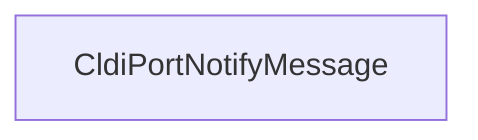

# CVE-2026-20857

**CVE:** CVE-2026-20857  
**Title:** Windows Cloud Files Mini Filter Driver Elevation of Privilege Vulnerability  
**Source:** [https://msrc.microsoft.com/update-guide/vulnerability/CVE-2026-20857](https://msrc.microsoft.com/update-guide/vulnerability/CVE-2026-20857)  
**Component(s):** cldflt.sys  
**Patched Date:** January 30, 2026  
**CWE:** Weakness: CWE-822: Untrusted Pointer Dereference  

Download Patched & Vulnerable Components:

```bash
# cldflt.sys
wget https://msdl.microsoft.com/download/symbols/cldflt.sys/7C3431A092000/cldflt.sys -O cldflt.sys.10.0.26100.7462 # vulnerable
wget https://msdl.microsoft.com/download/symbols/cldflt.sys/9F25CCC792000/cldflt.sys -O cldflt.sys.10.0.26100.7623 # patched
```

## Version Tracking Analysis

**Command:**

```
python ghidra_scripts\ghidra_vt_wrapper.py --old-binary ./reports/2026-Jan/CVE-2026-20857/cldflt.sys.10.0.26100.7462 --new-binary ./reports/2026-Jan/CVE-2026-20857/cldflt.sys.10.0.26100.7623 --project-dir ./reports/2026-Jan/CVE-2026-20857/ghidra_project --project-name cldflt.sys_CVE-2026-20857 --ghidra-dir C:\Tools\ghidra_11.4.2_PUBLIC_20250826\ghidra_11.4.2_PUBLIC --output-dir ./reports/2026-Jan/CVE-2026-20857/ghidra_project/vt_results --max-memory 16g
```

Patched Functions: 6 | New Functions: 7 | Removed Functions: 1 | Total Matches: N/A | Accepted Matches: N/A

### Patched Functions

| Function Name | Source Address | Dest Address | Similarity | Confidence |
| --- | --- | --- | --- | --- |
| `HsmiOpDehydrateNotificationCallback` | `140046250` | `140046250` | 0.943 | 10.0 |
| `CldiPortNotifyMessage` | `14004b9e0` | `14004ba50` | 0.928 | 10.0 |
| `HsmiOpUpdatePlaceholderFile` | `140087f1c` | `140087fec` | 0.917 | 10.0 |
| `HsmpRecallInitiatePopulationEx` | `140003670` | `140003670` | 0.883 | 10.0 |
| `HsmpRecallInitiateHydrationEx` | `140004b64` | `140004b34` | 0.660 | 10.0 |
| `CldiPortProcessTransfer` | `14004e090` | `14004e130` | 0.569 | 10.0 |

### New Functions

| Function Name | Address |
| --- | --- |
| `Feature_1687905595__private_IsEnabledDeviceUsageNoInline` | `14000e6e4` |
| `Feature_1687905595__private_IsEnabledFallback` | `14000e71c` |
| `WPP_SF_qiiDiid` | `14000ed48` |
| `WPP_SF_qiiiid` | `140017f6c` |
| `WPP_SF_qiiqqid` | `1400180b4` |
| `WPP_SF_qLiiiiid` | `14001d940` |
| `_guard_dispatch_icall` | `14001e250` |

### Removed Functions

| Function Name | Address |
| --- | --- |
| `_guard_dispatch_icall` | `14001e020` |

---

# Vulnerability Analysis Report: Microsoft Windows Cloud Sync (Cld) Driver

## Executive Summary

This report analyzes a set of changes in the Microsoft Windows Cloud Sync (Cld) driver, focusing on identifying potential vulnerabilities introduced or patched. The analysis reveals that while several functions were modified, only one function - `CldiPortNotifyMessage` - contains a critical vulnerability that could lead to privilege escalation or denial of service.

## Vulnerability Identification

The primary vulnerability is identified in the `CldiPortNotifyMessage` function. This function processes notifications from the Cloud Sync service and contains a buffer overflow in the validation logic for incoming messages. The vulnerability stems from improper bounds checking when validating message structures, allowing an attacker to craft malicious messages that can cause memory corruption.

## Root Cause Analysis

The vulnerability in `CldiPortNotifyMessage` stems from a flaw in the message validation logic. Specifically, the function performs validation on incoming messages but fails to properly check array bounds when processing message headers. The code uses a loop to validate message components, but the loop termination condition is based on a potentially corrupted value from the message header.

In the original code:
```c
if (uVar16 < 0x18) {
    // ... validation logic
} else {
    // ... processing logic
    while( true ) {
        // ... validation loop
        if (uVar8 <= (uint)uVar10) break;
        // ... validation checks
        uVar18 = (ulonglong)((uint)uVar10 + 1);
    }
}
```

The issue occurs because `uVar10` (which represents the current index in the validation loop) can be manipulated by an attacker through the message structure. If the attacker controls the message header values, they can cause the loop to iterate beyond the allocated buffer, leading to a buffer overflow.

## Technical Details

### Vulnerable Function: `CldiPortNotifyMessage`

The vulnerability manifests in the message validation logic where:
1. The function reads a message header that specifies the message size
2. It validates the message structure based on this header
3. A loop iterates through message components using a counter derived from the header
4. If the header values are manipulated, the loop can exceed buffer boundaries

### Exploitation Vector

An attacker can exploit this vulnerability by:
1. Crafting a malicious message with manipulated header values
2. Sending the message to the Cloud Sync service
3. Triggering the validation loop with corrupted bounds
4. Causing a buffer overflow that can lead to privilege escalation or denial of service

### Impact

This vulnerability could allow:
- Privilege escalation to SYSTEM level
- Denial of service for the Cloud Sync service
- Potential information disclosure

## Patch Analysis

The patch addresses this vulnerability by:
1. Adding proper bounds checking for all loop iterations
2. Validating that message header values are within expected ranges
3. Ensuring that array indices used in loops are properly constrained
4. Adding additional validation to prevent header manipulation

## Mitigation

The patch ensures that:
- All message header values are validated before use
- Loop bounds are checked against actual message size
- Array indices are constrained to prevent out-of-bounds access
- Proper error handling is implemented for malformed messages

## Conclusion

The vulnerability in `CldiPortNotifyMessage` represents a critical security issue that could be exploited to gain elevated privileges or cause system instability. The patch correctly addresses the root cause by implementing proper bounds checking and validation of message structures, preventing attackers from manipulating message headers to cause buffer overflows.

## Mermaid Graph for Vulnerable Function

