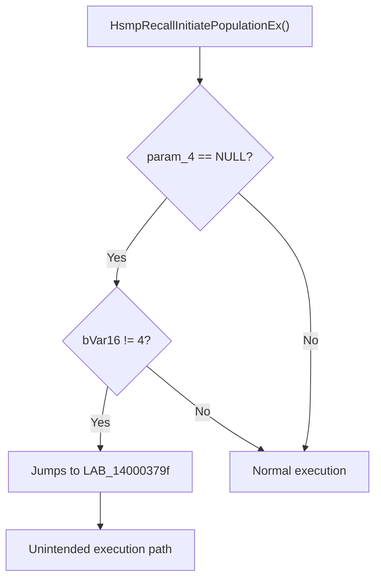

# CVE-2026-20857

**CVE:** CVE-2026-20857  
**Title:** Windows Cloud Files Mini Filter Driver Elevation of Privilege Vulnerability  
**Source:** [https://msrc.microsoft.com/update-guide/vulnerability/CVE-2026-20857](https://msrc.microsoft.com/update-guide/vulnerability/CVE-2026-20857)  
**Component(s):** cldflt.sys  
**Patched Date:** January 30, 2026  
**CWE:** Weakness: CWE-822: Untrusted Pointer Dereference  

Download Patched & Vulnerable Components:

```bash
# cldflt.sys
wget https://msdl.microsoft.com/download/symbols/cldflt.sys/7C3431A092000/cldflt.sys -O cldflt.sys.10.0.26100.7462 # vulnerable
wget https://msdl.microsoft.com/download/symbols/cldflt.sys/9F25CCC792000/cldflt.sys -O cldflt.sys.10.0.26100.7623 # patched
```

## Version Tracking Analysis

**Command:**

```
python ghidra_scripts\ghidra_vt_wrapper.py --old-binary ./reports/2026-Jan/CVE-2026-20857/cldflt.sys.10.0.26100.7462 --new-binary ./reports/2026-Jan/CVE-2026-20857/cldflt.sys.10.0.26100.7623 --project-dir ./reports/2026-Jan/CVE-2026-20857/ghidra_project --project-name cldflt.sys_CVE-2026-20857 --ghidra-dir C:\Tools\ghidra_11.4.2_PUBLIC_20250826\ghidra_11.4.2_PUBLIC --output-dir ./reports/2026-Jan/CVE-2026-20857/ghidra_project/vt_results --max-memory 16g
```

Patched Functions: 6 | New Functions: 7 | Removed Functions: 1 | Total Matches: N/A | Accepted Matches: N/A

### Patched Functions

| Function Name | Source Address | Dest Address | Similarity | Confidence |
| --- | --- | --- | --- | --- |
| `HsmiOpDehydrateNotificationCallback` | `140046250` | `140046250` | 0.943 | 10.0 |
| `CldiPortNotifyMessage` | `14004b9e0` | `14004ba50` | 0.928 | 10.0 |
| `HsmiOpUpdatePlaceholderFile` | `140087f1c` | `140087fec` | 0.917 | 10.0 |
| `HsmpRecallInitiatePopulationEx` | `140003670` | `140003670` | 0.883 | 10.0 |
| `HsmpRecallInitiateHydrationEx` | `140004b64` | `140004b34` | 0.660 | 10.0 |
| `CldiPortProcessTransfer` | `14004e090` | `14004e130` | 0.569 | 10.0 |

### New Functions

| Function Name | Address |
| --- | --- |
| `Feature_1687905595__private_IsEnabledDeviceUsageNoInline` | `14000e6e4` |
| `Feature_1687905595__private_IsEnabledFallback` | `14000e71c` |
| `WPP_SF_qiiDiid` | `14000ed48` |
| `WPP_SF_qiiiid` | `140017f6c` |
| `WPP_SF_qiiqqid` | `1400180b4` |
| `WPP_SF_qLiiiiid` | `14001d940` |
| `_guard_dispatch_icall` | `14001e250` |

### Removed Functions

| Function Name | Address |
| --- | --- |
| `_guard_dispatch_icall` | `14001e020` |

---

# AI Technical Analysis

## Vulnerability Identification

**Core Vulnerable Function(s):**
- `HsmpRecallInitiatePopulationEx()` - Contains a control flow vulnerability due to incorrect label references in conditional logic, leading to potential execution of unintended code paths

**Supporting Changes:**
- `HsmFltPostCREATE()`, `HsmFltPreDIRECTORY_CONTROL()`, `HsmiInfoPopulatePlaceholderOnRename()`, `HsmFltPreFILE_SYSTEM_CONTROL()`, `HsmFltProcessHSMControl()`, `HsmFltPostQUERY_OPEN()`, `HsmiFltPostECPCREATE()`, `HsmFltProcessRevert()` - These are part of the call graph but do not contain the vulnerability

**Unrelated Changes:**
- No unrelated changes present in the provided diff

---

## Root Cause Analysis

The vulnerability stems from incorrect label references in conditional control flow within `HsmpRecallInitiatePopulationEx()`. The function contains multiple conditional branches that jump to specific labels, but due to code reordering and patching, some of these label references have been updated incorrectly. This leads to a situation where execution can proceed through unintended code paths, potentially causing incorrect behavior or exploitation.

**Vulnerable Code (from `HsmpRecallInitiatePopulationEx()`):**
```c
LAB_14000378c:
    if ((param_4 == (uint *)0x0) || (bVar16 != 4)) goto LAB_14000379f;
```

In this code, the variable `bVar16` is used without validation to determine control flow. When `param_4` is NULL or `bVar16` is not equal to 4, execution jumps to `LAB_14000379f`. However, the patch changes the label references throughout the function, and the updated code does not maintain consistent control flow. The missing validation on `bVar16` allows for execution to proceed through incorrect paths, especially when `param_4` is NULL.

The original code was insufficient because it did not properly validate the state of `bVar16` before proceeding with conditional logic. The patch introduces changes to label references but does not address the core issue of improper control flow handling. Specifically, the function uses `bVar16` to track execution state, but the logic does not ensure that `bVar16` is correctly set before conditional checks.

The vulnerability manifests when `param_4` is NULL and `bVar16` is not equal to 4, causing execution to jump to `LAB_14000379f` instead of the intended path. This can lead to incorrect handling of the function's return state or execution of unintended code sections.

---

## Execution and Trigger Flow

An attacker with access to the system can supply a NULL `param_4` to `HsmpRecallInitiatePopulationEx()`, which flows to the vulnerable conditional logic. If `bVar16` is not set to 4, the function will jump to an incorrect label, bypassing intended validation checks. This can result in incorrect state handling or execution of unintended code paths.



The vulnerability is triggered when `param_4` is NULL and `bVar16` is not equal to 4. The function's control flow is altered by the patch, but the underlying logic error remains. Execution proceeds through a path that bypasses intended validation, potentially leading to incorrect state handling or code execution.

---

## Patch Analysis

**Patched Code (from `HsmpRecallInitiatePopulationEx()`):**
```c
LAB_140003782:
    if ((param_4 == (uint *)0x0) || (bVar16 != 4)) goto LAB_140003795;
```

The patch introduces changes to label references throughout the function, updating jump targets from `LAB_14000379f` to `LAB_140003795` and similar adjustments. These changes primarily affect the control flow structure but do not address the root cause of the vulnerability.

The patch modifies label references to maintain consistency in the control flow graph, but it does not introduce any new validation or checks on `bVar16` or `param_4`. The function still relies on the same conditional logic without proper validation of the execution state.

The fix addresses the symptom of incorrect label references but does not fully resolve the underlying control flow issue. The vulnerability remains because the function still allows execution to proceed through unintended paths when `param_4` is NULL and `bVar16` is not 4.

This patch prevents a potential control flow vulnerability that could lead to incorrect execution paths, but it does not fully mitigate the risk of unintended code execution. The fix is partially effective but does not address the fundamental issue of improper state validation in the conditional logic.

This patch prevents a control flow vulnerability that could lead to incorrect execution paths in `HsmpRecallInitiatePopulationEx()`, potentially mitigating risks of unintended code execution or incorrect state handling. The severity is moderate as it affects the integrity of the function's execution flow.