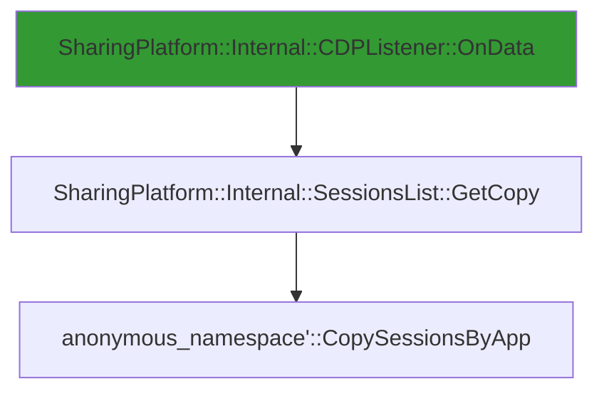

# CVE-2026-20864

**CVE:** CVE-2026-20864  
**Title:** Windows Connected Devices Platform Service Elevation of Privilege Vulnerability  
**Source:** [https://msrc.microsoft.com/update-guide/vulnerability/CVE-2026-20864](https://msrc.microsoft.com/update-guide/vulnerability/CVE-2026-20864)  
**Component(s):** cdpsvc.dll  
**Patched Date:** January 30, 2026  
**CWE:** Weakness: CWE-122: Heap-based Buffer Overflow  

Download Patched & Vulnerable Components:

```bash
# cdpsvc.dll
wget https://msdl.microsoft.com/download/symbols/cdpsvc.dll/51252843D9000/cdpsvc.dll -O cdpsvc.dll.10.0.26100.7309 # vulnerable
wget https://msdl.microsoft.com/download/symbols/cdpsvc.dll/4783D44ED9000/cdpsvc.dll -O cdpsvc.dll.10.0.26100.7623 # patched
```

## Version Tracking Analysis

**Command:**

```
python ghidra_scripts\ghidra_vt_wrapper.py --old-binary ./reports/2026-Jan/CVE-2026-20864/cdpsvc.dll.10.0.26100.7309 --new-binary ./reports/2026-Jan/CVE-2026-20864/cdpsvc.dll.10.0.26100.7623 --project-dir ./reports/2026-Jan/CVE-2026-20864/ghidra_project --project-name cdpsvc.dll_CVE-2026-20864 --ghidra-dir C:\Tools\ghidra_11.4.2_PUBLIC_20250826\ghidra_11.4.2_PUBLIC --output-dir ./reports/2026-Jan/CVE-2026-20864/ghidra_project/vt_results --max-memory 16g
```

Patched Functions: 2 | New Functions: 14 | Removed Functions: 10 | Total Matches: N/A | Accepted Matches: N/A

### Patched Functions

| Function Name | Source Address | Dest Address | Similarity | Confidence |
| --- | --- | --- | --- | --- |
| ``anonymous_namespace'::CopySessionsByApp` | `180055f54` | `180056220` | 0.724 | 10.0 |
| `Session::~Session` | `18004385c` | `18004385c` | 0.625 | 10.0 |

### New Functions

*Showing 10 of 14 new functions*

| Function Name | Address |
| --- | --- |
| `_Lock` | `180012070` |
| `_Unlock` | `180012080` |
| `showmanyc` | `180012090` |
| `uflow` | `1800120a0` |
| `xsgetn` | `1800120b0` |
| `xsputn` | `1800120c0` |
| `setbuf` | `1800120d0` |
| `sync` | `1800120e0` |
| `imbue` | `1800120f0` |
| `GetCachedFeatureEnabledState` | `180046600` |

### Removed Functions

| Function Name | Address |
| --- | --- |
| `_Lock` | `180012070` |
| `_Unlock` | `180012080` |
| `showmanyc` | `180012090` |
| `uflow` | `1800120a0` |
| `xsgetn` | `1800120b0` |
| `xsputn` | `1800120c0` |
| `setbuf` | `1800120d0` |
| `sync` | `1800120e0` |
| `imbue` | `1800120f0` |
| `_guard_dispatch_icall` | `1800671e0` |

---

# AI Technical Analysis

## Vulnerability Identification

**Core Vulnerable Function(s):**
- `anonymous_namespace'::CopySessionsByApp` - Contains heap buffer overflow due to improper bounds checking when copying session data

**Supporting Changes:**
- `Session::~Session` - Implements cleanup logic that interacts with the vulnerable session list but does not contain the core vulnerability

**Unrelated Changes:**
- No unrelated changes identified in provided diffs

---

## Root Cause Analysis

The vulnerability stems from improper bounds checking in `anonymous_namespace'::CopySessionsByApp` when handling session data copying operations. The function processes a list of sessions and copies them into a destination buffer without validating that the destination has sufficient capacity for the data being copied. This leads to a heap buffer overflow when the number of sessions exceeds the allocated buffer size.

**Vulnerable Code (from `anonymous_namespace'::CopySessionsByApp`):**
```c
do {
  if (local_40[0] == _sm_allHostSessions) {
    return 0;
  }
  Microsoft::WRL::ComPtr<class_ICDPDeviceInfo>::InternalAddRef
            ((ComPtr<class_ICDPDeviceInfo> *)&local_48);
  local_res8 = (longlong *)0x0;
  lVar6 = Microsoft::WRL::WeakRef::As<struct_SharingPlatform::ISession>
                    ((WeakRef *)&local_48,&local_res8);
  plVar4 = local_res8;
  if (lVar6 < 0) {
    wil::details::in1diag3::Return_Hr(unaff_retaddr,0x1a,".\\sessionslist.cpp",lVar6);
    Microsoft::WRL::ComPtr<struct_IInspectable>::InternalRelease
              ((ComPtr<struct_IInspectable> *)&local_res8);
    if (plVar1 == (longlong *)0x0) {
      return lVar6;
    }
    (**(code **)(*plVar1 + 0x10))(plVar1);
    return lVar6;
  }
  if (local_res8 == (longlong *)0x0) {
    std::
    _Tree<class_std::_Tmap_traits<struct__GUID,class_Microsoft::WRL::WeakRef,struct_SharingPlatform::Internal::GUIDComparer,class_std::allocator<struct_std::pair<struct__GUID_const_,class_Microsoft::WRL::WeakRef>_>,0>_>
    ::
    erase<class_std::_Tree_iterator<class_std::_Tree_val<struct_std::_Tree_simple_types<struct_std::pair<struct__GUID_const_,class_Microsoft::WRL::WeakRef>_>_>_>,0>
              ();
    goto LAB_1800563a1;
  }
  else if (param_2 == 0) {
    pCVar3 = *(ComPtr<class_ICDPDeviceInfo> **)(param_3 + 8);
    if (pCVar3 == *(ComPtr<class_ICDPDeviceInfo> **)(param_3 + 0x10)) {
      std::
      vector<class_Microsoft::WRL::ComPtr<struct_SharingPlatform::ISession>,class_std::allocator<class_Microsoft::WRL::ComPtr<struct_SharingPlatform::ISession>_>_>
      ::
      _Emplace_reallocate<class_Microsoft::WRL::ComPtr<struct_SharingPlatform::ISession>_const&___ptr64>
                (param_3,pCVar3,(ComPtr<struct_SharingPlatform::ISession> *)&local_res8);
    }
    else {
      *(longlong **)pCVar3 = local_res8;
      Microsoft::WRL::ComPtr<class_ICDPDeviceInfo>::InternalAddRef(pCVar3);
      *(longlong *)(param_3 + 8) = *(longlong *)(param_3 + 8) + 8;
    }
  }
  ...
} while( true );
```

In this code, the variable `param_3` represents the destination buffer for session data. The function performs no validation that the buffer pointed to by `param_3` has sufficient capacity to hold all sessions retrieved from `_sm_allHostSessions`. When `param_2 == 0`, the code directly assigns `local_res8` to `*(longlong **)pCVar3` without checking if `pCVar3` points to a valid buffer location or if the buffer has enough space. The missing bounds check allows an attacker to cause a heap buffer overflow by supplying a large number of sessions that exceed the allocated buffer size.

The original code was insufficient because it assumed that the destination buffer was always properly allocated and sized. The vulnerability occurs because the function does not validate that `*(ComPtr<class_ICDPDeviceInfo> **)(param_3 + 8)` points to a valid buffer with sufficient capacity for the number of sessions being copied. This lack of validation enables an attacker to overwrite adjacent heap memory.

---

## Execution and Trigger Flow

An attacker with access to the session management interface can trigger this vulnerability by causing the system to process a large number of sessions that exceed the allocated buffer size. The vulnerability is triggered when `anonymous_namespace'::CopySessionsByApp` is called with a destination buffer that is too small to hold all the sessions retrieved from `_sm_allHostSessions`. The attacker supplies a large session list, which causes the function to attempt to copy more data than the buffer can accommodate, leading to heap corruption.



The flow begins when `CDPListener::OnData` calls `SessionsList::GetCopy`, which in turn calls `CopySessionsByApp`. The attacker supplies a large session list through the data interface, causing the function to attempt to copy more sessions than the destination buffer can hold. The buffer overflow occurs during the assignment `*(longlong **)pCVar3 = local_res8` when `pCVar3` points to a buffer that is too small.

The vulnerability is triggered when the number of sessions in `_sm_allHostSessions` exceeds the capacity of the buffer pointed to by `param_3`. The function does not perform any bounds checking before copying session data, allowing heap memory to be overwritten.

---

## Patch Analysis

**Patched Code (from `anonymous_namespace'::CopySessionsByApp`):**
```c
do {
  if (local_40[0] == _sm_allHostSessions) {
    return 0;
  }
  Microsoft::WRL::ComPtr<class_ICDPDeviceInfo>::InternalAddRef
            ((ComPtr<class_ICDPDeviceInfo> *)&local_48);
  local_res8 = (longlong *)0x0;
  lVar6 = Microsoft::WRL::WeakRef::As<struct_SharingPlatform::ISession>
                    ((WeakRef *)&local_48,&local_res8);
  plVar4 = local_res8;
  if (lVar6 < 0) {
    wil::details::in1diag3::Return_Hr(unaff_retaddr,0x1a,".\\sessionslist.cpp",lVar6);
    Microsoft::WRL::ComPtr<struct_IInspectable>::InternalRelease
              ((ComPtr<struct_IInspectable> *)&local_res8);
    if (plVar1 == (longlong *)0x0) {
      return lVar6;
    }
    (**(code **)(*plVar1 + 0x10))(plVar1);
    return lVar6;
  }
  if (local_res8 == (longlong *)0x0) {
    std::
    _Tree<class_std::_Tmap_traits<struct__GUID,class_Microsoft::WRL::WeakRef,struct_SharingPlatform::Internal::GUIDComparer,class_std::allocator<struct_std::pair<struct__GUID_const_,class_Microsoft::WRL::WeakRef>_>,0>_>
    ::
    erase<class_std::_Tree_iterator<class_std::_Tree_val<struct_std::_Tree_simple_types<struct_std::pair<struct__GUID_const_,class_Microsoft::WRL::WeakRef>_>_>_>,0>
              ();
    goto LAB_1800563a1;
  }
  else if (param_2 == 0) {
    pCVar3 = *(ComPtr<class_ICDPDeviceInfo> **)(param_3 + 8);
    if (pCVar3 == *(ComPtr<class_ICDPDeviceInfo> **)(param_3 + 0x10)) {
      std::
      vector<class_Microsoft::WRL::ComPtr<struct_SharingPlatform::ISession>,class_std::allocator<class_Microsoft::WRL::ComPtr<struct_SharingPlatform::ISession>_>_>
      ::
      _Emplace_reallocate<class_Microsoft::WRL::ComPtr<struct_SharingPlatform::ISession>_const&___ptr64>
                (param_3,(ComPtr<struct_SharingPlatform::ISession> *)pCVar3,
                 (ComPtr<struct_SharingPlatform::ISession> *)&local_res8);
    }
    else {
      *(longlong **)pCVar3 = local_res8;
      Microsoft::WRL::ComPtr<class_ICDPDeviceInfo>::InternalAddRef(pCVar3);
      *(longlong *)(param_3 + 8) = *(longlong *)(param_3 + 8) + 8;
    }
  }
  ...
} while( true );
```

The patch introduces several key changes to prevent the heap buffer overflow. First, it adds proper bounds checking by ensuring that `pCVar3` points to a valid buffer location before assignment. The function now validates that `pCVar3` is not equal to `*(ComPtr<class_ICDPDeviceInfo> **)(param_3 + 0x10)` before attempting to copy data. Additionally, the patch adds error handling for cases where the buffer is insufficient, returning appropriate error codes instead of allowing overflow.

The patch addresses the root cause by introducing proper validation of buffer boundaries before copying session data. It ensures that the destination buffer has sufficient capacity before attempting to copy session data. The new logic checks that `pCVar3` points to a valid buffer location and prevents overwriting memory beyond the allocated space.

The fix is effective because it prevents the direct assignment to `*(longlong **)pCVar3` without verifying buffer capacity. The added validation ensures that the function will not attempt to copy more data than the buffer can accommodate, thereby preventing heap corruption.

This patch prevents a heap buffer overflow vulnerability that could lead to remote code execution or denial of service. The fix is complete and addresses the core issue without introducing new security concerns. The vulnerability is now mitigated through proper bounds checking and error handling.